## some preparations

进行大模型应用开发的学习，底层绝对离不开一个名词:`token`，它是衡量大模型输入输出时的最小单位，也许可以把它当作电话卡的话费或流量？

搭建本地模型，还是蛮吃硬件支持的，但是大多笔记本电脑的硬件支持普遍不够高，这会对我们后面的模型开发学习带来不好的体验，例如本地模型很难带动多agent，不过前期学习的话，本地模型能力还是足够滴

后期训练自己开发的agent时，我们一般会找一些大型API中转平台,他们会提供一些免费额度或普通模型供我们进行训练和学习，如果经济条件不错，自然是参数越大的模型用起来越好，哎嘿，能不能给Yolo V个`api key`呢？

### 搭建本地模型服务

本地模型运行平台推荐两个：`ollama`和`LM Studio`

#### ollama

`ollama`算是t0版本吧，我在很早之前就知道它是专门用来跑本地模型的，说下怎么部署安装

访问[ollama官方下载链接](https://ollama.com/download)，选择自己的系统，我这里选择的是Linux，因为我打算把Wsl2作为我的开发主环境，不少工具还是在Linux调用效果最好，还有，ollama主要是命令行工具（虽说Windows下有界面了，但是命令行用的习惯

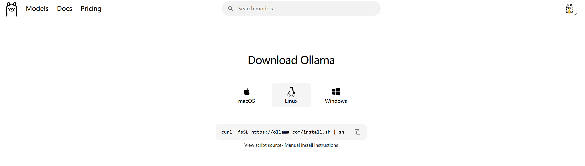

由于Ollama被开源到GitHub仓库里，下载的时候可能网速不稳定，网络环境的问题还是由读者自行解决吧，如果解决不了的话，可以评论区找我

安装好后，运行`ollama --version`

```bash
⋈┈◎ ollama --version                                                                                            ⌂ 18:12
ollama version is 0.21.2
```

接下来我们需要检查自己系统的硬件信息

```
⋈┈◎ nvidia-smi                                                                                                  ⌂ 18:13
Sun Apr 26 18:14:27 2026
+-----------------------------------------------------------------------------------------+
| NVIDIA-SMI 595.45.03              Driver Version: 595.71         CUDA Version: 13.2     |
+-----------------------------------------+------------------------+----------------------+
| GPU  Name                 Persistence-M | Bus-Id          Disp.A | Volatile Uncorr. ECC |
| Fan  Temp   Perf          Pwr:Usage/Cap |           Memory-Usage | GPU-Util  Compute M. |
|                                         |                        |               MIG M. |
|=========================================+========================+======================|
|   0  NVIDIA GeForce RTX 4060 ...    On  |   00000000:01:00.0 Off |                  N/A |
| N/A   55C    P8              1W /   95W |     215MiB /   8188MiB |      0%      Default |
|                                         |                        |                  N/A |
+-----------------------------------------+------------------------+----------------------+

+-----------------------------------------------------------------------------------------+
| Processes:                                                                              |
|  GPU   GI   CI              PID   Type   Process name                        GPU Memory |
|        ID   ID                                                               Usage      |
|=========================================================================================|
|  No running processes found                                                             |
+-----------------------------------------------------------------------------------------+

```

我的硬件配置相对来说算是中上了：4060显卡+8GB显存，如果其它读者的硬件配置较低的话，请直接看下面的`online API Key`部分

由于后面章节打算加上skill或mcp等能力，我们需要的模型必须有**tool calling(函数调用)支持**

读者可以将硬件配置信息复制给在线AI，它们会帮你找出最适合你的本地模型，我这里就选择了`qwen2.5:7b-instruct-q4_K_M`，deepseek老师推荐的

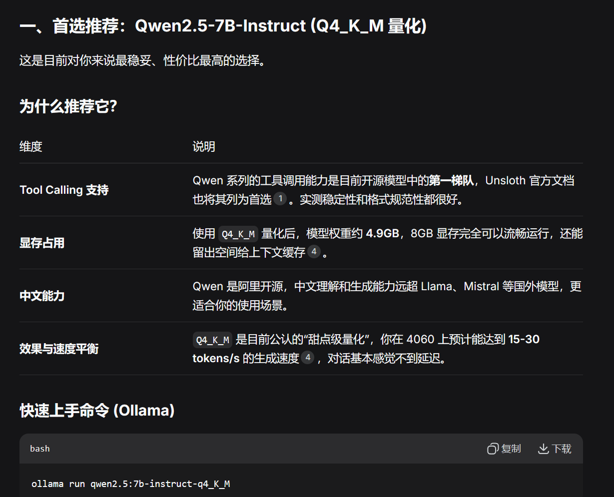

这是安装好的效果

```bash
⋈┈◎ ollama run qwen2.5:7b-instruct-q4_K_M                                                                       ⌂ 18:14
pulling manifest
pulling 2bada8a74506: 100% ▕██████████████████████████████████████████████████████████▏ 4.7 GB
pulling 66b9ea09bd5b: 100% ▕██████████████████████████████████████████████████████████▏   68 B
pulling eb4402837c78: 100% ▕██████████████████████████████████████████████████████████▏ 1.5 KB
pulling 832dd9e00a68: 100% ▕██████████████████████████████████████████████████████████▏  11 KB
pulling 2f15b3218f05: 100% ▕██████████████████████████████████████████████████████████▏  487 B
verifying sha256 digest
writing manifest
success
>>> hello,我是Yolo,你是我最好的AI助手,请多多关照
你好，Yolo！很高兴成为你的AI助手，我会尽力为你提供帮助和支持。你可以告诉我需要解决的问题或想要了解的内容，无论是学习
知识、工作上的问题还是生活中的困惑，我都会尽全力协助你。请尽管吩咐吧！
```

可以使用`/bye`退出当前的会话

到这里并没有结束哦，可以先使用`sudo systemctl status ollama`查看ollama的系统运行状态

```bash
◎ sudo systemctl status ollama                                                                                  ⌂ 18:42
[sudo] password for yolo:
● ollama.service - Ollama Service
     Loaded: loaded (/etc/systemd/system/ollama.service; enabled; preset: enabled)
     Active: active (running) since Sun 2026-04-26 18:12:50 CST; 30min ago
 Invocation: 5694944697324dd28ad287f296eec71b
   Main PID: 23260 (ollama)
      Tasks: 57 (limit: 9283)
     Memory: 4.6G (peak: 5.4G)
        CPU: 2min 48.083s
     CGroup: /system.slice/ollama.service
             ├─23260 /usr/local/bin/ollama serve
             └─26485 /usr/local/bin/ollama runner --model /usr/share/ollama/.ollama/models/blobs/sha256-2bada8a74506770>

Apr 26 18:37:40 Yolo ollama[23260]: llama_context:  CUDA_Host compute buffer size =    15.01 MiB
Apr 26 18:37:40 Yolo ollama[23260]: llama_context: graph nodes  = 959
Apr 26 18:37:40 Yolo ollama[23260]: llama_context: graph splits = 2
Apr 26 18:37:40 Yolo ollama[23260]: time=2026-04-26T18:37:40.289+08:00 level=INFO source=server.go:1402 msg="llama runn>
Apr 26 18:37:40 Yolo ollama[23260]: time=2026-04-26T18:37:40.289+08:00 level=INFO source=sched.go:561 msg="loaded runne>
Apr 26 18:37:40 Yolo ollama[23260]: time=2026-04-26T18:37:40.289+08:00 level=INFO source=server.go:1364 msg="waiting fo>
Apr 26 18:37:40 Yolo ollama[23260]: time=2026-04-26T18:37:40.290+08:00 level=INFO source=server.go:1402 msg="llama runn>
Apr 26 18:37:40 Yolo ollama[23260]: [GIN] 2026/04/26 - 18:37:40 | 200 | 41.474437331s |       127.0.0.1 | POST     "/ap>
Apr 26 18:39:51 Yolo ollama[23260]: [GIN] 2026/04/26 - 18:39:51 | 200 |  1.707250887s |       127.0.0.1 | POST     "/ap>
Apr 26 18:40:13 Yolo ollama[23260]: [GIN] 2026/04/26 - 18:40:13 | 200 |  8.028045434s |       127.0.0.1 | POST     "/ap>

```

正常运行没错吧，有个坏消息，每次电脑开机，ollama都会自动启动并运行模型，这会大大消耗电脑的电量，解决方法如下：

```bash
⋈┈◎ sudo systemctl disable ollama                                                                               ⌂ 18:43
Removed '/etc/systemd/system/default.target.wants/ollama.service'.


⋈┈◎ sudo systemctl stop ollama                  
```

前者关闭了ollama的开机启动，后者则是关闭了当前的ollama后台运行进程

以后想用的时候，直接调用`sudo systemctl start ollama`即可，会后台启动，并且监听默认的11434端口，我们就能直接调用Ollama的api了

如果想启动一个命令行对话框，运行`ollama run qwen2.5:7b-instruct-q4_K_M`（必须提前启动ollama服务才行

结束的话用stop那个命令就行

#### LM Studio

[官方链接](https://lmstudio.ai/)，这个工具建议用Windows安装，它有界面，而且相对来说还挺好用的

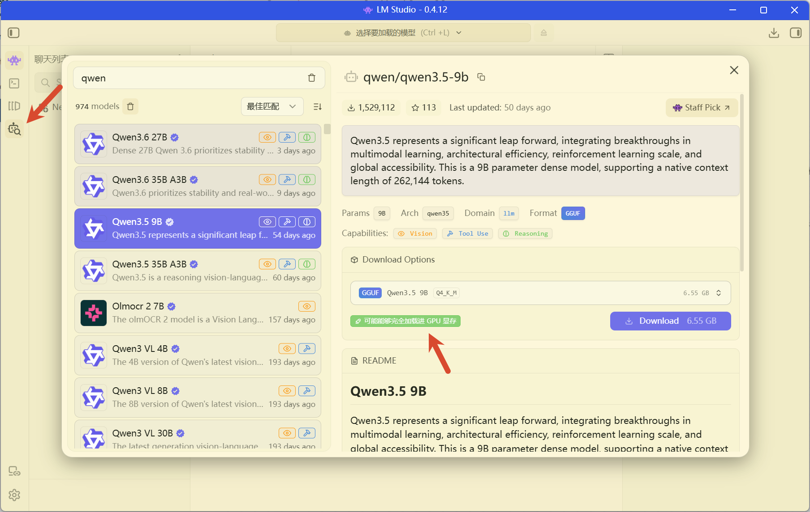

在左侧边栏中，选中那个有搜索放大镜的那个选项，在模型列表中查找具有工具调用和推理能力的模型，就是有一个锤子和一个大脑图的小icon图，第二个关注点就是是否显示`可能能够完全加载进 GPU 显存`,这是LM studio的一个优势，可以自行检测环境，并给我们对应的模型推荐

点击上面的`选择要加载的模型`，然后将刚刚下载的模型加载上，就能正常对话啦

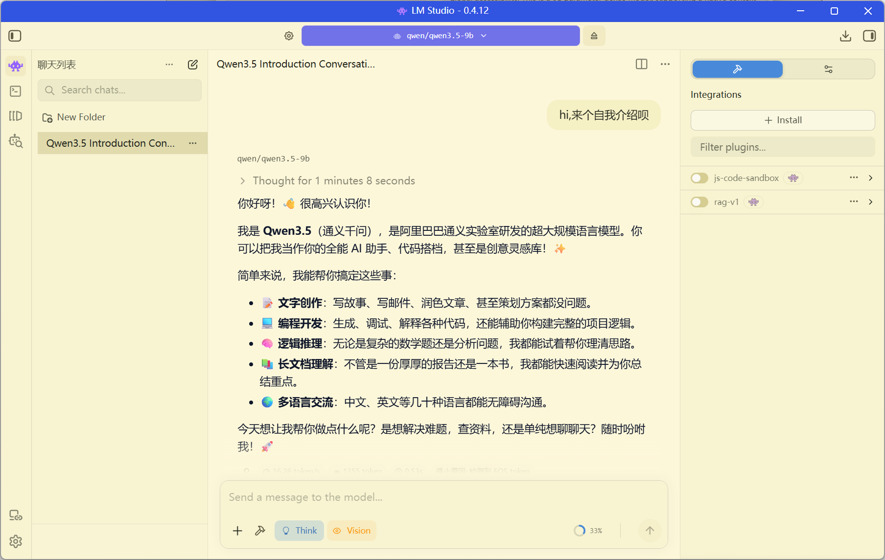

---

好啦，关于本地的大模型，我就暂且推荐这两个工具吧，它们都支持api调用的，这一部分等本篇末尾会讲解到的，整体来说，它们的推理能力被我们的硬件设备严格限制了，到后期一旦配置mcp或agent的时候，效果越来越差，我仅仅会在前期学习调用`api key`或编写skill的时候利用本地模型进行举例，so，下面的`online API Key`部分一定要有，后期必备

---

### online API Key

> 我猜昂，大家肯定是希望能用最低成本来进行学习agent开发，我也一样哈（不过我并不嫌弃好心人送我好用的模型`api key`哦，哈哈哈
>
> 下面我会举例几家我自己用的中转api提供商

#### Siliconflow

我这里说的是[国内硅基流动](https://cloud.siliconflow.cn/i/yoOSvnhP)

它有个好处，就是推荐官计划，如果通过我上面的链接进入注册并完成实名认证，可以获取到16元的代金券，暂且是够日常学习用了


它支持挺多国内模型厂家的，请看,他们上模型还挺快的，前两天刚上的deepseekV4也已经有了

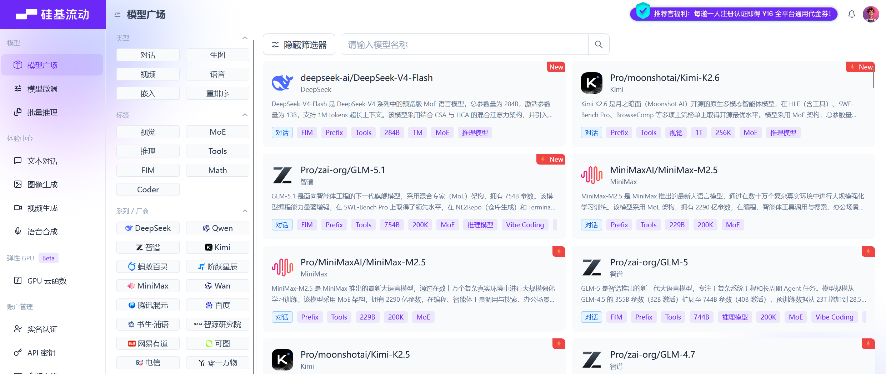

记录下获取API Key流程

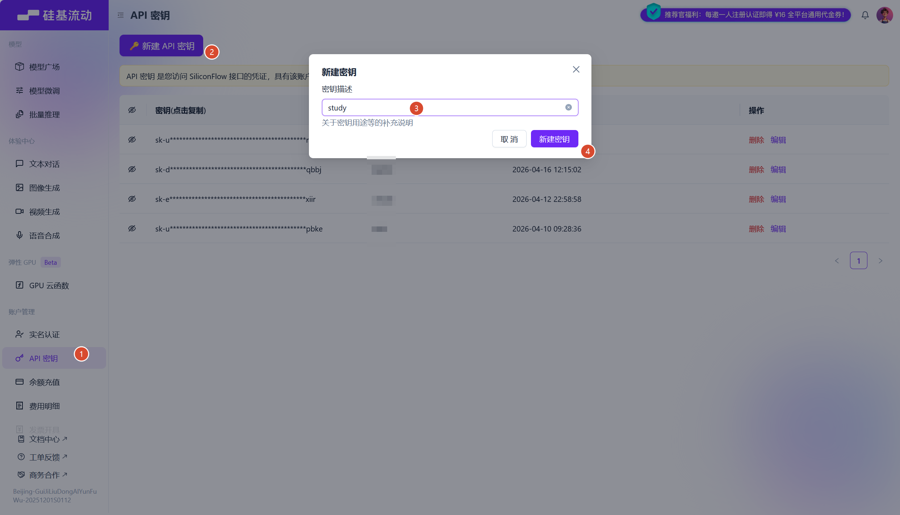

这里倒是不错，`api key`可以多次复制的

#### 阿里云百炼

这是[平台链接](https://bailian.console.aliyun.com/)

它是阿里那边提供的福利，每一个新用户都有大量模型的试用额度，额度为`1M token`,100万的话，日常测试倒是挺够用了

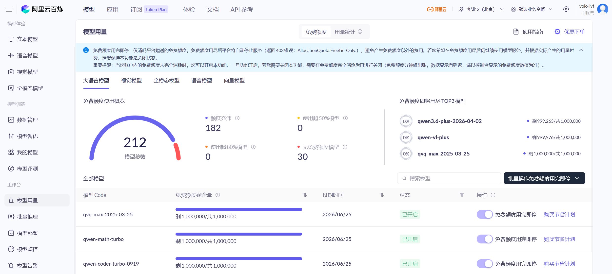

大致说说怎么获取`api key`，按照我下面的图片操作

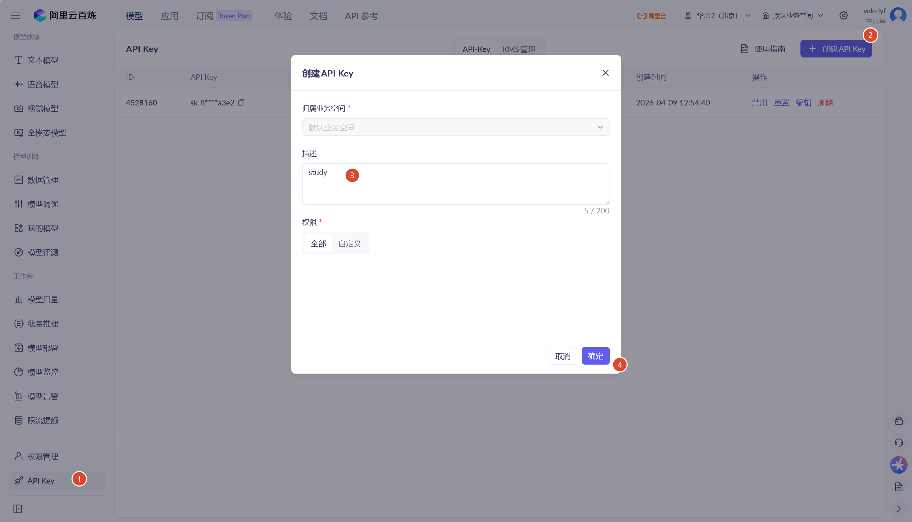

获取到的`api key`千万不要泄露到外界环境中，不然就要被像Yolo这样缺少`api key`的坏蛋滥用了

#### DeepSeek

这并不算是中转站吧，是国产大模型[Deepseek的官方平台](https://platform.deepseek.com/api_keys)，相对国外的顶尖模型还是有一定的差距，但是啊，它都没嫌我穷，我为啥要嫌弃它思考能力没国外的强呢？

它的定价真的很划算了，来看看最近的V4

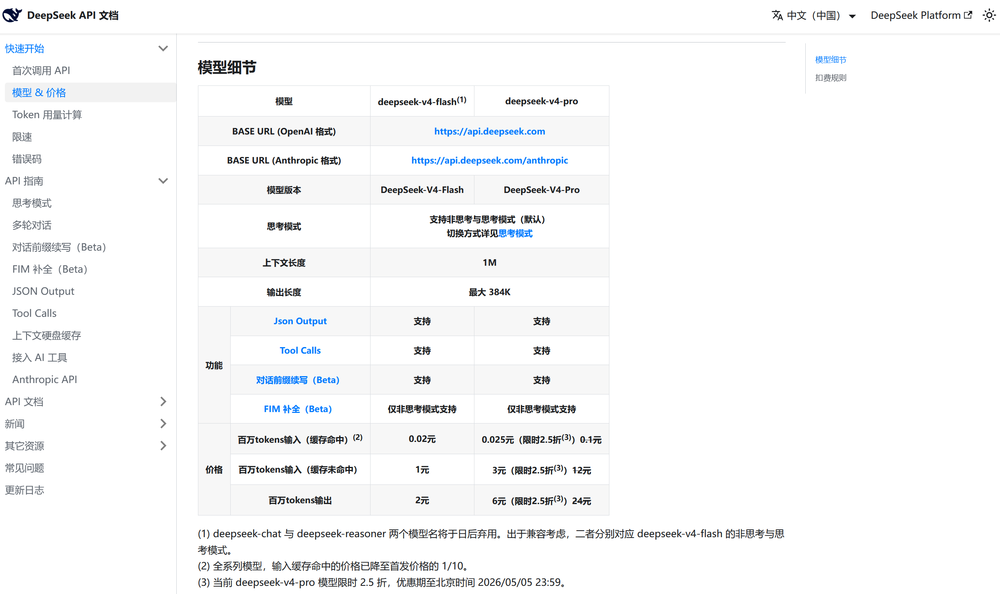

真的很赚了吧，1M tokens就2元，一顿饭钱就够我们能用一段时间了呢

嗯，这句话我爱了，来自DeepSeek官方公众号,加油，会做到更好

> 「不诱于誉，不恐于诽，率道而行，端然正己。」

获取`api key`的流程见下图：

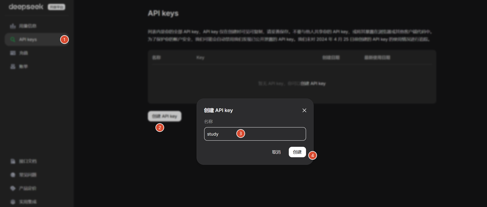

`api key`没有办法重新读，必须复制出来存储，不然就得销毁重新创建了

#### Groq

这是一家[国外的api中转站](https://console.groq.com/home)因为是国外的，必须科学上网，我喜欢用它的原因之一是它获取api key很轻松，只需要邮箱验证过去就能创建账户，每个账户能用的模型以及一些limits如下：

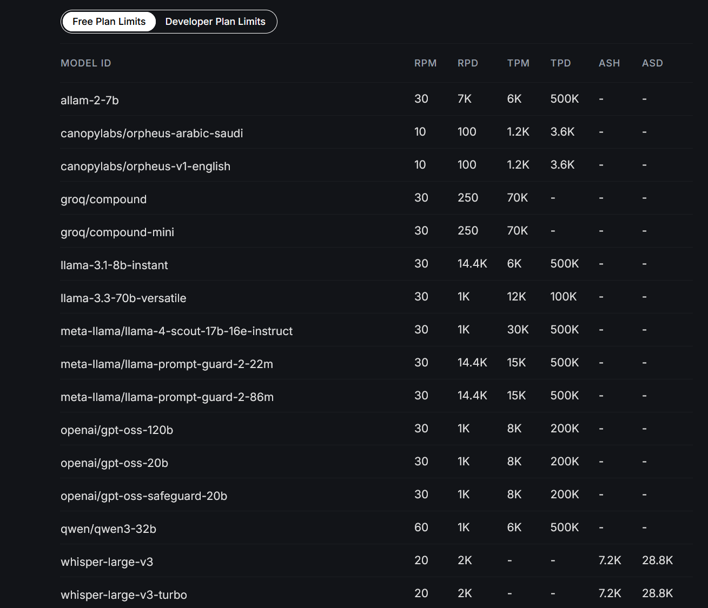

这些模型相对来说都挺不错了，但是美中不足的地方是groq会对免费账户调用模型的输出进行严格的限制：`max_completion_tokens=8192`，它的意思是说，每次会话的最大输出长度仅仅8192token，这方面并不好绕过，这样形容下，平台会实时开一个监控，如果某次输出超过8192，就像断开开关一样，就算任务没有完成也不会再输出，额，就像代码只给你写一半的那种窘况

我有想过，配置一个skill，让它能自动新开会话继续上一步的操作？好，这一步就等第二章的时候我来写

获取`api key`的流程如下：

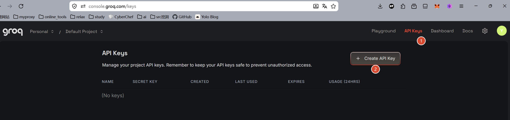

还是和前面一样，`api key`只能看一次，必须复制，否则销毁重新create


