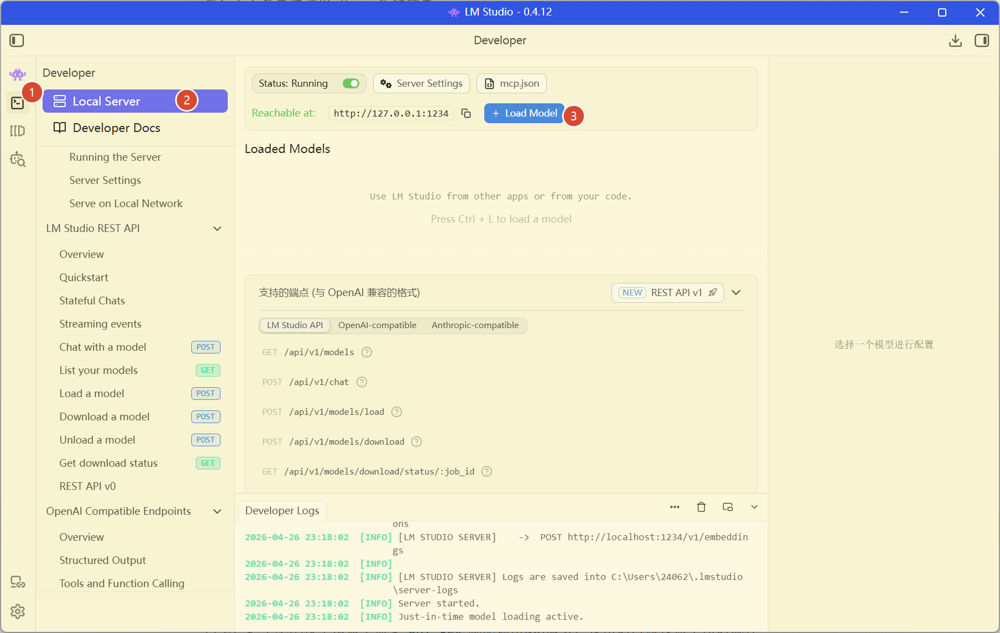
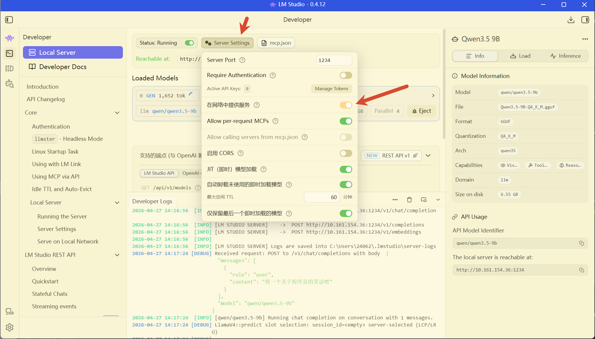
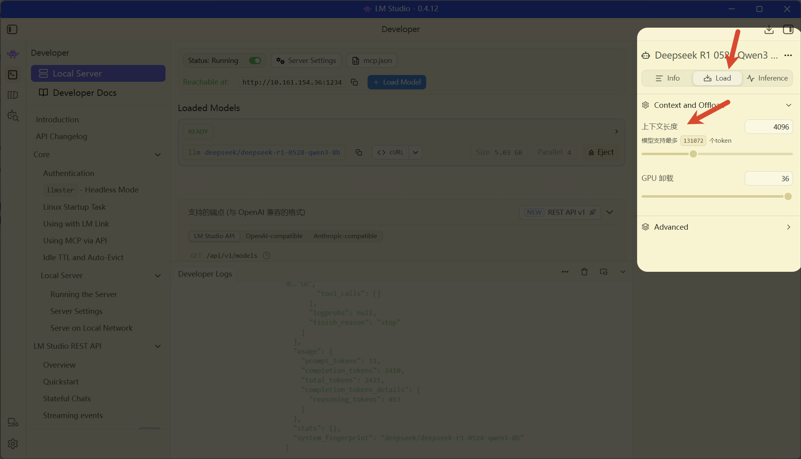

> to读者：
>
> 本文可以当作一本字典手册，并不需要全部配置，有需要的时候再看即可，本文也会不断更新，如果读者有推荐的中转api平台，可以评论区留言，我来记录

## some preparations

进行大模型应用开发的学习，底层绝对离不开一个名词:`token`，它是衡量大模型输入输出时的最小单位，也许可以把它当作电话卡的话费或流量？

搭建本地模型，还是蛮吃硬件支持的，但是大多笔记本电脑的硬件支持普遍不够高，这会对我们后面的模型开发学习带来不好的体验，例如本地模型很难带动多agent，不过前期学习的话，本地模型能力还是足够滴

后期训练自己开发的agent时，我们一般会找一些大型API中转平台,他们会提供一些免费额度或普通模型供我们进行训练和学习，如果经济条件不错，自然是参数越大的模型用起来越好，哎嘿，能不能给Yolo V个`api key`呢？

### 搭建本地模型服务

本地模型运行平台推荐两个：`ollama`和`LM Studio`

#### ollama

`ollama`算是t0版本吧，我在很早之前就知道它是专门用来跑本地模型的，说下怎么部署安装

访问[ollama官方下载链接](https://ollama.com/download)，选择自己的系统，我这里选择的是Linux，因为我打算把Wsl2作为我的开发主环境，不少工具还是在Linux调用效果最好，还有，ollama主要是命令行工具（虽说Windows下有界面了，但是命令行用的习惯


由于Ollama被开源到GitHub仓库里，下载的时候可能网速不稳定，网络环境的问题还是由读者自行解决吧，如果解决不了的话，可以评论区找我

安装好后，运行`ollama --version`

```bash
⋈┈◎ ollama --version                                                                                            ⌂ 18:12
ollama version is 0.21.2
```

接下来我们需要检查自己系统的硬件信息

```
⋈┈◎ nvidia-smi                                                                                                  ⌂ 18:13
Sun Apr 26 18:14:27 2026
+-----------------------------------------------------------------------------------------+
| NVIDIA-SMI 595.45.03              Driver Version: 595.71         CUDA Version: 13.2     |
+-----------------------------------------+------------------------+----------------------+
| GPU  Name                 Persistence-M | Bus-Id          Disp.A | Volatile Uncorr. ECC |
| Fan  Temp   Perf          Pwr:Usage/Cap |           Memory-Usage | GPU-Util  Compute M. |
|                                         |                        |               MIG M. |
|=========================================+========================+======================|
|   0  NVIDIA GeForce RTX 4060 ...    On  |   00000000:01:00.0 Off |                  N/A |
| N/A   55C    P8              1W /   95W |     215MiB /   8188MiB |      0%      Default |
|                                         |                        |                  N/A |
+-----------------------------------------+------------------------+----------------------+

+-----------------------------------------------------------------------------------------+
| Processes:                                                                              |
|  GPU   GI   CI              PID   Type   Process name                        GPU Memory |
|        ID   ID                                                               Usage      |
|=========================================================================================|
|  No running processes found                                                             |
+-----------------------------------------------------------------------------------------+

```

我的硬件配置相对来说算是中上了：4060显卡+8GB显存，如果其它读者的硬件配置较低的话，请直接看下面的`online API Key`部分

由于后面章节打算加上skill或mcp等能力，我们需要的模型必须有**tool calling(函数调用)支持**

读者可以将硬件配置信息复制给在线AI，它们会帮你找出最适合你的本地模型，我这里就选择了`qwen2.5:7b-instruct-q4_K_M`，deepseek老师推荐的


这是安装好的效果

```bash
⋈┈◎ ollama run qwen2.5:7b-instruct-q4_K_M                                                                       ⌂ 18:14
pulling manifest
pulling 2bada8a74506: 100% ▕██████████████████████████████████████████████████████████▏ 4.7 GB
pulling 66b9ea09bd5b: 100% ▕██████████████████████████████████████████████████████████▏   68 B
pulling eb4402837c78: 100% ▕██████████████████████████████████████████████████████████▏ 1.5 KB
pulling 832dd9e00a68: 100% ▕██████████████████████████████████████████████████████████▏  11 KB
pulling 2f15b3218f05: 100% ▕██████████████████████████████████████████████████████████▏  487 B
verifying sha256 digest
writing manifest
success
>>> hello,我是Yolo,你是我最好的AI助手,请多多关照
你好，Yolo！很高兴成为你的AI助手，我会尽力为你提供帮助和支持。你可以告诉我需要解决的问题或想要了解的内容，无论是学习
知识、工作上的问题还是生活中的困惑，我都会尽全力协助你。请尽管吩咐吧！
```

可以使用`/bye`退出当前的会话

到这里并没有结束哦，可以先使用`sudo systemctl status ollama`查看ollama的系统运行状态

```bash
◎ sudo systemctl status ollama                                                                                  ⌂ 18:42
[sudo] password for yolo:
● ollama.service - Ollama Service
     Loaded: loaded (/etc/systemd/system/ollama.service; enabled; preset: enabled)
     Active: active (running) since Sun 2026-04-26 18:12:50 CST; 30min ago
 Invocation: 5694944697324dd28ad287f296eec71b
   Main PID: 23260 (ollama)
      Tasks: 57 (limit: 9283)
     Memory: 4.6G (peak: 5.4G)
        CPU: 2min 48.083s
     CGroup: /system.slice/ollama.service
             ├─23260 /usr/local/bin/ollama serve
             └─26485 /usr/local/bin/ollama runner --model /usr/share/ollama/.ollama/models/blobs/sha256-2bada8a74506770>

Apr 26 18:37:40 Yolo ollama[23260]: llama_context:  CUDA_Host compute buffer size =    15.01 MiB
Apr 26 18:37:40 Yolo ollama[23260]: llama_context: graph nodes  = 959
Apr 26 18:37:40 Yolo ollama[23260]: llama_context: graph splits = 2
Apr 26 18:37:40 Yolo ollama[23260]: time=2026-04-26T18:37:40.289+08:00 level=INFO source=server.go:1402 msg="llama runn>
Apr 26 18:37:40 Yolo ollama[23260]: time=2026-04-26T18:37:40.289+08:00 level=INFO source=sched.go:561 msg="loaded runne>
Apr 26 18:37:40 Yolo ollama[23260]: time=2026-04-26T18:37:40.289+08:00 level=INFO source=server.go:1364 msg="waiting fo>
Apr 26 18:37:40 Yolo ollama[23260]: time=2026-04-26T18:37:40.290+08:00 level=INFO source=server.go:1402 msg="llama runn>
Apr 26 18:37:40 Yolo ollama[23260]: [GIN] 2026/04/26 - 18:37:40 | 200 | 41.474437331s |       127.0.0.1 | POST     "/ap>
Apr 26 18:39:51 Yolo ollama[23260]: [GIN] 2026/04/26 - 18:39:51 | 200 |  1.707250887s |       127.0.0.1 | POST     "/ap>
Apr 26 18:40:13 Yolo ollama[23260]: [GIN] 2026/04/26 - 18:40:13 | 200 |  8.028045434s |       127.0.0.1 | POST     "/ap>

```

正常运行没错吧，有个坏消息，每次电脑开机，ollama都会自动启动并运行模型，这会大大消耗电脑的电量，解决方法如下：

```bash
⋈┈◎ sudo systemctl disable ollama                                                                               ⌂ 18:43
Removed '/etc/systemd/system/default.target.wants/ollama.service'.


⋈┈◎ sudo systemctl stop ollama                  
```

前者关闭了ollama的开机启动，后者则是关闭了当前的ollama后台运行进程

以后想用的时候，直接调用`sudo systemctl start ollama`即可，会后台启动，并且监听默认的11434端口，我们就能直接调用Ollama的api了

如果想启动一个命令行对话框，运行`ollama run qwen2.5:7b-instruct-q4_K_M`（必须提前启动ollama服务才行

结束的话用stop那个命令就行

#### LM Studio

[官方链接](https://lmstudio.ai/)，这个工具建议用Windows安装，它有界面，而且相对来说还挺好用的


在左侧边栏中，选中那个有搜索放大镜的那个选项，在模型列表中查找具有工具调用和推理能力的模型，就是有一个锤子和一个大脑图的小icon图，第二个关注点就是是否显示`可能能够完全加载进 GPU 显存`,这是LM studio的一个优势，可以自行检测环境，并给我们对应的模型推荐

点击上面的`选择要加载的模型`，然后将刚刚下载的模型加载上，就能正常对话啦


---

好啦，关于本地的大模型，我就暂且推荐这两个工具吧，它们都支持api调用的，这一部分等本篇末尾会讲解到的，整体来说，它们的推理能力被我们的硬件设备严格限制了，到后期一旦配置mcp或agent的时候，效果越来越差，我仅仅会在前期学习调用`api key`或编写skill的时候利用本地模型进行举例，so，下面的`online API Key`部分一定要有，后期必备

---

### online API Key

> 我猜昂，大家肯定是希望能用最低成本来进行学习agent开发，我也一样哈（不过我并不嫌弃好心人送我好用的模型`api key`哦，哈哈哈
>
> 下面我会举例几家我自己用的中转api提供商

#### Siliconflow

我这里说的是[国内硅基流动](https://cloud.siliconflow.cn/i/yoOSvnhP)

它有个好处，就是推荐官计划，如果通过我上面的链接进入注册并完成实名认证，可以获取到16元的代金券，暂且是够日常学习用了


它支持挺多国内模型厂家的，请看,他们上模型还挺快的，前两天刚上的deepseekV4也已经有了


记录下获取API Key流程


这里倒是不错，`api key`可以多次复制的

#### 阿里云百炼

这是[平台链接](https://bailian.console.aliyun.com/)

它是阿里那边提供的福利，每一个新用户都有大量模型的试用额度，额度为`1M token`,100万的话，日常测试倒是挺够用了


大致说说怎么获取`api key`，按照我下面的图片操作


获取到的`api key`千万不要泄露到外界环境中，不然就要被像Yolo这样缺少`api key`的坏蛋滥用了

#### DeepSeek

这并不算是中转站吧，是国产大模型[Deepseek的官方平台](https://platform.deepseek.com/api_keys)，相对国外的顶尖模型还是有一定的差距，但是啊，它都没嫌我穷，我为啥要嫌弃它思考能力没国外的强呢？

它的定价真的很划算了，来看看最近的V4


真的很赚了吧，1M tokens就2元，一顿饭钱就够我们能用一段时间了呢

嗯，这句话我爱了，来自DeepSeek官方公众号,加油，会做到更好

> 「不诱于誉，不恐于诽，率道而行，端然正己。」

获取`api key`的流程见下图：


`api key`没有办法重新读，必须复制出来存储，不然就得销毁重新创建了

#### Groq

这是一家[国外的api中转站](https://console.groq.com/home)因为是国外的，必须科学上网，我喜欢用它的原因之一是它获取api key很轻松，只需要邮箱验证过去就能创建账户，每个账户能用的模型以及一些limits如下：


这些模型相对来说都挺不错了，但是美中不足的地方是groq会对免费账户调用模型的输出进行严格的限制：`max_completion_tokens=8192`，它的意思是说，每次会话的最大输出长度仅仅8192token，这方面并不好绕过，这样形容下，平台会实时开一个监控，如果某次输出超过8192，就像断开开关一样，就算任务没有完成也不会再输出，额，就像代码只给你写一半的那种窘况

我有想过，配置一个skill，让它能自动新开会话继续上一步的操作？好，这一步就等第二章的时候我来写

获取`api key`的流程如下：


还是和前面一样，`api key`只能看一次，必须复制，否则销毁重新create

## study to use api key

到这里为止，读者肯定有了属于自己的`api key`了吧，那我接下来说说怎么调用对应的模型服务

下面为了追求详细，每一个provider都会写到，大家就当这里是一个字典吧，需要什么直接跳转即可

### ollama

这是本地模型，其实是不需要`api key`的，可以直接调用它的api服务

ollama默认的API服务地址是`http://localhost:11434`,关于api key的详细调用，一定要参考[官方文档](https://docs.ollama.com/)，Yolo这里仅仅举几个最简单的例子

先本地启动ollama服务：`sudo systemctl start ollama`

获取ollama的所有模型列表：`curl http://localhost:11434/api/tags`

```bash
⋈┈◎ curl http://localhost:11434/api/tags                                                                        ⌂ 23:01
{"models":[{"name":"qwen2.5:7b-instruct-q4_K_M","model":"qwen2.5:7b-instruct-q4_K_M","modified_at":"2026-04-26T18:36:58.576822483+08:00","size":4683087332,"digest":"845dbda0ea48ed749caafd9e6037047aa19acfcfd82e704d7ca97d631a0b697e","details":{"parent_model":"","format":"gguf","family":"qwen2","families":["qwen2"],"parameter_size":"7.6B","quantization_level":"Q4_K_M"}}]}
```

可以看出来我这里只有一个模型

快速用curl命令进行一次交互：

```bash
⋈┈◎ curl http://localhost:11434/api/generate -d '{                                                              ⌂ 23:04
"model": "qwen2.5:7b-instruct-q4_K_M",
"prompt": "为什么天空是蓝色的？",
"stream": false
}'
{"model":"qwen2.5:7b-instruct-q4_K_M","created_at":"2026-04-26T15:05:04.113515261Z","response":"天空之所以呈现蓝色，主要是因为大气中的气体分子和其他微小颗粒会对太阳光产生散射作用。这种现象被称为瑞利散射（Rayleigh scattering），由英国物理学家约翰·威廉·斯特拉特（Lord Rayleigh）在19世纪末提出。\n\n当太阳光进入地球的大气层时，它包含了所有颜色的光波。这些光线中的蓝色和紫色光波较短、能量较高，在遇到大气分子和其他微小颗粒时更容易发生散射。相比之下，红色和橙色等较长波长的光线则较少被散射。因此，这些颜色的光在穿过大气层后直接到达地面。\n\n由于我们的眼睛对蓝色较为敏感且蓝光比紫光更加常见（因为太阳辐射中的蓝色光成分较多），所以我们看到的是天空呈现出蓝色。当我们观察日出和日落时，太阳位于地平线附近，光线需要穿过更厚的大气层才能到达观察者，这时较长波长的红、橙色光也会被散射出来，使得太阳本身以及周围的天际显得更加红润。\n\n总之，大气中的气体分子对蓝紫色光的强烈散射是天空呈现蓝色的主要原因。","done":true,"done_reason":"stop","context":[151644,8948,198,2610,525,1207,16948,11,3465,553,54364,14817,13,1446,525,264,10950,17847,13,151645,198,151644,872,198,100678,101916,20412,105681,9370,11319,151645,198,151644,77091,198,101916,105133,104401,105681,3837,104312,99519,105797,101047,107155,102388,105504,48934,30709,107561,108772,101281,99225,100394,99632,99759,100154,1773,100137,102060,106253,100705,59532,99632,99759,9909,29187,62969,71816,48272,67071,104025,102462,108026,111028,13935,116094,13935,105829,72225,65278,9909,51082,13255,62969,7552,18493,16,24,101186,100072,101080,3407,39165,101281,99225,101040,102493,104197,99180,99371,13343,3837,99652,115191,55338,102284,9370,99225,99804,1773,100001,109587,101047,105681,33108,111413,99225,99804,99260,99534,5373,101426,105540,96050,104011,105797,102388,105504,48934,30709,107561,13343,108478,99726,99632,99759,1773,117646,3837,104165,33108,107678,38035,49567,112228,99804,45861,9370,109587,46448,109186,99250,99632,99759,1773,101886,3837,100001,102284,9370,99225,18493,109239,105797,99371,33447,101041,104658,104722,3407,101887,97639,106975,32664,105681,104735,105521,100136,100400,99225,56006,101168,99225,101896,101536,9909,99519,101281,105357,101047,105681,99225,105024,106204,48272,108728,101038,100146,101916,107433,105681,1773,109046,104144,8903,20221,33108,8903,99297,13343,3837,101281,103987,29490,49111,43268,102205,3837,109587,85106,109239,33126,99696,104197,99180,99371,101901,104658,104144,28946,3837,104616,112228,99804,45861,9370,99425,5373,107678,38035,99225,103977,99250,99632,99759,99898,3837,104193,101281,100775,101034,109292,35727,99326,104392,101896,99425,99842,3407,106279,3837,105797,101047,107155,102388,32664,100400,111413,99225,9370,102637,99632,99759,20412,101916,104401,105681,104396,99917,1773],"total_duration":21699424926,"load_duration":16026154457,"prompt_eval_count":35,"prompt_eval_duration":294415779,"eval_count":247,"eval_duration":5125061517}
```

我们会关注到，那个context里有大量的数字，它们是对话上下文token IDs

不过我们后面学习会主要使用python来实现，请看：

```bash
⋈┈◎ cat test.py                                                                                /tmp py ⌉⌊ 3.13.12 23:10
import requests
def chat_with_ollama(prompt):
    url="http://localhost:11434/api/generate"
    payload={
        "model":"qwen2.5:7b-instruct-q4_K_M",
        "prompt":prompt,
        "stream": False
    }
    try:
        response=requests.post(url,json=payload)
        response.raise_for_status()
        result=response.json()
        return result["response"]
    except Exception as e:
        return f"wront:{e}"
if __name__ =="__main__":
    answer=chat_with_ollama("用一句话解释什么是机器学习")
    print(answer)
    
⋈┈◎ python test.py                                                                             /tmp py ⌉⌊ 3.13.12 23:11
机器学习是让计算机在不进行明确编程的情况下从数据中学习并改进其性能的能力。
```

不过ollama为了让python更好的支持它的系列功能，专门写了一个ollama的python库，使用下面命令进行安装：

`pip install ollama`

然后下面是单纯调用ollama库的效果

```bash
⋈┈◎ cat test.py                                                                                /tmp py ⌉⌊ 3.13.12 23:15
import ollama

response = ollama.chat(
    model='qwen2.5:7b-instruct-q4_K_M',
    messages=[{
        'role':'user',
        'content':'hello,做个自我介绍'
    }]
)
print(response['message']['content'])


⋈┈◎ python test.py                                                                             /tmp py ⌉⌊ 3.13.12 23:15
您好！我是Qwen，一个由阿里云开发的语言模型助手。我能够提供信息查询、语言翻译、创意写作等多方面的服务，旨在帮助用户更高效地获取所需的知识和完成日常任务。请问您有什么问题或需要帮助的吗？我会尽力提供支持。
```

相较之前用requests版本的要简易不少吧

### LM Studio

同上，这个本地模型依然不需要`api key`就能调用api服务，使用的时候按照下图的流程



`load model`的时候选中自己前面安装的模型即可，有没有注意到这里的`Developer Docs`?里面写的挺详细的，可以认真读读

注意，必须打开在网络中服务，这样的话，只要是局域网(同一网卡)内，终端都能访问到，包括我的wsl，虚拟机等等



使用效果如下：

```bash
◎ curl http://10.161.154.36:1234/v1/chat/completions \                                                          ⌂ 14:23
-H "Content-Type: application/json" \
-d '{
  "messages":[
    {"role":"user","content":"做一个简单的自我介绍"}
  ],
  "model":"qwen/qwen3.5-9b"
}'
{
  "id": "chatcmpl-7tbojw2c479laawnkddiyj",
  "object": "chat.completion",
  "created": 1777271043,
  "model": "qwen/qwen3.5-9b",
  "choices": [
    {
      "index": 0,
      "message": {
        "role": "assistant",
        "content": "\n\n你好呀！很高兴认识你！😊\n\n**如果是在问我（AI）的自我介绍：**\n我是人工智能助手，可以帮你处理文字、解答问题、提供创意灵感或者翻译资料。无论你需要什么帮助，随时都可以叫我。\n\n***\n\n**如果你是想要一段属于你自己的“自我介绍”模板，我为你准备了几个不同场景的版本，你可以直接套用或修改：**\n\n### 🌟 场景一：职场/面试（专业、稳重）\n> “大家好，我叫 [你的名字]，目前担任 [你的职位/职业]。我拥有 [X] 年的 [行业/领域] 经验，擅长 [核心技能 1] 和 [核心技能 2]。在上一份工作中，我主要负责 [简述主要成就]。我很期待能在这里学习新的知识，并贡献我的力量。”\n\n### 🎉 场景二：社交/聚会（轻松、有趣）\n> “哈喽！我是 [名字]，可以叫我 [昵称]。平时我喜欢 [爱好 1，如摄影] 和 [爱好 2，如健身]。不过我最大的特点是特别爱笑，如果你需要找话题或帮忙拍照，随时叫我！希望能和大家聊得来。”\n\n### 🎓 场景三：校园/班级（亲切、积极）\n> “大家好，我是来自 [学校/专业] 的 [名字]。性格比较开朗，擅长组织策划活动。加入这个集体，希望能和大家一起进步，如果有需要帮忙搬重物或整理资料的地方，请随时提！”\n\n### 🚀 场景四：一句话极简版（电梯演讲）\n> “我是 [名字]，一个对 [领域/兴趣] 充满热情的 [职业/身份]，致力于通过 [你的特长/价值] 解决问题。”\n\n---\n\n**💡 小建议：**\n1. **控制时长：** 一般控制在 30-60 秒读完。\n2. **突出亮点：** 用具体的成就或爱好代替笼统的形容词（比如“做事负责”不如“经手的项目零失误”）。\n3. **保持真诚：** 语气自然，眼神有交流会更好哦。\n\n如果你有更具体的场合或想强调的内容，可以告诉我，我帮你定制更精准的版本！",
        "reasoning_content": "Here's a thinking process that leads to the suggested self-introductions:\n\n1.  **Analyze the Request:**\n    *   **User:** \"做一个简单的自我介绍\" (Make a simple self-introduction).\n    *   **Intent:** The user wants me (the AI) or they want help writing a self-introduction for themselves?\n        *   *Scenario A:* They are asking *me* to introduce myself.\n        *   *Scenario B:* They want a template/prompt for *them* to use in an interview, social setting, or professional context.\n    *   **Constraint:** The request is very broad (\"simple\"). I need to cover both possibilities (introducing myself as AI OR helping them introduce themselves) to be most helpful.\n\n2.  **Determine the Best Approach:**\n    *   Since I am an AI assistant, usually when users say \"make a self-introduction\" without specifying context, they might expect me to introduce *me*. However, often people ask this when they want a *template* for themselves.\n    *   *Strategy:* I should primarily introduce myself as an AI first (clarifying my identity), but then offer templates for *their* use cases (professional, casual, etc.) because that's likely what they actually need to achieve.\n    *   *Tone:* Polite, clear, helpful, and versatile.\n\n3.  **Drafting - Part 1: Introducing Myself (The AI):**\n    *   Name: Qwen (or just \"Assistant\" depending on specific branding, but generally keep it friendly).\n    *   Function: AI assistant, text processing, problem-solving, etc.\n    *   Personality: Helpful, patient, accurate.\n    *   *Draft:* 你好！我是你的 AI 助手。我叫 Qwen（或者通义千问）。我可以帮你写文章、查资料、做翻译等。很高兴为你服务。 (Hello! I'm your AI assistant. My name is Qwen... I can help you write, search, translate... Happy to serve.)\n\n4.  **Drafting - Part 2: Templates for the User (The Human):**\n    *   Need different scenarios because \"simple\" varies.\n    *   *Scenario 1: Workplace/Interview (Professional)*\n        *   Key elements: Name, Role, Experience, Skills, Goal.\n        *   Tone: Confident, concise.\n    *   *Scenario 2: Social/Party (Casual)*\n        *   Key elements: Name, Hobbies, Fun fact.\n        *   Tone: Relaxed, friendly.\n    *   *Scenario 3: School/Classmate*\n        *   Key elements: Major, Interests, Open to cooperation.\n        *   Tone: Approachable.\n\n5.  **Refining the Content (Self-Correction/Optimization):**\n    *   *Correction:* Wait, simply introducing myself might be what they want, but usually, \"make a simple self-introduction\" implies \"help me write one\". I need to explicitly ask/offer templates.\n    *   *Better Strategy:* Start with a warm AI introduction, then immediately pivot to offering help for *them*. This covers all bases.\n    *   *Structure:*\n        1.  Greeting & My Identity (AI).\n        2.  Offer to help them write theirs.\n        3.  Provide examples/templates (Work, Social, General).\n        4.  Tips on how to write a good one.\n\n6.  **Finalizing the Output (in Chinese):**\n    *   *Greeting:* 你好呀！很高兴认识你。(Hello! Nice to meet you.)\n    *   *My Intro:* 我是通义千问 (Qwen)... capabilities...\n    *   *Transition:* 不过，我猜你可能也想需要一段**适合你自己的自我介绍**模板吧？(But, I guess you might need a template for yourself?) -> \"如果是你需要写一个自己的介绍...\"\n    *   *Templates:* Create distinct versions.\n    *   *Tips:* Add value (keep it short, highlight strengths, smile).\n\n7.  **Review against Constraints:**\n    *   Keep it simple? Yes, avoid overly technical jargon.\n    *   Be helpful? Yes, provide actionable text.\n\n8.  **Final Polish:** (Self-Correction during drafting)\n    *   Make sure the templates are customizable (use placeholders like [名字]).\n    *   Keep the tone encouraging.\n\n**(Self-Correction Note):** I need to make sure I don't confuse the user. If they just want me to introduce myself, giving them templates might feel like \"reading their mind\". But usually, this prompt means \"Help me write one\". I will address both to be safe.\n*Revised Plan:*\n1. Brief AI intro (in case).\n2. Main focus: Helping *them* write theirs (since that's the more common utility request).\n3. Provide 3 distinct scenarios.\n\nLet's write it.\n\n*Drafting the response...*\n- Start with friendly greeting.\n- Mention my identity briefly.\n- Ask if they want to introduce themselves in a specific context.\n- Give examples immediately as value-add.\n- End with an offer to customize.\n\n*Wait, one more thought:* The prompt is \"Do a simple self-introduction\". It could literally mean \"You (the AI) do it now\". Or \"Generate text for me\". I should prioritize the AI introduction first, then ask/offer the human version. This is safer.\nActually, looking at search history/common intent: Most users want to generate text for *themselves*. I will provide templates but frame it as \"Here are some versions for you.\"\nOkay, let's combine: \"Here I am (AI), and here is help for you.\"\n\nLet's structure the response clearly.\n1. My intro (The AI).\n2. Templates for them (Work, Casual, etc.).\n3. Tips.\n\n*Wait, keep it simple.* If I just say \"I am an AI\", that's too short. If I dump 3 templates, that's too long without context.\nLet's do this: \"Hello! I'm [AI Identity]. I can help you write one. Here are some examples.\"\n\nOkay, ready to generate.\n\n*(Final decision)*: I will provide a friendly AI intro first, then assume they want *templates* for themselves and provide those, categorized by scenario. This is the most comprehensive way to answer \"Simple self-intro\".\n\nLet's go.cw\n",
        "tool_calls": []
      },
      "logprobs": null,
      "finish_reason": "stop"
    }
  ],
  "usage": {
    "prompt_tokens": 13,
    "completion_tokens": 1874,
    "total_tokens": 1887,
    "completion_tokens_details": {
      "reasoning_tokens": 1405
    }
  },
  "stats": {},
  "system_fingerprint": "qwen/qwen3.5-9b"
}                                           
```

emm，我发现9b我电脑带不动，响应速度太慢了点，我重新找了一个8b的`deepseek/deepseek-r1-0528-qwen3-8b`试试效果

感觉还行呢，对了，看看这里，后期一定要将上下文长度设置大一点，否则容易跑一半就失败



然后说说怎么用python库调用，不如这样吧，我在这里放一版openai的，这个版本脚本特别普遍，兼容所有`openai api key`的,务必安装openai库：`pip install openai`

~~~bash
◎ cat test.py                                                                                  /tmp py ⌉⌊ 3.13.12 15:38
from openai import OpenAI

# 1. 初始化客户端，指向 LM Studio 的本地服务器
client = OpenAI(
    base_url="http://10.161.154.36:1234/v1", # 这是 LM Studio 的默认地址，如果你的端口不同请修改
    api_key="lm-studio"                  # 本地服务器不需要真实密钥，但参数不能为空
)

# 2. 发送对话请求
try:
    response = client.chat.completions.create(
        model="deepseek-r1-0528-qwen3-8b", # 必须与 LM Studio 中加载的模型名称一致
        messages=[
            {"role": "system", "content": "你是一个精通编程的 AI 助手。请用中文回答。"},
            {"role": "user", "content": "请解释一下什么是 Python 中的装饰器（Decorator）？"}
        ],
        temperature=0.7,  # 生成文本的随机性 (0.0 到 1.0)
        max_tokens=35380    # 限制生成的最大 token 数量（可选）
    )

    # 3. 打印模型的回复
    print("🤖 DeepSeek 的回复：\n")
    print(response.choices[0].message.content)

except Exception as e:
    print(f"调用失败，请检查 LM Studio 的服务器是否已启动。错误信息: {e}")


◎ python test.py                                                                               /tmp py ⌉⌊ 3.13.12 15:38
🤖 DeepSeek 的回复：


好的，我们来详细解释一下 Python 中的装饰器（Decorator）。

# 什么是 Python 装饰器？

在编程中，**装饰器是一种强大的函数类型的功能增强工具**，它允许你修改一个已存在的函数或类的行为，同时还能保持原有的代码不变。本质上，它是：

1.  **一个函数，接收另一个函数作为参数，并返回一个新的函数（替换原函数）**
2.  或者是一个可计算的类，用于动态地扩展对象的功能。

装饰器的核心思想是**“在不修改原始定义的情况下增加新功能”**，这通常通过组合和包裹的方式实现。Python 使用 `@` 符号来将装饰器应用到函数或方法上（或者也可以应用于类）。

## 为什么需要装饰器？

当开发者想要给现有的函数添加一些功能时，例如：

*   **权限验证：** 在调用某个需要特定权限的函数前，检查用户是否拥有该权限。
*   **日志记录：** 记录函数被调用的时间、参数和返回值等信息。
*   **性能计数/缓存：** 测量一个耗时函数执行时间，或者将计算结果缓存起来避免重复计算。
*   **输入验证：** 检查传入函数的参数类型或格式是否正确。

如果每次都要复制原始代码并加入这些新功能，代码会变得冗余且难以维护。装饰器提供了一种更优雅、更简洁的方式来复用代码，并集中地修改函数的行为。

## 如何理解它？

可以把装饰器想象成是：

*   **胶水：** 把两个或多个东西（在这里是函数）粘合在一起，赋予它们新的组合特性。
*   **外套/包装盒：** 给一个核心功能穿上一件“新衣服”，在不改变核心本身的情况下增加额外的功能。

### 用最简单的例子来理解

假设我们有一个需要权限才能访问的简单函数：

```python
def greet():
    print("你好！")
```

现在，我们想添加一个新的行为：只有管理员才允许执行这个函数。我们可以使用一个装饰器来做这件事。

首先，定义一个装饰器 `admin_required`，它接收被装饰的函数作为参数，并返回一个新的函数（包裹后的函数）：

```python
def admin_required(func):
    def wrapper():
        # 新增功能：检查用户是否为管理员
        if not is_admin():  # 假设有一个全局函数is_admin()可以判断当前用户权限
            print("你没有管理员权限，无法访问此功能。")
            return None

        # 如果是管理员，则调用原始的greet函数
        original_func = func
        result = original_func()
        return result

    # 返回包装后的函数（也就是新的“greet”）
    return wrapper
```

然后，我们使用 `@` 符号将这个装饰器应用到 `greet` 函数上：

```python
@admin_required  # 这个就是装饰器的语法糖！它会调用admin_required(greet)并将返回的新函数赋值给 greet_name
def greet():
    print("你好！")
```

现在，当我们调用 `greet()` 时，实际上是在调用由装饰器生成的那个新的函数（`wrapper` 函数）。这个新函数首先检查权限，如果通过了则执行原始的 `greet` 并返回其结果；如果没有，则打印错误信息并停止。

注意：在 Python 中，这相当于：

```python
def greet():
    print("你好！")

# 使用装饰器语法糖等同于：
greet = admin_required(greet)
```

### 装饰器的通用结构

一个典型的函数装饰器结构是这样的：

```python
def decorator(old_func):
    def new_func(*args, **kwargs):
        # 在调用旧函数之前添加的功能 (增强部分)
        result = old_func(*args, *kwargs)  # 执行被装饰的原始函数
        # 在调用之后添加的功能 (可能修改、记录或返回结果)

        return result

    return new_func
```

然后应用：

```python
@decorator
def my_function(...):
    ...
```

## 类装饰器和静态方法装饰器也是类似的原理

类装饰器也是一个函数，它接收一个类作为参数，并返回一个修改后的类。它可以用于添加到类的方法、改变类的结构或行为等。

### 总结一下关键点

*   **目的：** 增强或修改现有代码（通常是函数）的功能。
*   **本质：** 高阶函数，接收被装饰对象作为参数并返回一个新对象。
*   **语法糖：** `@` 符号使得应用装饰器非常简洁方便。
*   **工作方式：** 将原始函数包装在一个新的函数（或类）内部，在这个包裹层里可以添加任何代码，然后调用原始函数。

理解了装饰器的核心概念和工作原理后，你就可以开始使用它来编写更简洁、功能更强的 Python 代码了。这是一个非常重要的语言特性，尤其是在框架中很常用，如 Django 的 CBVs（基于类的视图）中的 `login_required` 装饰器等。

如果你想进一步学习，请尝试：
1. 编写自己的简单装饰器。
2. 查看标准库中的装饰器示例（比如 Flask, Django 中的常见装饰器）。
3. 研究如何使用多个装饰器修饰一个函数。
~~~

### Siliconflow

可以直接访问[官方提供的文档](https://docs.siliconflow.cn/cn/api-reference/chat-completions/chat-completions)

### 阿里云百炼

[官方文档链接](https://bailian.console.aliyun.com/cn-beijing?tab=doc#/doc)

### DeepSeek

[接口文档信息](https://api-docs.deepseek.com/zh-cn/)

### Groq

[文档链接](https://console.groq.com/docs/overview)


