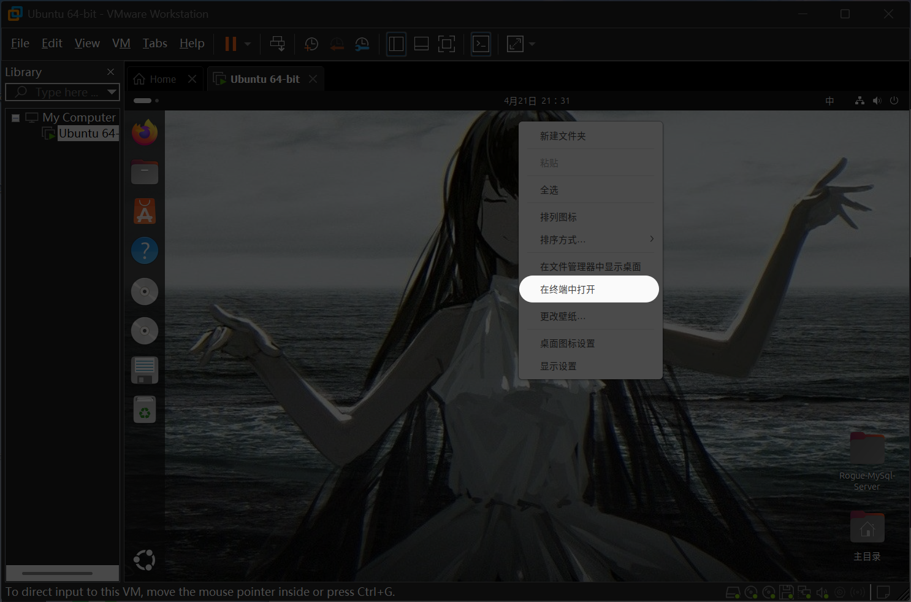
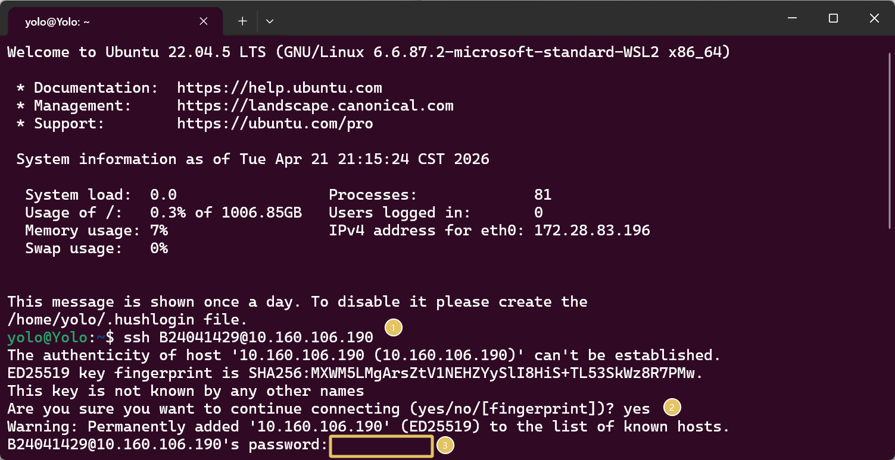
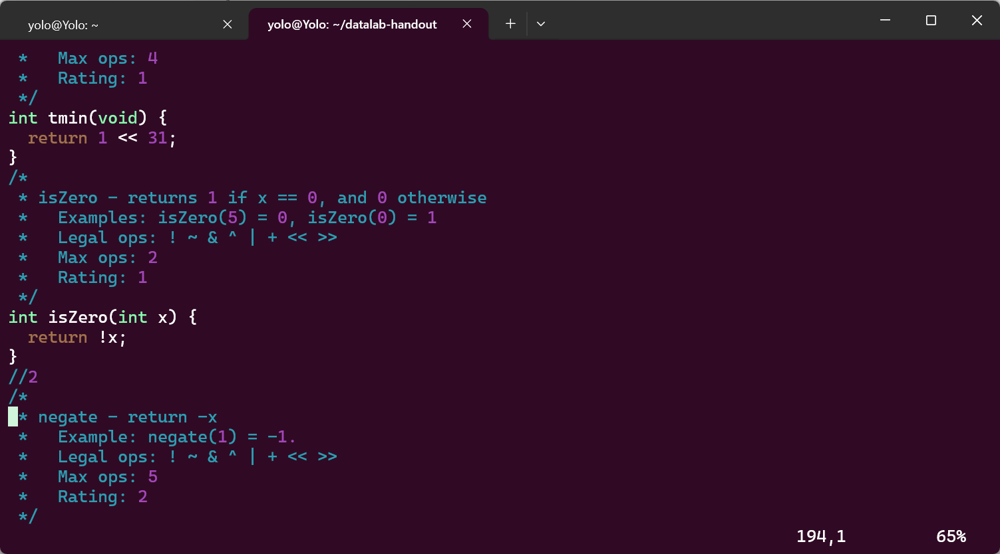
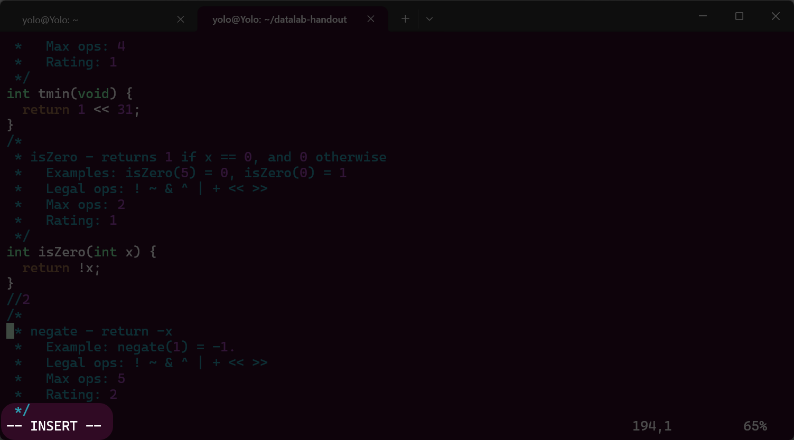
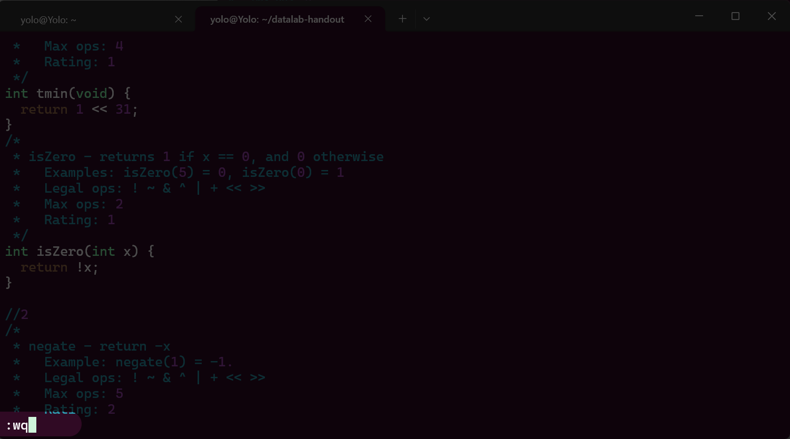

> 虽说这个实验不作提交要求，但是对于刚接触Linux命令行的新人来说，特别安利

## 环境准备

老师建议的实验环境：`VMware17+Ubuntu24.04`

Yolo使用的本地环境:`Wsl2(Ubuntu22.04)`

> 这里不会对如何安装虚拟机进行指导，这个网上教程太多太多，本文会详细讲解在命令行中执行的命令的具体含义，以及实验内容

## start

虚拟机里右键应该能看到选项：`在终端中打开`如果是英文的话，就是`open in terminal`



点击后应该会调出像下面的终端



可以关注我标注了三处，先说说命令

```bash
ssh B24041429@10.160.106.190
```

这里是利用ssh进行远程服务器连接，想象一个场景，拜访亲戚串门的时候，每一个门对应一个IP地址，不能走错的，然后拜访前应该说明自己是谁，就是命令里的B24041429

> 我的举例也许不会很严谨，比如IP地址还有不少细节知识:ipv4,ipv6,公网IP,内网环境等等，但是大概思路是这样，供大家简单理解的

第二处标记是我输入了yes，这里的行为是告诉本地，可以确认信任连接的服务器的公钥指纹，并将它保留到本地的known_hosts文件中，下次就不会再触发（但是下次连接的时候，后台会再次校验公钥指纹的，一旦与已知的指纹不匹配，同样会警告的，避免出现中间人攻击，这些算是后话了）

我也能举个小例子，农村栓住的看门小狗遇到陌生人一定会警惕的，但是一旦主人招呼下，小狗就会简单认识这个陌生人，下次有概率不会叫吧，哈哈哈

第三处标记是我们需要输入密码的地方，敲密码的时候发现屏幕没有任何回显并不意味着电脑卡住了，实际上这是几乎所有Linux关于密码输入的安全设计，避免攻击者通过常规那种星号替换密码获取密码长度等特征信息，只要密码输入正确后回车就能连接上服务器

## 下载实验程序

> 下述操作我都在我自己的wsl2中进行的，服务器端暂时没有用，仅仅只有一个下载文件并收集bits.c的作用

看了下实验报告，显然老师提供了一个http端供我们直接下载文件，这里稍微炫炫技

```bash
yolo@Yolo:~$ wget http://10.160.106.190/datalab-handout.tar
--2026-04-21 22:07:36--  http://10.160.106.190/datalab-handout.tar
Connecting to 10.160.106.190:80... connected.
HTTP request sent, awaiting response... 200 OK
Length: 1341440 (1.3M) [application/x-tar]
Saving to: ‘datalab-handout.tar’

datalab-handout.tar      100%[===============================>]   1.28M  --.-KB/s    in 0.02s

2026-04-21 22:07:36 (61.8 MB/s) - ‘datalab-handout.tar’ saved [1341440/1341440]

yolo@Yolo:~$ tar -xvf datalab-handout.tar
datalab-handout/
datalab-handout/Makefile
datalab-handout/fshow.c
datalab-handout/btest.h
datalab-handout/bits.c
datalab-handout/README
datalab-handout/tests.c
datalab-handout/ishow.c
datalab-handout/btest.c
datalab-handout/dlc
datalab-handout/bits.h
datalab-handout/decl.c
datalab-handout/driver.pl
datalab-handout/Driverlib.pm
datalab-handout/Driverhdrs.pm
```

不细讲哈，用浏览器打开那个链接就能自动下载，接下来的那个tar命令可以用来解压压缩包，同样，本地如果有解压工具，右键直接解压即可

## 正式答题

根据报告描述，我们需要完善`bits.c`即可，前面部分的注释自己翻译哈，我大致说说要求

- **target**：修改 `bits.c`，使所有函数通过 `btest` 测试，且不违反编码规则

- **整数函数限制**：
  - 仅允许操作符：`! ~ & ^ | + << >>`
  - 常量范围：`0` ~ `255`（`0xFF`）
  - 数据类型：仅 `int`
  - 禁止：`if` / `while` / `&&` / `||` / `-` / `?:` / 函数调用 / 类型转换 / 宏

- **浮点数函数限制**：
  - 允许：控制结构（`if` / `while`）、比较运算符、`&&` / `||`
  - 允许：任意整数常量、`int` 和 `unsigned` 类型
  - 禁止：浮点类型 / 浮点运算 / 类型转换 / 函数调用 / 宏

- **操作计数**：
  - 每个函数有最大操作数限制（`Max ops`）
  - 赋值 `=` 不计入，其他操作符都算

- **工具使用**：
  - `./dlc bits.c` → 检查规则合规性
  - `./dlc -e bits.c` → 查看操作数统计
  - `./btest` → 测试正确性
  - `./ishow` / `./fshow` → 查看位表示

- **假设环境**：
  - 32 位补码，算术右移
  - 移位量 < 0 或 > 31 时行为不可预测

### 1-1

```c
//1
/*
 * tmin - return minimum two's complement integer
 *   Legal ops: ! ~ & ^ | + << >>
 *   Max ops: 4
 *   Rating: 1
 */
int tmin(void) {
  return 2;
}
```

返回32位补码表示的最小整数,这里先考虑下，32位有符号整数的范围应该是`-2³¹`到`2³¹-1`

最小值只能是`-2³¹=0x80000000`，如果再减1就会溢出到`0x7FFFFFFF`这显然是一个正数

再处理下最小值`-2³¹=0x80000000=1000 中间我省略了6组4个0 0000`

emm，将数字1左移31位到达符号位不就是最小值吗？

```c
int tmin(void){
	return 1 << 31;
}
```

---

下面我简单说说怎么用vi编辑文件(其实下载下来的话，可以直接用vscode这类IDE编辑)

- 输入`vi bits.c`
- 进来后只能预览，无法编辑



- 输入`i`,进入编辑模式



会看到左下角出现`-- INSERT --`字样，这个时候我们可以直接进行编辑

- 按`esc`退出编辑模式，这个时候我们回到了预览模式，然后输入`:wq`可以退出当前打开的文件



> 温馨提示，如果进来后没有编辑，可以直接使用`:q`退出文件

接下来我们需要进行编译，正常来说单纯使用gcc即可，但是本题代码规定了，是32位环境，需要提前安装好这两个工具链,作用是支持我们在64位环境下也能编译32位的源代码

```bash
sudo apt install gcc-multilib g++-multilib
```

接下来使用`make clean`清理下之前编译残留的文件，然后进行编译

```bash
yolo@Yolo:~/datalab-handout$ make btest
gcc -O -Wall -m32 -lm -o btest bits.c btest.c decl.c tests.c
btest.c: In function ‘test_function’:
btest.c:334:23: warning: ‘arg_test_range’ may be used uninitialized [-Wmaybe-uninitialized]
  334 |     if (arg_test_range[2] < 1)
      |         ~~~~~~~~~~~~~~^~~
btest.c:299:9: note: ‘arg_test_range’ declared here
  299 |     int arg_test_range[3]; /* test range for each argument */

```

关于下面的警告信息我们不用管，无非就是btest.c中的代码里定义了一些变量什么的，但是我们没有调用，这个警告预计会在后面写完相关代码就能消失

> 关于我为啥要`make btest`，可以去读读`./README`，里面描述的很详细了:关于本题的一些测试工具的调用等等信息

---

用我们刚刚编译好的btest进行验证

```bash
yolo@Yolo:~/datalab-handout$ ./btest -f tmin
Score   Rating  Errors  Function
 1      1       0       tmin
Total points: 1/1
```

win!

### 1-2

```c
/*
 * isZero - returns 1 if x == 0, and 0 otherwise 
 *   Examples: isZero(5) = 0, isZero(0) = 1
 *   Legal ops: ! ~ & ^ | + << >>
 *   Max ops: 2
 *   Rating: 1
 */
int isZero(int x) {
  return 2;
}
```

这个函数会检测读取的x是不是0，如果是0返回1，其它都返回0，要求很严格，只能用2个操作符号

这里有个很有意思的逻辑运算符号:`!`

在所有`!`参与的运算中，它后面的值如果非0，统一会被判真，如果是0，那就判假

> (温馨提示，我这里说的情况是运算符后面仅仅跟着一个int整数，如果是一些逻辑比较运算，我们还需要单独讨论!)

但是`!`的运算是非运算，也就是说结果真的话，它处理后就变成`假 ---> 0`

如果结果为假，进行非运算后，变成`真 ---> 1`

这里和本题特别特别贴近，如果是0就返回1，反之都返回0

```c
int isZero(int x) {
  return !x;
}
```

是不是超级ez?

```bash
yolo@Yolo:~/datalab-handout$ ./btest -f isZero
Score   Rating  Errors  Function
 1      1       0       isZero
Total points: 1/1
```

win!

### 2-1

```c
//2
/* 
 * negate - return -x 
 *   Example: negate(1) = -1.
 *   Legal ops: ! ~ & ^ | + << >>
 *   Max ops: 5
 *   Rating: 2
 */
int negate(int x) {
  return 2;
}
```

看这个例子，好像是要返回x的相反数，而且只能最多使用5个运算逻辑符号

老师上课讲过，二进制中计算相反数的操作是：按位取反再加一

举个小例子

| 十进制 | 二进制(8位二进制) |
| ------ | ----------------- |
| 2      | 0000 0010         |
| -2     | 1111 1110         |

- 取反：1111 1101
- 加1：1111 1110

那么本题的解决方法如下

```c
int negate(int x) {
  return ~x+1;
}
```

重新编译测试

```bash
yolo@Yolo:~/datalab-handout$ ./btest -f negate
Score   Rating  Errors  Function
 2      2       0       negate
Total points: 2/2
```

win了

### 2-2

```c
/* 
 * isNotEqual - return 0 if x == y, and 1 otherwise 
 *   Examples: isNotEqual(5,5) = 0, isNotEqual(4,5) = 1
 *   Legal ops: ! ~ & ^ | + << >>
 *   Max ops: 6
 *   Rating: 2
 */
int isNotEqual(int x, int y) {
  return 2;
}
```

这里的`isNotEqual`函数会读取两个整数，如果相同，返回0，不同返回1

哦哦，按位运算里的`xor`有点用，如果比对的两个数字相同，异或结果就是0，如果不同，结果会变成非0数（注意，我这里说的非0并不代表就是1

举个小例子：对数字4和数字6进行按位xor

```plain
  0 1 0 0   (4)
^ 0 1 1 0   (6)
-----------
  0 0 1 0   (2)
```

这个的结果就是2了，这个和本题的需求不太一样，但是我们能回顾下1-2里用到的`!`逻辑运算符，如果后面跟的整数非0，会返回结果1，是0的话，就会返回结果0

那么我们可以在运算x^y前加一个非运算，不过得到的结果与题目要求恰恰相反：相同返回0，不同返回1了

可以再套娃一个`!`来满足题目要求

```c
int isNotEqual(int x, int y) {
  return !!(x^y);
}
```

进行测试，成功了

```bash
yolo@Yolo:~/datalab-handout$ ./btest -f isNotEqual
Score   Rating  Errors  Function
 2      2       0       isNotEqual
Total points: 2/2
```

### 3-1

```c
//3
/* 
 * isAsciiDigit - return 1 if 0x30 <= x <= 0x39 (ASCII codes for characters '0' to '9')
 *   Example: isAsciiDigit(0x35) = 1.
 *            isAsciiDigit(0x3a) = 0.
 *            isAsciiDigit(0x05) = 0.
 *   Legal ops: ! ~ & ^ | + << >>
 *   Max ops: 15
 *   Rating: 3
 */
int isAsciiDigit(int x) {
  return 2;
}
```

这里考察大小比较，要求判断参数x是否在0x30和0x39之间,满足条件返回1，否则返回0

```text
x >= 0x30 且 x <= 0x39
```

思考了下，这里也许要进行两次边界测试？

第一次进行`x - 0x30`如果结果非负，就能判定x在`[0x30,+∞)`

第二次进行`0x39 - x`如果结果非负，就能判定x在`(-∞,0x39]`

将两次的边界测试的结果进行与运算，如果结果是1，就能锁定x在`[0x30,0x39]`了，至于那里怎么判定非负，可以回顾1-1里用到的位移运算符，我们这里的环境不是32位吗？int整数长度是32位二进制，然后最左侧第一位是符号位，只要它是0就能判定该值非负，那么我们需要进行`>>31`运算处理了

```c
int isAsciiDigit(int x) {
  int lower = x + (~0x30 +1);
  int upper = 0x39 + (~x +1);
  return !((lower >> 31)&1)& !((upper >> 31)&1);
}
```

对了，在题目要求的基础逻辑运算中，并不存在减号，可以使用2-1中求相反数的方法，然后再用加法求结果，仔细说说我后面返回的值，`!((lower >> 31)&1)`拿到运算结果的符号位后直接与1进行异或，预期正确结果应该是0，毕竟我们要找的是正数，然后外面再次进行非运算，让左边表达式的结果变成1

右边表达式和左边表达式的作用一样，不多作解释，如果是正确结果，右边得到的答案也是1，两个1进行异或拿到的结果还是1，这正是我们题目需要的满足条件返回1即可

不错，确实成功了

```bash
yolo@Yolo:~/datalab-handout$ ./btest -f isAsciiDigit
Score   Rating  Errors  Function
 3      3       0       isAsciiDigit
Total points: 3/3
yolo@Yolo:~/datalab-handout$ ./dlc bits.c
yolo@Yolo:~/datalab-handout$ ./dlc -e bits.c
dlc:bits.c:181:tmin: 1 operators
dlc:bits.c:191:isZero: 1 operators
dlc:bits.c:203:negate: 2 operators
dlc:bits.c:213:isNotEqual: 3 operators
dlc:bits.c:228:isAsciiDigit: 13 operators
dlc:bits.c:241:bitMask: 0 operators
dlc:bits.c:252:bitParity: 0 operators
dlc:bits.c:263:absVal: 0 operators
dlc:bits.c:278:floatScale2: 0 operators
dlc:bits.c:293:floatFloat2Int: 0 operators
```

这一关卡用的运算符稍微多了一点点，不过还好，在题目限制的15以下

### 3-2

```c
/* 
 * bitMask - Generate a mask consisting of all 1's 
 *   lowbit and highbit
 *   Examples: bitMask(5,3) = 0x38
 *   Assume 0 <= lowbit <= 31, and 0 <= highbit <= 31
 *   If lowbit > highbit, then mask should be all 0's
 *   Legal ops: ! ~ & ^ | + << >>
 *   Max ops: 16
 *   Rating: 3
 */
int bitMask(int highbit, int lowbit) {
  return 2;
}
```

这是一个掩码生成的函数，挺有意思的，第一个参数是高位，第二个参数是低位，然后上下限长度刚好是32，满足32位二进制长度，生成的掩码要求是将高位和低位之间所有的二进制位都变成1

举个例子：`bitMask(5,3) = 0x38`

这里仅仅用8位二进制描述，前面剩下的24位都是0，可以不用考虑的

```text
0011 1000 == 0x38
```

需要关注，这里的索引是从0开始的，然后高位5和低位3之间的三位我都改成1，结果正好是示例中的0x38

设计起来确实复杂，下面看看我的思路，我依然使用上面的那个例子进行

- 处理高位
  - 对0取反：`~0`
    - `1111 1111`
  - 向左移动高位个数，然后再左移1
    - `1100 0000`
- 处理低位
  - 对0取反：`~0`
    - `1111 1111`
  - 向左移动低位个数
    - `1111 1000`
  - 对结果进行取反
    - `0000 0111`
- 将两次处理的结果进行按位与运算

```text
  1100 0000
  0000 0111
&___________
  0011 1000 (0x38)
```

我设计的思路没有问题

> 关于我是如何设计出来的，我感觉不好形容，就草稿纸上把1111 1111和目标值0011 1000列好，然后不断尝试，先分析怎么得到0011 1000的，过程中我发现可以通过两个数进行与运算得到，然后这两个数又比较有规律，就是说0和1是连续的，中间没有交替变换，这样有规律的数字我刚好在位移运算中见过，思路基本上就是这样

```c
int bitMask(int highbit, int lowbit) {
  int high = (~0 << highbit << 1);
  int low = ~(~0 << lowbit);
  return high & low;
}
```

非常遗憾，这次没有成功

```bash
yolo@Yolo:~/datalab-handout$ ./btest -f bitMask
Score   Rating  Errors  Function
ERROR: Test bitMask(0[0x0],0[0x0]) failed...
...Gives 0[0x0]. Should be 1[0x1]
Total points: 0/3
```

题目的测试数据是高低位都是0，理论上只要将最后一位覆盖成1，整体结果变成1即可，但是我的版本好像不是这样处理的

```text
high = 1111 1110
low = 0000 0000
result = 0000 0001
```

奇怪啊，明明可以成功的

---

乐，被我自己蠢笑了，既然low是0，那么会是什么数与0进行与运算得到1呢？那么我应该是明白我的问题出现在哪里了，参与与运算的两个数务必要存在更高位，不能出现0的情况

回到上面我卡住的例子中，如果说让高位结果取反呢？（高位结果变成0，我不是没考虑过，但是实际上是不可能的，因为高位处理结果左移一定会大于等于1的，然后highbit最大是31，向左移位32后得到0,再取反，也不存在0的情况

```text
high = 1111 1110
high_new = 0000 0001
low = 1111 1111
result = 0000 0001
```

我改下我的程序

```c
int bitMask(int highbit, int lowbit) {
  int high = ~(~0 << highbit << 1);
  int low = (~0 << lowbit);
  return high & low;
}
```

嗯，这次成功了

```bash
yolo@Yolo:~/datalab-handout$ ./btest -f bitMask
Score   Rating  Errors  Function
 3      3       0       bitMask
Total points: 3/3
yolo@Yolo:~/datalab-handout$ ./dlc -e bits.c
dlc:bits.c:181:tmin: 1 operators
dlc:bits.c:191:isZero: 1 operators
dlc:bits.c:203:negate: 2 operators
dlc:bits.c:213:isNotEqual: 3 operators
dlc:bits.c:228:isAsciiDigit: 13 operators
dlc:bits.c:243:bitMask: 7 operators
dlc:bits.c:254:bitParity: 0 operators
dlc:bits.c:265:absVal: 0 operators
dlc:bits.c:280:floatScale2: 0 operators
dlc:bits.c:295:floatFloat2Int: 0 operators
```

### 4-1

```c
//4
/*
 * bitParity - returns 1 if x contains an odd number of 0's
 *   Examples: bitParity(5) = 0, bitParity(7) = 1
 *   Legal ops: ! ~ & ^ | + << >>
 *   Max ops: 20
 *   Rating: 4
 */
int bitParity(int x) {
  return 2;
}
```

很难，检测x的二进制位中的0的个数是否是奇数，是奇数返回1，否则返回0

十进制5的二进制是`0101`，前面7组4个0是偶数省略

这个时候0的个数是`2+4*7=30`，不是奇数，因此结果是0

草稿纸上划拉了下，这里需要利用异或进行整体压缩，还是用5举个例子吧

> 记住：异或后的每一个数字都有原始两个位的信息

这里使用了连续异或的性质：

最终最低位 = 所有位连续异或的结果

- 如果有偶数个1，连续异或后，结果是0
- 如果有奇数个1，连续异或后，结果是1

```text
第一次：0000 0101
对半进行xor: x^(x>>4)
	0000 0101
	0000 0000
^_____________
	0000 0101

第二次：0000 0101
这里要这样想：如果是0的话，不管异或时候的两个数字是1还是0，都能得出结论，它们是一样的，可以当作偶数不作考虑
对半进行xor: x^(x>>2)
	0000 0101
	0000 0001
^_____________
	0000 0100

第三次：0000 0100
对半进行xor: x^(x>>1)
	0000 0100
	0000 0010
^_____________
	0000 0110
压缩到最后一位就可以了，然后尝试与1进行按位与，这样做能帮我们快速提取最低位（只要提取最后一位就知道1的个数是不是奇数了
```

我的程序如下：

```c
int bitParity(int x) {
  x = x^(x>>16);
  x = x^(x>>8);
  x = x^(x>>4);
  x = x^(x>>2);
  x = x^(x>>1);
  return x&1;
}
```

就这样成功了

```bash
yolo@Yolo:~/datalab-handout$ ./btest -f bitParity
Score   Rating  Errors  Function
 4      4       0       bitParity
Total points: 4/4
yolo@Yolo:~/datalab-handout$ ./dlc -e bits.c
dlc:bits.c:181:tmin: 1 operators
dlc:bits.c:191:isZero: 1 operators
dlc:bits.c:203:negate: 2 operators
dlc:bits.c:213:isNotEqual: 3 operators
dlc:bits.c:228:isAsciiDigit: 13 operators
dlc:bits.c:243:bitMask: 7 operators
dlc:bits.c:259:bitParity: 11 operators
dlc:bits.c:270:absVal: 0 operators
dlc:bits.c:285:floatScale2: 0 operators
dlc:bits.c:300:floatFloat2Int: 0 operators
```

### 4-2

```c
/* 
 * absVal - absolute value of x
 *   Example: absVal(-1) = 1.
 *   You may assume -TMax <= x <= TMax
 *   Legal ops: ! ~ & ^ | + << >>
 *   Max ops: 10
 *   Rating: 4
 */
int absVal(int x) {
  return 2;
}
```

这题要我们求绝对值，并且不让我们考虑上下限的情况

先思考下，我们求相反数的时候是先取反然后再加一，那么本题设计恢复原数可以减1然后取反

但是本题还需要考虑x是否大于等于0，我们应该利用`>>31`获取符号位

那么这里完全对的上了，我们先获取符号位，将值给x加上，然后用新值与符号位进行异或

符号位无非就是0或1了，如果是0的话，`新值==x`，与0异或，结果不变;如果是1的话，`新值 = x+1`，这个时候再进行与1异或，恰好实现了取反操作（二进制的世界，挺有意思的，加一就要进位，这里需要考虑到的

那么本题程序如下：

```c
int absVal(int x) {
  mask = x>>31;
  return (x+mask) ^ mask;
}
```

程序运行成功,而且我仅仅用了3个操作符

```bash
yolo@Yolo:~/datalab-handout$ ./btest -f absVal
Score   Rating  Errors  Function
 4      4       0       absVal
Total points: 4/4
yolo@Yolo:~/datalab-handout$ ./dlc -e bits.c
dlc:bits.c:181:tmin: 1 operators
dlc:bits.c:191:isZero: 1 operators
dlc:bits.c:203:negate: 2 operators
dlc:bits.c:213:isNotEqual: 3 operators
dlc:bits.c:228:isAsciiDigit: 13 operators
dlc:bits.c:243:bitMask: 7 operators
dlc:bits.c:259:bitParity: 11 operators
dlc:bits.c:271:absVal: 3 operators
dlc:bits.c:286:floatScale2: 0 operators
dlc:bits.c:301:floatFloat2Int: 0 operators
```

### float-1

```c
//float
/* 
 * floatScale2 - Return bit-level equivalent of expression 2*f for
 *   floating point argument f.
 *   Both the argument and result are passed as unsigned int's, but
 *   they are to be interpreted as the bit-level representation of
 *   single-precision floating point values.
 *   When argument is NaN, return argument
 *   Legal ops: Any integer/unsigned operations incl. ||, &&. also if, while
 *   Max ops: 30
 *   Rating: 4
 */
unsigned floatScale2(unsigned uf) {
  return 2;
}
```

看这里的描述，我们需要返回浮点数`uf*2`后的结果，结果必须是浮点数形式

先回忆下老师讲过的float单精度格式

| 31   | 30~23  | 22~0               |
| ---- | ------ | ------------------ |
| 符号 | 指数位 | 尾数位（小数部分） |

这里的目标是乘2，在正常浮点数中就是指数+1

用1.0举个例子

```text
1.0 = 1.0 × 2^0

符号位 s = 0
指数 exp = 127 + 0 = 127 = 0x7F
尾数 frac = 0

二进制：0 01111111 00000000000000000000000
十六进制：0x3F800000
2 × 1.0 = 2.0 = 1.0 × 2^1
使用的公式如下：
原始：value = (1 + 0) × 2^(127 - 127) = 1 × 2^0 = 1.0
目标：value = (1 + 0) × 2^(128 - 127) = 1 × 2^1 = 2.0
```

那么我们先提取各个部分

```c
unsigned sign = uf >> 31;
unsigned exp = (uf >> 23) & 0xFF;
unsigned frac = uf & 0x7FFFFF;
```

这里有些特殊情况

- NaN或无穷大(`exp==0xFF`)，直接返回uf
- 0(`exp==0&&frac==0`),直接返回uf

处理非规格化数(`exp==0`)

- 左移frac
- 如果左移后到达规格化范围(`frac>=0x800000`)，要调整exp

处理规格化数(`exp!=0&&exp!=0xFF`)

- 直接`exp+1`
- 如果`exp+1==0xFF`,考虑无穷大，返回uf

重新组合回去即可

```c
return (sign << 31) | (exp << 23) | frac;
```

整理下我的程序

```c
unsigned floatScale2(unsigned uf) {
  unsigned sign = uf >>31;
  unsigned exp = (uf >> 23) & 0xFF;
  unsigned frac = uf & 0x7FFFFF;
  if (exp == 0xFF) {
    return uf;
  } 
  if (exp == 0) {
    frac <<= 1;
    if (frac & 0x800000) {
      exp = 1;
      frac &= 0x7FFFFF;
    }
  } 
  else {
    exp++;
    if (exp == 0xFF) {
      frac = 0;
  }
  }
  return (sign << 31) | (exp << 23) | frac;
}
```

脚本测试成功

```bash
yolo@Yolo:~/datalab-handout$ ./btest -f floatScale2
Score   Rating  Errors  Function
 4      4       0       floatScale2
Total points: 4/4
yolo@Yolo:~/datalab-handout$ ./dlc -e bits.c
dlc:bits.c:181:tmin: 1 operators
dlc:bits.c:191:isZero: 1 operators
dlc:bits.c:203:negate: 2 operators
dlc:bits.c:213:isNotEqual: 3 operators
dlc:bits.c:228:isAsciiDigit: 13 operators
dlc:bits.c:243:bitMask: 7 operators
dlc:bits.c:259:bitParity: 11 operators
dlc:bits.c:271:absVal: 3 operators
dlc:bits.c:305:floatScale2: 15 operators
dlc:bits.c:320:floatFloat2Int: 0 operators
```

### float-2

```c
/* 
 * floatFloat2Int - Return bit-level equivalent of expression (int) f
 *   for floating point argument f.
 *   Argument is passed as unsigned int, but
 *   it is to be interpreted as the bit-level representation of a
 *   single-precision floating point value.
 *   Anything out of range (including NaN and infinity) should return
 *   0x80000000u.
 *   Legal ops: Any integer/unsigned operations incl. ||, &&. also if, while
 *   Max ops: 30
 *   Rating: 4
 */
int floatFloat2Int(unsigned uf) {
  return 2;
}
```

这里考察float转int

记录下一些特殊情况：

- 如果超出int，返回0x80000000u
- 如果f在[-1,1)之间且不为0，返回0，向0舍入

用到的核心公式：

```text
整数部分 = (1 + frac) × 2^(exp - 127)  的整数部分
```

这里对程序分解下：

1. 提取各个部分

   1. ```c
      int sign = uf >> 31;
      int exp = (uf >> 23) & 0xFF;
      int frac = uf & 0x7FFFFF;
      ```

2. 处理特殊值

   1. `exp==0xFF`:NaN或无穷大->返回`0x80000000`
   2. `exp==0`:非规格化数，返回0

3. 计算指数

   1. ```c
      int E = exp - 127;  // 实际指数
      ```

4. 构造尾数

   1. ```c
      int mantissa = (1 << 23) | frac;  // 相当于 1.frac，共 24 位
      ```

5. 根据E调整小数点的位置

   1. E<0
      1. 返回0
   2. 0<=E<=23
      1. 小数点右移E位，整数部分在尾数mantissa的高E+1位
      2. `result=mantissa>>(23-E)`
   3. E>23
      1. 需要左移
      2. `result=mantissa << (E-23)`
      3. 如果左移溢出int范围，返回0x80000000

6. 搬动符号位

7. 检查结果是否溢出

我的程序如下：

```c
int floatFloat2Int(unsigned uf) {
  int sign,exp,frac,E,mantissa,result;
  sign = uf >> 31;
  exp = (uf >> 23) & 0xFF;
  frac = uf & 0x7FFFFF;
  if (exp == 0xFF) {
      return 0x80000000u;
  }
  if (exp == 0) {
      return 0;
  }
  E = exp - 127;
  mantissa = (1 << 23) | frac;
  if (E >= 31) {
    return 0x80000000u;
  }
  if (E < 0) {
    return 0;
  }
  if (E <= 23) {
    result = mantissa >> (23 - E);
  } else {
      result = mantissa << (E - 23);
    }
  if (sign) {
    result = -result;
  }
  return result;
}
```

测试了下，成功了

```bash
yolo@Yolo:~/datalab-handout$ ./btest -f floatFloat2Int
Score   Rating  Errors  Function
 4      4       0       floatFloat2Int
Total points: 4/4
yolo@Yolo:~/datalab-handout$ ./dlc -e bits.c
dlc:bits.c:181:tmin: 1 operators
dlc:bits.c:191:isZero: 1 operators
dlc:bits.c:203:negate: 2 operators
dlc:bits.c:213:isNotEqual: 3 operators
dlc:bits.c:228:isAsciiDigit: 13 operators
dlc:bits.c:243:bitMask: 7 operators
dlc:bits.c:259:bitParity: 11 operators
dlc:bits.c:271:absVal: 3 operators
dlc:bits.c:305:floatScale2: 15 operators
dlc:bits.c:346:floatFloat2Int: 17 operators
```

## 提交bits.c

先本地把所有函数都测试一次

```bash
yolo@Yolo:~/datalab-handout$ ./dlc bits.c
yolo@Yolo:~/datalab-handout$ ./btest
Score   Rating  Errors  Function
 1      1       0       tmin
 1      1       0       isZero
 2      2       0       negate
 2      2       0       isNotEqual
 3      3       0       isAsciiDigit
 3      3       0       bitMask
 4      4       0       bitParity
 4      4       0       absVal
 4      4       0       floatScale2
 4      4       0       floatFloat2Int
Total points: 28/28
yolo@Yolo:~/datalab-handout$ ./driver.pl
1. Running './dlc -z' to identify coding rules violations.

2. Compiling and running './btest -g' to determine correctness score.
gcc -O -Wall -m32 -lm -o btest bits.c btest.c decl.c tests.c
btest.c: In function ‘test_function’:
btest.c:334:23: warning: ‘arg_test_range’ may be used uninitialized [-Wmaybe-uninitialized]
  334 |     if (arg_test_range[2] < 1)
      |         ~~~~~~~~~~~~~~^~~
btest.c:299:9: note: ‘arg_test_range’ declared here
  299 |     int arg_test_range[3]; /* test range for each argument */
      |         ^~~~~~~~~~~~~~

3. Running './dlc -Z' to identify operator count violations.

4. Compiling and running './btest -g -r 2' to determine performance score.
gcc -O -Wall -m32 -lm -o btest bits.c btest.c decl.c tests.c
btest.c: In function ‘test_function’:
btest.c:334:23: warning: ‘arg_test_range’ may be used uninitialized [-Wmaybe-uninitialized]
  334 |     if (arg_test_range[2] < 1)
      |         ~~~~~~~~~~~~~~^~~
btest.c:299:9: note: ‘arg_test_range’ declared here
  299 |     int arg_test_range[3]; /* test range for each argument */
      |         ^~~~~~~~~~~~~~


5. Running './dlc -e' to get operator count of each function.

Correctness Results     Perf Results
Points  Rating  Errors  Points  Ops     Puzzle
1       1       0       2       1       tmin
1       1       0       2       1       isZero
2       2       0       2       2       negate
2       2       0       2       3       isNotEqual
3       3       0       2       13      isAsciiDigit
3       3       0       2       7       bitMask
4       4       0       2       11      bitParity
4       4       0       2       3       absVal
4       4       0       2       15      floatScale2
4       4       0       2       17      floatFloat2Int

Score = 48/48 [28/28 Corr + 20/20 Perf] (73 total operators)
```

恭喜自己拿到了48满分

提交的时候记得在bits.c文件里面最上面的注释部分加上学号姓名

按照报告要求，我们需要提交`bits.c`到自己用户下的lab1文件夹中,之前我并没有创建这个lab1文件夹，现在远程连上去

```bash
B24041429@ICS:~$ mkdir -p lab1
B24041429@ICS:~$ ls -la
总计 52
drwxrwx---   7 B24041429 staff      4096  4月 22 16:15 .
drwxr-xr-x 649 root      root      20480  4月 21 18:08 ..
-rw-------   1 B24041429 B24041429   441  4月 21 23:02 .bash_history
drwx------   4 B24041429 B24041429  4096  4月 21 21:27 .cache
drwx------   4 B24041429 B24041429  4096  4月 21 21:27 .config
drwxrwxr-x   2 B24041429 B24041429  4096  4月 22 16:15 lab1
drwx------   3 B24041429 B24041429  4096  4月 22 16:09 .local
drwx------   3 B24041429 B24041429  4096  4月 21 21:27 snap
-rw-------   1 B24041429 B24041429   793  4月 21 21:57 .viminfo
```

创建好后不着急退出，本地新开终端

在`bits.c`所在的路径下，使用下述命令`scp bits.c B24041429@10.160.106.190:/home/B24041429/lab1`然后输入密码即可

```bash
yolo@Yolo:~/datalab-handout$ scp bits.c B24041429@10.160.106.190:/home/B24041429/lab1/
B24041429@10.160.106.190's password:
bits.c                                                                        100%   10KB   2.3MB/s   00:00
```

然后回到远程连接的终端中

```bash
B24041429@ICS:~$ ls -la lab1
总计 20
drwxrwxr-x 2 B24041429 B24041429  4096  4月 22 16:16 .
drwxrwx--- 7 B24041429 staff      4096  4月 22 16:15 ..
-rw-r--r-- 1 B24041429 B24041429 10539  4月 22 16:16 bits.c
```

确认文件正确上传后，本次实验到此结束
