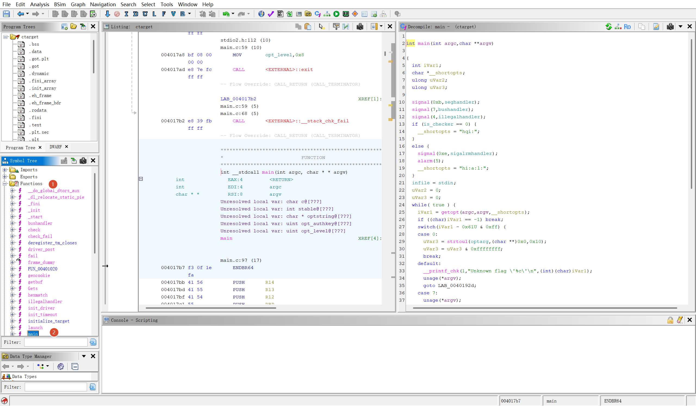
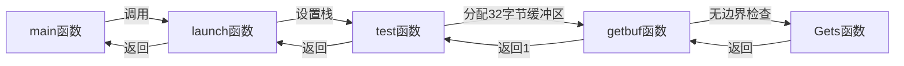

> pwn,砰~

## ctarget

### 架构分析

```bash
<yolo> /mnt/c/Users/24062/Documents/计算机组成/target73
❯ checksec ctarget                                                      □ 计算机组成/target73 ℂ v14.2.0-gcc 68% ↓ 13:59
[*] '/mnt/c/Users/24062/Documents/计算机组成/target73/ctarget'
    Arch:       amd64-64-little
    RELRO:      Partial RELRO
    Stack:      Canary found
    NX:         NX enabled
    PIE:        No PIE (0x400000)
    FORTIFY:    Enabled
    SHSTK:      Enabled
    IBT:        Enabled
    Stripped:   No
    Debuginfo:  Yes
```

地址并没有随机化，存在Canary金丝雀保护，64位小端序程序

### 逆向审计

> 工具：Ghidra,linux命令行

根据实验手册，ctarget共有三个关卡，着重分析的代码有`getbuf(),touch1(),touch2(),touch3()`

#### main()

这里回顾下怎么在Ghidra中快速跳转对应函数



下面我分多段来分析main函数

> part1

```c
int main(int argc,char **argv)

{
  int iVar1;
  char *__shortopts;
  ulong uVar2;
  ulong uVar3; 
//上述内容是函数签名以及变量定义
  
  signal(0xb,seghandler);//段错误
  signal(7,bushandler);//总线错误
  signal(4,illegalhandler);//非法指令
//上述内容是信号处理设置，无需深入了解
//下面是两种调用模式
    //非checker模式，短选项里有h:帮助、q:静默模式、i:插入文件（参考实验报告得到的结论
  if (is_checker == 0) {
    __shortopts = "hqi:";
  }
    //checker模式，相较上一种模式多了a:和l:选项，定义了定时器超时处理器，超过5s会触发
  else {
    signal(0xe,sigalrmhandler);
    alarm(5);
    __shortopts = "hi:a:l:";
  }
  infile = stdin; //默认输入为标准输入
  uVar2 = 0; //包括下一行都是在定义某一种变量参数，作用暂时未知
  uVar3 = 0;
```

> part2

```c
  while( true ) {
    iVar1 = getopt(argc,argv,__shortopts);
    if ((char)iVar1 == -1) break;//循环处理命令行选项，直到没有更多选项
    switch(iVar1 - 0x61U & 0xff) { //处理选项的部分，用表达式将选项里的小写字母偏移到较小整数范围，用于case匹配，举个例子，选项q的ASCII值113转换成十六进制就是0x71,这个时候减去0x61后得到结果0x10，恰好出现在case列表中
    case 0: //选项a
      uVar3 = strtoul(optarg,(char **)0x0,0x10); //将认证密钥转换成ulong
      uVar3 = uVar3 & 0xffffffff; //截断为32位
      break;
    default: //没有匹配的选项，崩溃退出
      __printf_chk(1,"Unknown flag \'%c\'\n",(int)(char)iVar1);
      usage(*argv);
      goto LAB_0040192d;
    case 7: //选项h
      usage(*argv);  //打印用法
    case 8: //选项i
      infile = (FILE *)fopen(optarg,"r"); //打开文件并作为输入，失败则报错退出
      if ((FILE *)infile == (FILE *)0x0) {
        __fprintf_chk(stderr,1,"Cannot open input file \'%s\'\n",optarg);
        return 1;
      }
      break;
    case 0xb: //选项l，暂时不知道作用
      uVar2 = strtol(optarg,(char **)0x0,10); //处理字符串为十进制
      uVar2 = uVar2 & 0xffffffff;//截取32位
      break;
    case 0x10: //q
      notify = 0; //静默模式，不会将结果返回到服务器中
    }
  }
```

> part3

```c
LAB_0040192d: //解析结束后的初始化
  initialize_target((int)uVar2,0); //调用初始化函数，并传入变量uVar2
  if ((is_checker != 0) && (authkey != (uint)uVar3)) { //如果是checker模式并且提供的密钥域内置的authkey不同，会打印报错并直接check_fail
    __printf_chk(1,"Supplied authentication key 0x%x != target key\n",uVar3);
                    /* WARNING: Subroutine does not return */
    check_fail();
  }
  __printf_chk(1,"Cookie: 0x%x\n",cookie);
  stable_launch(buf_offset); //正常启动主逻辑
  return 0;
```

> **Summary:**
>
> 这里的main函数作用仅仅是处理命令行参数，下一步逆向应该关注stable_launch函数

#### stable_launch()

```c
void stable_launch(size_t offset) //函数签名

{
  void *__addr; //变量定义
  
  global_offset = offset; //保存全局偏移
  __addr = mmap((void *)0x55586000,0x100000,7,0x132,0,0); //尝试固定地址mmap,地址:0x55586000,大小:1MB,保护7(可读可写可执行),标志：0x132，匿名映射。目标是强行占用该地址区间作为我们的可控执行区
  if (__addr == (void *)0x55586000) {//如果强行占用该地址成功
    stack_top = (void *)0x55685ff8; //手动建立新栈空间
    uRam0000000055685ff0 = 0x402714; //写入一个返回地址
    global_save_stack = &stack0xfffffffffffffff8; //保存原栈指针的某个偏移，用于恢复
    launch(global_offset); //将栈调整好后执行下一步主逻辑
    *(undefined8 *)((long)global_save_stack + -8) = 0x40272b; //恢复原来的栈布局，并解除映射
    munmap((void *)0x55586000,0x100000);
    return;
  }
  munmap(__addr,0x100000);//如果映射失败，先释放意外映射的内存并报错退出
  __fprintf_chk(stderr,1,"Couldn\'t map stack to segment at 0x%lx\n",0x55586000);
                    /* WARNING: Subroutine does not return */
  exit(1);
}
```

> **summary:**
>
> 本函数的目的是在固定的内存地址映射一块可执行内存作为新的栈，在新的栈布局中调用launch函数

#### launch()

乱七八糟（本函数没有精读的必要，可直接跳过

```c
//上面省略部分是函数签名以及变量定义
  local_10 = *(long *)(in_FS_OFFSET + 0x28);//栈金丝雀保护，不管
  for (puVar3 = auStack_18; puVar3 != auStack_18 + -(offset + 0x17 & 0xfffffffffffff000);
      puVar3 = puVar3 + -0x1000) {
    *(undefined8 *)(puVar3 + -8) = *(undefined8 *)(puVar3 + -8);
  }//循环移动栈指针，分配空间，当循环结束时，puVar3指向auStack_18下方（偏移+对齐后大小）的位置，可以理解为栈向下增长一定的字节，这里的循环手工实现了一个alloca的对齐版本，并且每次访问一页
  uVar2 = (ulong)((uint)(offset + 0x17) & 0xff0);//对齐到16字节边界，取低12位
  lVar1 = -uVar2;
  if (uVar2 != 0) {//如果额外对齐量不为0，再次执行一个空赋值来手动对齐
    *(undefined8 *)(puVar3 + -8) = *(undefined8 *)(puVar3 + -8);
  }//最终栈指针=puVar3+lVar1 (lVar1=-uVar2),栈向下额外移动最多4080字节
  *(undefined8 *)(puVar3 + lVar1 + -8) = 0x402631; //设置返回地址占位，为新栈顶下方8字节处写入0x402631作为返回地址
  memset((void *)((ulong)(puVar3 + lVar1 + 0xf) & 0xfffffffffffffff0),0xf4,offset);//填充hlt滑板区：对齐到16字节边界后，写入hlt指令(x86停机指令)，长度为offset字节
  if (infile == stdin) {//如果输入来自终端，会提示type string:
    *(undefined8 *)(puVar3 + lVar1 + -8) = 0x402691;
    __printf_chk(1,"Type string:");
  }
  vlevel = 0;//设置全局变量vlevel=0,用来区分3个关卡用的
  *(undefined8 *)(puVar3 + lVar1 + -8) = 0x402655;
  test();//调用关键函数test
  if (is_checker == 0) {
    *(undefined8 *)(puVar3 + lVar1 + -8) = 0x40266a;//检测canary是否变化，没有变化会正常返回，若变化会崩溃报错
    puts("Normal return");
    if (local_10 == *(long *)(in_FS_OFFSET + 0x28)) {
      return;
    }
                    /* WARNING: Subroutine does not return */
    *(code **)(puVar3 + lVar1 + -8) = stable_launch;
    __stack_chk_fail();
  }
  *(undefined8 *)(puVar3 + lVar1 + -8) = 0x40269f;//checker模式的话，会打印No exploit并直接调用check_fail
  puts("No exploit");
                    /* WARNING: Subroutine does not return */
  *(undefined8 *)(puVar3 + lVar1 + -8) = 0x4026a9;
  check_fail();
}
```

这种手动栈操作的目的：

1. **绕过编译器优化**：让栈布局不可预测
2. **创建特定的内存布局**：为漏洞利用创造条件
3. **反逆向**：静态分析很难理解真正的栈结构
4. **栈金丝雀保护**：仍然保留，但布局被打乱

> **Summary:**
>
> launch函数进行了一系列手动栈操作，整体来说其实是帮我们构造一个简单的栈空间，方便我们后面分析漏洞代码并利用，不能理解它的操作过程也没关系，可以跳过直接查看test函数，把launch函数当作初始化阶段中给我们申请题目利用的栈空间的代码即可，明白下一步调用的函数是test()

#### test()

```c
void test(void)

{
  uint uVar1;
  
  uVar1 = getbuf();
  __printf_chk(1,"No exploit.  Getbuf returned 0x%x\n",uVar1);
  return;
}
```

很好读了，单纯调用getbuf()函数，可以意识到，getbuf函数是一种读取输入的函数，如果存在缓冲区溢出，我们能直接指定返回地址为我们希望的函数地址

#### getbuf()

```c
uint getbuf(void)

{
  char buf [32];//在栈上分配32字节的字符数组
  
  Gets(buf); //关键函数，由于是自定义，还需要审计
  return 1;
}
```

简单画了下栈布局

```plain
高地址
+----------------------------------+
|                                  |
|     调用者栈帧                    |
|                                  |
+----------------------------------+  ← RBP (调用者的帧基址)
|                                  |
|     返回地址 (8 bytes)           |  ← 攻击目标！
|     (RIP 保存值)                 |
+----------------------------------+
|                                  |
|     保存的 RBP (8 bytes)         |  ← 可能被覆盖
|     (调用者的 RBP)               |
+----------------------------------+  ← getbuf 的 RBP
|                                  |
|     对齐填充 (可选)               |
+----------------------------------+
|                                  |
|     buf[24-31] (8 bytes)         |
+----------------------------------+
|     buf[16-23] (8 bytes)         |
+----------------------------------+
|     buf[8-15]  (8 bytes)         |
+----------------------------------+
|     buf[0-7]   (8 bytes)         |  ← Gets() 从这里开始写
+----------------------------------+  ← RSP (getbuf 的栈顶)
|                                  |
|     红色区域 (128 bytes)         |
|     (Red Zone，x86-64 特有)      |
+----------------------------------+
低地址
```

 #### Gets()

这是自定义函数

```c
//省略函数签名与变量定义
  gets_cnt = 0; //初始化，统计读取字数
  puVar2 = (uchar *)dest; //指向目标缓冲区的起始位置
  while( true ) { //无限循环读取
    iVar1 = getc((FILE *)infile);
    if ((iVar1 == -1) || (iVar1 == 10)) break;//终止条件是遇到'EOF'或'\n'
    *puVar2 = (uchar)iVar1; //写入缓冲区
    save_char((uchar)iVar1); //记录字符
    puVar2 = puVar2 + 1; //指针递增,移动到下一个字符
  }
  *puVar2 = '\0';//字符串末尾添加空字符\0
  save_term(); //编辑记录结束，保存结束信息
  return dest; //返回
}
```

审计完了，会发现这里的漏洞很明显，结合getbuf的相关内容，二进制会提前申请32字节大小的数组，正常情况下是让这32字节写入buf就结束了，但是漏洞在于这里的puVar2并没有边界检测，我们会发现它的读取停止条件仅仅是EOF或换行符，因此我们输入的长度完全可以超过buf所谓的32字节，然后覆盖栈布局上的一些存储器，将里面存储的函数返回地址改为我们希望的函数地址即可

我刚刚画了下ctarget的函数调用逻辑，如下：



函数分析并没有到此结束，还需要审计三个touch关卡函数

#### touch1

```c
void touch1(void)

{
  vlevel = 1;
  puts("Touch1!: You called touch1()");
  validate(1);
                    /* WARNING: Subroutine does not return */
  exit(0);
}
```

没有读取任何参数，定义全局变量为vlevel=1，触发函数validate函数用于记录，可不用分析

> **Summary:**
>
> 第一关要求我们让getbuf函数返回的时候调用touch1对应的函数地址即可，没有什么坑

#### touch2

```c
void touch2(uint val)

{
  vlevel = 2; //设置关卡识别
  if (cookie == val) { //条件判断
    __printf_chk(1,"Touch2!: You called touch2(0x%.8x)\n",val);
    validate(2); //成功后会记录
  }
  else {
    __printf_chk(1,"Misfire: You called touch2(0x%.8x)\n",val);
    fail(2);
  }
                    /* WARNING: Subroutine does not return */
  exit(0);
}
```

touch2的难度上升不少，函数签名里需要读取一个uint变量参数，具体的payload构造以及栈布局我会在后面进行分析

#### touch3

```c
void touch3(char *sval)

{
  int iVar1;
  
  vlevel = 3;
  iVar1 = hexmatch(cookie,sval);
  if (iVar1 == 0) {
    __printf_chk(1,"Misfire: You called touch3(\"%s\")\n",sval);
    fail(3);
  }
  else {
    __printf_chk(1,"Touch3!: You called touch3(\"%s\")\n",sval);
    validate(3);
  }
                    /* WARNING: Subroutine does not return */
  exit(0);
}
```

touch3需要传递的是字符串指针，如果全局变量cookie和我传入的字符串指针相同，就挑战成功，否则失败，简单思考了下，这里所谓的字符串指针需要我们在缓冲区里写入整个字符串，然后将第一个字符的地址传入返回touch3函数对应的参数地址中


