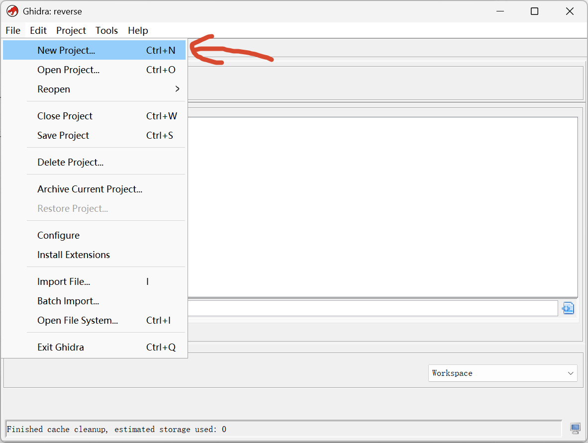
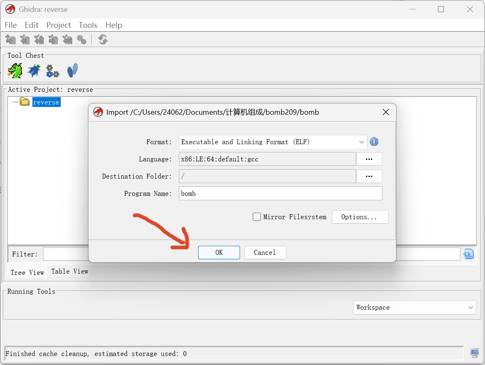
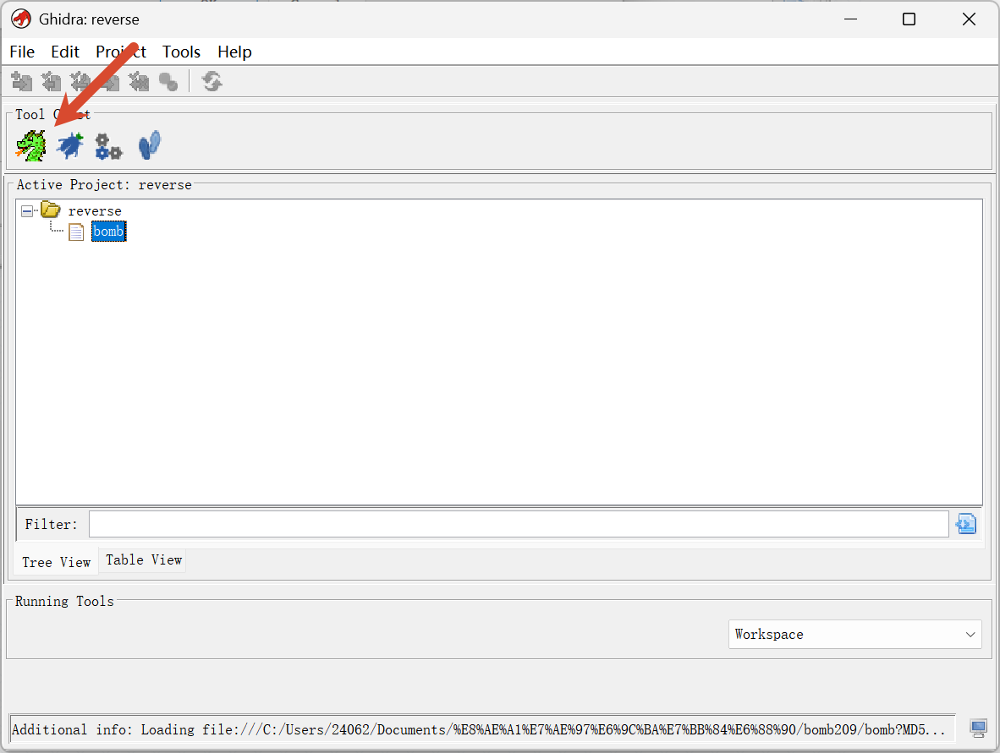
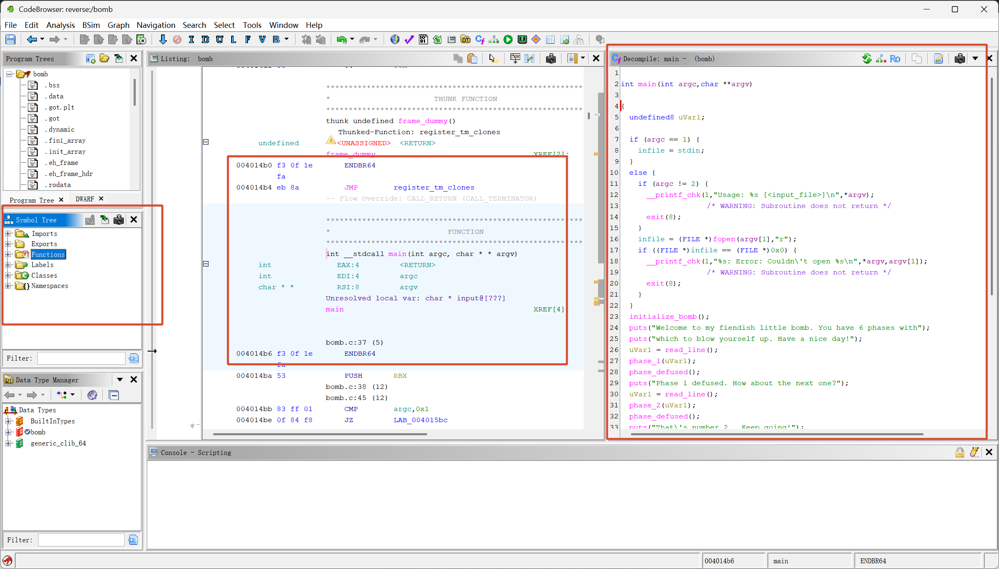
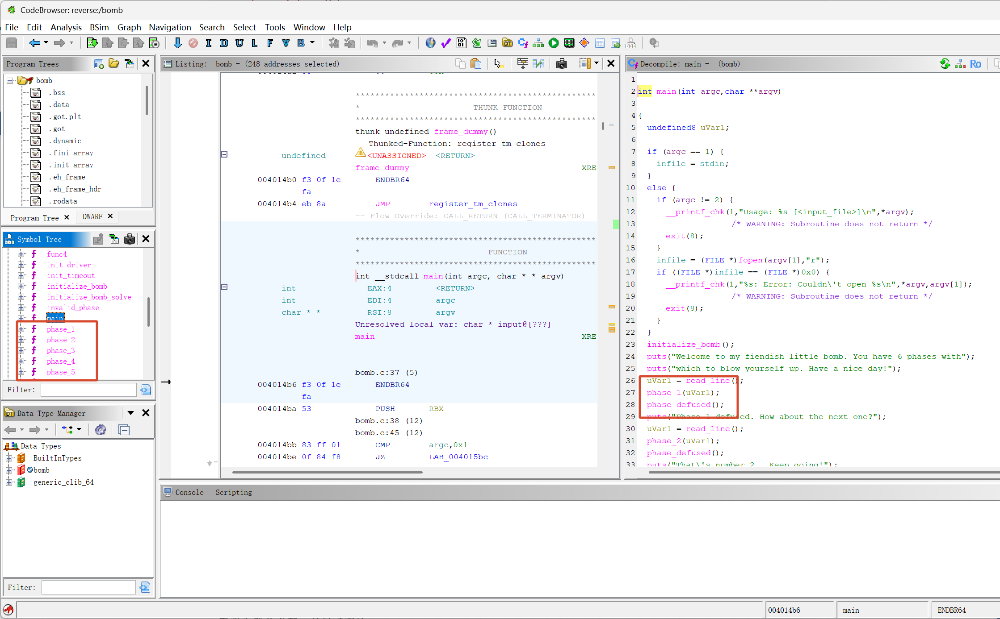
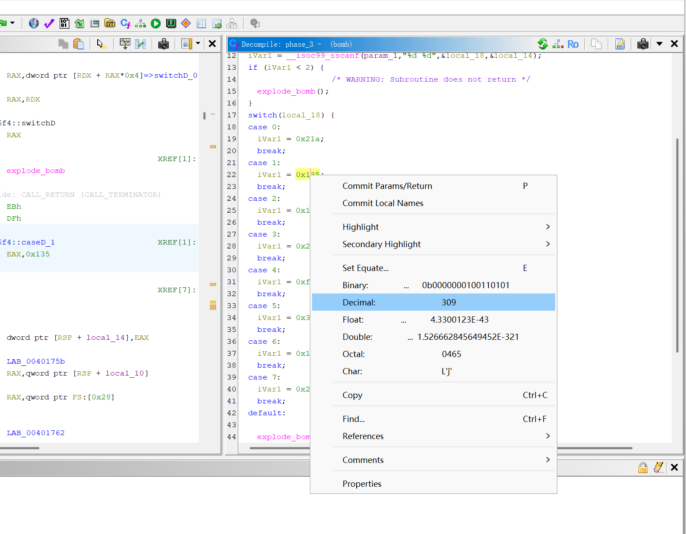
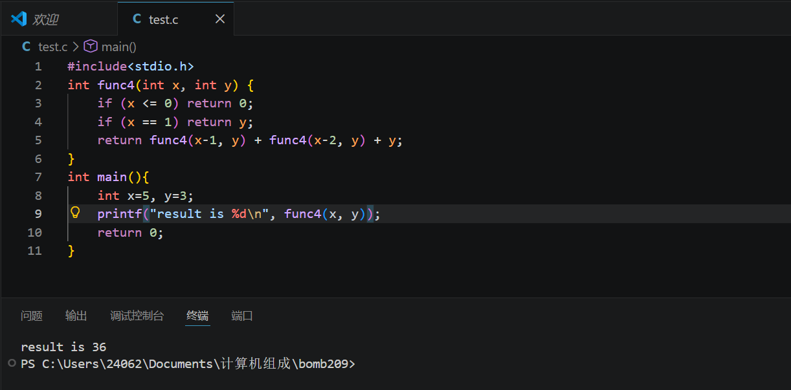

> Boom Boom Boom
>
> 就当这次实验是一次逆向题吧

## start

先查看下二进制程序的架构

```bash
◎ checksec bomb                                                                □ 计算机组成/bomb209 ℂ v14.2.0-gcc 22:04
[*] '/mnt/c/Users/24062/Documents/计算机组成/bomb209/bomb'
    Arch:       amd64-64-little
    RELRO:      Partial RELRO
    Stack:      Canary found
    NX:         NX enabled
    PIE:        No PIE (0x400000)
    FORTIFY:    Enabled
    SHSTK:      Enabled
    IBT:        Enabled
    Stripped:   No
    Debuginfo:  Yes
```

这里不打`pwn`,我们就关注下第一行，它是64位小端序程序

比较喜欢用`IDA pro`查看，但是考虑到有些同学不太会配置破解版`ida pro`，这里就用`ghidra`好了，这是[仓库地址](https://github.com/NationalSecurityAgency/ghidra)(安装过程去网上搜吧，这是开源免费的，那种收钱工具下载链接都是假的，实在不行找我吧)

运行那个启动bat程序后，会看到一个空白页面，我们先点击左上角File，选择`New Project`，选中我们自定义的路径即可，这里随机，不作要求



接下来还是点击左上角File，应该能看到下面的`Import File...`吧，点击后将我们需要进行逆向的bomb二进制程序选中，然后啥也不用调，点两次ok就可以了



然后应该看到这里长得差不多，我们就成功了,接下来我们应该做的是双击bomb，它会自动调用tool chest的龙图标，它的作用是查看源代码的



简单讲讲里面的布局，一般来说初始化都是这样



左侧框框是符号表树，里面可以看到二进制中引用的库，以及内置的函数列表，一定关注那个functions，里面能找到main，这是关键的主函数，中间框框是反编译代码，就是老师开始讲的汇编函数，第三个框框是反汇编代码，或者叫它伪c代码，它是ghidra帮我们将反编译出来的汇编代码整理成高级语言，方便我们阅读审计

> 温馨提示，如果遇到一些混淆严重的二进制程序，我觉得应该相信反编译出来的汇编代码，而不是伪c代码，不然一些花指令会让伪c代码误导我们进行逆向分析

## 审计代码

### main

先来审计main函数，我分析的时候一般喜欢一部分一部分读

```c
int main(int argc,char **argv)

{
  undefined8 uVar1;
  
  if (argc == 1) {
    infile = stdin;
  }
  else {
    if (argc != 2) {
      __printf_chk(1,"Usage: %s [<input_file>]\n",*argv);
                    /* WARNING: Subroutine does not return */
      exit(8);
    }
    infile = (FILE *)fopen(argv[1],"r");
    if ((FILE *)infile == (FILE *)0x0) {
      __printf_chk(1,"%s: Error: Couldn\'t open %s\n",*argv,argv[1]);
                    /* WARNING: Subroutine does not return */
      exit(8);
    }
  }
}
```

这部分代码的作用很简单:处理输入

- 如果我们单纯在命令行中输入了`./bomb`，那么这个二进制会从键盘输入里读取炸弹答案
- 如果我们写入的参数超过2（记住，程序名也算一个），二进制程序会提示用法`"Usage: %s [<input_file>]\n"`，然后退出
- 如果参数是2个，第二个参数就会被程序当作要读取的文件名，以读模式打开文件，打开失败也会报错退出

这里是后半部分main函数

```c
  initialize_bomb(); //关键函数1：initialize_bomb()
  puts("Welcome to my fiendish little bomb. You have 6 phases with");
  puts("which to blow yourself up. Have a nice day!");
  uVar1 = read_line(); //关键函数2：read_line()
  phase_1(uVar1); //关键函数3：phase_1()
  phase_defused(); //关键函数4：phase_defused()
  puts("Phase 1 defused. How about the next one?");
  uVar1 = read_line();
  phase_2(uVar1); //关键函数5：phase_2()
  phase_defused();
  puts("That\'s number 2.  Keep going!");
  uVar1 = read_line();
  phase_3(uVar1); //关键函数6：phase_3()
  phase_defused();
  puts("Halfway there!");
  uVar1 = read_line();
  phase_4(uVar1); //关键函数7：phase_4()
  phase_defused();
  puts("So you got that one.  Try this one.");
  uVar1 = read_line();
  phase_5(uVar1); //关键函数8：phase_5()
  phase_defused();
  puts("Good work!  On to the next...");
  uVar1 = read_line();
  phase_6(uVar1); //关键函数9：phase_6()
  phase_defused();
  return 0;
```

后半部分很有规律的，初始化炸弹后，无非是输出一些欢迎信息，然后读一行字符串，接下来调用对应的关卡函数，最后调用`phase_defused()`,我发现每一轮都有这个函数，那么我们可以大概揣测各个关键函数的作用了

- 关键函数1：`initialize_bomb()`，这里进行炸弹初始化，应该是对一些环境的检查（我已经看过了，是检测本地环境是否合法，并且会和成绩网站建立通信的，相关逻辑有那么一点点复杂，但是值得庆幸的是对我们后面的关卡挑战没有关系
- 关键函数2：`read_line()`，看字面意思就清楚，这是逐行读取，没有必要查看(如果后面逆向卡住了，再看)
- 关键函数3,5,6,7,8,9：`phase()`这里显然是各个关卡对应的函数，必须查看
- 关键函数4：`phase_defused()`我认为这个函数是检测状态的，如果上一轮关卡成功，就pass，如果失败，这个函数会直接让程序退出，也就是​Boom;本函数等后期卡住再来审计

### phase_1

跳转这个函数很简单，两个方法，一个是在左侧的functions中选中对应的函数名，第二个方法是在main的反汇编代码中双击那个函数，会自动跳转



查看下反汇编代码

```c

void phase_1(undefined8 param_1)

{
  int iVar1;
  
  iVar1 = strings_not_equal(param_1,"I am not part of the problem. I am a Republican.");
  if (iVar1 == 0) {
    return;
  }
                    /* WARNING: Subroutine does not return */
  explode_bomb();
}
```

逻辑很简单，函数会读取paraw_1参数，然后会调用strings_not_equal函数进行对比，那个函数应该会返回bool值吧，一会儿查看，看这个样子，如果函数返回0，就算第一关pass，否则会触发爆炸函数`explode_bomb()`

```c

undefined8 strings_not_equal(char *param_1,long param_2)

{
  int iVar1;
  int iVar2;
  undefined8 uVar3;
  long lVar4;
  char cVar5;
  
  iVar1 = string_length();
  iVar2 = string_length(param_2); //这两句是存储字符串长度的，第一句应该是隐式继承吧，结合main函数的调用，大致能猜测是程序读取的我们答案，第二个才是存储的正确答案
  uVar3 = 1; //这里是记录状态的，初始是1，默认不相等
  if (iVar1 == iVar2) { //第一部分：进行长度校验
    cVar5 = *param_1;
    if (cVar5 == '\0') { //这是校验是否是空字符串，如果过了第一部分的话，就证明读取的两个参数都是空字符串相等，自然会让uVar3更新成0
      uVar3 = 0;
    }
    else {//下面才是正常处理的流程（排除了长度不同以及都是空字符串的情况
      lVar4 = 0;//定位符吧，从第1个字母开始（注：索引都是从0开始的
      do {
        if (*(char *)(param_2 + lVar4) != cVar5) {
          return 1;
        }
        lVar4 = lVar4 + 1;
        cVar5 = param_1[lVar4];
      } while (cVar5 != '\0'); //进行循环逐字符对比，全部字符相同的话才能让uVar3更新成0，否则都是1
      uVar3 = 0;
    }
  }
  return uVar3;
}
```

我上面备注的注释都很清晰了吧,那么我们再结合实验报告的要求

```text
文件中的每行包含拆除对应炸弹阶段的字符串，程序将依次检查每一阶段拆除字符串的正确性来决定炸弹拆除成败。该文本文件必须采用Unix格式（换行字符不同于Windows格式），并且注意最后一个字符串后也要进行换行（即所有字符串必须以换行结尾）。
```

可以得到第一题的答案(注意，务必在Linux环境中执行)

```bash
◎ echo "I am not part of the problem. I am a Republican." > test.txt   /tmp 56% ↓ 14:20


◎ xxd test.txt                                                         /tmp 54% ↓ 14:25
00000000: 4920 616d 206e 6f74 2070 6172 7420 6f66  I am not part of
00000010: 2074 6865 2070 726f 626c 656d 2e20 4920   the problem. I
00000020: 616d 2061 2052 6570 7562 6c69 6361 6e2e  am a Republican.
00000030: 0a
```

---

那就简单扩展下吧，在ASCII中，换行符`\n`对应的索引值就是0x0a,如果我们在Windows下编辑文件，会默认在语句后面加上`\r\n`，这里的`\r`是光标返回第一个字节的意思，也就是所谓的回车符号，对应索引值是0x0D

---

### phase_2

如果上一关过了，应该会收到这个`puts("Phase 1 defused. How about the next one?");`

接下来看看第二关

```c

void phase_2(undefined8 param_1)

{
  int *piVar1;
  long in_FS_OFFSET;
  int local_38 [6]; //申请了一个6元素空间的数组
  long local_20;
  
  piVar1 = local_38;
  local_20 = *(long *)(in_FS_OFFSET + 0x28); //canary金丝雀，pwn里的知识，不用管
  read_six_numbers(param_1,local_38); //关键函数，应该会处理读取的输入，一会儿分析
  if ((local_38[0] != 0) || (local_38[1] != 1)) { //这里规定了，读取的前两个数字必须是0,1;否则Boom
                    /* WARNING: Subroutine does not return */
    explode_bomb();
  }
  // 循环处理剩下的4个数字
  do {
    if (piVar1[2] != piVar1[1] + *piVar1) {
                    /* WARNING: Subroutine does not return */
      explode_bomb();
    }
    piVar1 = piVar1 + 1;
  } while (piVar1 != local_38 + 4); 
  if (local_20 == *(long *)(in_FS_OFFSET + 0x28)) { //栈保护处理，不管
    return;
  }
                    /* WARNING: Subroutine does not return */
  __stack_chk_fail();
}
```

中间循环那部分有点关键，我扣下来讲

```c
do {
    if (piVar1[2] != piVar1[1] + *piVar1) {
                    /* WARNING: Subroutine does not return */
      explode_bomb();
    }
    piVar1 = piVar1 + 1;
  } while (piVar1 != local_38 + 4); 
```

首先需要明确，piVar1指向的是`local_38[0]`

看这里的if判断，很像斐波那契数列：`a2=a1+a0`

如果判断通过，那么不会爆炸，开始自增，让piVar1指向`local_38[1]`,重新开始判断

至于这里的停止循环条件为啥是`local_38+4`而不是`+6`，原因很简单，这样理解，理论上最后一个斐波那契数是`a5=a4+a3`(索引从a0开始)，那么这个时候a3是6元素数组中的第四个，如果再往上自增，系统内部是找不到a6的，会导致逻辑奔溃

再来看看这里的处理函数（我稍微格式上美化了下

```c
void read_six_numbers(undefined8 param_1, long param_2)
{
    int iVar1;
    
    iVar1 = __isoc99_sscanf(
        param_1,                     // 输入字符串（用户输入的那一行）
        "%d %d %d %d %d %d",         // 格式：读取 6 个整数
        param_2,                     // 第 1 个整数 → &numbers[0]
        param_2 + 4,                 // 第 2 个整数 → &numbers[1]
        param_2 + 8,                 // 第 3 个整数 → &numbers[2]
        param_2 + 0xc,               // 第 4 个整数 → &numbers[3]
        param_2 + 0x10,              // 第 5 个整数 → &numbers[4]
        param_2 + 0x14               // 第 6 个整数 → &numbers[5]
    );
    
    if (5 < iVar1) {   // 实际检查 iVar1 >= 6
        return;        // 成功读到 6 个整数 → 正常返回
    }
    
    explode_bomb();    // 读到的数字少于 6 个 → 炸弹爆炸
}
```

它会读取6个整数，至于这里的数组索引，我来解释下为啥递增4字节

记得phase_2最上面定义的数组`int local_38 [6];`

这里有个很重要的标志int，这意味着local_38数组内部都装的是4字节大小的int整数，超过4字节就进入下一个元素的空间

那么本关卡就能解决了，答案应该这样写入：

```bash
◎ echo "0 1 1 2 3 5" >> test.txt                                       /tmp 54% ↓ 14:25 

◎ xxd test.txt                                                         /tmp 40% ↓ 14:55
00000000: 4920 616d 206e 6f74 2070 6172 7420 6f66  I am not part of
00000010: 2074 6865 2070 726f 626c 656d 2e20 4920   the problem. I
00000020: 616d 2061 2052 6570 7562 6c69 6361 6e2e  am a Republican.
00000030: 0a30 2031 2031 2032 2033 2035 0a         .0 1 1 2 3 5.
```

在Linux终端中，echo可以用来追增文件内容，一定记得用`>>`，如果只写一个，作用就变成了覆盖

关于这里的0x0a换行符，我觉得还是有必要说一下，echo里会默认对每个字符串末尾追加换行符，如果说不用换行的话，一定要在前面加上`-n`修饰

```bash
◎ echo "yolo is handsome" | xxd                                        /tmp 40% ↓ 14:55
00000000: 796f 6c6f 2069 7320 6861 6e64 736f 6d65  yolo is handsome
00000010: 0a                                       .


◎ echo -n "yolo is handsome" | xxd                                     /tmp 39% ↓ 14:58
00000000: 796f 6c6f 2069 7320 6861 6e64 736f 6d65  yolo is handsome

```

相信这两个例子能让大家理解

### phase_3

这一个关卡代码相对上一题简单点

```c

void phase_3(undefined8 param_1)

{
  int iVar1;
  long in_FS_OFFSET;
  undefined4 local_18;
  int local_14;
  long local_10;
  
  local_10 = *(long *)(in_FS_OFFSET + 0x28);
  iVar1 = __isoc99_sscanf(param_1,"%d %d",&local_18,&local_14); //这里读取了两个整数，10进制就行
  if (iVar1 < 2) { //必须至少读两个数
                    /* WARNING: Subroutine does not return */
    explode_bomb();
  }
  switch(local_18) {//这里开始进行case选择了，读取的第一个数就是case用的
  case 0:
    iVar1 = 0x21a; //538
    break;
  case 1:
    iVar1 = 0x135; //309
    break;
  case 2:
    iVar1 = 0x1a6; //422
    break;
  case 3:
    iVar1 = 0x238; //568
    break;
  case 4:
    iVar1 = 0xf1; //241
    break;
  case 5:
    iVar1 = 0x39b; //923
    break;
  case 6:
    iVar1 = 0x1b2; //434
    break;
  case 7:
    iVar1 = 0x23e; //574
    break;
  default:
                    /* WARNING: Subroutine does not return */
    explode_bomb(); //如果8个case都没有匹配上，就会触发Boom
  }
  if (local_14 != iVar1) { //这里在校验读取的第二个数字是否和case对应的数字相同，不同就会boom
                    /* WARNING: Subroutine does not return */
    explode_bomb();
  }
  if (local_10 != *(long *)(in_FS_OFFSET + 0x28)) { //栈安全检查，不管
                    /* WARNING: Subroutine does not return */
    __stack_chk_fail();
  }
  return;
}


```

在ghidra里很好快速计算的,点击十六进制，然后右键下就能看到



理论上这里有8组答案，提交任意一条即可

```bash
◎ echo "1 309" >> test.txt                                             /tmp 39% ↓ 14:58


◎ xxd test.txt                                                         /tmp 34% ↓ 15:08
00000000: 4920 616d 206e 6f74 2070 6172 7420 6f66  I am not part of
00000010: 2074 6865 2070 726f 626c 656d 2e20 4920   the problem. I
00000020: 616d 2061 2052 6570 7562 6c69 6361 6e2e  am a Republican.
00000030: 0a30 2031 2031 2032 2033 2035 0a31 2033  .0 1 1 2 3 5.1 3
00000040: 3039 0a                                  09.
```

### phase_4

看看第四关

```c

void phase_4(undefined8 param_1)

{
  int iVar1;
  long in_FS_OFFSET;
  int local_18;
  int local_14;
  long local_10;
  
  local_10 = *(long *)(in_FS_OFFSET + 0x28);
  iVar1 = __isoc99_sscanf(param_1,"%d %d",&local_14,&local_18); //读取两个整数
  if ((iVar1 != 2) || (2 < local_18 - 2U)) { //进行两次判断，读取整数必须两个，输入的第二个参数必须小于等于2+2=4，否则会boom
                    /* WARNING: Subroutine does not return */
    explode_bomb();
  }
  iVar1 = func4(5,local_18); //关键函数 func4
  if (local_14 != iVar1) { //第一个参数的值必须等于func4算出来的值，否则Boom
                    /* WARNING: Subroutine does not return */
    explode_bomb();
  }
  if (local_10 == *(long *)(in_FS_OFFSET + 0x28)) { //栈检查
    return;
  }
                    /* WARNING: Subroutine does not return */
  __stack_chk_fail();
}
```

查看下关键函数

```c

int func4(int param_1,int param_2)

{
  int iVar1;
  int iVar2;
  
  if (0 < param_1) {
    if (param_1 != 1) {
      iVar1 = func4(param_1 + -1); //warning:有没有发现这里仅仅读取了一个参数？
      iVar2 = func4(param_1 + -2,param_2);
      param_2 = iVar2 + iVar1 + param_2;
    }
    return param_2;
  }
  return 0;
}

```

emm，大致看了下，发现这次的反编译效果并不理想，可以大致了解到，这里的func4是一个递归函数，但是在iVar1变量处理中，只读取了一个参数（我猜哈，第二个参数大概率是param_2，不过在计算机里，用猜测并立不住跟脚

接下来我打算查看下相关汇编来进行确定

> 在ghidra中，选中你想重命名的变量名，右键可以看到rename，或者按`l`键

```assembly
                             *************************************************************
                             *                           FUNCTION                         
                             *************************************************************
                             undefined  __stdcall  func4 (undefined4  x,  undefined4  y)
             undefined         <UNASSIGNED>   <RETURN>
             undefined4        EDI:4          x
             undefined4        ESI:4          y
                             func4                                           XREF[6]:     Entry Point (*) ,  00401786 (c) , 
                                                                                          00401794 (c) , 
                                                                                          phase_4:004017eb (c) ,  00403630 , 
                                                                                          00403804 (*)   
        00401767 f3  0f  1e       ENDBR64
                 fa
        0040176b b8  00  00       MOV        EAX ,0x0
                 00  00
        00401770 85  ff           TEST       x,x
        00401772 7e  2d           JLE        LAB_004017a1
        00401774 41  54           PUSH       R12
        00401776 55              PUSH       RBP
        00401777 53              PUSH       RBX
        00401778 89  fb           MOV        EBX ,x
        0040177a 89  f5           MOV        EBP ,y
        0040177c 89  f0           MOV        EAX ,y
        0040177e 83  ff  01       CMP        x,0x1
        00401781 74  19           JZ         LAB_0040179c
        00401783 8d  7f  ff       LEA        x,[x + -0x1 ]
        00401786 e8  dc  ff       CALL       func4                                            undefined func4(undefined4 x, un
                 ff  ff
        0040178b 44  8d  24       LEA        R12D ,[RAX  + RBP *0x1 ]
                 28
        0040178f 8d  7b  fe       LEA        x,[RBX  + -0x2 ]
        00401792 89  ee           MOV        y,EBP
        00401794 e8  ce  ff       CALL       func4                                            undefined func4(undefined4 x, un
                 ff  ff
        00401799 44  01  e0       ADD        EAX ,R12D
                             LAB_0040179c                                    XREF[1]:     00401781 (j)   
        0040179c 5b              POP        RBX
        0040179d 5d              POP        RBP
        0040179e 41  5c           POP        R12
        004017a0 c3              RET
                             LAB_004017a1                                    XREF[1]:     00401772 (j)   
        004017a1 c3              RET

```

这里是复制出来的func4部分的汇编代码，好了，接下来把《深入理解计算机系统》翻到p120页，哈哈，版本是第三版，封面在[这里](https://docs.yo1o.top/docs/study/homeworks/cs/)能看到，主要是看里面一些寄存器的作用

我们先定位`0x40177a`和`0x40177c`

```assembly
        0040177a 89  f5           MOV        EBP ,y
        0040177c 89  f0           MOV        EAX ,y
```

前者将y值copy到`%EBP`保存寄存器中了，后者则是将y保存到`%EAX`返回值寄存器中，需要明白一点，MOV操作符并不是move剪切，而是copy，这也就意味着之前的`%esi`寄存的y值一直没有动

接下来回头看看函数签名

```assembly
                             undefined  __stdcall  func4 (undefined4  x,  undefined4  y)
             undefined         <UNASSIGNED>   <RETURN>
             undefined4        EDI:4          x
             undefined4        ESI:4          y
                             func4                                           XREF[6]:   
```

全局初始化里，就将y保存到`%ESI`中了，查表会知道，它是第二个参数的寄存器，所以说啊，这一部分并没有y相关的汇编代码是正常的

```assembly
        0040177e 83  ff  01       CMP        x,0x1
        00401781 74  19           JZ         LAB_0040179c
        00401783 8d  7f  ff       LEA        x,[x + -0x1 ]
        00401786 e8  dc  ff       CALL       func4    
```

哦，趁这个机会，再去看看第二次递归调用

```assembly
        0040178f 8d  7b  fe       LEA        x,[RBX  + -0x2 ]
        00401792 89  ee           MOV        y,EBP
        00401794 e8  ce  ff       CALL       func4   
```

会看到一个惊喜的地方，这里对y重新定义了，读取的是`%EBP`里的值，但是这和前面第一次调用时候的y值一样的，那么这里能不能直接删除这一句呢？答案是不行的，因为第二次调用的时候，系统无法信任已经被调用过的参数，简单来说就是用过的参数会消失，必须重新配置参数，尽管两次的值是一样的

我对反汇编的代码简单手动修复下

```c

int func4(int x,int y)

{
  int iVar1;
  int iVar2;
  
  if (0 < x) {
    if (x != 1) {
      iVar1 = func4(x + -1,y);
      iVar2 = func4(x + -2,y);
      y = iVar2 + iVar1 + y;
    }
    return y;
  }
  return 0;
}
```

其实还能再简化的，就像下面这样

```c
int func4(int x, int y) {
    if (x <= 0) return 0;
    if (x == 1) return y;
    return func4(x-1, y) + func4(x-2, y) + y;
}
```

关于func4的逆向分析就到这里截至吧，我们可以思考下phase_4的限制是y必须小于等于4

> 这里有个小陷阱，不知道读者有没有意识到呢？我先不告诉你

我们按照上面的分析逻辑，phase_4要读取两个数，其中第二个数必须小于等于4，第一个数必须是`func4(5,第二个数)`

那么理论上第二个数可以是0,1,2,3,4和所有负数?

Boom!

恭喜我们掉进坑里了，还是得回顾下前面的if判断

```c
if ((iVar1 != 2) || (2 < local_18 - 2U))
```

这里的2u是一个无符号整数，关键看它的后缀U，它的值确实是2没错，但是类型有问题，前面的local_18是int，但是运算中的2U是`unsigned int`

在表达式中同时出现有符号和无符号时，c语言标准规定：有符号数会被隐式转换为无符号数

这个时候我们我们想想看，如果`local_18=1`,转换成无符号数1U，然后`1U-2U`在无符号运算中会发生下溢，具体看看这个运算过程

```text
  0x00000001
- 0x00000002
-------------
  0xFFFFFFFF  (借位溢出)
```

这里的0xFFFFFFFF是`2^32 − 1`，这个时候再回到与2的比较中，显然结果true，自然会触发`explode_bomb()`

学懂了吧


那么我们口头算算，原先的y<=4一定要有个下限，那么这个整数可选项只有2,3,4了

然后再算算func4，就用3算好了

这是一个递归函数，手算多慢，还可能会算错，我这里写了一个简单的c程序

```c
#include<stdio.h>
int func4(int x, int y) {
    if (x <= 0) return 0;
    if (x == 1) return y;
    return func4(x-1, y) + func4(x-2, y) + y;
}
int main(){
    int x=5, y=3;
    printf("result is %d\n", func4(x, y));
    return 0;
}
```



脚本运行结果是36，那么本题的答案我们可以写`36 3`

### phase_5

> 呼~，拆弹进度4/6

审计代码

```c

void phase_5(long param_1)

{
  int iVar1;
  long lVar2;
  long in_FS_OFFSET;
  char local_17 [6];
  undefined1 local_11;
  long local_10;
  
  local_10 = *(long *)(in_FS_OFFSET + 0x28); //栈检查，忽略
  iVar1 = string_length(); //读取输入的字符串长度，这里应该是省略了参数？
  if (iVar1 != 6) { //key1:输入的字符串长度为6
                    /* WARNING: Subroutine does not return */
    explode_bomb();
  }
  lVar2 = 0; //定义初始状态为0
  do {
    local_17[lVar2] =
         "maduiersnfotvbylSo you think you can stop the bomb with ctrl-c, do you?"
         [*(byte *)(param_1 + lVar2) & 0xf];
    lVar2 = lVar2 + 1; //状态递增
  } while (lVar2 != 6);
  local_11 = 0;
  iVar1 = strings_not_equal(local_17,"bruins");
  if (iVar1 == 0) {
    if (local_10 == *(long *)(in_FS_OFFSET + 0x28)) {
      return;
    }
                    /* WARNING: Subroutine does not return */
    __stack_chk_fail();
  }
                    /* WARNING: Subroutine does not return */
  explode_bomb();
}
```

这里的循环有点复杂，单独看看

```c
  lVar2 = 0; //定义初始状态为0
  do {
    local_17[lVar2] =
         "maduiersnfotvbylSo you think you can stop the bomb with ctrl-c, do you?"
         [*(byte *)(param_1 + lVar2) & 0xf];
    lVar2 = lVar2 + 1; //状态递增
  } while (lVar2 != 6);
```

*还剩两个炸弹了，等晚上我继续*


