> 本文记录Yolo在VMware中部署Arch linux的过程并记录部分美化操作，本文会持续更新

# build Arch linux

## Preparations

需要准备下述文件：

- [VMware](https://support.broadcom.com/group/ecx/productdownloads?subfamily=VMware%20Workstation%20Pro&freeDownloads=true)
- [Arch linux iso镜像](https://mirrors.tuna.tsinghua.edu.cn/archlinux/iso/)

下载记录就不多说了，我已经把对应的链接保存在上面的列表中了，可以直接点击进去下载，其中VMware下载的时候要填些个人信息什么的，如果觉得麻烦，可以下载我上传到[百度网盘的对应文件](https://pan.baidu.com/s/1iWTDYl5Y-ZZi6pmmHnp5VQ?pwd=Yolo)，至于iso镜像，我下载的是截至当前时间2026.06.01最新的版本[archlinux-2026.05.01-x86_64.iso](https://mirrors.tuna.tsinghua.edu.cn/archlinux/iso/latest/archlinux-2026.05.01-x86_64.iso)

关于VMware的安装，都走默认安装就好了

## start

点击`Create a New Virtual Machine`

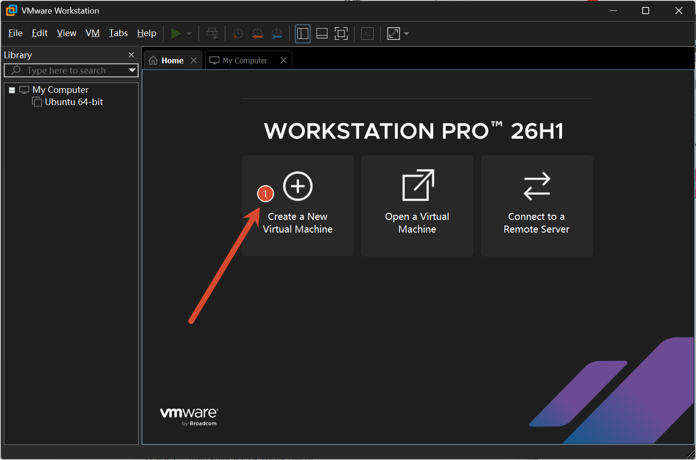

选择typical就好，然后点击next

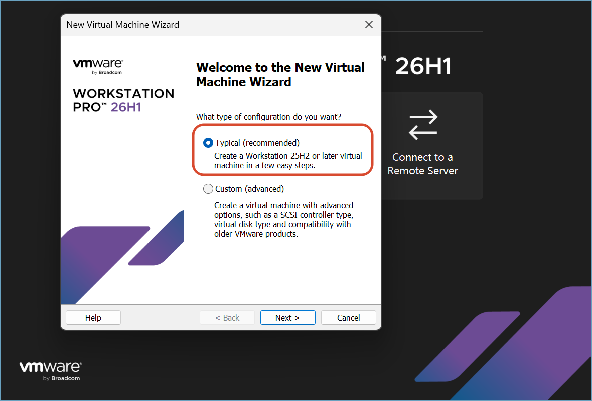

选择browse，选中我们下载好的archlinux iso,点击next进入下一步

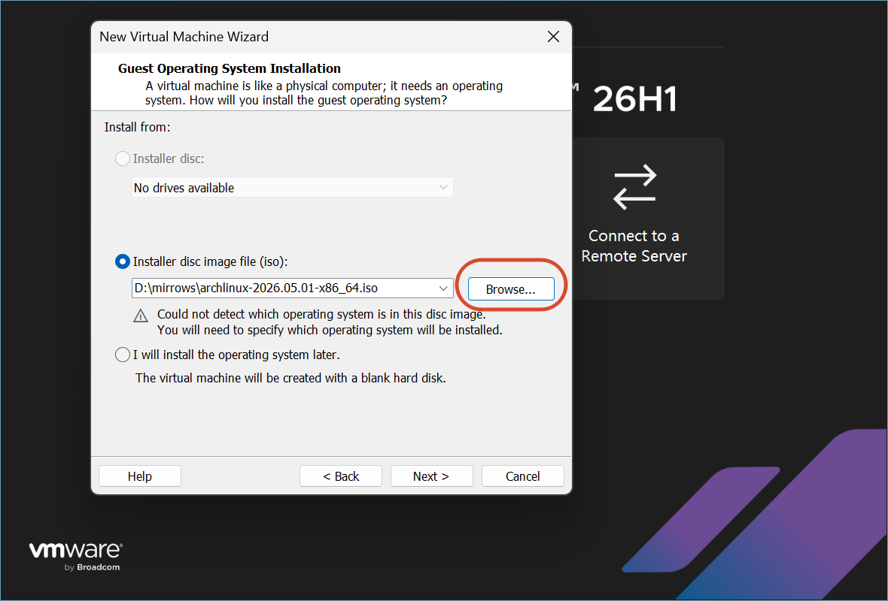

引导操作系统选中Linux，版本选中`Other Linux 6.x kernel 64-bit`,点击next

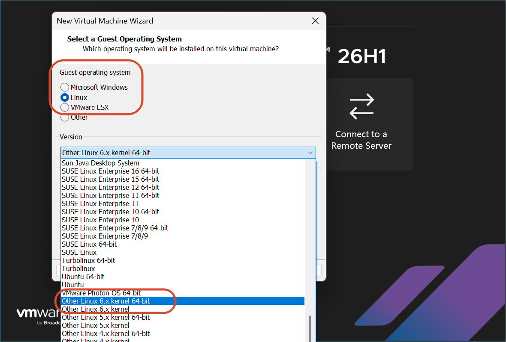

这一步是给虚拟机进行命名，只需要改写名字即可，那个路径不用编辑,点击next

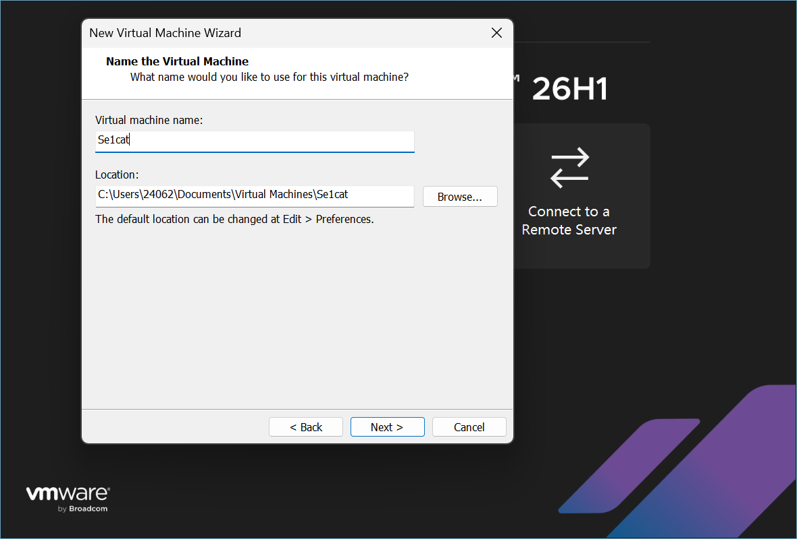

配置虚拟机硬盘大小，我建议提供64G，这样这样够大了，避免后续的磁盘扩展，然后这里建议选择`Store virtual disk as a single file`,弄成一个的话，好迁移

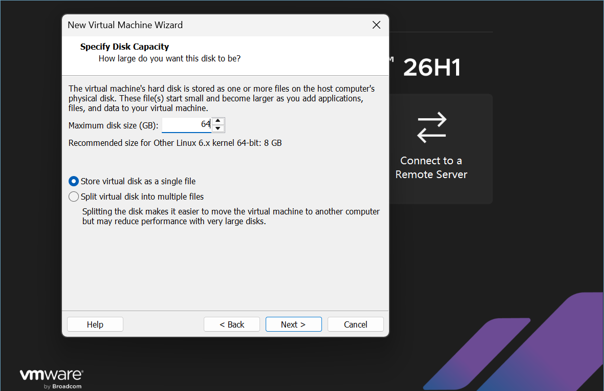

这里确认下，没问题就直接FINISH

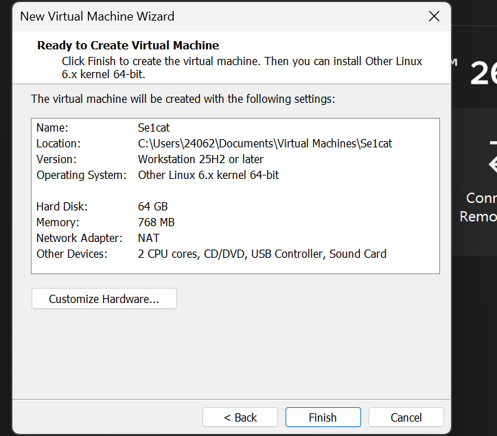

到这里还没结束！

首先点击Devices里的Memory，这里是内存，768MB实在太小了，不改的话，一卡一卡的，体验不佳,图片里是我已经改过了，我给了2G

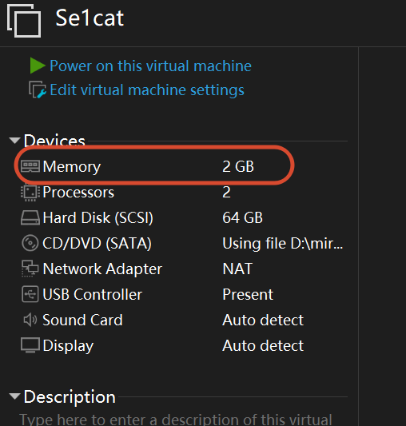

直接点击2GB就好了，然后点击Options

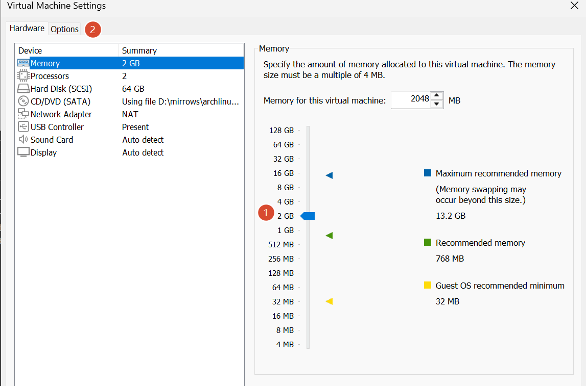

在option下，将Advanced下的引导模式改成UEFI

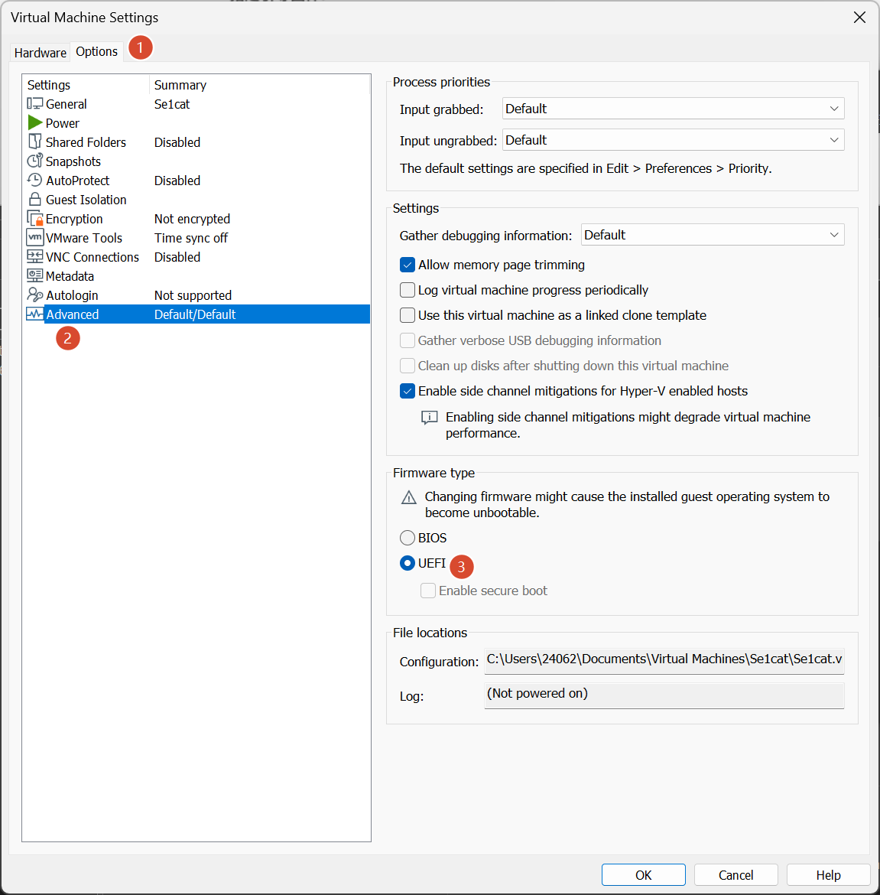

改成这样应该就差不多了，点击OK退出即可

启动刚刚配置好的虚拟机，如果和下面框中的部分一样，就代表我们设定的UEFI引导成功了，回车就行

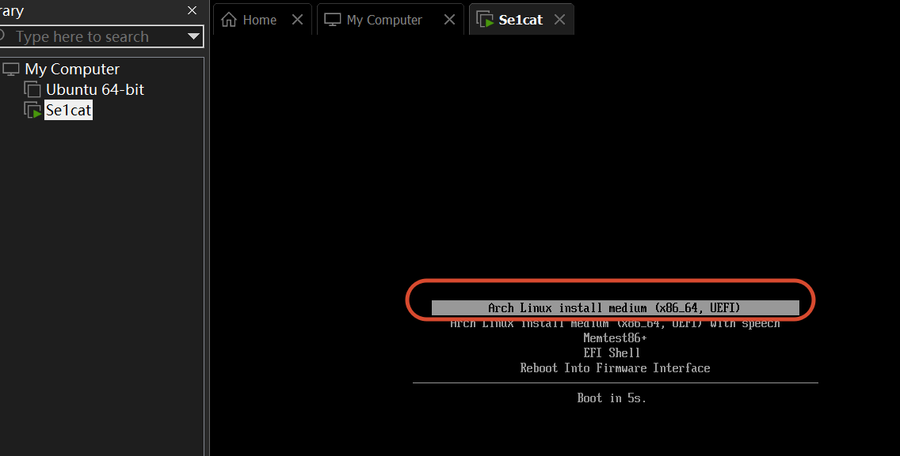

看到这里的命令行代表成功

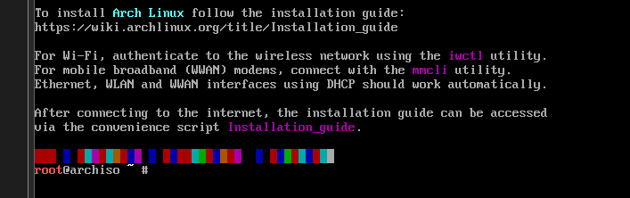

输入`ping www.baidu.com`检查是否能正常上网，如果没有丢包，就代表我们的现有环境很正常

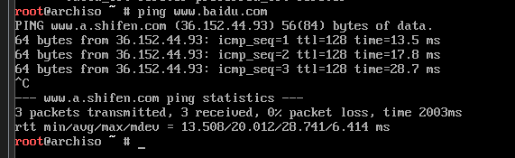

