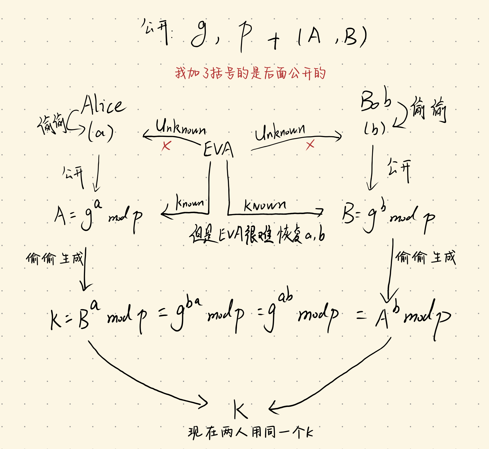

简称DH密钥交换，解决了如何在公开信道上安全地交换密钥的问题

这类算法会先给两个公开参数：g(生成元),p(大素数)

流程如下：

Alice这边生成一个私钥a，借助公式`pow(g,a,p)`生成一份公钥A

Bob同样生成一个私钥b，借助公式`pow(g,b,p)`生成公钥B

这个时候，双方将自己的公钥互相发给对方，可以直接公开的那种

Alice计算：`K=pow(B,a,p)`，将B再拆成`pow(g,b,p)`，就能得到K，实际上是`pow(g,a*b,p)`

Bob这边同理，这个时候，双方拿到了相同的共享密钥K

为啥我说第三方很难拿到这个K呢？在整个流程中，第三方能获取到的数值有`g,p,A,B`

能难住攻击者的安全性依赖便是离散对数难题，攻击者明确知道`A=pow(g,a,p)`但是他们很难反推出a，毕竟p是一个大素数，且涉及离散函数细节，所以说啊，就算攻击者同时获取到了A,B，也无法算出`pow(g,a*b,p)`中的a*b，我下面画个图吧，以供理解

至于这里的K加密密钥具体怎么用，还需要看题目要设计什么样的加密算法才行

这里有个dh和ecb结合的一个例题，请看这篇[文章](https://docs.yo1o.top/training/orphaned-problems/outdh+ecb/)
