> 这是本学期最后一次计算机组成实验了，看过实验手册，这里考察的是patch库文件，从安全的角度讲，如果我们将二进制链接的库文件改成自己的恶意code,就能想干啥干啥了

## phase1

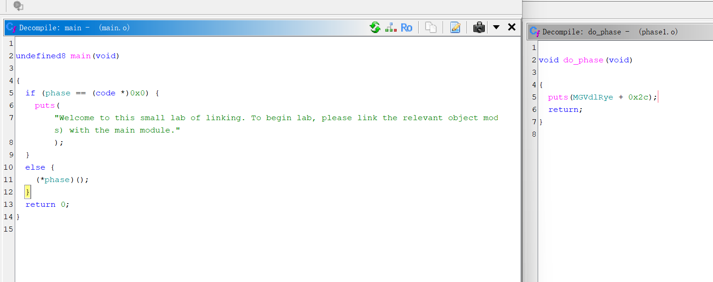

（左为`main.o`，右为`phase1.o`)

初看这两个二进制的反汇编，一定会感到疑惑，明明`main.o`里面没有调用`phase1`里的`do_phase`函数，那么为啥说我们`patch`了`phase1.o`后，重新编译就能运行我们篡改的code呢？

关键要看main里的phase全局变量

我先解读下`Ghidra`给我们反汇编的伪c代码

```c

undefined8 main(void)

{
  if (phase == (code *)0x0) { //判断全局变量phase是否空（不是0），如果是，就输出一串话，否则，会直接执行指针地址处的函数
    puts(
        "Welcome to this small lab of linking. To begin lab, please link the relevant object module( s) with the main module."
        );
  }
  else {
    (*phase)(); //这里用指针定位到phase全局变量地址，并把它当作函数运行
  }
  return 0;
}
```

再结合对应汇编代码好好过一下

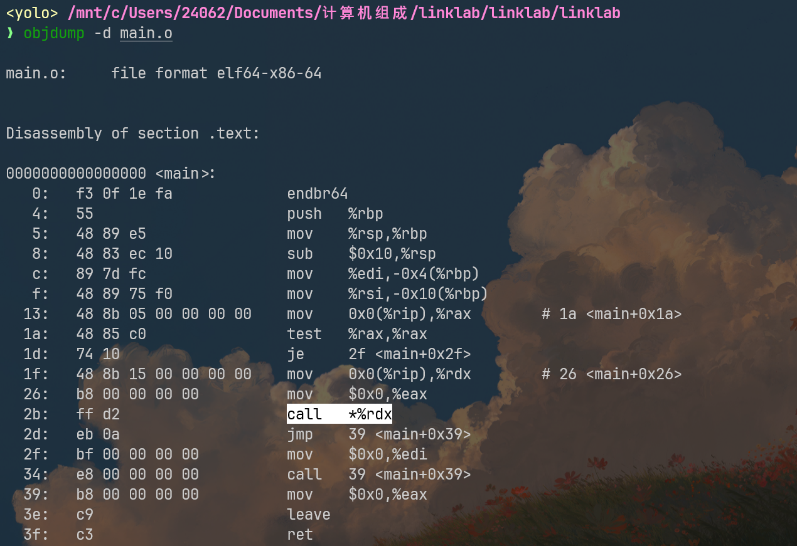

> 注意 `call *%rdx`——这不是 `call do_phase`，而是call 一个寄存器里的地址。main根本不知道、也不关心那个地址是谁，它只知道：「读全局变量 phase，如果非空，就把它当函数调用。」

我们可以得到结论，一旦全局变量phase有值，就会执行phase指针上的code，再结合本次实验要打的link，那么三个关卡文件中一定都有定义phase的部分，使用`Ghidra`看不明白的话，可以直接用命令行工具`readelf`查看

```bash
readelf -s phase1.o
```

这个命令会帮助我们梳理并显示库文件里的符号表，这很有用，可以显示函数列表，数据对象，文件名，节，未指定块，等等

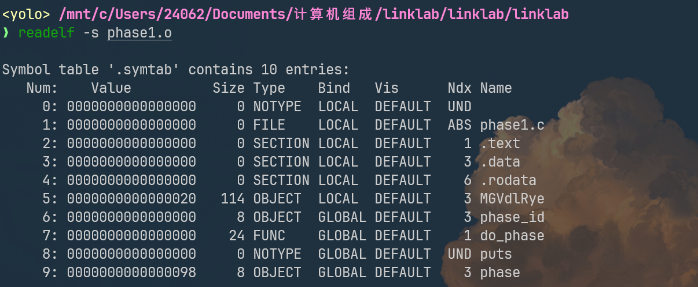

如图，这里存在9个符号，我下面按照Num顺序介绍

- 符号 0 - 空符号，保留的空符号，所有目标文件的第一个符号都是这个

- 符号 1 - 源文件，记录这个目标文件来自phase1,c，ABS表示这是一个绝对值，不依赖于任何节，用于调试信息

- 符号 2、3、4 - 节符号，分别代表 `.text`、`.data`、`.rodata` 三个节的起始位置

- 符号5 - 一个局部变量，感觉是二进制内部的某个临时数据，仔细观察会发现它就是phase1内部硬编码的，会输出的字符串，详细可以看下图，需要留意，它被存储在.data段，偏移0x20处

  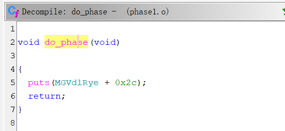

- 符号6 - phase_id，这是一个全局变量，只有8字节，同样存储在.data段

- 符号7 - do_phase，这次关注FUNC，这说明它的类型是函数，大小是24字节，地址在.text节的初始位置，偏移为0

- 符号8 - puts外部函数，这也就是为啥类型是NOTYPE，因为二进制并没有定义它，它走的是公共库

- 符号9 - phase全局变量，这就是我们要找的那个全局变量，大小8字节，并且地址在.data节的偏移为0x98的地方

我们已经大致分析完了，简单画个内存布局图

```bash
.data 节布局：
┌─────────────────────────────────────────────┐
│ 偏移 0x00:  phase_id (8字节)                 │  ← 符号 6
├─────────────────────────────────────────────┤
│ 偏移 0x08 - 0x1F: (未使用或填充)             │
├─────────────────────────────────────────────┤
│ 偏移 0x20:  MGVdlRye (114字节)               │  ← 符号 5（局部）
├─────────────────────────────────────────────┤
│ 偏移 0x98:  phase (8字节)                    │  ← 符号 9
└─────────────────────────────────────────────┘

.text 节布局：
┌─────────────────────────────────────────────┐
│ 偏移 0x00:  do_phase (24字节的机器码)        │  ← 符号 7
└─────────────────────────────────────────────┘
```

但是这里依然有个问题，因为按照main的逻辑，程序会执行phase全局变量对应的地址处的函数code，现在phase在.data段，和可执行段.text不在同一处，应该怎么搞，让他们有所关联？可以用`readelf -r`查看重定位节，细节如下，关注我框中的地方

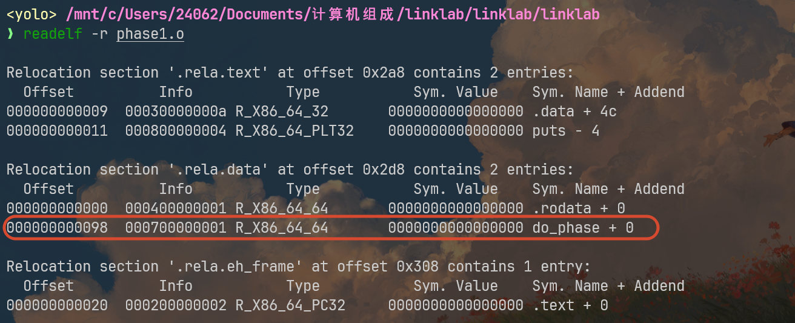

框中的内容就是本题的考点，库文件将.data节中偏移为0x98的指令重定向为符号为do_phase的开始地址，回忆上面我画的布局图，这里的0x98又恰好是phase的地址，那么这样就能解释清楚，为何main单独通过phase指针就能跳转运行到phase1.o里的函数do_phase了

来解决下第一题，目标是让main运行后，输出的是学号，看看函数定义，puts要读取的是`局部变量MGVdlRye再偏移0x2c`

```c
void do_phase(void)

{
  puts(MGVdlRye + 0x2c);
  return;
}
```

只要完全覆盖puts的参数，就能实现输出学号的效果，这里推荐使用命令行工具`hexedit`，蛮好用的，然后我们要开始算会账了，我们要替代的参数显然就是.data节里的第五个，那个局部变量，恰好，实验报告也指定了，我们只能篡改数据节，接下来我们看看.data节相对完整的二进制文件的绝对位置，可以使用下面的命令查看所有节头信息

```bash
readelf -S phase1.o
```

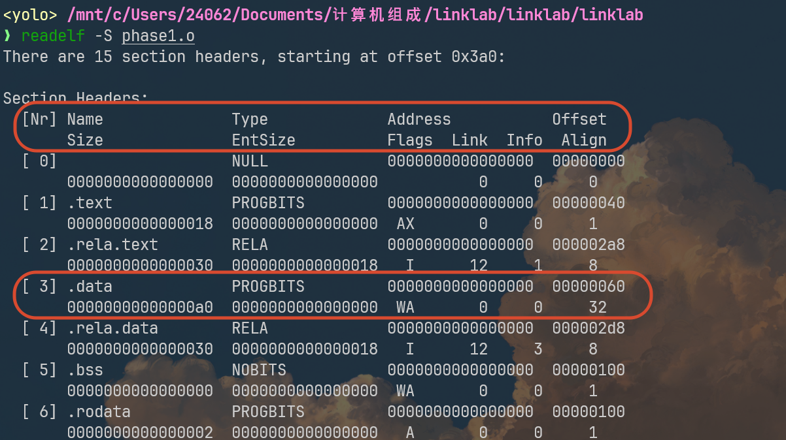

由表知，`.data`节在二进制0x60处，大小是0xa0，整理下范围`[0x60, 0x60 + 0xa0) = [0x60, 0x100)`

回顾那个局部变量，它相对.data的偏移是0x20，那么我们可以锁定它的地址是`0x80`然后我们再加上`0x2c`，这就来到了`0xac`,那么这里就是puts真正读取的参数地址(使用ctrl+g，输入ac后光标就会来到我下面框中59的位置)

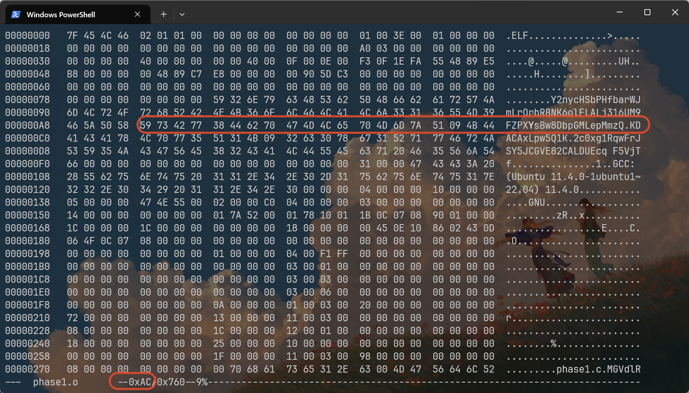

我先不做编辑，根据我们前面的分析，二进制应该会输出一串`YsBw...`这样的可打印字符(不可打印字符会被跳过)，然后一直到0x139那里的00才会停止（puts函数会检测到00才能停止读取）

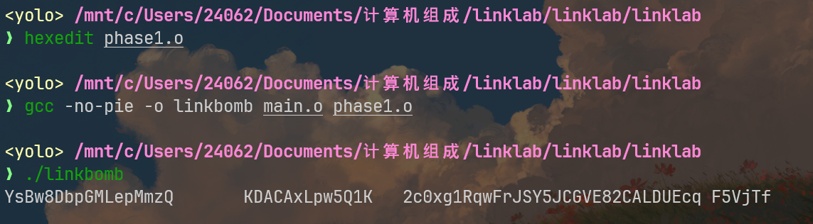

所以说，我们应该篡改的内容是怎么样的呢？不要直接在16进制里写B2404xxxx，它必须按照十六进制来，在hexedit中两种方法

- 方法一

用xxd提前将学号编码处理

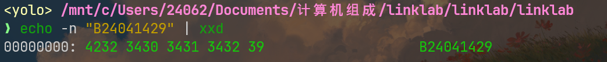

那么我要覆盖的内容应该是`42323430343134323900`

这里的00特别特别关键，千万不能丢

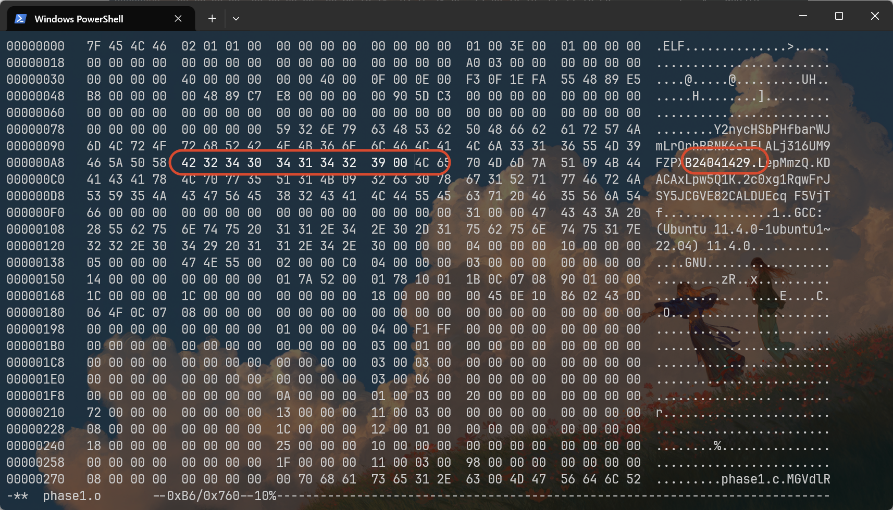

使用`ctrl+x`可以保存退出,重新编译运行，发现挑战成功

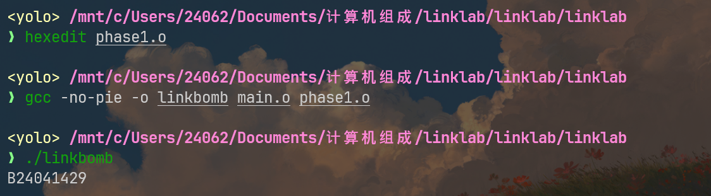

- 方法2

hexedit还有一处优点，使用tab可以直接将光标切换到右侧ASCII视图，直接进行明文编辑

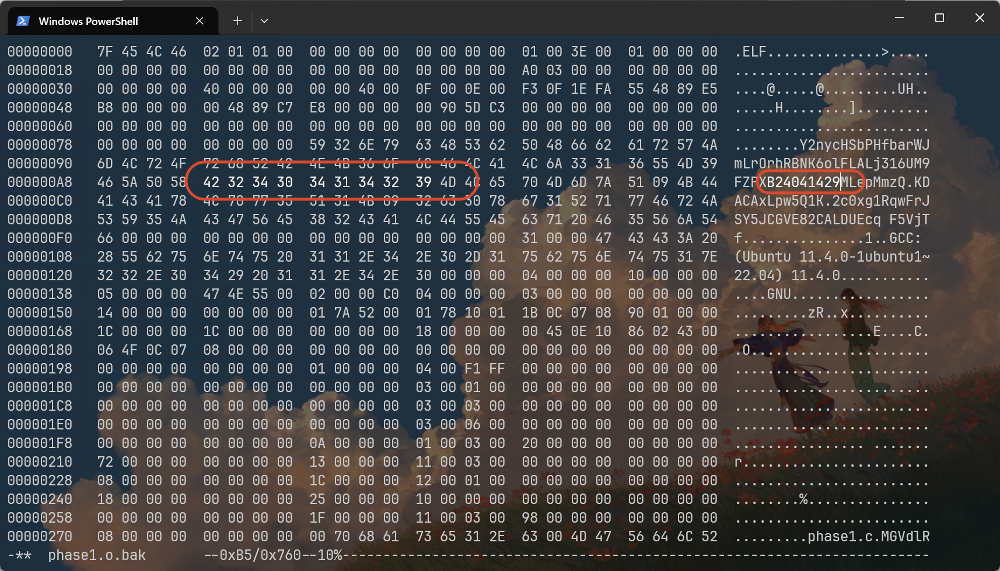

但是这里存在局限，00代表字符串结束，属于不可打印字符，我们是无法在ASCII视图中编辑出来的，这个时候必须再次tab跳转到十六进制视图，将00写上后，ctrl+x保存退出，其它做法和前面一致

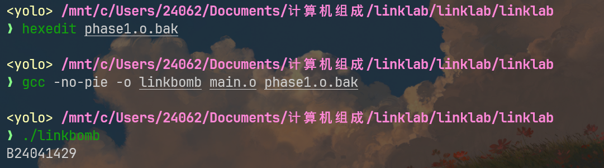

## phase2

本关卡难度飙升

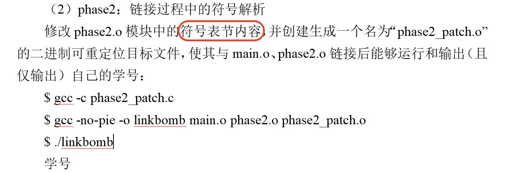

需要篡改符号表，应该在里面找个没怎么用的符号，将它类型改成函数，这样的话，才能调用`phase2_patch.o`里的同名函数

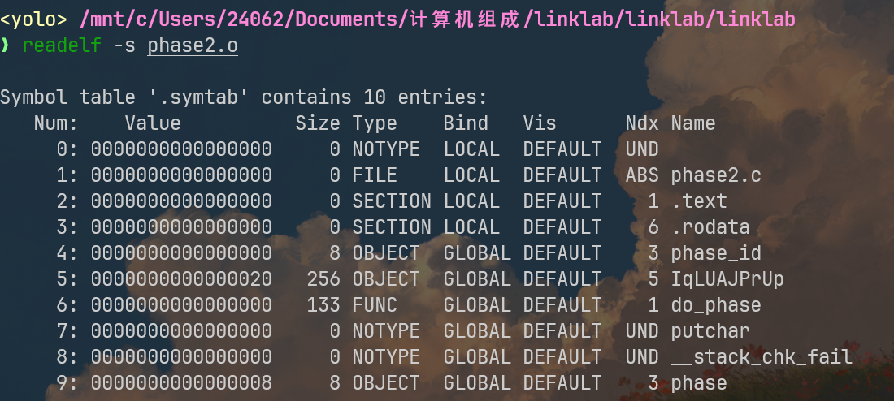

我看完反汇编的代码，大致了解到do_phase的功能是个查表(务必结合汇编，单纯靠ghidra的反汇编，读起来并不舒服)

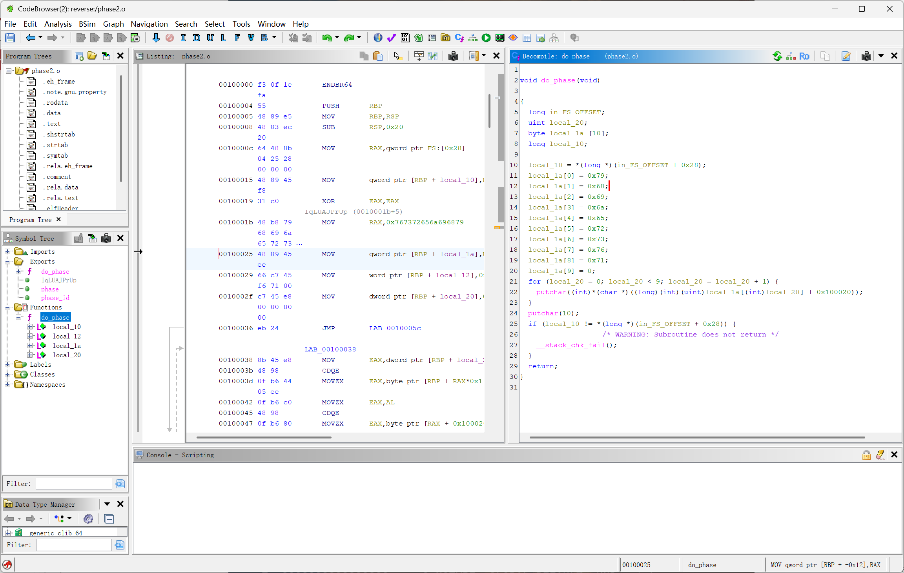

我将它整理了下，看看

```c
  char IqLUAJPrUp[256];   // 256 字节数组,当前在 .bss(未初始化,全 0)

  void do_phase(void) {
      char key[10];
      *(uint64_t*)key = 0x767372656a696879;  // movabs:8 字节
      *(uint16_t*)(key+8) = 0x71;             // movw: 第 9 字节 = 0x71
      for (int i = 0; i <= 8; i++)            // cmp $8 / jbe → i=0..8,共 9 次
          putchar( IqLUAJPrUp[ (unsigned char)key[i] ] );   // ★ 查表
      putchar('\n');
  }
```

一定很清晰吧，通过key获取到`IqLUAJPrUp`变量内部的数组

可以看看重定位信息

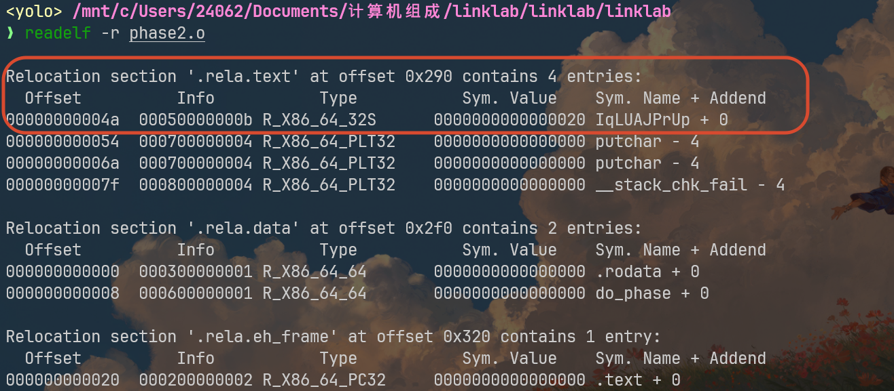

再用`objdump -d`查看函数汇编

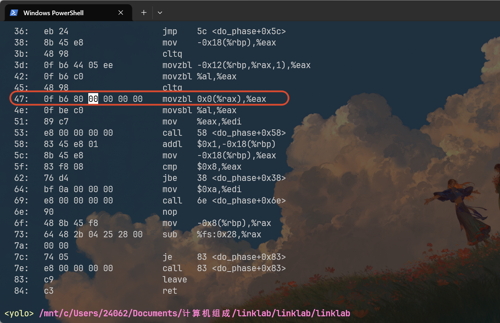

结合重定位，就知道那里一定调用的是`IqLUAJPrUp`段，这就是为啥我整理的汇编会相对ghidra更简单点

看懂查表原理了吧，结合do_phase，我知道要查的表如下：

```bash
  movabs 0x767372656a696879  小端 →  79 68 69 6a 65 72 73 76
  movw   0x71                       →  71
  key[] = { 0x79,0x68,0x69,0x6a,0x65,0x72,0x73,0x76,0x71 }
  十进制 = { 121, 104, 105, 106, 101, 114, 115, 118, 113 }

  所以程序输出 = 表[121], 表[104], 表[105], 表[106], 表[101], 表[114], 表[115], 表[118], 表[113],再加换行。
```

为了让它查的结果中正好是学号，我们就要在新的库中定义那个数组，满足下面格式就好

```bash
  | 下标 | 应得字符 |
  |------|----------|
  | 121  | B        |
  | 104  | 2        |
  | 105  | 4        |
  | 106  | 0        |
  | 101  | 4        |
  | 114  | 1        |
  | 115  | 4        |
  | 118  | 2        |
  | 113  | 9        |
```

来看看我写的代码

```c
char IqLUAJPrUp[256]={
    [121]='B',
    [104]='2',
    [105]='4',
    [106]='0',
    [101]='4',
    [114]='1',
    [115]='4',
    [118]='2',
    [113]='9',
};
```

怎么篡改符号表呢？先看节头信息

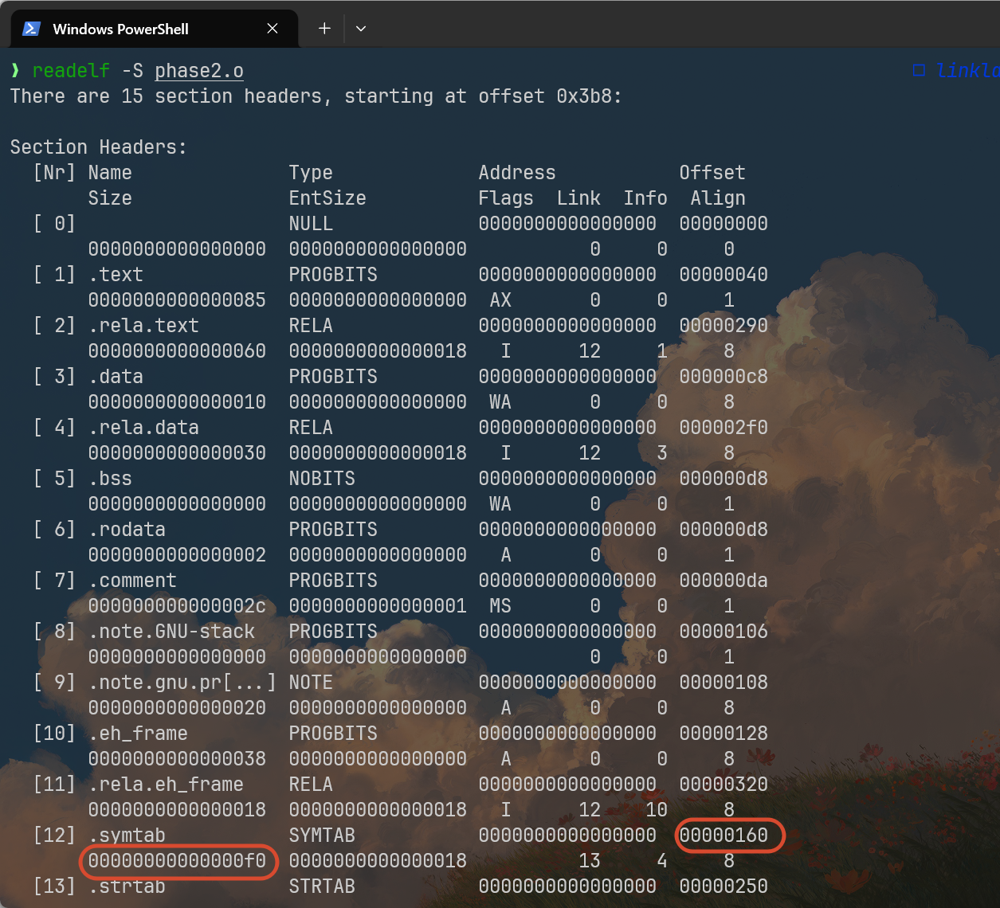

symtab在`0x160`的偏移处，大小是`0xf0`，那么范围应该是`[0x160,0x250)`

然后就是一些内存上的布局，可以上网让ai解释，我下面截取部分关键信息

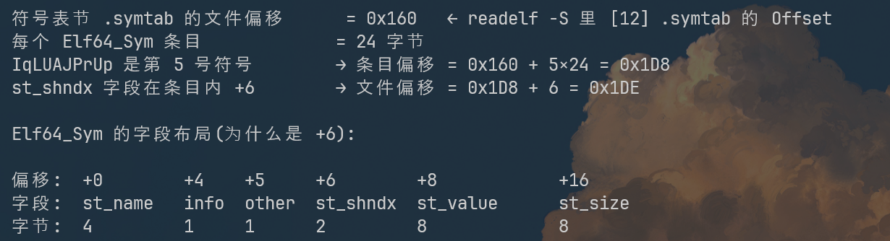

原本的ndx是5，这代表它在.bss段，这里存在强定义的问题

---

「强定义」到底指什么？

  一个符号(比如 `IqLUAJPrUp`)在链接时分三种身份:

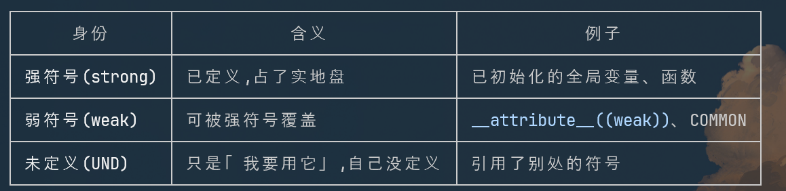

  phase2.o 里 `IqLUAJPrUp` 在 `.bss`、`Ndx=5`,这是一个强定义——意思是:`phase2.o` 拍胸脯说「这个数组归我管,256字节的实际存储空间我来提供」。

> 注意:它不是「无法调用外部」,而是「它自己就是那个定义」。链接时,所有引用 `IqLUAJPrUp` 的地方(包括 `phase2.o` 自己
> do_phase 里那条 `R_X86_64_32S` `IqLUAJPrUp`)都会被绑到这块 .bss 空间上。

  那为什么不能直接加个 patch.o?

  链接器的符号解析规则(经典三条):

  1. 不允许两个强符号同名 → 报 multiple definition 错误。
  2. 一强一弱 → 选强的。
  3. 多个弱的 → 任选一个。

  phase2.o 的 `IqLUAJPrUp` 是强的,你 patch.o 里 `char IqLUAJPrUp[256]={...}` 带初值也是强的。两个强符号撞名 → 命中规则 1 → 链接失败。

  所以问题不是「它调不到外部」,而是「它自己已经是个强定义,占着茅坑,别人没法再定义一个同名的」。

  改成 UND 之后发生了什么？

  把 phase2.o 那个符号的 st_shndx 从 5(.bss)改成 0(UND),等于让 phase2.o 改口:

> 「`IqLUAJPrUp` 不归我了,我只是要用它,具体定义请别的模块提供。」

  这下:

  - `phase2.o`:`IqLUAJPrUp = UND`(未定义引用),只剩「我要用」。
  - `phase2_patch.o`:`IqLUAJPrUp` = 唯一的强定义。
  - 链接器:把 phase2.o 的那条引用(do_phase 里查表那行)解析到 `patch.o` 的数组上。

  冲突消失,而且 do_phase 现在查的是你设计的那张表,而不是原来 .bss 里那块全 0 的空表。

---

科普就到这里，来说说看本题具体怎么做

其实上面截图部分已经很清晰的写出了具体的偏移，这是计算过程


也就是说，我们需要将0x1DE上的值，从05改成00，来看看我篡改前后的变化

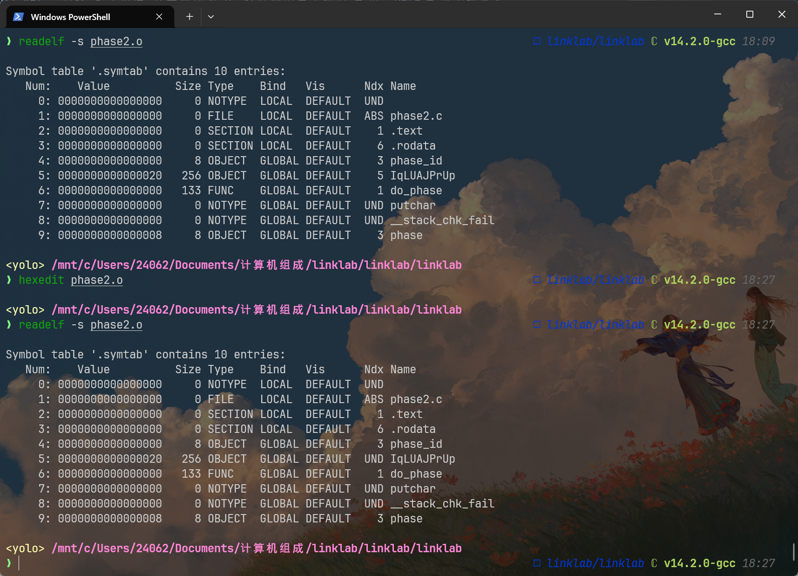

然后说说具体过程，用hexedit打开后，使用`ctrl+g`，输入`1de`会让光标跳转到要改动的05左侧，直接输入00能覆盖，然后ctrl+x进行保存退出，就结束了

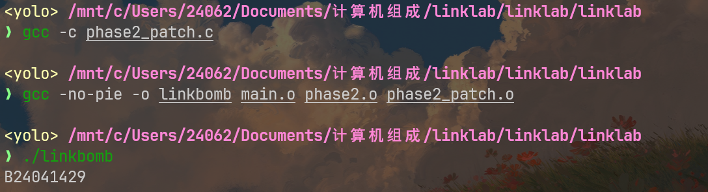

依次运行下述命令

```bash
gcc -c phase2_patch.c
gcc -no-pie -o linkbomb main.o phase2.o phase2_patch.o
./linkbomb
```

## phase3

先看看phase3的内容

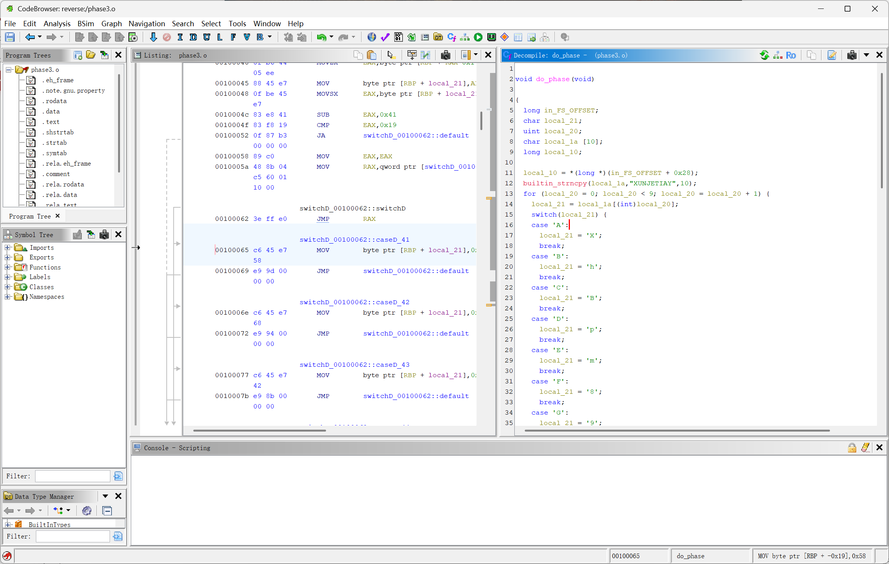

大致作用是case-switch，通过匹配字符串`XUNJETIAY`，会输出映射出来的字符，比如说匹配到的是字符A，那么返回的值就是X，大致效果就是这样，按照实验报告的要求，这一关卡我要调整重定位节,根据COOKIE字符，将对应的偏移量改向我的学号即可

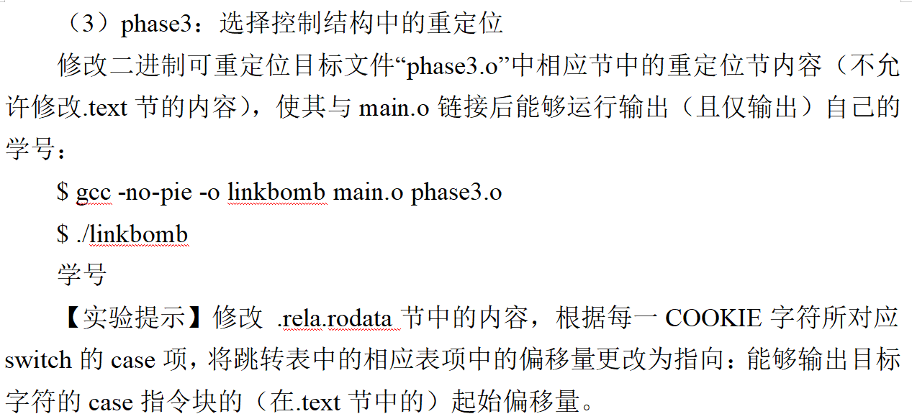

使用命令`readelf -r phase3.o`查看所有偏移跳转情况，这里能看到共26个选项

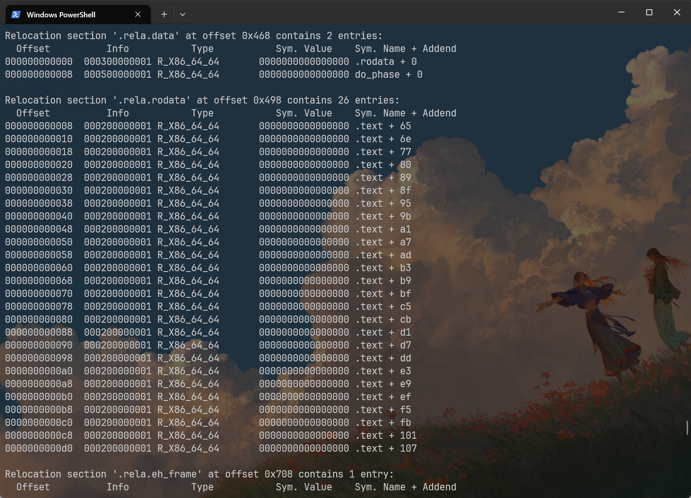

教大家这里怎么看，左侧是26个字母表偏移，就比如说0x08对应的是第一个索引，就是第一个case的那个，它是`case 'A'`

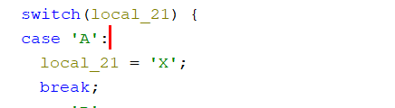

然后看最右侧，对应的地址是.text+65,它代表这里重定向的地址是.text节的偏移为65的地方，在Linux中可以直接用`objdump -d`查看

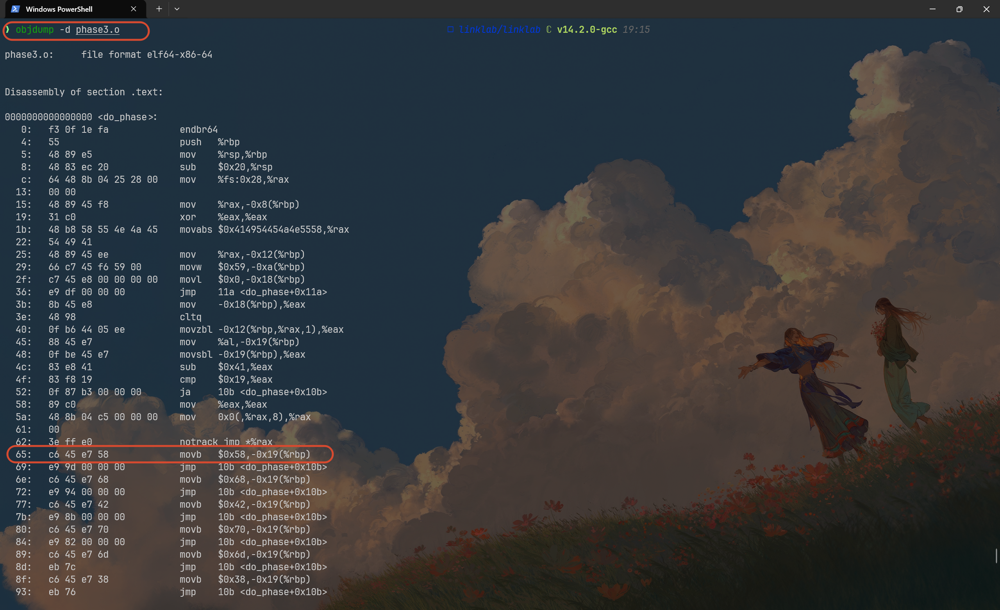

注意看我第二处框中的地方，它对应的指令是`movb $0x58,-0x19(%rbp)`输出下0x58对应的字符

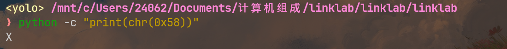

恰好匹配我用ghidra反汇编的情况

那我就按照上述原理，整理下这里的映射表

| case | result | offset |
| ---- | ------ | ------ |
| A    | X      | 65     |
| B    | h      | 6e     |
| C    | B      | 77     |
| D    | p      | 80     |
| E    | m      | 89     |
| F    | 8      | 8f     |
| G    | 9      | 95     |
| H    | 3      | 9b     |
| I    | Y      | a1     |
| J    | O      | a7     |
| K    | 7      | ad     |
| L    | >      | b3     |
| M    | >      | b9     |
| N    | 1      | bf     |
| O    | z      | c5     |
| P    | W      | cb     |
| Q    | 2      | d1     |
| R    | Q      | d7     |
| S    | p      | dd     |
| T    | 0      | e3     |
| U    | T      | e9     |
| V    | M      | ef     |
| W    | 4      | f5     |
| X    | @      | fb     |
| Y    | 5      | 101    |
| Z    | 6      | 107    |

然后回忆下do_phase中要匹配的字符串`XUNJETIAY`

| 源字符 | 映射为 | offset |
| ------ | ------ | ------ |
| X      | @      | fb     |
| U      | T      | e9     |
| N      | 1      | bf     |
| J      | O      | a7     |
| E      | m      | 89     |
| T      | 0      | e3     |
| I      | Y      | a1     |
| A      | X      | 65     |
| Y      | 5      | 101    |

然后我再把我学号对应的offset弄出来

| 学号 | offset |
| ---- | ------ |
| B    | 77     |
| 2    | d1     |
| 4    | f5     |
| 0    | e3     |
| 4    | f5     |
| 1    | bf     |
| 4    | f5     |
| 2    | d1     |
| 9    | 95     |

那么本题的解决思路就是将原本的fb改成77，e9改成d1以此类推，完成本题任务

怎么编辑呢？我们需要先确定`.rela.rodata`的具体位置以及对应结构

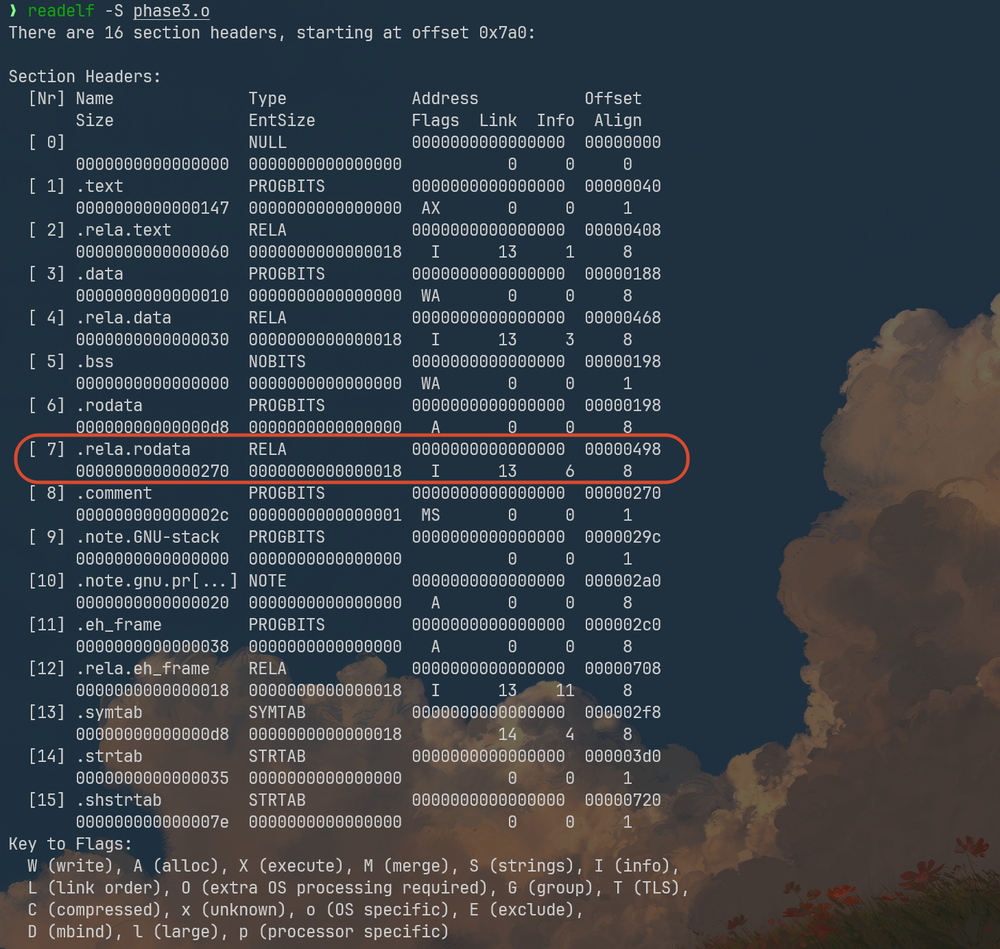

它在0x498的位置，大小是0x270

关于`.rela.rodata`的大致结构，可以让ai解读

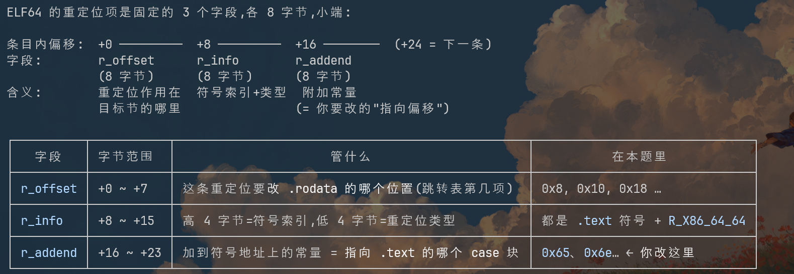

可以看得出来，我们应该处理每个重定位项的0x16到0x23的偏移，就先看看第一个吧，我们需要将原本的fb改到77，这里的fb应该对应的是`case X`,偏移地址算一下：

`0x498+24*23+16=0x6d0`

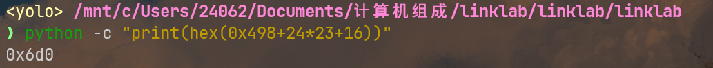

使用`hexedit phase3.o`

直接ctrl+g，输入6d0后回车跳转，注意看我下面的框中的光标，恰好就是FB，完全匹配我们前面的理论，接下来直接输入77进行覆盖即可，其它的类似，我就不重复描述了

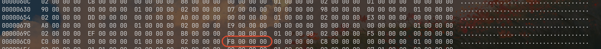

就是最后那个101改95的时候要仔细观察，而且处理的时候小心，应该写`95 00`

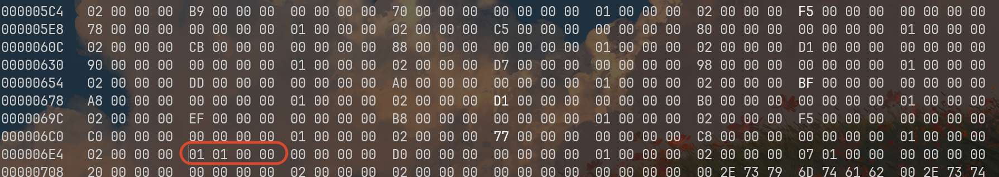

最后使用ctrl+x保存即可

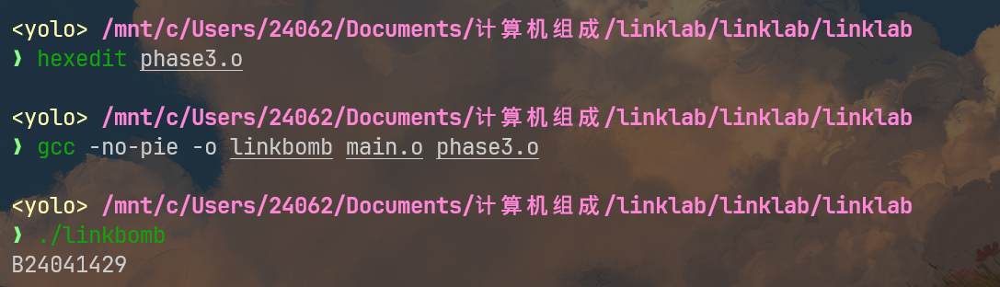

> 本次实验到此结束，耗时2h，挺不错的，就当提前复习这部分的期末考点了


