记录一些学习web渗透必须拥有的基础工具

> 我记录的工具的功能相对简单基础点，好用的工具非常多，建议在网安学习中，多掌握原理，遇到好用的工具就更新自己的装备，不过适合自己 的才是最好用的

## Flclash

这第一个便是`VPN`代理工具，俗称“翻墙”

简短讲解下我对梯子的了解：在国内网络环境中，访问国外网站会极度受限，我们在`GitHub`上找开源工具项目或`Chatgpt`,`huggingface`等网站服务如果不挂梯子是无法访问的，这些资源对于我们学习网络安全技术或其它计算机技术是非常有帮助的，为了解决这个网络受限的问题，也就衍生出了`VPN`等梯子服务，它可以将电脑的网络配置挂一层代理，将所有网络请求从直连变成经过第三方转发，由此解决国内网络访问国外资源受限的窘况

上面只是`flclash`的作用，但是它并不算完整的`VPN`，完整的`VPN`还需要一个稳定的国外服务器转发，俗称机场订阅，举个例子，可以将`flclash`当作电话卡，但是电话卡配套的服务自然就是话费、流量，而这里的机场订阅就是我说的流量，没有它的话，同样上不了外网的

> warning,国内明确禁止使用翻墙软件访问外网，但是这里好像不会太过严格，总之每次仅仅访问正常合规的网站的话，被网警叔叔请去喝茶的概率不会太大
>
> 但是！绝对不要访问任何灰黑产网页，禁止访问以及评论涉及政治、黄赌毒等敏感网站，一旦做了这些，网安部门一定会第一时间锁定你的上网设备并进行教育，届时追悔莫及

`Flclash`的国内下载地址：[https://flclash.dev/#download](https://flclash.dev/#download)

测试过，不挂梯子是可以正常访问并下载的

然后这是官方网站对应的开源仓库地址:[https://github.com/chen08209/FlClash/](https://github.com/chen08209/FlClash/)

> 上面给的两个链接区别不大，前者不需要我们提前挂梯子，但是下载的版本号相对来说不是最新的，后者链接则是直接去官方仓库下载最新的版本，但是`GitHub`仓库必须提前挂上梯子才能稳定访问并下载

一切走默认安装即可，如果遇到恶意软件警告提醒，请无视风险安装，安装好长这个样子,我推荐选中虚拟网卡模式，这会对其它虚拟环境要友善很多，比如`wsl`

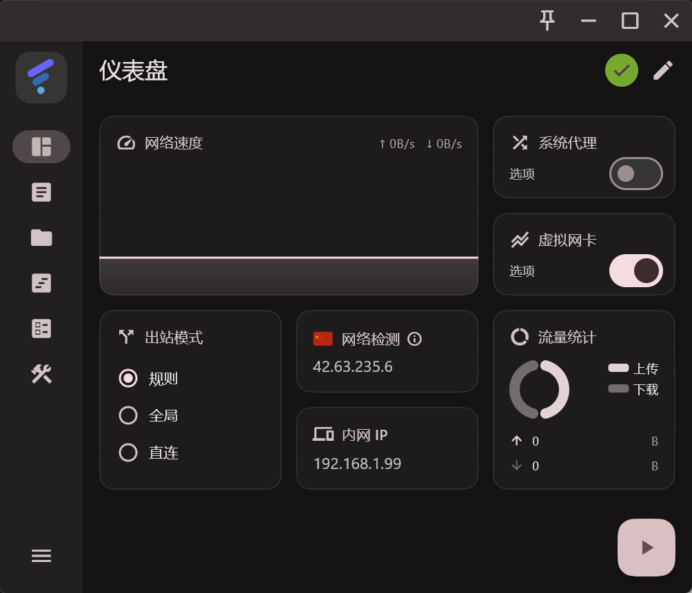

关于这里的机场订阅，我暂时用的是魔戒那边的，性价比确实很高，我买的是￥19.9换130G流量的套餐，对我这种经常科学上网的来说，一学期算是坚持下来了，轻度用户用一年都绰绰有余（务必少充多次，中转站跑路还是很常见的

这是机场地址：[https://47.112.97.173:5000/#/register?code=KN815eQN](https://47.112.97.173:5000/#/register?code=KN815eQN)

氪金后，按照下图的顺序复制出订阅地址

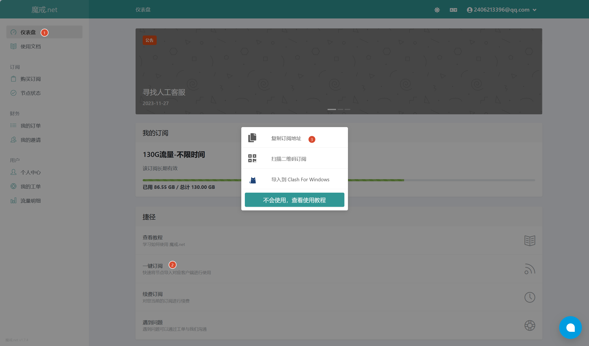

然后在`flclash`中，按照下图流程将订阅地址复制进去

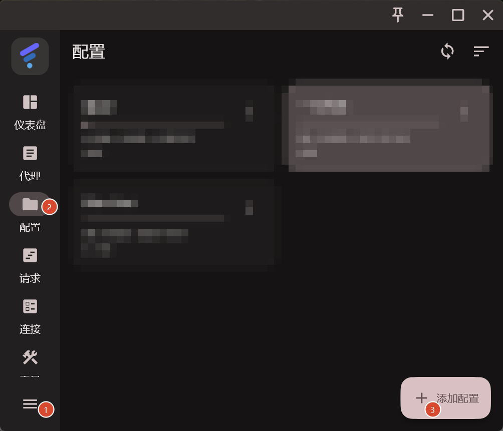

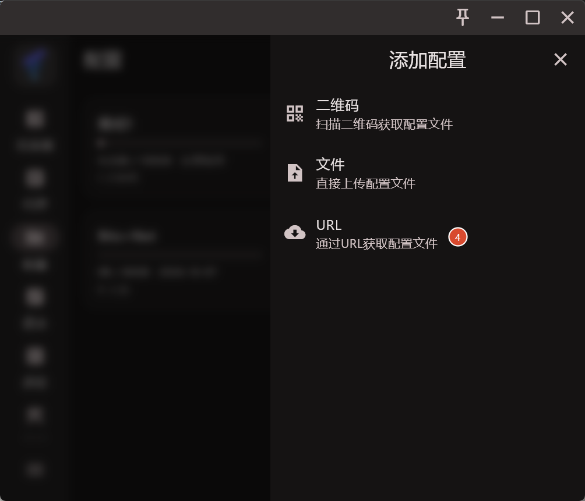

会看到一个url输入框，将url复制进去后提交即可

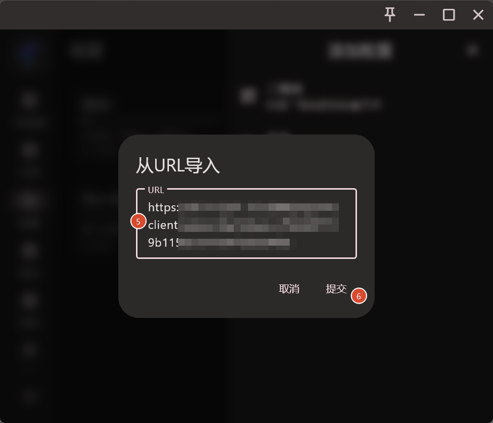

会看到新增的一个机场订阅

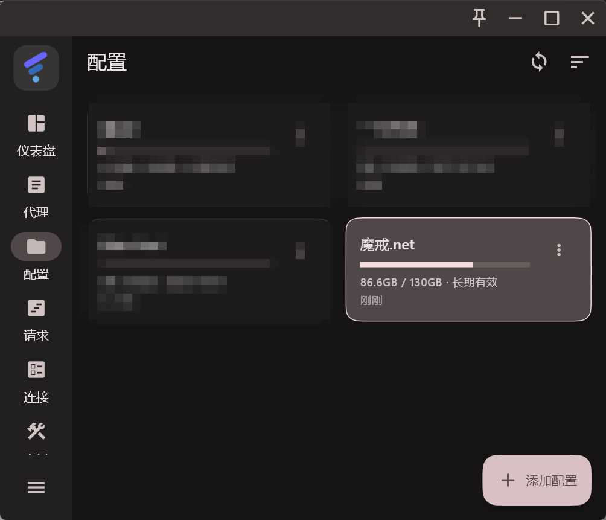

回到仪表盘中，点击那个开关按钮，`flclash`会自动灵活调用机场订阅下的不同节点

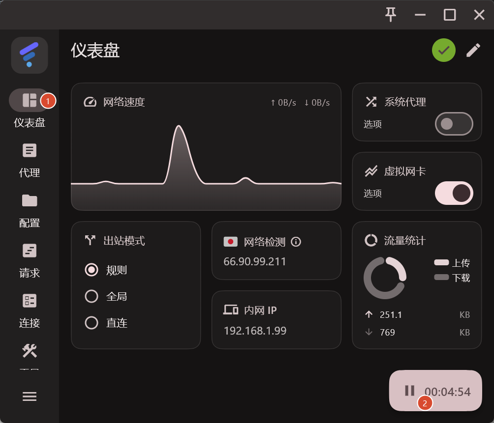

我比较喜欢用规则，因为它会匹配规则：对国外网站走梯子访问，对国内网站走直连模式，这样挺省流量的，不想用梯子的时候，再点一次开关就好

> 安全说明，不要轻信那种免费的中转站，我前面有介绍过，所谓的挂梯子就是将直连的过程变成了第三方中转，也就是说你发送的任意web请求都会经过中转站那边的服务器，一旦有些网站的账号登录走的是明文，那就会被恶意机场那边捕获到，造成信息泄露

## Yakit

这是学习Web必备的抓包工具（如果是几年前的话，就应该是Burp Suite了）

工具官网下载地址：[https://yaklang.com/](https://yaklang.com/)

默认安装即可

正常来说它必须结合浏览器代理工具一起使用，因此详细点的抓包过程请看下一个工具描述

## FoxyProxy

这个是一款浏览器插件，应该主流浏览器插件市场里都能搜到吧，我这里用的是Firefox浏览器，浏览器官网下载地址：[https://www.firefox.com/zh-CN/thanks/](https://www.firefox.com/zh-CN/thanks/)

下载好后，把一系列注册等操作完成后，在管理扩展中搜索`foxyproxy`并回车

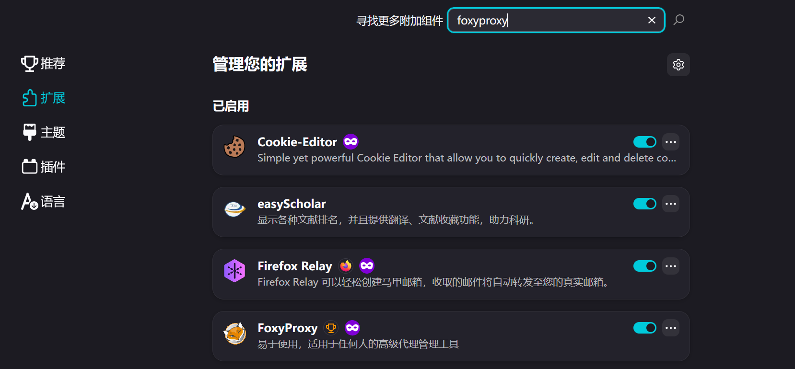

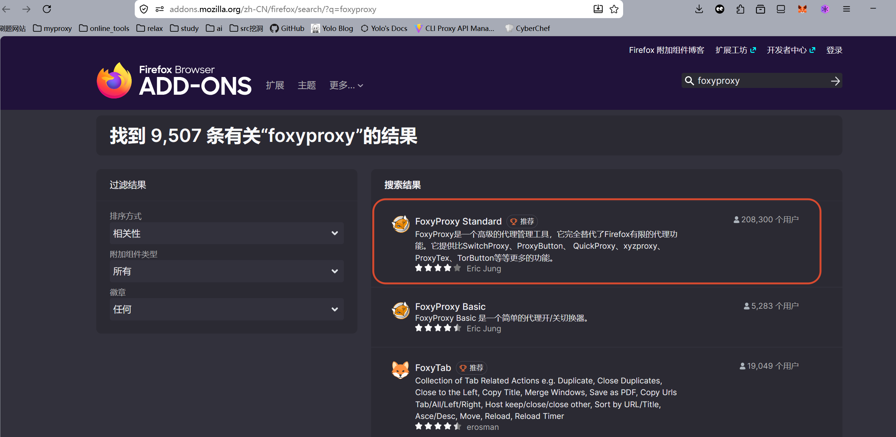

直接安装我上图框中的那个

使用的话，可以先打开`yakit`,查看它监听的端口号

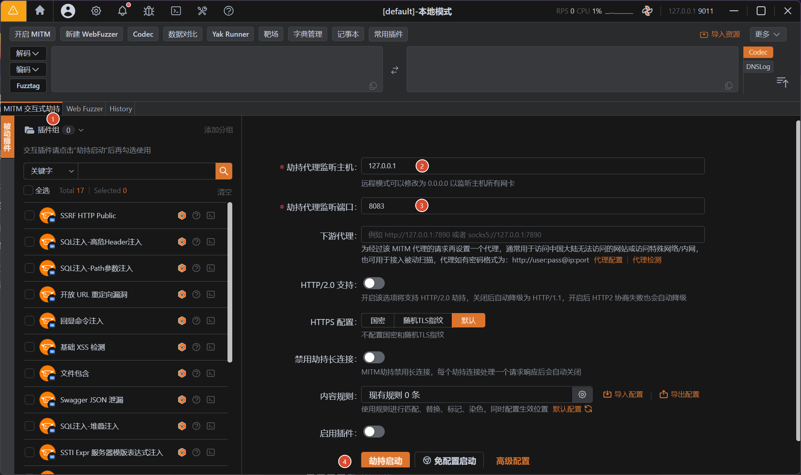

在`MITM`交互式劫持中，可以看到监听主机是`127.0.0.1`，监听端口是`8083`，对了，左上角的那个三角警告记得点下，里面应该有个启用证书的部分，按照`yakit`的流程来

回到我们安装好`foxyproxy`的浏览器中

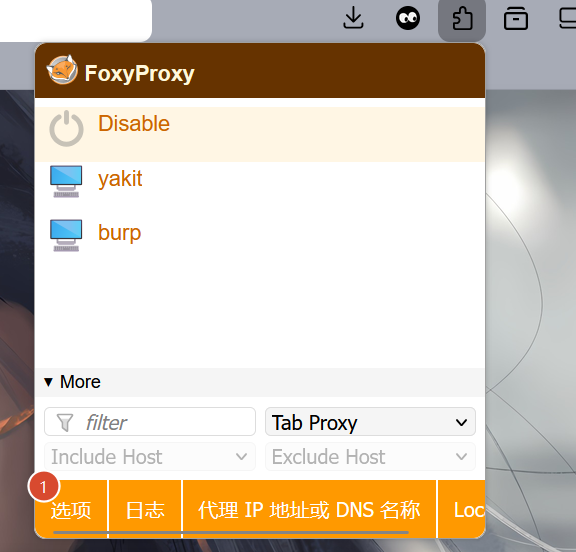

最开始大家的都应该和上图一样，Disable下是空的，点击选项

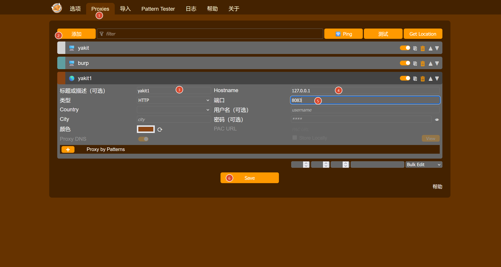

按照上图的流程，将前面`yakit`监听的端口等信息输入，选择`save`保存即可

使用的话，点击扩展，选中proxy后，点击刚刚保存的那个代理

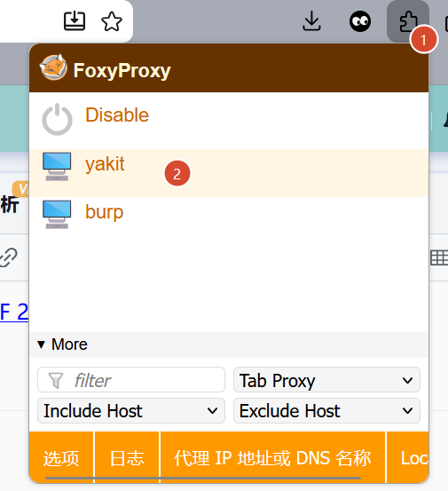

这会儿已经将代理配置好了，回到`yakit`中，进行劫持

我在浏览器中随意找了一个`web`题目，启动容器后，会看到`yakit`抓到不少包，我们需要选中和靶机相关的流量包，主要是看域名

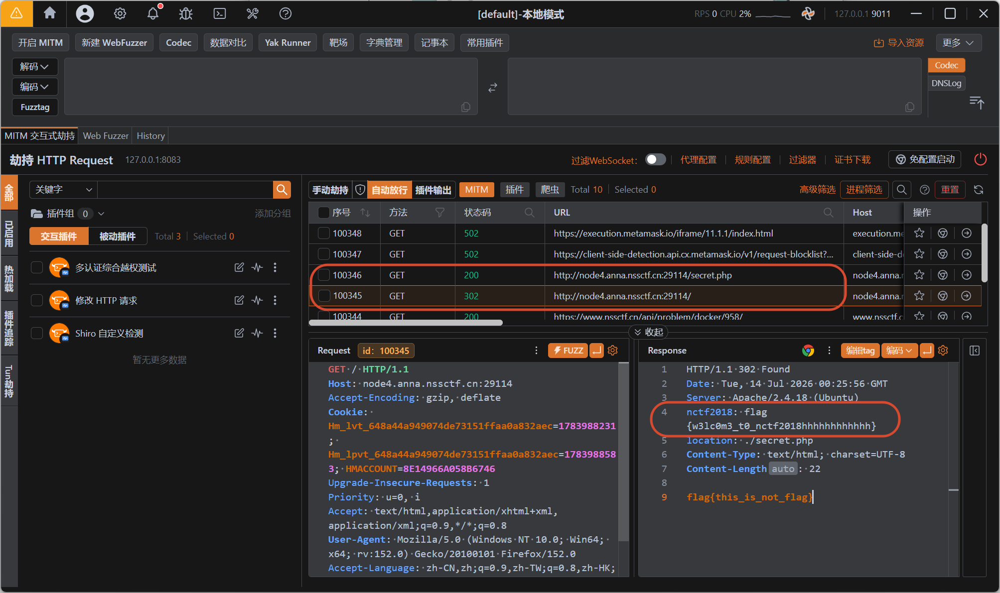

一眼就能看到flag

## Hackbar

这是一款浏览器插件，作用是帮助我们灵活修改请求头，不需要进行抓包，这是Firefox中的插件[下载链接](https://addons.mozilla.org/zh-CN/firefox/addon/hackbar-free/)

安装好后，按F12，应该能看到一个绿色头像

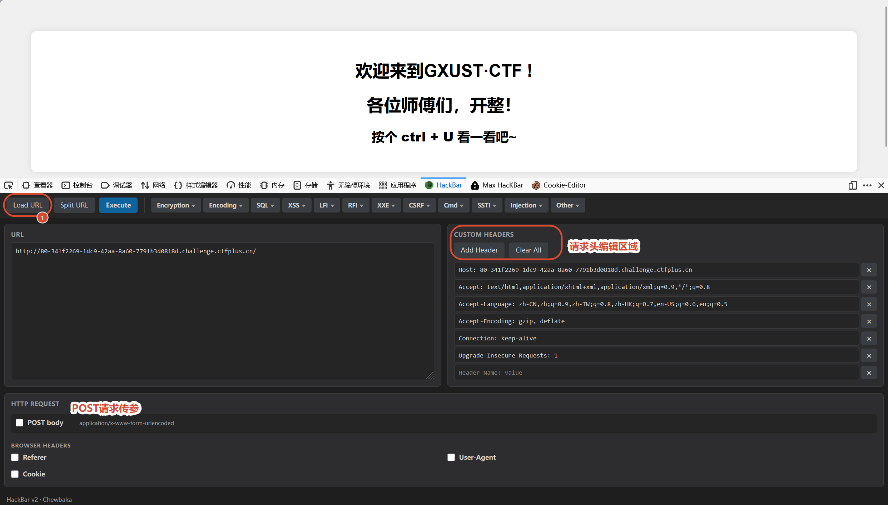

就按照我上面编辑的那样，多用用，就熟练了
