在这里记录下学习web的基础知识，类似那种常识入门课

> 若看不懂，暂请跳过，不建议钻牛角尖，这类常识性的知识大家会在后续的web学习中，潜移默化下掌握、精通

## basic web framework

一个基础的web应用应该由数据库、后端、前端组成，它们三个之间的联系如下

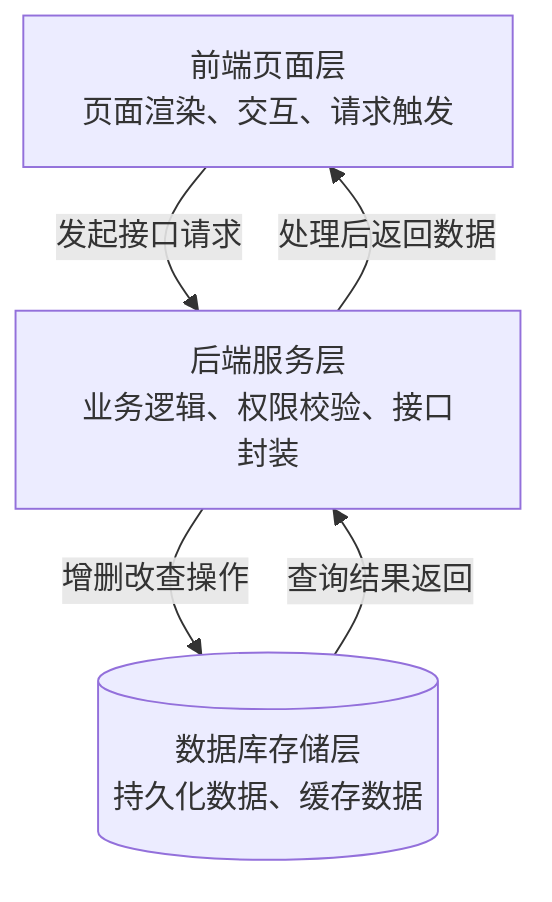
```mermaid
flowchart TD
    Front[前端页面层<br/>页面渲染、交互、请求触发]
    Back[后端服务层<br/>业务逻辑、权限校验、接口封装]
    DB[(数据库存储层<br/>持久化数据、缓存数据)]

    Front -->|发起接口请求| Back
    Back -->|增删改查操作| DB
    DB -->|查询结果返回| Back
    Back -->|处理后返回数据| Front

```

## HTTP

对于Web手来说，最长打交道的便是HTTP协议

HTTP是一个客户端(用户)和服务器(网站)之间请求和应答的标准，其本质是TCP

通过使用网页浏览器、网络爬虫或者其它的工具，客户端发起一个HTTP请求到服务器上指定的端口，我们称这个客户端为用户代理程序(User Agent),应答的服务器上存储着一些资源，如HTML文件或图像，我们称这个应答服务器为源服务器

简单来说，客户端使用HTTP格式来构造请求包内容，将其发送出去之后，服务器再以HTTP格式来构造应答包，发送回客户端，客户端接收到这个包之后进行解析，最终得到我们看到的网页架构

下面详细讲解下请求包和响应包的格式

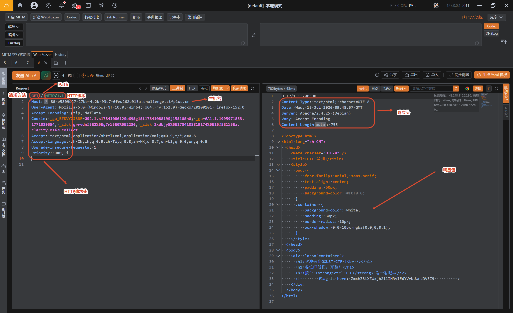

在我看来，不管是请求包还是响应包，它们都是由两部分组成：请求(响应)头+请求(响应)体

> 我划分的太过粗略，大致这样理解就好，细节部分大家见多了就能熟悉

## HTTP请求方法

上图中，我标记的请求方法是GET，它的含义顾名思义，就是向服务器获取资源，我下面整理一下能见到的请求方法

- GET:通常用于直接获取服务器上的资源
- POST:一般用于向服务器发送数据，常用于更新资源信息
- PUT:一般用于新增一个数据记录
- PATCH:一般用于修改一个数据记录
- HEAD:一般用于判断一个资源是否存在
- OPTIONS:一般用户获取一个资源自身所具备的约束，如应该采用怎样的HTTP方法及自定义的请求头

我这里只说明下GET和POST请求如何发包，这两是考察最频繁的

GET请求的话，只需要在URL后面加个?和一个键值对，比如说我要发送test这个请求参数，传递进去的值是web，那么就要构造的URL如下：

```text
http://target:port?test=web
```

至于POST请求的话，常见的方法两种，一种是用hackbar这样的浏览器插件工具，另一种则是抓包直接编辑载荷再发送，详细的操作请看下面的例题部分

## HTTP请求状态码

在每个响应包的响应头中，都能看到类似200这样的数字，它们被成为状态码，常见的状态码如下：

- 101 Switching Protocols: 切换协议，通常用于HTTP切换为Websocket协议
- 200 OK：请求成功
- 201 Created:资源创建成功，通常用于回应请求方法PUT
- 204 No Content: 用于不回显任何内容的情况，如网络联通性检测
- 301 Moved Permanently: 永久跳转，浏览器以后访问到这个地址都会直接跳转到Location头所指向的新地址
- 302 Found: 临时跳转，会跳转到Location头所指向的地址
- 404 Not Found:所请求资源不存在
- 405 Method not allowed: 方法不被允许
- 500 Internal Server Error:服务器内部错误
- 502 Bad Gateway: 网关在转发内容时错误，通常是转发的下一站----后端不可达或者返回了一些奇怪的信息
- 504 Gateway Time-out: 网关在转发内容时超时

## HTTP协议的URL

URL就是我们平时访问的网站链接，一个标准的URL如下：

```text
https://url/read.html?a=1&b=2#tag5
```

我对每个部分进行解构，大致如下：

```text
scheme:[//[userinfo@]host[:port]]path[?puery][#fragment]
```

- 协议(scheme):用于代表这个URL所指向的协议，常见的有HTTP,HTTPS,FTP等
- 用户信息(userinfo):通常为"用户名:密码"这类格式，会被编码在Authorization头中发向服务器
- 主机名(host):指向网络上的服务器地址、域名，或者IP地址
- 端口(port):指向服务器上的端口，如果不填写，就会依据协议设置成默认值并不展示，例如HTTP默认就是80端口，HTTPS默认是443端口，FTP默认是21端口
- 请求路径(path):指向服务器上的资源的路径，如/read.html会请求该路径对应的资源
- 请求参数(query):在请求资源时所带的参数，后端可获取到这些参数，例如a=1&b=2,这代表有两个参数a和b，它们传递的值分别是1和2
- 页面锚点(fragment):用于指向页面上的某个元素，不会被实际发送到服务器，浏览器会进行处理并滚动到该元素出现的地方

## HTTP头信息

> 这一部分有点杂，我也短期记录不全，大家遇到一个就记录一个

- Set-Cookie:此头用于远程服务器向本地设置Cookie,Cookie是一种凭证，一般用于客户端向远程服务器证明身份
- Location: 这个头用于跳转下一步路由，通常和301、302状态码一起用

- User-Agent: UA头，每个HTTP请求都会带，它会包含我们所使用的操作系统版本、CPU、浏览器类型等信息，比如下面这个
  - 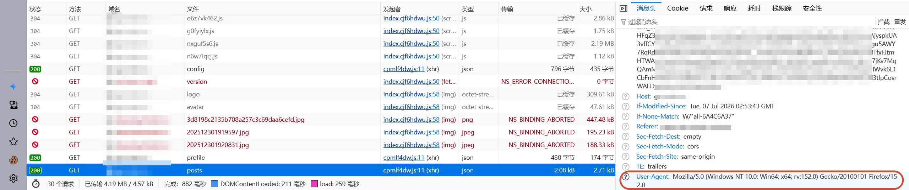


入门web的话，优先对这些基础知识大致掌握，具体的需要自行钻研，加油，我下面专门出一个web题，难度为入门级别，基本上会将我上面写到的知识点考上

## example question

> 关于本题环境,我已经push到CTFPlus平台，大家可以自行上去搜索
>
> 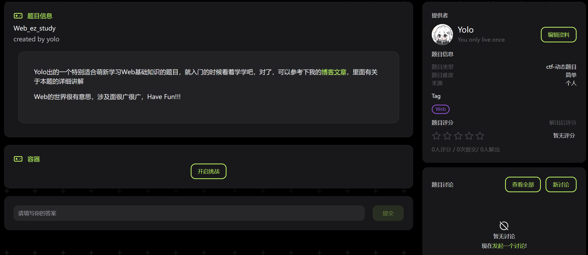


### stage1

第一关查看网页源代码

根据下面的新手提示，这里最常见的方法便是右键查看或者ctrl+u

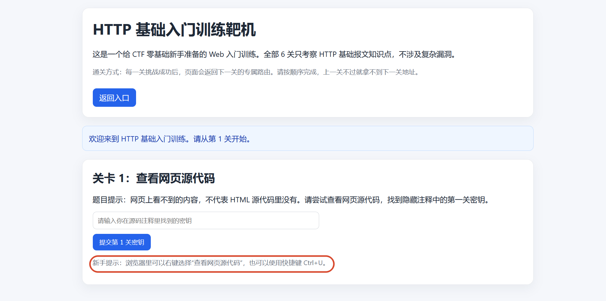

甚至抓包也能查看完整源代码，正常情况下，我们这里一般只能看到html语言，换句话说，我们只能看到出题人想让我们看到的前端内容，那些其它后端代码，比如php、python或Java等，除非出题人故意写类似php的highlight函数那样，我们才能查看部分代码，其它情况下，这些后端代码是不可能看到的

关于本题，我再补充一个小方法，按F12可以进入开发者工具,在查看器中也能看到前端代码，包括注释

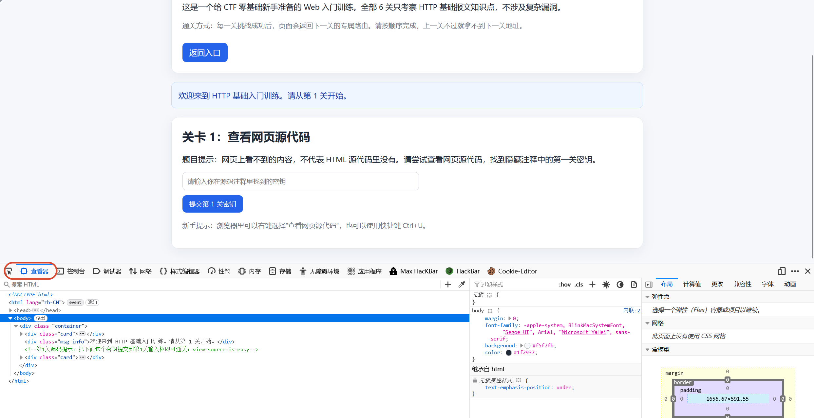

在注释中，看到第一题答案：`view-source-is-easy`

### stage2

第二题要求我们发送PATCH请求，这个我们在上面的请求方法中有提到一句，具体是要修改某个包，那个具体用途实现起来还挺麻烦，我们这里只需要发送一个空的patch包即可

对了，这里务必提前进入正确的路由，如果我们依然在Stage1下面发送PATCH包，那么本题是不可能解决的

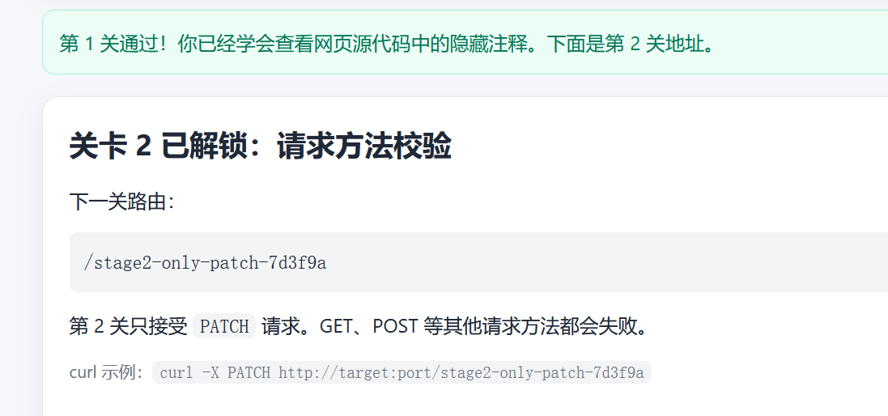

解决方法便是将URL里的`/stage1`替换成`/stage2-only-patch-7d3f9a`，发送一个失败的请求

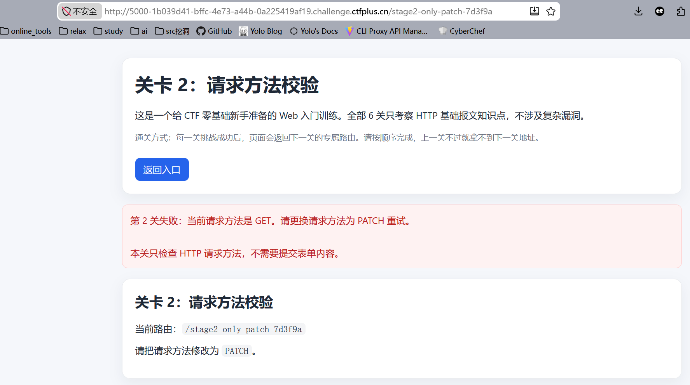

接下来的解决方案有两种，但是本质上都是抓包重放

> way1

浏览器的开发者工具有个网络功能，它会记录当前页面的所有发包记录（注意，需要刷新一次才能看到

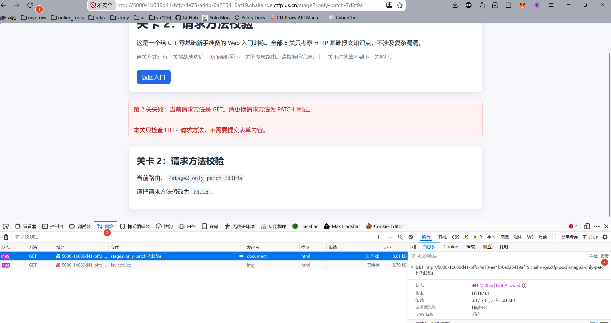

按照我上面标记的序号，这里先刷新看到该路由的完整的记录，然后单击，会看到右侧有该记录的所有信息，点击重发

会看到下图

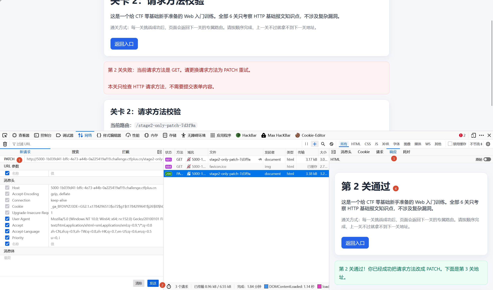

这个时候同样按照序号的顺序，先改请求方法，然后发送，看到中间有个200状态码，单击它，查看右边的响应包，会看到第二关已经通过，获取第三关的挑战信息

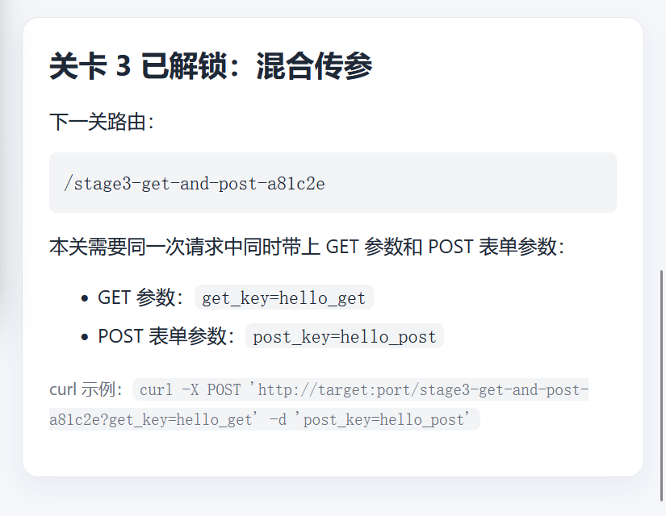

> way2

这里需要进行一次抓包，按照[base tools](https://docs.yo1o.top/study/web/base_tools/#foxyproxy)里讲得那样，将当前的包刷新一下，在Yakit里抓到，右键将它导入`Web Fuzzer`中(ctrl+r也行)，然后将原先的GET请求方式更改为PATCH，发送后会看到第二关成功通过

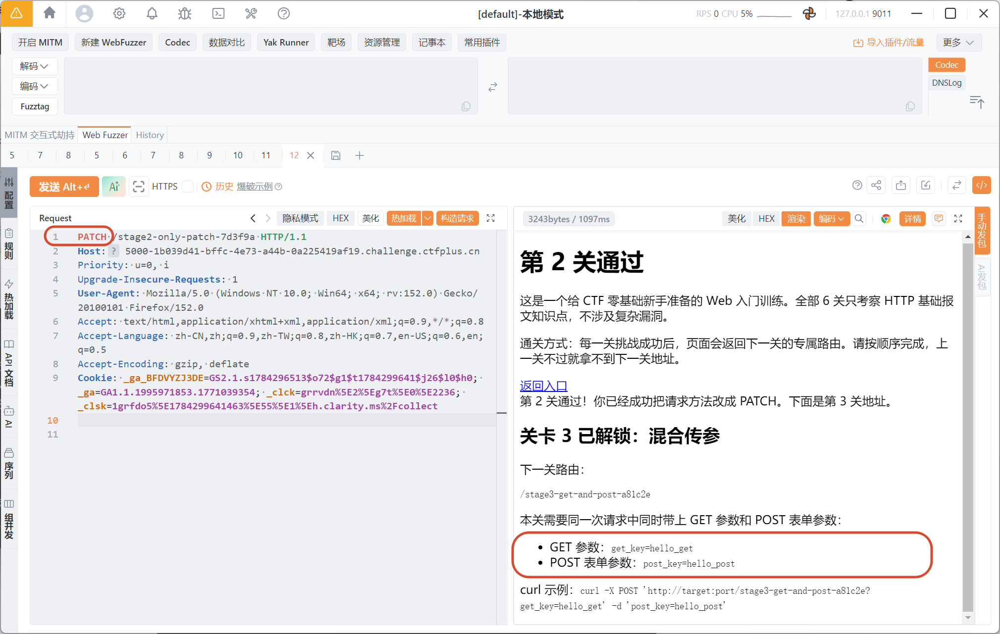

### stage3

这里需要传递一个GET参数和一个POST参数

我会选用常见的两个方法：

> way1

我们使用类似hackbar这样的浏览器插件工具

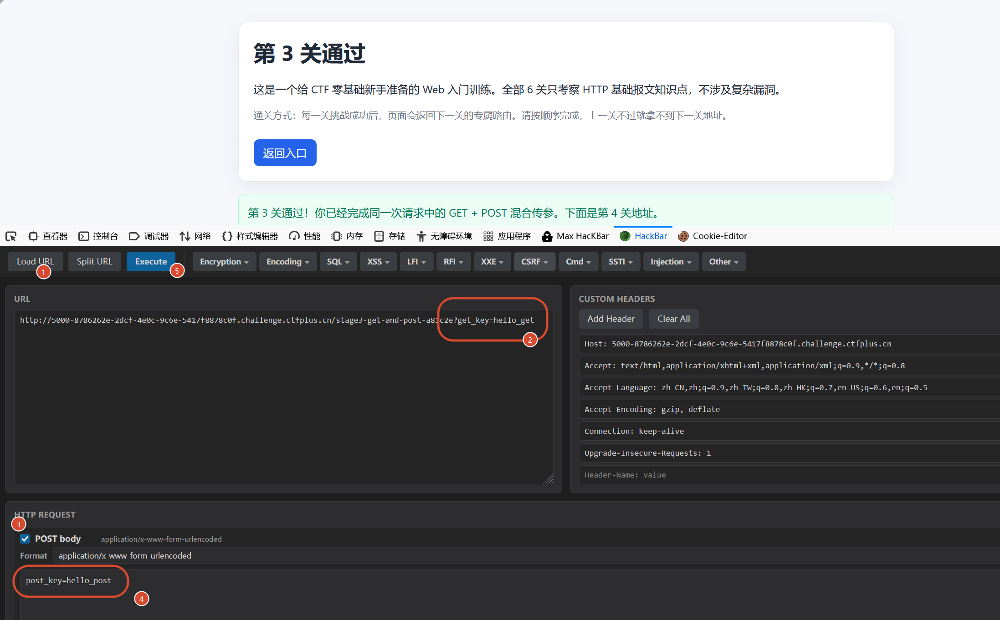

发送请求后，会看到第三关挑战通过

> way2

需要抓包,按照我下面编辑的那样即可

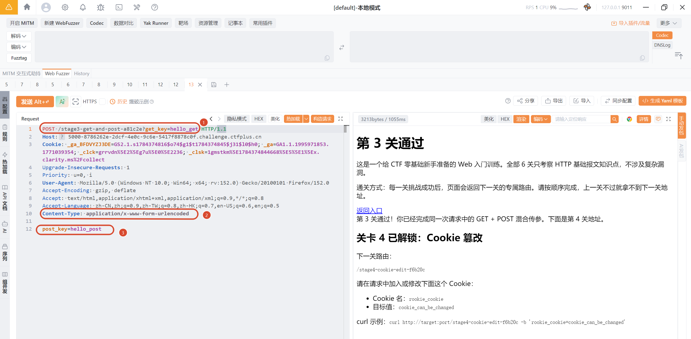

这里需要编辑三处，第一处是head里的请求方法POST，然后添加get请求?get_key=hello_get

第二处是加`Content-Type`，这是因为所有POST请求都要有这个，它会控制POST载荷的类型

常见的有这三种

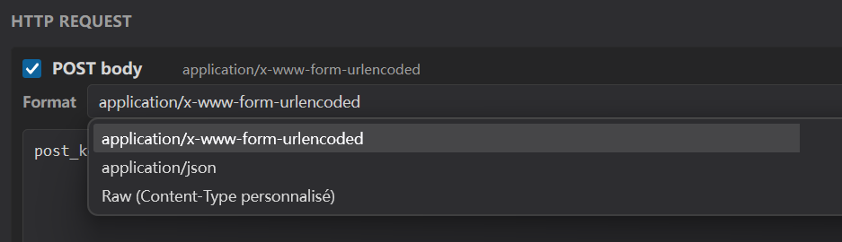

可以看看ai的解读

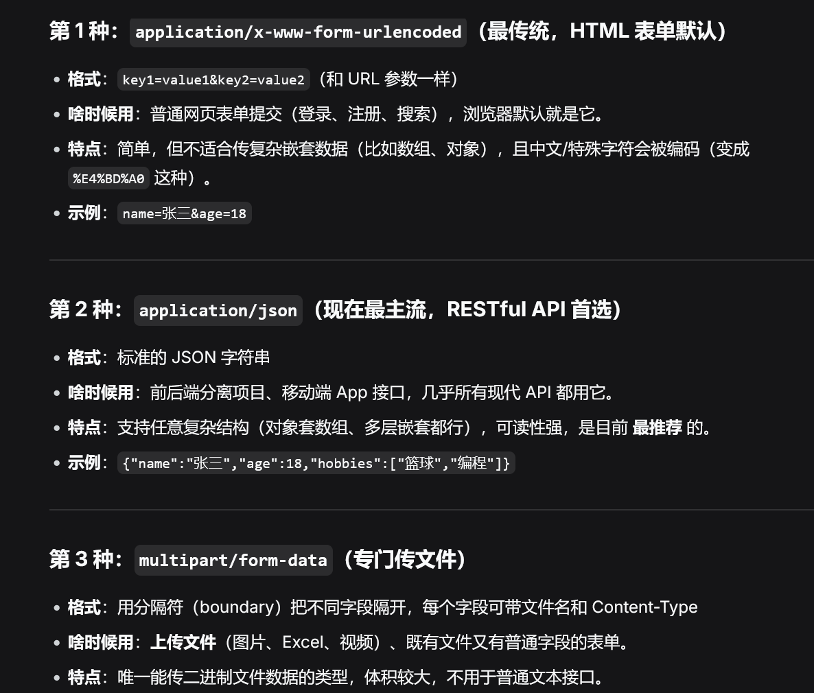

总之，若是想传递普通的键值对，可以直接走第一种，如果是json表单，走第二种，至于传递二进制文件的，具体等后面讲解上传文件的时候再说

### stage4

这里考察伪造cookie，这个是用来记录用户在本地浏览器存储个人凭据的

> way1

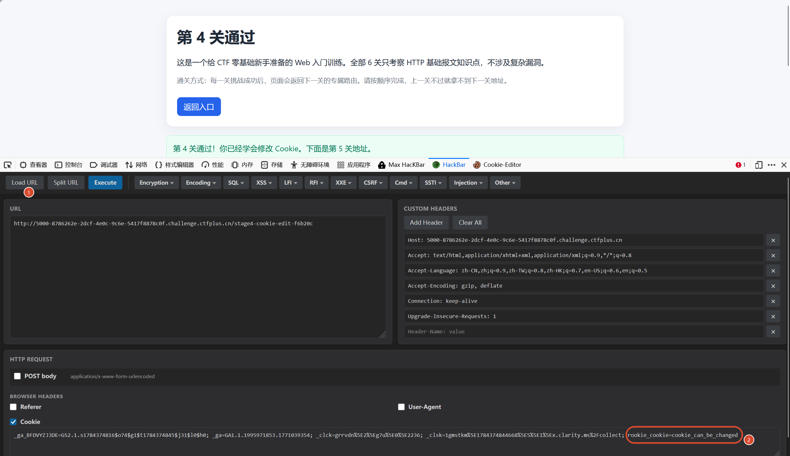

在hackbar中，加载当前url后，在Cookie中添加题目指定的键值对`rookie_cookie=cookie_can_be_changed`，温馨提示，多个cookie同时发送的时候，应该用分号进行分割

> way2

依然是抓包，这个时候我们编辑的应该是请求头

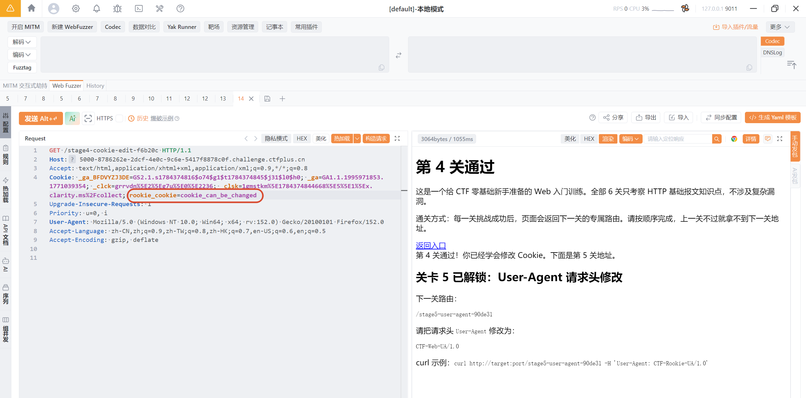

### stage5

修改UA头，下面是hackbar的操作

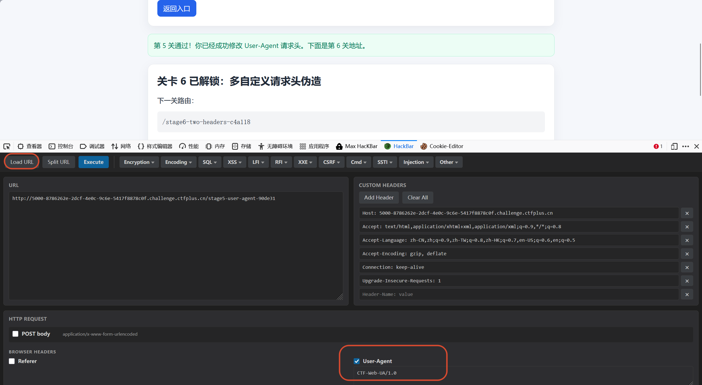

然后这是yakit的样子

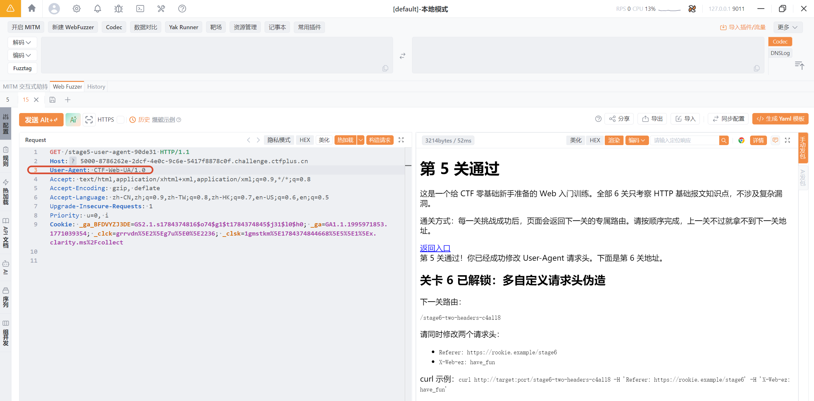

### stage6

这一关是自定义两个请求头，分别是Referer和一个自定义的header

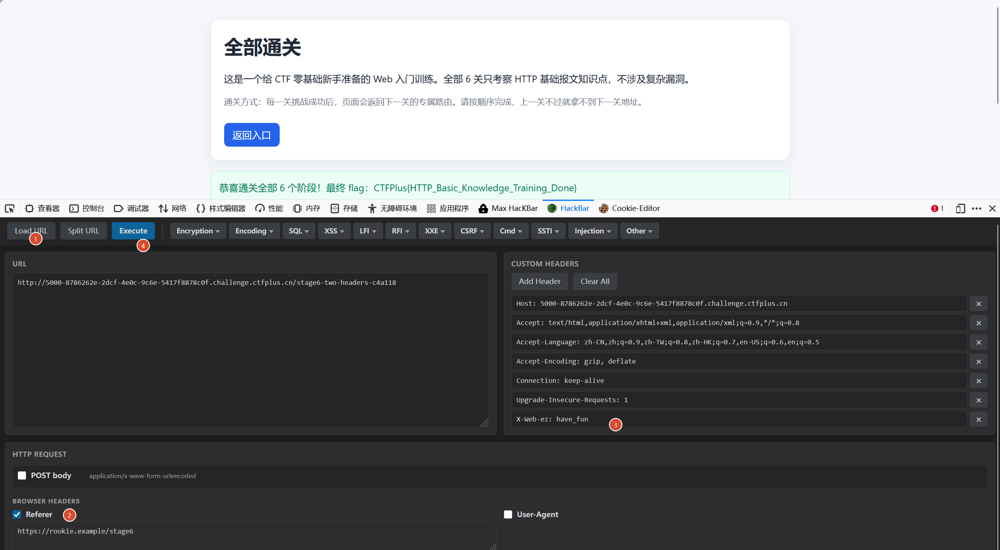

至于yakit的做法，如下：

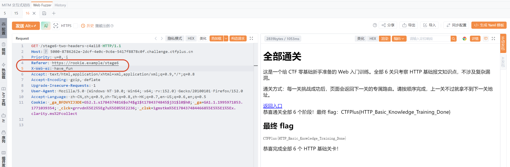

后面几个关卡貌似解法完全一样，大家多做，熟能生巧

基础知识关卡告一段落咯

> 留意我出的题里，会看到部分关卡下面有个使用curl命令的示例，这算是第三种方法，仅仅利用命令行工具就能帮助我们完成发包等操作，但考虑到大家新接触web，这一个方法蛮吃操作的，就不多讲了

