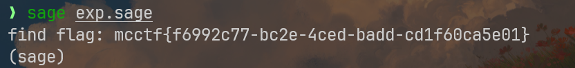
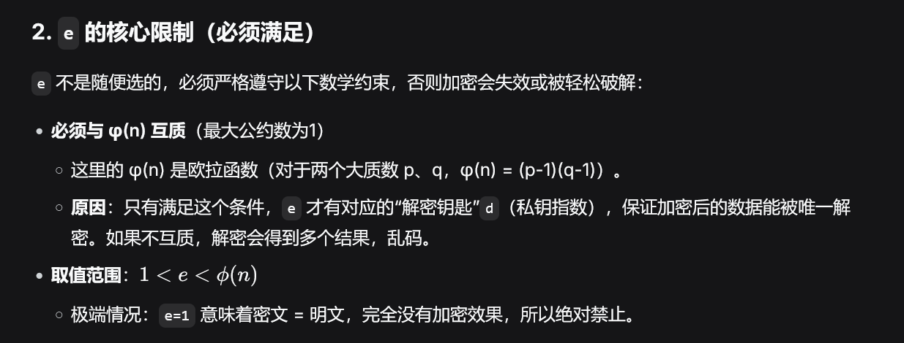
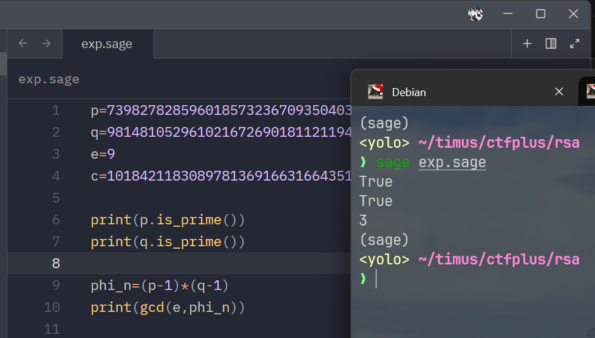

## fix_lattice

题目地址：[CTFPlus](https://www.ctfplus.cn/problem-detail/2072518436314943488/description)

蛮简单的LLL格密码

先看题目核心加密函数语句：

```python
h = [(pow(i, -1, n) * k) % n for i in flag]
```

把它写成数学公式，对于每一个部分 \(i\) （共 3 部分：0, 1, 2），都满足：
$$
h_i \equiv \text{flag}_i^{-1} \cdot k \pmod n
$$
这里的\({flag}_i^{-1}\) 是在模 \(n\) 意义下的乘法逆元。为了去掉这个讨厌的逆元，我们可以在等式两边同时乘以 \({flag}_i\)。因为\({flag}_i^{-1} \cdot \text{flag}_i \equiv 1 \pmod n\)，方程就变成了非常清爽的形式：
$$
h_i \cdot \text{flag}_i \equiv k \pmod n
$$
注意看，等式右边是一个常数 \(k\) ,这意味着 \(h_0 \cdot \text{flag}_0\)、\(h_1 \cdot \text{flag}_1\) 和 \(h_2 \cdot \text{flag}_2\) 在模 \(n\) 之后，得到的结果是完全一样的（都是 \(k\)）

接下来消去未知数\(K\)，既然它们模\(n\)后都等于k，那么它们彼此之间自然就是同余的，我们可以两两配对，得到下面的同余方程组
$$
h_0 \cdot \text{flag}_0 \equiv h_1 \cdot \text{flag}_1 \pmod n
$$

$$
h_0 \cdot \text{flag}_0 \equiv h_2 \cdot \text{flag}_2 \pmod n
$$

现在k彻底消失了，我们的未知数只剩下 \({flag}_0\), \({flag}_1\), \({flag}_2\)

若想将密码学问题转换成格问题，不能停留在带有(\(\mod n\))的同余式上，必须将它转换成等式问题

在数学中，\(A \equiv B \pmod n\) 的真实含义是：**A 减去 B 的结果，一定是 n 的整数倍**

换句话说，\(A - B = y \cdot n\)（这里的 \(y\) 是某个我们不知道的整数）

按照这个原理，我们将上面整理出来的同余式方程组移项处理，可以写成：
$$
h_0 \cdot \text{flag}_0 - h_1 \cdot \text{flag}_1 + y_1 \cdot n = 0
$$

$$
h_0 \cdot \text{flag}_0 - h_2 \cdot \text{flag}_2 + y_2 \cdot n = 0
$$

现在我们已经有一组线性方程，可以利用矩阵乘法来表达这组方程

首先我们定义一个未知数向量：
$$
v = (\text{flag}_0, \text{flag}_1, \text{flag}_2, y_1, y_2)
$$
需要设计一个矩阵\(M\)，当我们用这个向量 \(v\) 去乘矩阵 \(M\) 时，结果向量的后几维正好就是上面那两个等于 \(0\) 的方程

毕竟要弄一个五阶的乘法，我设计了一个这样的矩阵
$$
M = \begin{pmatrix} 1 & 0 & 0 & h_0 & h_0 \\ 0 & 1 & 0 & -h_1 & 0 \\ 0 & 0 & 1 & 0 & -h_2 \\ 0 & 0 & 0 & n & 0 \\ 0 & 0 & 0 & 0 & n \end{pmatrix}
$$
当我们进行向量与矩阵的乘法时，可以看看这些结果向量：

- **结果的第一维**（\(v\) 乘第一列）：\(\text{flag}_0 \cdot 1 + 0 + 0 + 0 + 0 = \text{flag}_0\)

- **结果的第二维**（\(v\) 乘第二列）：\(0 + \text{flag}_1 \cdot 1 + 0 + 0 + 0 = \text{flag}_1\)

- **结果的第三维**（\(v\) 乘第三列）：\(0 + 0 + \text{flag}_2 \cdot 1 + 0 + 0 = \text{flag}_2\)

- **结果的第四维**（\(v\) 乘第四列）：\(\text{flag}_0 \cdot h_0 - \text{flag}_1 \cdot h_1 + y_1 \cdot n\)

- **结果的第五维**（\(v\) 乘第五列）：\(\text{flag}_0 \cdot h_0 - \text{flag}_2 \cdot h_2 + y_2 \cdot n\)

仔细观察我构造的最后两维结果向量，它们恰好是线性方程组的式子，两个结果都为0，那么完整的结果向量是：
$$
v_{\text{target}} = (\text{flag}_0, \text{flag}_1, \text{flag}_2, 0, 0)
$$
这种情况下，特别适合LLL格算法求解，在格的概念里，矩阵\(M\)的每一行都是一个基向量，向量\(v \cdot M \)的意思就是用这5格基向量进行线性组合，然后我们在上面的证明中证明出存在一种特殊的组合方式，组合出来的向量是我们需要的三个flag碎片

这个目标向量有个致命的弱点，它非常短

- 矩阵\(M\)里包含了\(h_i\)和\(n\)，它们都是1024bit的天文数字
- 目标向量的前三维是flag的片段碎片，大小大约在112bit，最后两维甚至为0

LLL算法的作用便是在一个由大数字构成的格基矩阵中，自动帮我寻找那些最短的非零向量，emm，我上面构造的目标向量相对常规向量来说，已经非常非常短了，那么用LLL算法可以大概率找到这个超短向量，让我恢复flag

```python
from Crypto.Util.number import long_to_bytes

n = 100625514150727247032420516116608856782487111813791698520982666115724806950764839038623903018290987706283594450486952973094156081738298007004092606555072753336594045280706774316982358415939931716013574261131363522039141792428045731639273462224484828454170375113702051304517249977971915922515103016871972769159
h = [39094183719332262752776148615292951047609898416142670039317205633353461223733147092166268805994986801122373488896929929689451733708052131511163677040934486246614470019158587148956433381734422163890736223070577661447374082786727121427069851650597931588706632941933135206949306788864089171172598516993637247931, 60642089837612000729798247132178468305849159740999280411656339899227980688939908236510112612446368554255085014095883554835088975680261692094049596345816682645688604795801465223278179476642719379260602833971811959842051031718264030857496939591893197249796082912523056887546448134655580499085561499731236136167, 93461521747517324792768844336210834830763727731412777982471601029287634861405725941431296513980342490683940494024121354570563681548820184532413059541133518201685443658430354710680833027244564477516097328511289192963875809305573776158858840474210061568009523203392289270940755315080174936170824750296041072141]

M = Matrix(ZZ, 5, 5)

M[0, 0] = 1; M[0, 3] = h[0]; M[0, 4] = h[0]
M[1, 1] = 1; M[1, 3] = -h[1]
M[2, 2] = 1; M[2, 4] = -h[2]
M[3, 3] = n
M[4, 4] = n

L = M.LLL()

for row in L:
    f0 = abs(row[0])
    f1 = abs(row[1])
    f2 = abs(row[2])

    try:
        flag_part0 = long_to_bytes(int(f0))
        flag_part1 = long_to_bytes(int(f1))
        flag_part2 = long_to_bytes(int(f2))

        full_flag = flag_part0 + flag_part1 + flag_part2
        if b'mcctf' in full_flag:
            print("find flag:", full_flag.decode())
            break
    except:
        continue
```

注意，请在sage环境下运行




## 玉兰花

属于一个加了点料的RSA，通过附件可以获取以下信息：

```python
p=7398278285960185732367093504035374282789863157229899409826810424462879720498244187941100105638365111628387065570034455918760206815351996708001482354860709
q=9814810529610216726901811211949128983833818855006314297622508915137991818756606204626077430150492859569301029217291646100798982856076428292971928950676749
e=9
c=10184211830897813691663166435101341937224483570306521509642450426140816826261596577984298276858389754546710488363035073561814899586145575191769107755478443141639932911810895434077806005865629168625351746259614258856809926570726816265979973410484832806876507473367360098488886929118476047013700248785640713156

```

按照原流程，我们可以直接计算私钥d，并解密c获取m，但是本题经过检查后，会发现\(gcd(e,\phi(n))=3\)

这个条件会导致常规求解失败，看看`deepseek`讲解的公钥指数e的要求



然后请看我在sage里跑的结果



本题中的\(gcd(e,\phi(n))=3\)

与RSA加密要求违背，因此本题需要按照e不互素的解决思路处理

---

target：从\(c \equiv m^9(\mod n)   \)恢复m

step1: 先降到立方

因为\(gcd(9,\phi)=3\)，可以用扩展欧几里得找到一个x，使得\(9x \equiv 3(\mod \phi)  \)

于是有：\(c^x \equiv m^{9x} \equiv m^3 (\mod n)  \)

记 \(m_x=c^x \mod n    \)  则 \(m_x \equiv m^3 (\mod n)  \)且\({m_x}^3 \equiv c (\mod n)\)

step2: 对\(m_x\)开立方根

开立方根的时候，我需要分别在mod  p和mod q上开立方，存在多个根，然后利用CRT进行合并

> 如果直接在模n下开立方，没有简单公式，但是在素数域下有

