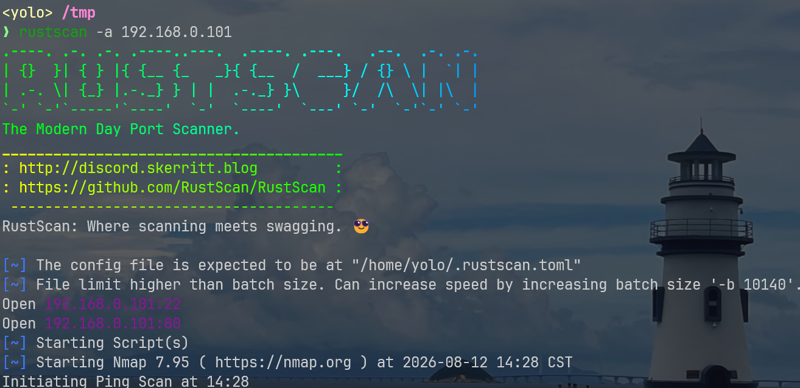
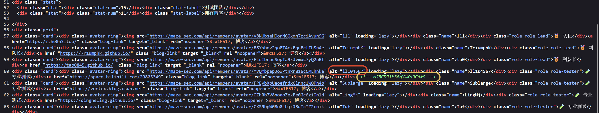
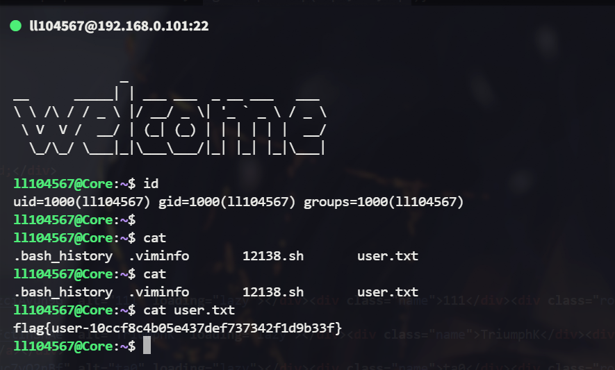
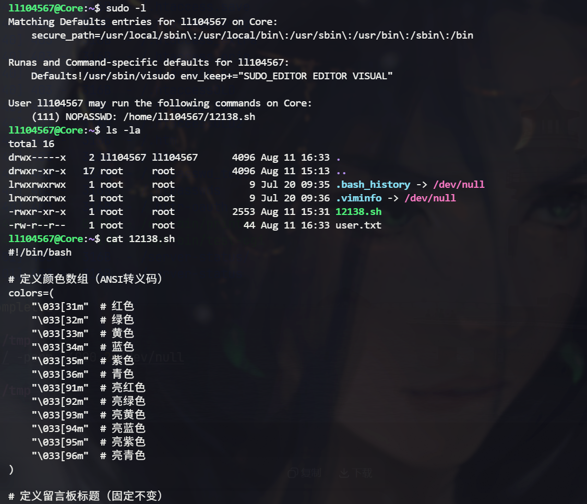
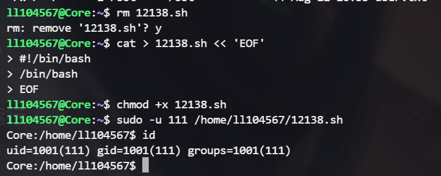
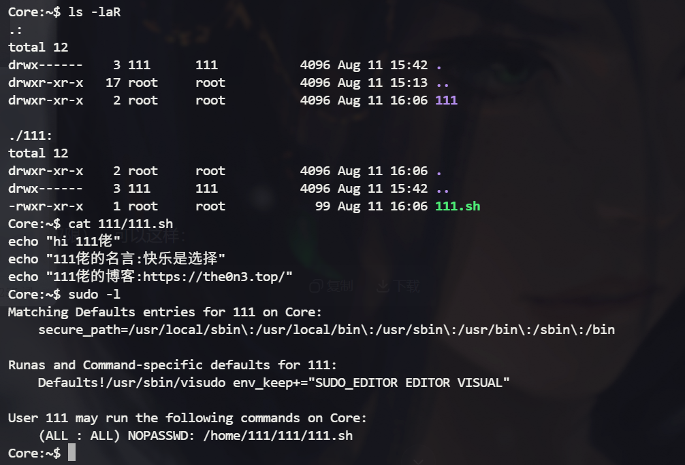
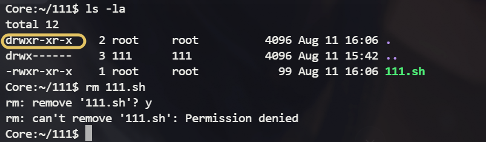
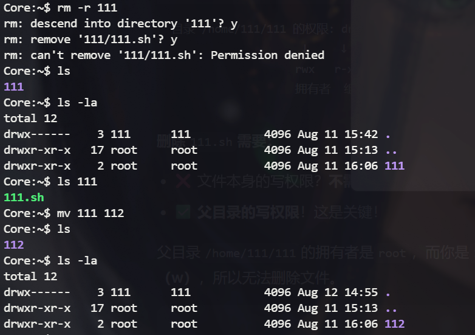
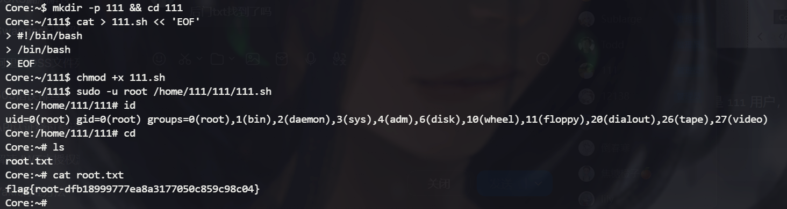

## 信息搜集

> 端口扫描



发现只有22和80端口

> 80 web

查看源码，在老大标签附近看到注释，大概率是ssh登录凭据



`ll104567:WJBCDJ1k36gYWKs9GjkS` 

## get ll104567 shell



## get 111 shell

进行常规的提权信息搜集，发现当前用户能用111的身份无密码执行sh文件



脚本的逻辑简单，是个留言板随机输出的sh文件，仔细留意这个家目录的权限配置，当前用户确实无法编辑12138.sh文件，但是他可以删除该文件，在Linux中，删除文件(夹)的权限取决于父目录的写权限，而不是文件(夹)自身的写权限，即使它属于root，我也能删

那么我删除后再改个同名的sh劫持脚本，就能拿到111的shell



## get root shell

提权路线和水平移动到111用户的方法几乎一样



在`/home/111/111/`下，我们无法直接删除sh文件，这是因为第四级路径是root创建的



但是我们返回`/home/111`后，可以直接将root创建的111文件夹更改名字，然后重新创建111同名文件夹并创建对应的劫持shell脚本

> 这里无法直接删除111文件夹是有依据的，我上面有说过，删除文件或文件夹看的并不是文件(夹)本身的写权限，而是父目录的写权限，111.sh的父目录是/home/111/111，这是root创建的，我自然动不了它，但是当我想动那个三级路径下的111文件夹，是可以的，它的父目录对于111来说有写权限，但是！无法删除，每次删除文件夹都会向下遍历所有文件并检测其父目录写权限，这就是为啥我想直接删除文件夹失败但是更改名字成功的原因
>
> 

接下来按部就班，创建文件夹和sh脚本->无密码sudo执行->读取flag

```bash
mkdir -p 111 && cd 111
cat > 111.sh << 'EOF'
> #!/bin/bash
> /bin/bash
> EOF
chmod +x 111.sh
sudo -u root /home/111/111/111.sh
cat /root/root.txt
```


