## collect information

> 端口扫描

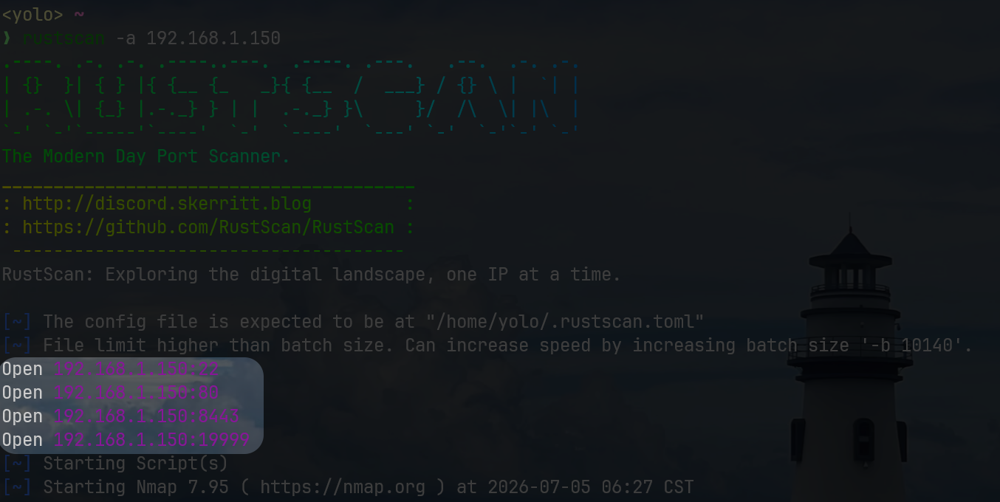

共开放四种端口：22，80，8443，19999

> 80

某个公司的介绍UI，是Apache架构

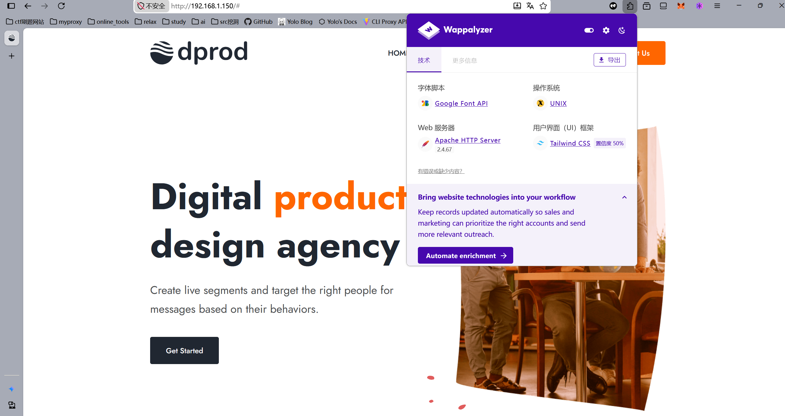

路径扫描后只知道这里存在`/assets/`文件夹供我浏览文件列表

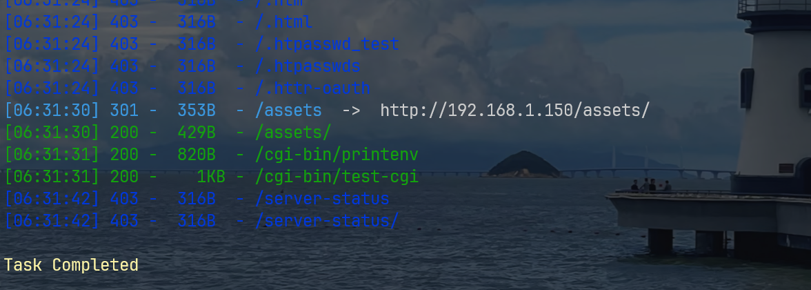

我挨个看过了，几乎都没有什么用，暂且搁置这里

> 8443

这里的8443看上去是一个python-web的api服务网站

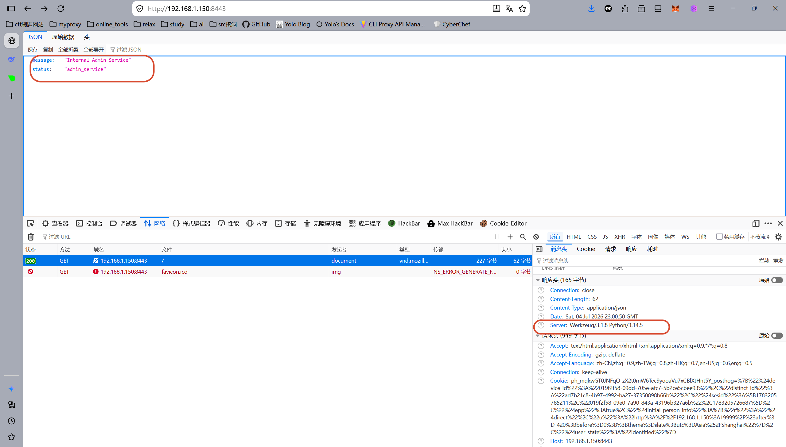

多尝试了几次，发现有个路由/api/health,但是这里还需要我去登录,暂时什么也不知道，也搁置了

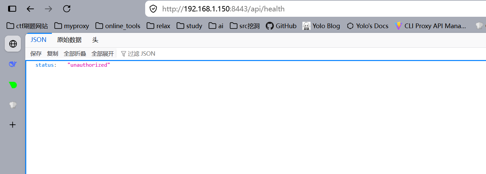

> 19999

这里是Netdata服务，我检查了下版本号，是`netdata_1.47.5`,版本偏老，感觉存在版本cve?

上网搜索了一会儿，只找到一个关于XSS的CVE-2025-71385，这几乎没有用

Netdata自带api服务，我找了下文档，看到几个有点意思的endpoint

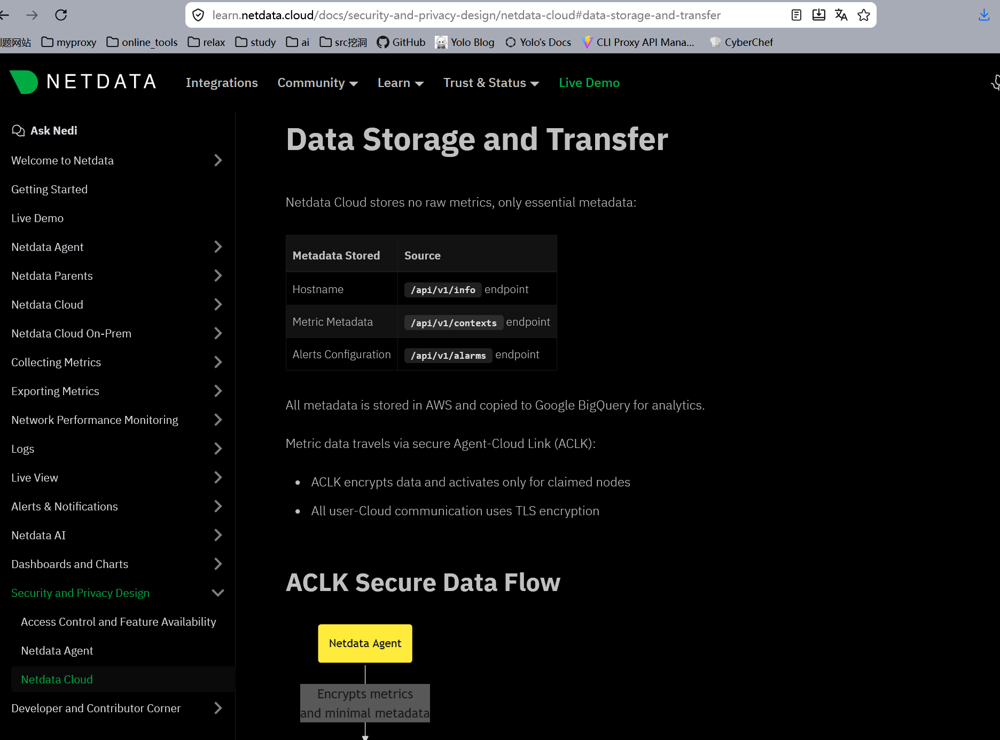

在`/api/v1/info`里，我能看到一些不需要鉴权的信息，发现了三处重要的键值对

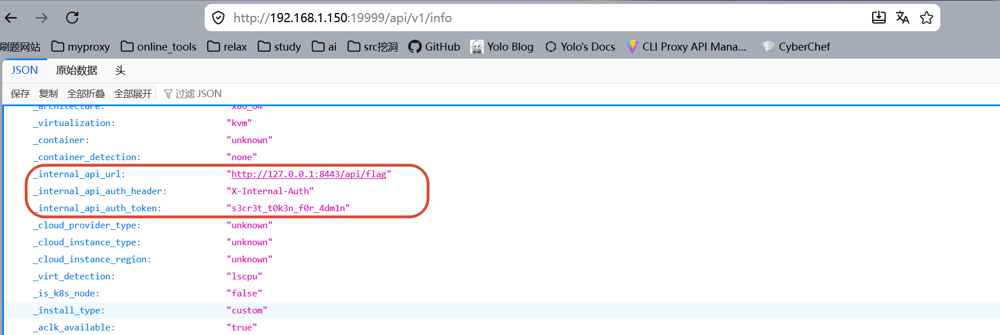

## get user shell

获取到了8443那个api服务的登录方式和口令，先去`/api/health`测试下

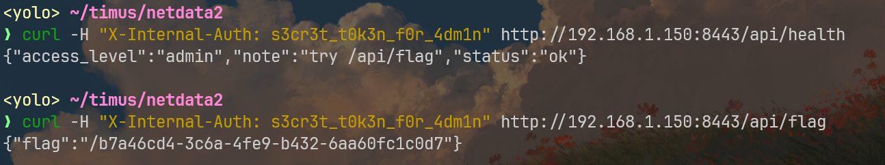

认证成功了，在`/api/flag`的输出中，我看到的那个json键值应该是一个url路径？考虑到80那边我还暂时搁置了，那就试试这个路径

成功获取一份ssh登录的私钥

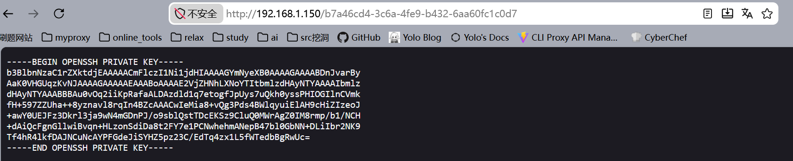

既然都到这里了，靶机里应该是有用户将这个私钥对应的公钥存储在了authorized_keys里了吧，不然这份私钥有点点用不了

对了，这份私钥有加密，我们需要处理下

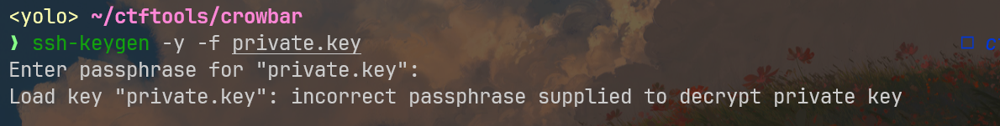

这类爆破题，用john会很舒服

首先，我需要用ssh2john提取`private.key`里的hash值

这是我用的ssh2john.py的仓库地址：https://github.com/openwall/john/blob/bleeding-jumbo/run/ssh2john.py

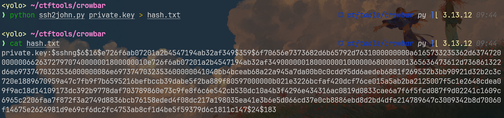

然后我们可以先用john检测生成的哈希可不可读

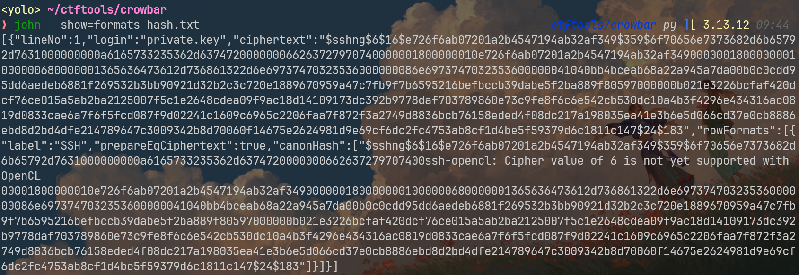

如果结果如上图，那就识别成功，直接爆破

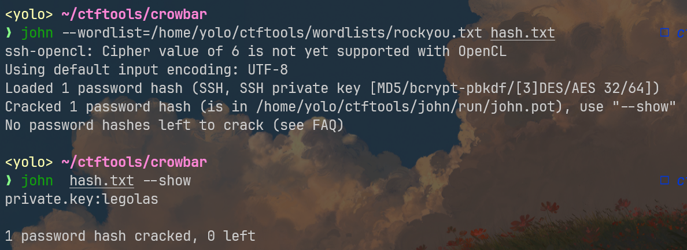

我用`rockyou`爆的，得到私钥密码`legolas`

用`ssh-keygen`解密一次，就拿到了一份公钥,理论上，只要靶机某个用户下正确配置存储下面的公钥，我就能利用私钥连接上去

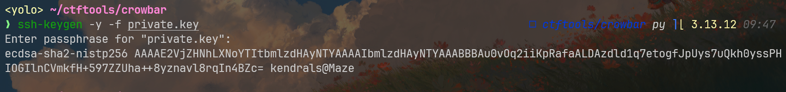

但是我并不清楚具体用户名，打算先用上面公钥里的用户名`kendrals`测试，如果失败，再换用`hydra+rockyou`进行爆破

登录成功

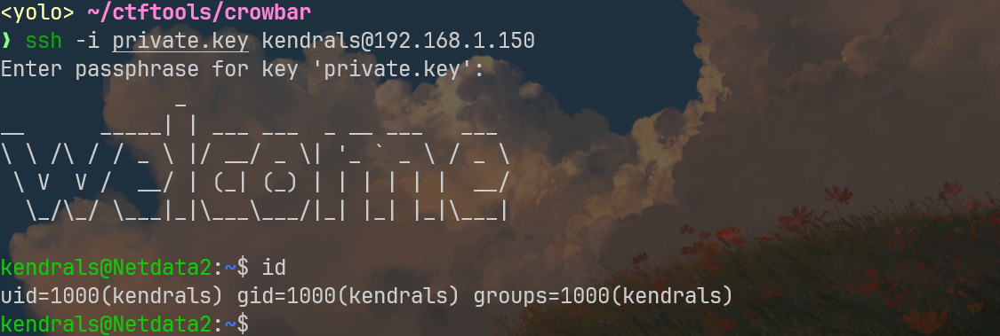

## Horizontal Escalation

看过家目录，还有一个用户`devops`，需要想办法从`kendrals`平移过去

这次我先看的是进程，抓了一些，发现这里存在root提权的线索

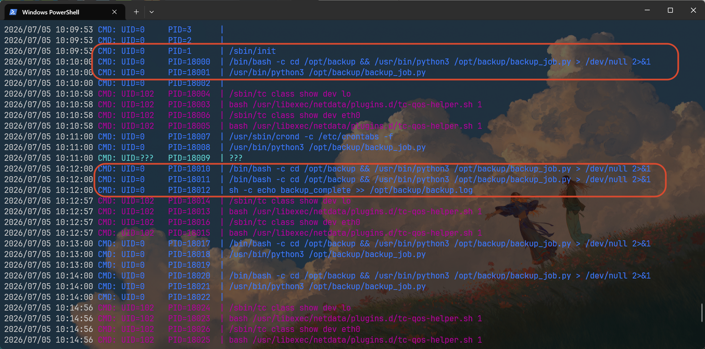

看得出来，root那边应该有定时任务，然后它会定时执行`/opt/backup/backup_job.py`脚本文件

接下来直接去看这个python文件，一旦出现文件权限问题，我们再想办法平移到`devops`上

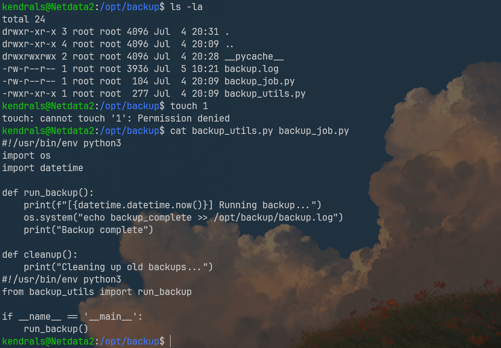

/opt下的文件都属于root，backup的脚本结构很简单，不断执行打印文本到log文件中的操作

我已经测试过了，当前用户无法在`/opt/backup`下创建文件，不然我就可以劫持python库了，看样子得切换账号，利用devops上的特权才行

但是我信息基本上搜集完了，无法提权上去，水平提权失败！

## Vertical Escalation

回到/opt/backup下再仔细检查

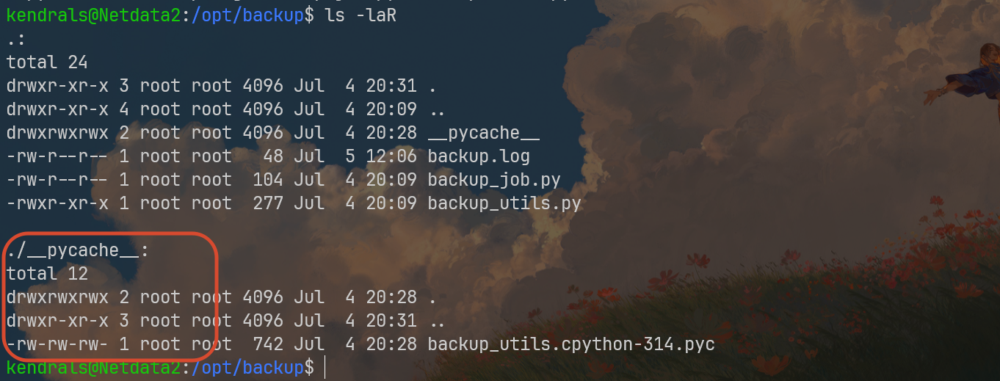

这里的python字节码缓存路径居然是777，任意用户都可以写，那么本次靶机考察的就是`.pyc`劫持：python文件在运行的时候，如果在`__pycache__`下面存在对应的缓存字节码，python会认为对应的`.pyc`缓存有效，转而直接去加载`.pyc`文件，只要我们将带有恶意py语句的字节码保存进去，就能劫持root的定时任务，进行提权

在家路径下写evil.py（/tmp下有nosuid特权，搞提权的时候，还是尽量别在/tmp下进行

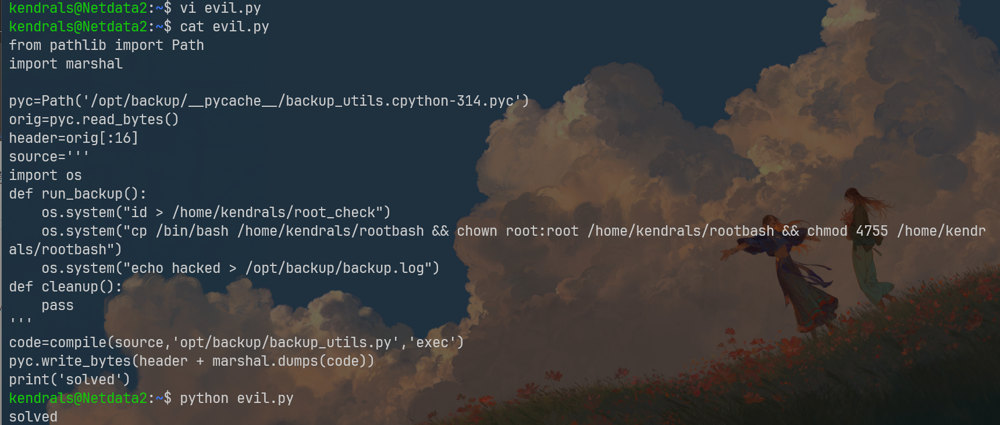

```python
from pathlib import Path
import marshal

pyc=Path('/opt/backup/__pycache__/backup_utils.cpython-314.pyc')
orig=pyc.read_bytes()
header=orig[:16]
source='''
import os
def run_backup():
    os.system("id > /home/kendrals/root_check")
    os.system("cp /bin/bash /home/kendrals/rootbash && chown root:root /home/kendrals/rootbash && chmod 4755 /home/kendrals/rootbash")
    os.system("echo hacked > /opt/backup/backup.log")
def cleanup():
    pass
'''
code=compile(source,'opt/backup/backup_utils.py','exec')
pyc.write_bytes(header + marshal.dumps(code))
print('solved')
```

等待一会儿，会看到当前路径有rootcheck和rootbash文件,直接`rootbash -p`提权成功

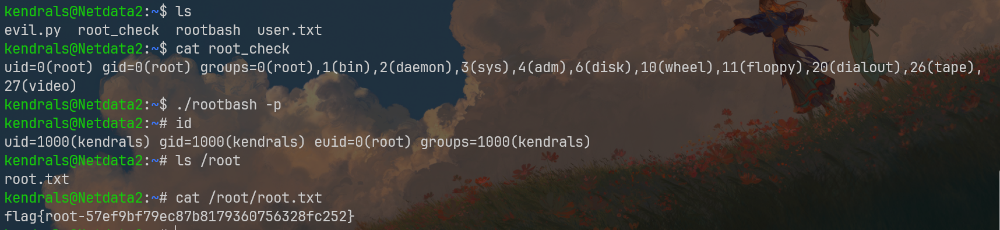
