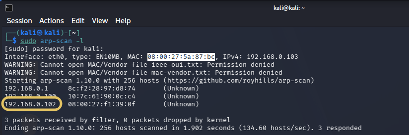
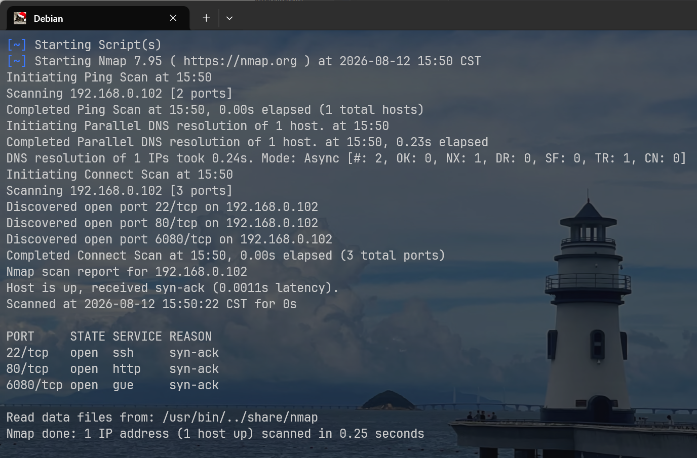
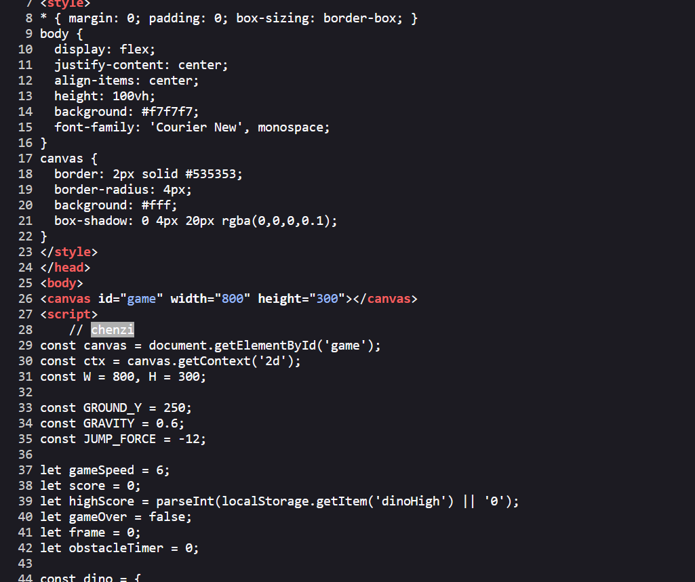
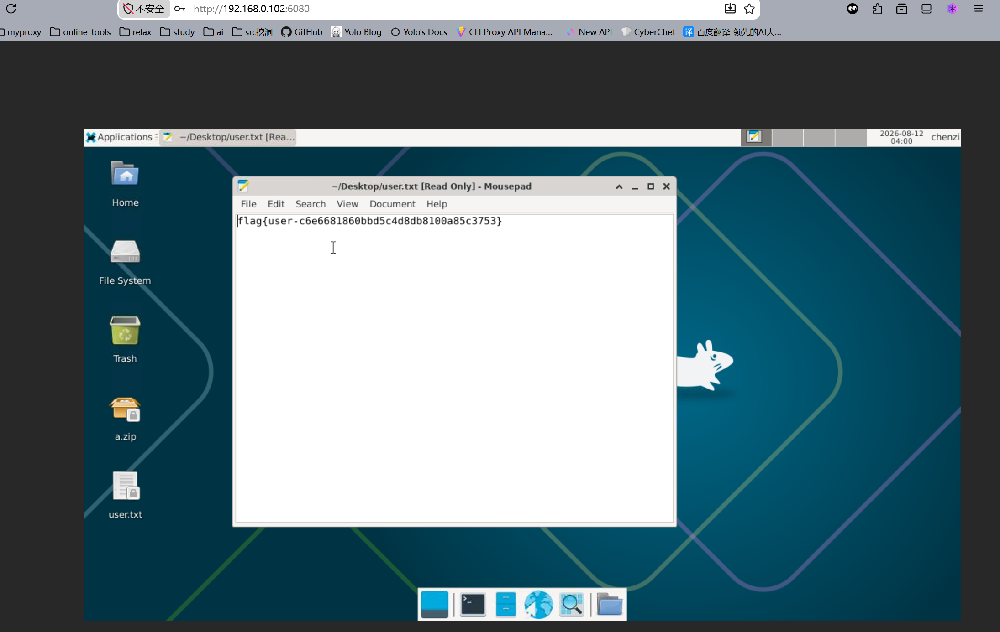
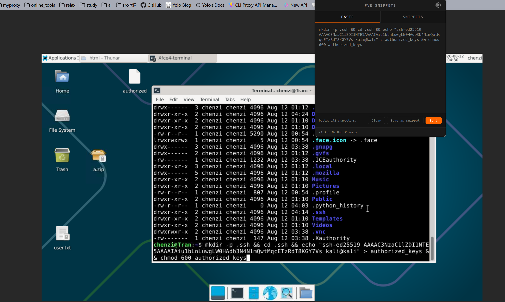
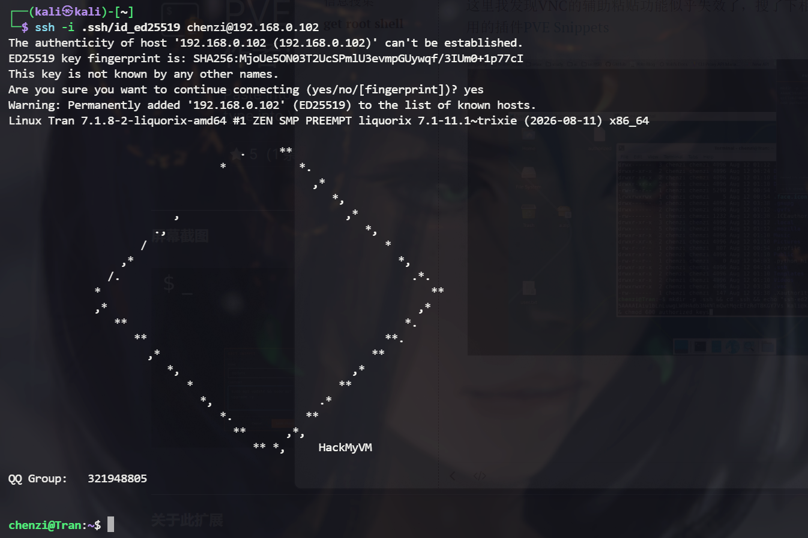
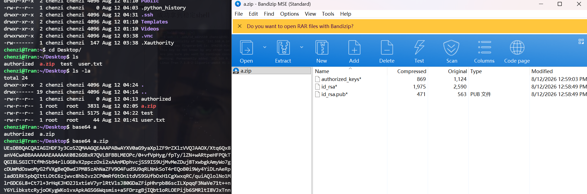
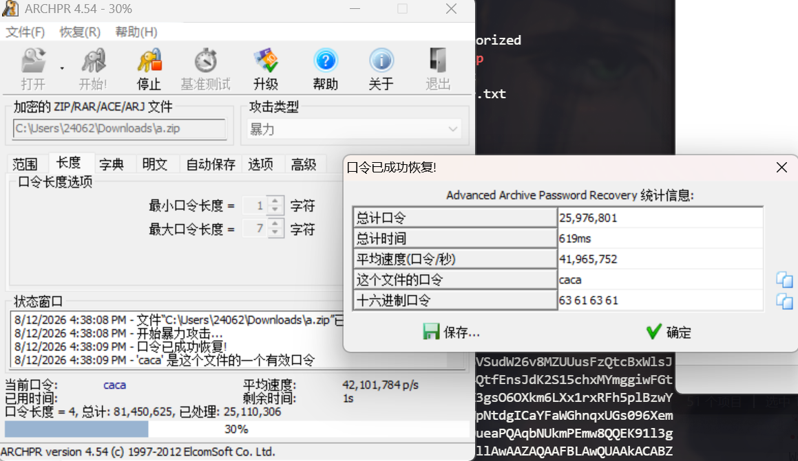
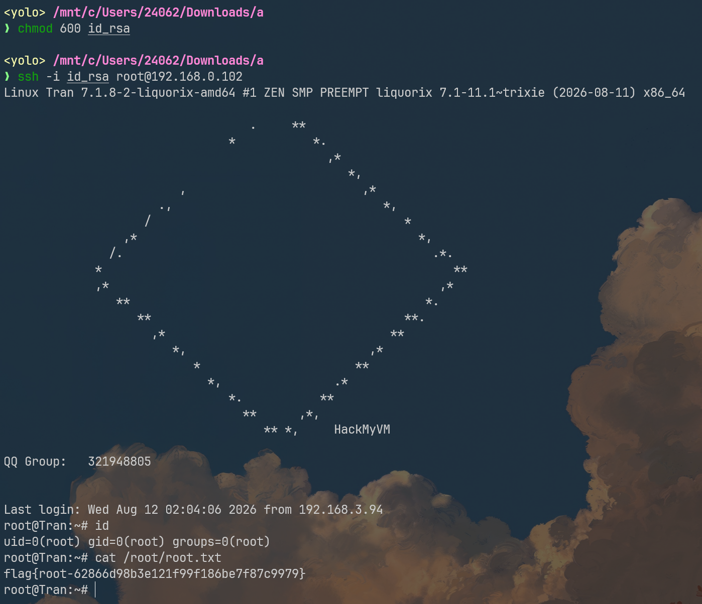

## 信息搜集

> 锁定IP

本次靶机有一点点特殊，需要我们自行检测靶机IP地址

我常用的方法是再开启一个配有相同网卡设置的kali虚拟机，在里面执行`sudo arp-scan -l`

很好辨认的,由于我的kali和靶机是相同网关配置，它们的mac指纹一定是一样的，我们能直接锁定本次靶机的IP地址：`192.168.0.102`



> 端口扫描

```bash
rustscan -a 192.168.0.102
```



存活22、80、6080三端口

> 80

是一款JS跳一跳小游戏，查看源代码，发现注释`chenzi`，大概率是某个地方的密码



路径爆破等操作都完成过，没有找到其它线索

> 6080

这是noVNC服务，登录密码恰好是在80端的注释中看到的chenzi，直接获取user shell



## get root shell

在novnc上交互很不方便，我把ssh公钥写上去，本地连接

```bash
mkdir -p .ssh && cd .ssh && echo "ssh-ed25519 AAAAC3NzaC1lZDI1NTE5AAAAIAiu1bLnLuwgLW0HAdb3N4NlmQwtMqcETzRdT8KGY7Vs kali@kali" > authorized_keys && chmod 600 authorized_keys
```

这里我发现VNC的辅助粘贴功能似乎失效了，搜了下相关解决措施，找到挺好用的插件[PVE Snippets](https://addons.mozilla.org/zh-CN/firefox/addon/pve-snippets/)



成功拿到稳定shell



这个时候下载a.zip特别方便，我看这里的压缩包不大，选择通过base64编码压缩包，复制出来后解码



这里应该是root的公私钥，毕竟当前chenzi用户已经被我们拿下，靶机上再没有其它家用户了

随意找了一个弱密码爆破工具



爆破密码caca

解密后给id_rsa加个权限就能直接本地连接root了


