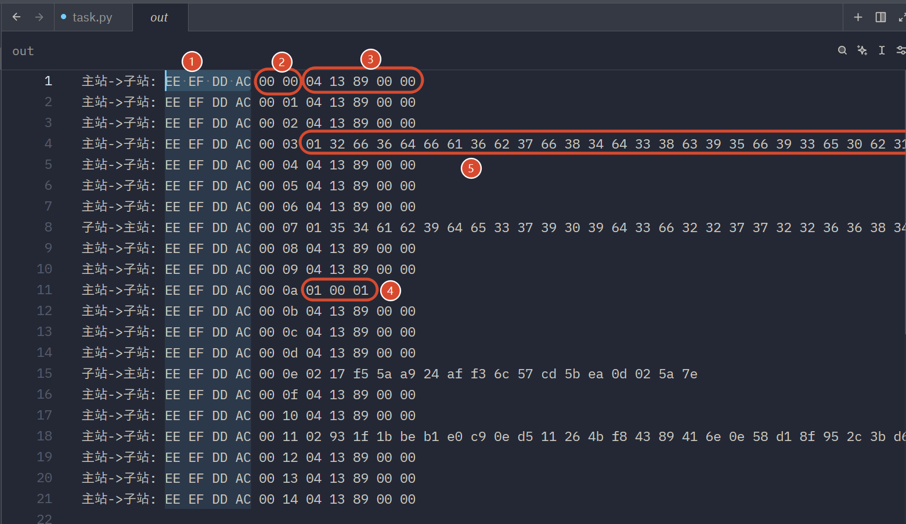
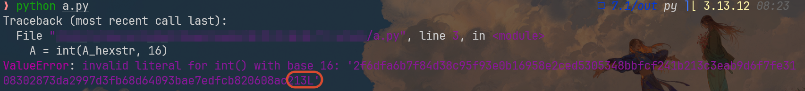
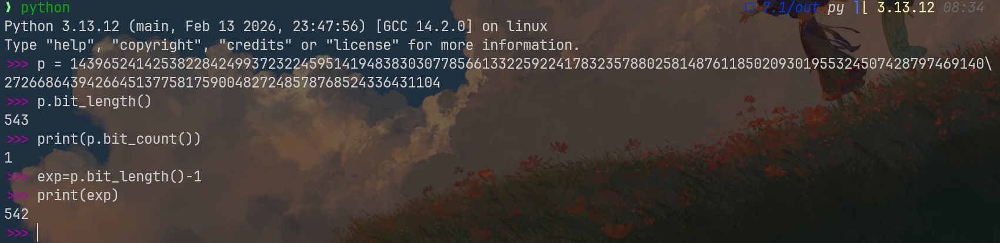
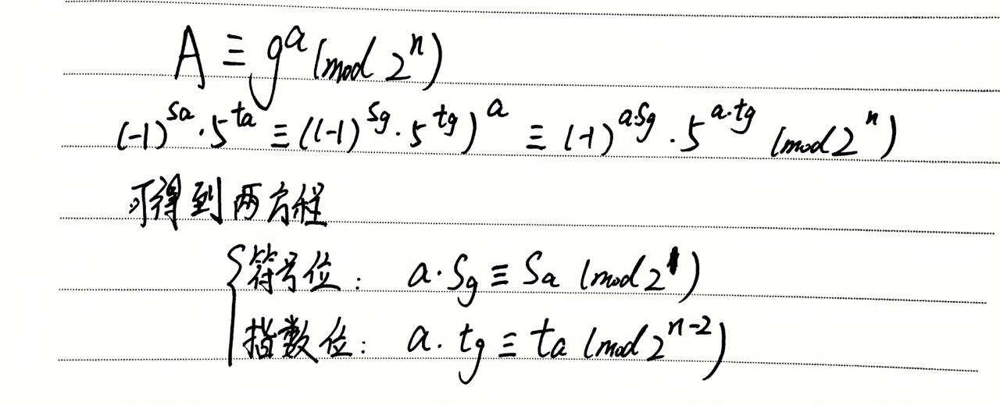
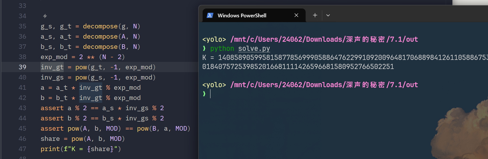
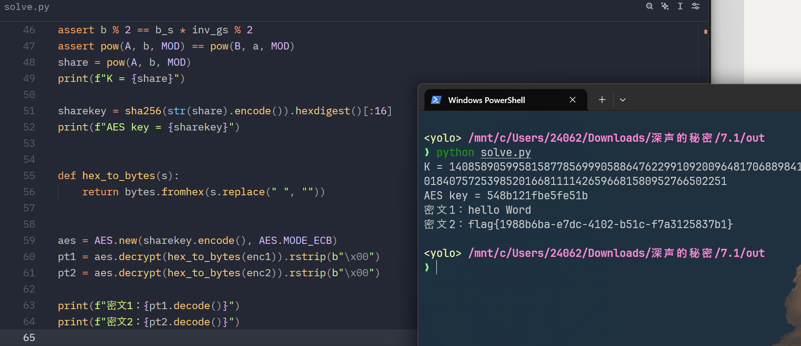

好像是某个公司内部的密码题，感觉挺基础的，而且场景也比较真实，就拿来充实到博客里，我先逐个知识点详细讲解

> 本题附件我有，如果想做的话，可以[邮箱](mailto:2406213396@qq.com)联系

## Diffie-Hellman

简称DH密钥交换，解决了如何在公开信道上安全地交换密钥的问题

这类算法会先给两个公开参数：g(生成元),p(大素数)

流程如下：

Alice这边生成一个私钥a，借助公式`pow(g,a,p)`生成一份公钥A

Bob同样生成一个私钥b，借助公式`pow(g,b,p)`生成公钥B

这个时候，双方将自己的公钥互相发给对方，可以直接公开的那种

Alice计算：`K=pow(B,a,p)`，将B再拆成`pow(g,b,p)`，就能得到K，实际上是`pow(g,a*b,p)`

Bob这边同理，这个时候，双方拿到了相同的共享密钥K

为啥我说第三方很难拿到这个K呢？在整个流程中，第三方能获取到的数值有`g,p,A,B`

能难住攻击者的安全性依赖便是离散对数难题，攻击者明确知道`A=pow(g,a,p)`但是他们很难反推出a，毕竟p是一个大素数，且涉及离散函数细节，所以说啊，就算攻击者同时获取到了A,B，也无法算出`pow(g,a*b,p)`中的a*b，我下面画个图吧，以供理解


至于这里的K加密密钥具体怎么用，还需要看题目要设计什么样的加密算法才行

## AES-ECB

首先讲解下AES，它隶属于分组密码，就是将明文信息分组成等长块，循环进行一系列加密变换：S盒变换、行移位、列混淆、轮密钥加(最后一次的时候就没有列混淆了)

有几个要点，就是AES分组大小是128bit，换算成字节就是16字节，支持的密钥标准是128位、192位、256位，它们分别代表循环10次、12次、14次

这里的一系列加密变换考察频率应该不大，最多魔改下s盒吧，为省篇幅，我就先跳过了，解题可以直接知道方法即可

再说说ECB，这是AES中的一个分组方式：明文分成固定的块，每个块分别进行加密，可以并行

> 扩展，除了ECB电子密码本模式，还有CBC密码分组链接模式，CFB密文反馈模式

## how to solve

我前面说过，本题蛮真实的，看那份日志记录，会发现这里甚至存在心跳包



标记1代表的是魔数，这是每个加密请求流都有的，简单来说就是在大量信息交互中，筛选出特定的流量参与后续的加解密

标记2则是顺序索引，这里就从`00 00`一直递增到了`00 14`

标记3就是心跳包的特征，我感觉猜也能猜出来，像标记5那样长的才算是加密包吧，其它心跳包都是04 13 89 00 00，这里有个细节需要注意，我是在尝试解密的过程中发现的，第一个字节是操作码的意思，整理了下，本题一共有三个操作码：04代表心跳保活，全部丢掉；01代表这是明文帧；02代表这是AES密文

标记4就是我上面说的明文帧，但是它并没有内容，它的含义仅仅是发送给密文加密方，接收方已经解密获取到了加密私钥K了，就把它当作标志吧，有了它，后续的密文传输才能正常进行，它的位置也很合理啊，恰好是发送了两个长串信息，结合我在DH里讲的，肯定是Alice和Bob的公钥

标记5就是第一个公钥，这里走的是十六进制流，我们都知道公钥私钥那些都应该是一个大整数，所以说这里应该先把对应的ASCII转十六进制，然后再转整数,注意，操作码01并不参与加密，后面的密文操作码02同样

提取公钥需要这样处理：

```python
A_ascii="32 66 36 64 66 61 36 62 37 66 38 34 64 33 38 63 39 35 66 39 33 65 30 62 31 36 39 35 38 65 32 63 65 64 35 33 30 35 33 34 38 62 62 66 63 66 32 34 31 62 32 31 33 63 33 65 61 62 39 64 36 66 37 66 65 33 31 30 38 33 30 32 38 37 33 64 61 32 39 39 37 64 33 66 62 36 38 64 36 34 30 39 33 62 61 65 37 65 64 66 63 62 38 32 30 36 30 38 61 63 32 31 33 4c"
A_hexstr=bytes.fromhex(A_ascii.replace(" ","")).decode()
A=int(A_hexstr,16)
```

运行过程中出现报错是正常的，注意看末尾的4C，这个在十六进制解码后代表的是ASCII中的'L'，然而它并不能参与那个16进制转十进制的过程，毕竟超出了范围



做一个解释，在python2中，长整数hex()输出的后缀，一般会带有L，例如

`hex(123456789012345L) = '0x704885bf2f81L'`，这就是一个尾缀，我们将那个4C删掉即可

这是运行结果

```text
2154604479331489732392009970862314323418817157082868710823191583816263142506136360159706412832367992505139306769995995781287415393206803
```

再用相同的方法，处理出公钥B

```text
3846356842894650354255581462848554905978070875905946811690630772473449736515907980905237514278152618586138827009253699993188404736468379
```

这两都是很大的数，分别来自`pow(g,a,p)`,`pow(g,b,p)`,我们需要找到一个漏洞，将a和b恢复出来

还记得我前面说过，DH密钥交换过程中，公开参数中p应该是一个大素数吧，但是本题中，我们会发现p参数的末尾居然是4，这是一个偶数，很显然，坑就在这里了

请看这里



p的二进制长度是543，但是里面仅仅有一个1，这代表着它是\(2^{542}\)

---

解释下，1的二进制是1，只有一个1，长度为1，所以是\(2^{1-1}\)

2的二进制是10，只有一个1,长度为2，所以是\(2^{2-1}\)

4的二进制是100，只有一个1，长度是3，所以是\(2^{3-1}\)

以此类推，懂了吧

---

p根本不是素数，这样看来，出题人把DH密钥交换从有限域的乘法群搬到\((\mathbb{Z}/2^n\mathbb{Z})^*\),前者属于离散对数问题(DLP)非常难算，后者这个群的结构很特殊，我们可以像刮刮乐那样，将隐藏的指数按照二进制位，从低到高一位一位地直接刮出来

我来解释下这个群

首先\((\mathbb{Z}/2^n\mathbb{Z})^*\)的意思就是模\(2^n\)的所有奇数的集合，比如说当n=5时，\(2^5=32\),这个群就是{1,3,5,7,...,31},一共\(2^{5-1}=16\)个元素

有一个定理(定理证明不讲，又不是上密码课，其实我也不会)，如下：
$$
(\mathbb{Z}/2^n\mathbb{Z})^* \cong \mathbb{Z}/2\cdot \mathbb{Z}/2^{n-2}
$$
意思就是说这个群里任何一个奇数x都可以被唯一拆成两部分的乘积：
$$
x \equiv (-1)^s \cdot 5^t \pmod{2^n}
$$

- \((-1)^s\)负责控制正负号：s只能是0或1，在模\(2^n\)下，-1就是\(2^n-1\),这对应了结构定理中的\(Z/2\)
- \(5^t\)负责生成剩下的部分，数字5是这个群里的"大功臣"(生成元)，它的阶是\(2^{n-2}\),也就是说，\(5^0\),\(5^1\),\(5^2\),...一直乘下去，能刚好循环生成群里剩下的一大半元素，直到\(5^{2^{n-2}} \equiv 1\),这对应了\(Z/2^{n-2}\)

在这个群里，任何一个奇数都有一个唯一的“身份证号”(s,t)，如果我们要在里面做DH密钥交换，本质上就是在求这个指数t

为啥说DLP离散对数问题可以在这里轻松解决？就是因为这是一个2-群(大小是2的幂)，到这里2-adic逐位提升(Lifting)极其致命

假设攻击者拿到了\(y = 5^t \pmod{2^n}\),想要算出t，在二进制下，我们就把t写成了
$$
t = t_0 + t_1 \cdot 2 + t_2 \cdot 2^2 + t_3 \cdot 2^3 + \dots
$$
我们的目标就是把\(t_0,t_1,t_2,\dots\)这些二进制位(非0即1)一个一个确定出来

怎么刮出第一位\(t_0\)?

并不需要看模\(2^n\),单纯只看模8，也就是\(2^3\),因为\(5 \equiv 5 \pmod 8\),而\(5^2 = 25 \equiv 1 \pmod 8\)

这就意味着：

- 如果t是偶数(\(t_0=0\)),那么\(5^t\equiv 1 \pmod 8\)
- 如果t是奇数(\(t_0=1\)),那么\(5^t\equiv 5 \pmod 8\)

攻击者只要把手里的y拿去模8，看它是1还是5就瞬间知道了\(t_0\)是0还是1

再来尝试刮一下\(t_1\)

我们知道了t0之后，可以令\(t = t_0 + 2k\)

代入原式：\(y = 5^{t_0 + 2k} = 5^{t_0} \cdot (5^2)^k \pmod{2^n}\)

两边同时除以\(5^{t_0}\)就是乘上对应的逆元，就能得到一个新的已知数\(y' = (25)^k \pmod{2^n}\),现在我们把视线放大一点，看模16(\(2^4\)),在模16下，\(25\equiv9 \pmod{16}\),而\(9^2=81\equiv1 \pmod{16}\)

同样的道理：

- 如果k是偶数(\(t_1=0\)),那么\(25^k\equiv1\pmod{16}\)
- 如果k是偶数(\(t_1=1\)),那么\(25^k\equiv9\pmod{16}\)

把\(y'\)拿去模16，看它是1还是9，这样的话，\(t_1\)就到手了

原理便是这样，我们尝试进行解密，主要是找到g,A,B在模\(2^{542}\)下的值

我单纯用g讲解

步骤1：判断符号位s

g ≡ 1 (mod 4) → s=0; g ≡ 3 (mod 4) → s=1

```python
if g % 4 == 1:
    s, y = 0, g
else:
    s, y = 1, (-g) % (2**n)
```

现在 y ≡ 1 (mod 4), 落在 ⟨5⟩ 子群里

步骤2：2-adic Hensel lifting 求 t 使 5^t ≡ y (mod 2^n)

这里需要从低位到高位逐位决定t的每一个bit

```python
M = 2**n
t = 0
cur = 1  # 保持 cur == 5^t (mod M)
for i in range(n - 2):
    target_mod = 2**(i + 3) #从2^3开始
    if cur % target_mod != y % target_mod:
        t |= (1 << i)
        cur = (cur * pow(5, 1 << i, M)) % M
return s, t
```

> 解释下这个`if cur % target_mod != y % target_mod`，cur代表的是已知低位对答案的贡献，所以先用低位的贡献和那个指数位进行取模运算，然后再用y对同一个指数位进行取模，如果说结果一致，就说明贡献位对应的二进制值就是y那个bit位，如果不一致，就会利用`t |= (1 << i)`左移将第i位强行赋值为1，为了保持cur满足cur == 5^t (mod M)，这才有了`cur = (cur * pow(5, 1 << i, M)) % M`来实现乘法层面的同步
$$
5^{t_{\text{新}}} = 5^{t_{\text{旧}} + 2^i} = 5^{t_{\text{旧}}} \cdot 5^{2^i}
$$
> 这两是高度同步的
>
> 假设在某一轮，`i = 2`（代表我们要纠正 \(t\) 的二进制第三位，权值是 \(2^2 = 4\)）：
>
> 1. **比特世界**：`t |= (1 << 2)` 👉 指数 \(t\)  加上了 \(4\) 
> 2. **乘法世界**：`cur = cur * pow(5, 4, M)` 👉 结果 `cur` 乘以了 \(5^4\) （也就是 \(625\) ）。
>
> 通过这种方式，比特位每多出一个 `1`，`cur` 就在模 \(M\)  的乘法世界里向前推进对应的步数。

这样处理后，我们就拿到了符号位s以及t的所有bit,接下来只要将该身份令牌(s,t)整理就能转换成g在(mod 2^n)的结果了,用的公式就是我前面说的这两个
$$
(\mathbb{Z}/2^n\mathbb{Z})^* \cong \mathbb{Z}/2\cdot \mathbb{Z}/2^{n-2}
$$

$$
x \equiv (-1)^s \cdot 5^t \pmod{2^n}
$$
详细细节请看我的手写笔记



有没有发现这里的符号位作用不是很大？它作用在mod2里，显然不能用来恢复我们的a，倒是这里的指数位有用，恢复出来a后，利用符号位公式做个验证好了

基本上就是这样



密钥K算出来了，我突然发现我没有详细讲解task.py

```python
from hashlib import sha256

from Crypto.Cipher import AES


def gen_pub(x, g, p):
    return pow(g, x, p)


def gen_sharekey(A, b):
    share = pow(A, b, p)
    sharekey = sha256(str(share)).hexdigest()[:16]
    return sharekey


def pad(msg):
    l = 16 - (len(msg) % 16)
    return msg + "\x00" * l


def encrypt(sharekey, msg):
    msg = pad(msg)
    aes = AES.new(sharekey, AES.MODE_ECB)
    return aes.encrypt(msg)

```

这里的gen_pub和gen_sharekey就是我在dh里说的alice和bob生成公钥A,B并且生成会话私钥K的函数，对了，这里的gen_sharekey还有个小坑，最终用于AES加密的key还需要我再将会话密钥加工下，计算K的sha256,然后取它的前16位

pad函数用于padding填充，我前面介绍AES里有说过，加密时会将明文按照16字节分组，如果分组中字节数少于16字节，这里会用\x00进行填充

encrypt是没有任何坑的AES-ECB加密，解密的话，也用AES库好了



完整脚本如下：

```python
from hashlib import sha256

from Crypto.Cipher import AES

g = 916143391925527262831875920931
p = 14396524142538228424993723224595141948383030778566133225922417832357880258148761185020930195532450742879746914027266864394266451377581759004827248578768524336431104
A = 2154604479331489732392009970862314323418817157082868710823191583816263142506136360159706412832367992505139306769995995781287415393206803
B = 3846356842894650354255581462848554905978070875905946811690630772473449736515907980905237514278152618586138827009253699993188404736468379
N = 542
MOD = 2**N
enc1 = "17 f5 5a a9 24 af f3 6c 57 cd 5b ea 0d 02 5a 7e"
enc2 = "93 1f 1b be b1 e0 c9 0e d5 11 26 4b f8 43 89 41 6e 0e 58 d1 8f 95 2c 3b d6 a9 5c 85 21 d2 00 d6 96 45 4a 67 8d bd 50 31 3a 19 0b 9e 24 85 8f 4b"


def decompose(x, n):
    assert x % 2 == 1, "x 必须是奇数"

    # 步骤 1: 判断符号位 s
    if x % 4 == 1:
        s, y = 0, x
    else:
        s, y = 1, (-x) % (2**n)
    # 现在 y ≡ 1 (mod 4), 落在 ⟨5⟩ 子群里

    # 步骤 2: 2-adic Hensel lifting 求 t 使 5^t ≡ y (mod 2^n)
    M = 2**n
    t = 0
    cur = 1  # 保持 cur == 5^t (mod M)
    for i in range(n - 2):
        target_mod = 2 ** (i + 3)
        if cur % target_mod != y % target_mod:
            t |= 1 << i
            cur = (cur * pow(5, 1 << i, M)) % M
    return s, t


g_s, g_t = decompose(g, N)
a_s, a_t = decompose(A, N)
b_s, b_t = decompose(B, N)
exp_mod = 2 ** (N - 2)
inv_gt = pow(g_t, -1, exp_mod)
inv_gs = pow(g_s, -1, exp_mod)
a = a_t * inv_gt % exp_mod
b = b_t * inv_gt % exp_mod
assert a % 2 == a_s * inv_gs % 2
assert b % 2 == b_s * inv_gs % 2
assert pow(A, b, MOD) == pow(B, a, MOD)
share = pow(A, b, MOD)
print(f"K = {share}")

sharekey = sha256(str(share).encode()).hexdigest()[:16]
print(f"AES key = {sharekey}")


def hex_to_bytes(s):
    return bytes.fromhex(s.replace(" ", ""))


aes = AES.new(sharekey.encode(), AES.MODE_ECB)
pt1 = aes.decrypt(hex_to_bytes(enc1)).rstrip(b"\x00")
pt2 = aes.decrypt(hex_to_bytes(enc2)).rstrip(b"\x00")

print(f"密文1：{pt1.decode()}")
print(f"密文2：{pt2.decode()}")

```
